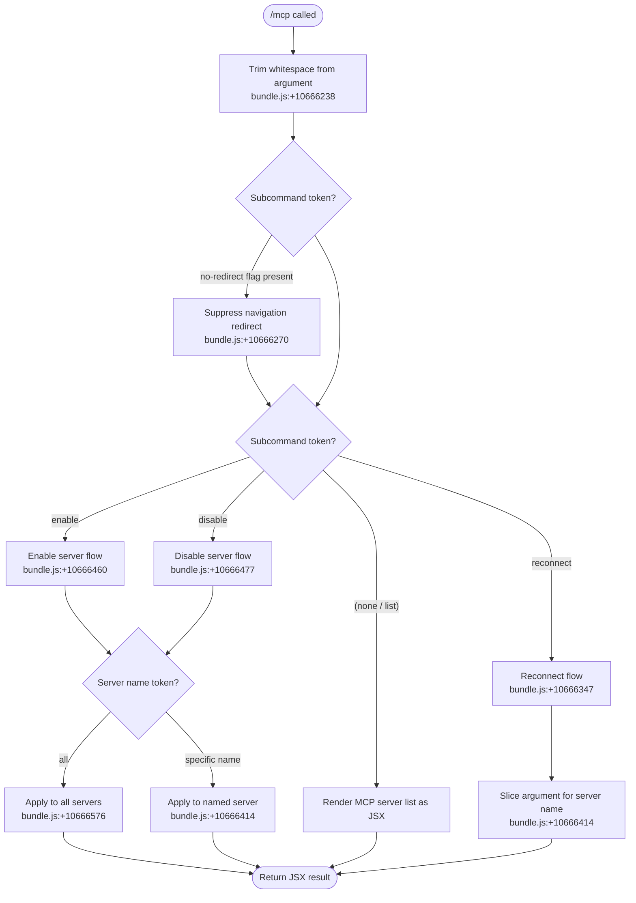

# `/mcp`

> Analysis basis: CC v2.1.132 bundle.js (AST extraction + Claude interpretation)
> Minimum version: v2.1.132

---

## Overview

The `/mcp` command provides in-session management of Model Context Protocol (MCP) servers. It allows the user to list, enable, disable, or reconnect MCP servers without leaving the Claude Code session. The command is executed immediately (no agent round-trip for dispatch) and renders its output as JSX.

---

## Registration

| Field | Value |
|---|---|
| type | `local-jsx` |
| name | `mcp` |
| description | `Manage MCP servers` |
| argumentHint | `[enable\|disable [server-name]]` |
| immediate | `true` |
| module_id | `RAq` |
| load_inline | `true` |
| handler | `EL7` (async function, resolved via `module_id` path) |
| `loc_byte_end` | `10666939` |
| `arbor_handler.name` | `EL7` |
| `arbor_handler.kind` | `AsyncFunction` |
| `arbor_handler.resolution_path` | `module_id` |
| `arbor_handler.fqn` | `claude-2.1.132::EL7` |
| `arbor_handler.n_hits` | `0` |

Analysis basis: CC v2.1.132 bundle.js:+10666767–+10666939

---

## Input Branching

The handler (`EL7`) trims the raw argument string, then dispatches on subcommand keywords. The recognized subcommand set is: `reconnect`, `enable`, `disable`, and the target modifier `all`.



---

## Behavioral Spec

### Argument Parsing

```
async function mcpCommandHandler(rawArgument, context):
    trimmedArg = trim(rawArgument)                  // bundle.js:+10666238
    noRedirect  = trimmedArg contains "no-redirect" // bundle.js:+10666270
    subcommand  = extractFirstToken(trimmedArg).toLowerCase()
    remainder   = sliceAfterFirstToken(trimmedArg)  // bundle.js:+10666414

    dispatch(subcommand, remainder, noRedirect, context)
```

The argument is trimmed before any further parsing. The `no-redirect` flag, when present, suppresses any navigation side-effect that would normally follow command execution. Analysis basis: CC v2.1.132 bundle.js:+10666238, +10666270

---

### Subcommand: `reconnect`

```
function handleReconnect(serverName, context):
    if serverName is empty:
        reconnect all registered MCP servers
    else:
        reconnect the named server

    // Internally calls closeServer (_.close) and queuedClose (q.close)
    // bundle.js:+14139791, +14139801
    for each target server:
        closeExistingTransport()      // bundle.js:+14139791
        closeQueuedTransport()        // bundle.js:+14139801
        reinitializeServer()
```

Analysis basis: CC v2.1.132 bundle.js:+10666347, +14139791, +14139801

---

### Subcommand: `enable` / `disable`

```
function handleEnableDisable(action, serverName, context):
    // action ∈ {"enable", "disable"}
    // bundle.js:+10666460, +10666477

    if serverName == "all":            // bundle.js:+10666576
        targets = getAllRegisteredServers()
    else:
        targets = [lookupServer(serverName)]

    for each server in targets:
        if action == "enable":
            setServerEnabled(server, true)
        else:
            setServerEnabled(server, false)

    persistConfigurationChange()
```

Analysis basis: CC v2.1.132 bundle.js:+10666460, +10666477, +10666576

---

### Server Cleanup / Exit Helper

A helper function (identified as `K` in the bundle) is called during reconnect and certain error paths. It coordinates socket-level teardown, state serialization, and process exit.

```
function serverCleanupAndExit(server, exitCode):
    closeQueuedTransport(server)            // bundle.js:+14110218
    convertToString(errorInfo)              // bundle.js:+133978
    writeErrorStateToFile(                  // bundle.js:+149948
        path = joinPaths(...),              // bundle.js:+149966
        tag  = "spare_uncaught"             // bundle.js:+14110289
    )
    process.exit(1)                         // bundle.js:+14110307, literal 1 at +14110320
```

The `"spare_uncaught"` string literal at +14110289 marks the error record written to disk when an unhandled condition forces a server restart. Analysis basis: CC v2.1.132 bundle.js:+14110218, +14110276, +14110289, +14110307

---

### Token Length Limit

A numeric constant `40` appears in the lowercase-comparison path at bundle.js:+14154022. This likely constrains the maximum length of a server name token accepted for matching before truncation or rejection.

Maximum server-name token length considered for matching: **40 characters** (bundle.js:+14154022)

---

### No-argument / List Mode

When `/mcp` is invoked with no subcommand, the handler renders the current set of registered MCP servers as a JSX component (consistent with `type: local-jsx`). No server state is mutated.

<!-- TODO: exact JSX component structure not found in depth-2 traversal; needs --depth 4 -->

---

## State & Side Effects

| Item | Detail |
|---|---|
| Telemetry | None detected in this command's implementation |
| Transport teardown | `closeExistingTransport` and `closeQueuedTransport` called during reconnect (bundle.js:+14139791, +14139801) |
| Filesystem write | `writeFileSync` called on error/cleanup path; writes a record tagged `"spare_uncaught"` to a joined path (bundle.js:+14110155, +149948, +149966) |
| Process exit | `process.exit(1)` called on unhandled cleanup path (bundle.js:+14110307) |
| Config persistence | `enable`/`disable` subcommands mutate and persist MCP server configuration |
| Navigation redirect | Suppressed when `no-redirect` flag is present in the argument string (bundle.js:+10666270) |
| Immediate execution | `immediate: true` — the command runs synchronously in the CLI layer, not via the agent loop |

---

## Version History

| Version | Change |
|---|---|
| v2.1.132 | Initial analysis |

---

## Common Mistakes

1. **Omitting the server name with `enable`/`disable`**: Without a server name or the `all` keyword, the subcommand may silently match nothing. Use `all` explicitly when the intent is to affect every configured server.
2. **Expecting agent-mediated output**: Because `immediate: true`, the command's JSX output is rendered directly — it does not go through the agent's response pipeline. Tool-call hooks targeting agent responses will not fire for this command.
3. **Assuming `reconnect` reloads configuration from disk**: The reconnect flow tears down and re-opens transports for already-registered servers. It does not re-read the MCP configuration file to pick up newly added servers; a full session restart is required for that.
4. **Using `no-redirect` in normal interactive use**: The `no-redirect` flag is an internal control signal; passing it as a user argument in typical workflows has no meaningful visible effect and may suppress expected navigation behavior.
5. **Conflating `disable` with server removal**: Disabling a server marks it inactive in configuration but does not unregister or delete it. A subsequent `enable` restores it without reconfiguration.

---

## Appendix — Identifier Mapping

> For bundle debugging only. Identifiers change across versions.

| Identifier | Role |
|---|---|
| `EL7` | Main async handler for the `/mcp` command (entry point, resolved via `module_id: RAq`) |
| `_` | Argument-processing / subcommand-dispatch helper; calls `f.toLowerCase` |
| `f` | Server lifecycle manager; coordinates transport close calls and cleanup invocation |
| `q` | Queued-transport object; exposes `close()` and `slice()` (used in argument slicing and transport teardown) |
| `K` | Cleanup-and-exit coordinator; writes `"spare_uncaught"` error state and calls `process.exit` |
| `vH` | String-conversion utility; wraps `String()` for error serialization |
| `AZ` | File-write helper; calls `writeFileSync` with a joined path for error state persistence |