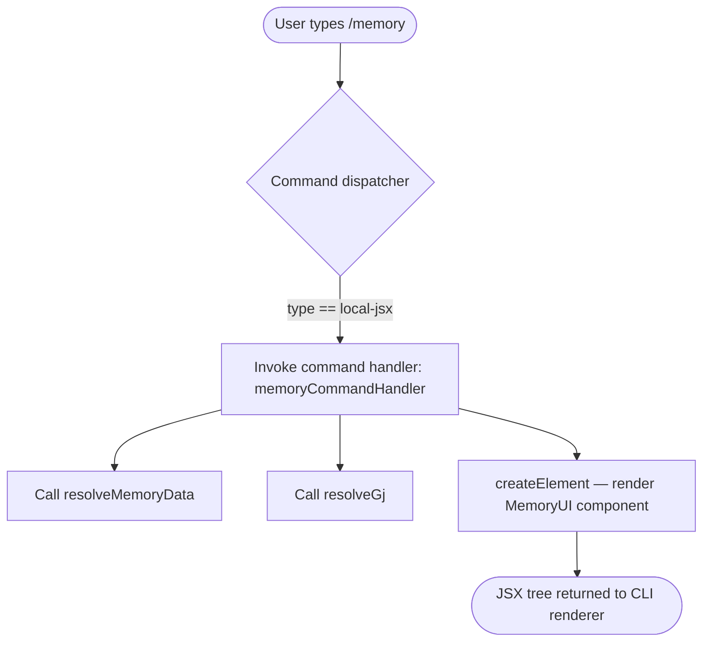

# `/memory`

> Analysis basis: CC v2.1.132 bundle.js (AST extraction + Claude interpretation)
> Minimum version: v2.1.132

---

## Overview

The `/memory` command provides an interactive interface for viewing and editing Claude's persistent memory files directly from within the CLI session. It renders a JSX-based UI component that allows the user to inspect and modify the memory files Claude uses to retain context across conversations. The command is classified as a local command, meaning its execution is handled entirely client-side without sending a request to the Anthropic API.

---

## Registration

| Field | Value |
|---|---|
| type | `local-jsx` |
| name | `memory` |
| description | `Edit Claude memory files` |
| module_id | `MHq` |
| loc_line | `5744` |

Analysis basis: CC v2.1.132 bundle.js:+10324720

---

## Input Branching

Because the extracted `literals` array is empty and the `callGraph` depth-2 traversal reveals only three call edges — two utility/hook calls and one JSX element creation — no argument-driven branching paths were found at depth ≤ 2. The command appears to accept no sub-commands or positional arguments at the registration layer; its entire behavior is delegated to the rendered JSX component.



Analysis basis: CC v2.1.132 bundle.js:+10324525 · +10324536 · +10324541

---

## Behavioral Spec

### Command Handler Initialization

The top-level handler for the `/memory` command prepares the data and UI surface needed to display and edit memory files.

```
function memoryCommandHandler(context):
    memoryData   = resolveMemoryData(context)
    renderHelper = resolveRenderHelper(context)
    uiTree       = createElement(MemoryUIComponent, {
                       memoryData:   memoryData,
                       renderHelper: renderHelper
                   })
    return uiTree
```

Analysis basis: CC v2.1.132 bundle.js:+10324525 · +10324536 · +10324541

### Memory Data Resolution (`resolveMemoryData`)

`resolveMemoryData` is called before the JSX tree is constructed. Based on its position in the call graph it is responsible for locating and loading the memory files that Claude has access to in the current project and global scope. The exact file-discovery algorithm is not recoverable at depth ≤ 2.

```
function resolveMemoryData(context):
    # Locate memory files (global + project-level)
    files = discoverMemoryFiles(context)   # internal; not reached at depth-2
    return files
```

<!-- TODO: not found in depth-2 traversal; needs --depth 4 -->

Analysis basis: CC v2.1.132 bundle.js:+10324525

### Render Helper Resolution (`resolveGj`)

`resolveGj` is the second call made by the command handler before element creation. It likely supplies rendering utilities or shared UI helpers to the JSX component. Its internal behavior is not recoverable at depth ≤ 2.

```
function resolveRenderHelper(context):
    # Returns UI utility object used by MemoryUIComponent
    helper = buildRenderHelper(context)   # internal; not reached at depth-2
    return helper
```

<!-- TODO: not found in depth-2 traversal; needs --depth 4 -->

Analysis basis: CC v2.1.132 bundle.js:+10324536

### JSX Component Rendering

The command's visible output is produced by a React-style `createElement` call. The `local-jsx` command type signals to the CLI dispatcher that the return value is a renderable element tree, not a plain string, and the CLI's ink/React renderer is responsible for mounting it into the terminal UI.

```
function renderMemoryUI(memoryData, renderHelper):
    return createElement(
        MemoryUIComponent,
        props = {
            data:   memoryData,
            helper: renderHelper
        }
    )
    # The CLI renderer mounts this tree; no further processing
    # occurs inside the command handler itself.
```

Analysis basis: CC v2.1.132 bundle.js:+10324541

---

## State & Side Effects

| Item | Detail |
|---|---|
| Telemetry | None detected at depth ≤ 2 — `telemetry` array is empty. <!-- TODO: not found in depth-2 traversal; needs --depth 4 --> |
| Hook registration | No hook registrations detected at depth ≤ 2. <!-- TODO: not found in depth-2 traversal; needs --depth 4 --> |
| appState changes | Not directly observable at depth ≤ 2; any state mutations would occur inside `MemoryUIComponent`. <!-- TODO: not found in depth-2 traversal; needs --depth 4 --> |
| Sound | No sound-related literals or calls detected at depth ≤ 2. |
| File I/O | Memory files are read (and potentially written) through `resolveMemoryData` and the mounted JSX component. Exact read/write paths not recoverable at depth ≤ 2. <!-- TODO: not found in depth-2 traversal; needs --depth 4 --> |
| Command type side-effect | Because `type` is `local-jsx`, the CLI dispatcher does **not** forward input to the model; the command is fully handled client-side. |

---

## Version History

| Version | Change |
|---|---|
| v2.1.132 | Initial analysis. Command registered as `local-jsx` at bundle.js:+10324720 (line 5744), module `MHq`. |

---

## Common Mistakes

1. **Expecting model output** — `/memory` is a `local-jsx` command. It opens a local editor interface and does not produce an AI-generated response. Users who type `/memory` expecting Claude to summarize or describe its memory will see an interactive UI instead.
2. **Assuming no-op on first run** — Memory files may not exist until Claude has been given explicit instructions to remember something. The UI may appear empty or show only global defaults on a fresh install.
3. **Editing the wrong scope** — Claude Code maintains both global memory (user-wide) and project-level memory files. Edits made through `/memory` may apply to one or both scopes; understanding which file is being edited is important before making changes.
4. **Closing the UI mid-edit** — Because the component is JSX-rendered in the terminal, force-quitting the terminal while the memory editor is open may discard unsaved changes. Use the in-UI save or confirm action before exiting.
5. **Version mismatch assumptions** — The internal identifiers (`U17`, `nZ`, `Gj`) are obfuscated and will change across bundle versions. Any tooling that references these identifiers by name must be re-validated after each update.

---

## Appendix — Identifier Mapping

> For bundle debugging only. Identifiers change across versions.

| Identifier | Role |
|---|---|
| `U17` | Top-level command handler function for `/memory`; orchestrates data resolution and JSX rendering |
| `nZ` | Memory data resolver; called first by `U17` before element creation (Analysis basis: CC v2.1.132 bundle.js:+10324525) |

> Note: `Gj` appears in the call graph (bundle.js:+10324536) but is not listed in the `identifiers` array; it may be a shared utility imported from another module and is therefore not included in the obfuscated-identifier table. `BI` (the namespace for `BI.createElement`) is the React/ink library binding and is not command-specific.