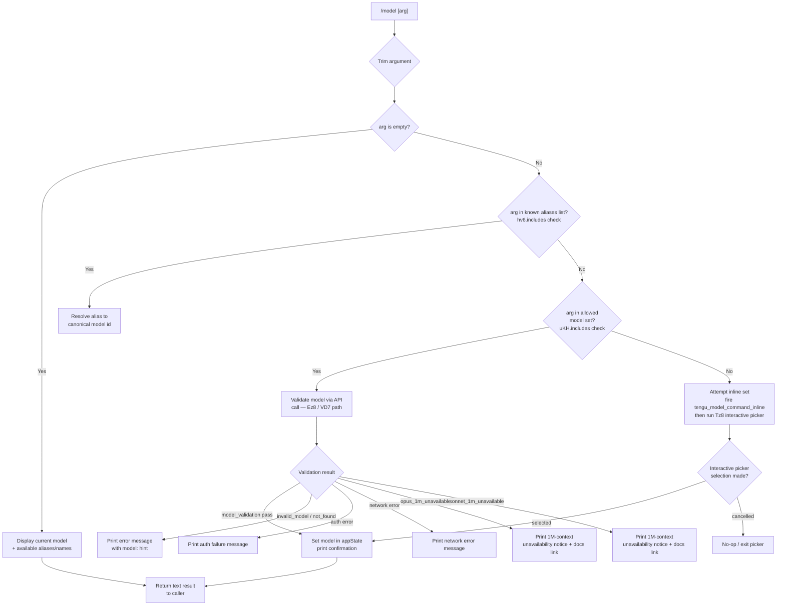

# `/model`

> Analysis basis: CC v2.1.132 bundle.js (AST extraction + Claude interpretation)
> Minimum version: v2.1.132

---

## Overview

The `/model` command allows users to inspect or change the active AI model used by Claude Code within a session. When invoked with no argument it displays the current model and available model aliases; when invoked with a model name or alias it validates the input against known models and—if valid—updates the session's active model. It supports both interactive and non-interactive (scripted) execution modes.

---

## Registration

| Field | Value |
|---|---|
| type | `local` |
| name | `model` |
| description | `Set the AI model for Claude Code` |
| argumentHint | `<model>` |
| supportsNonInteractive | `true` |
| module_id | `IOq` |
| load_inline | `true` |
| handler | `XY7` (resolved via `module_id` path) |
| `loc_byte_end` | `11350548` |
| `arbor_handler.name` | `XY7` |
| `arbor_handler.kind` | `AsyncFunction` |
| `arbor_handler.resolution_path` | `module_id` |
| `arbor_handler.fqn` | `claude-2.1.132::XY7` |
| `arbor_handler.n_hits` | `0` |

Analysis basis: CC v2.1.132 bundle.js:+11350374 – +11350548

---

## Input Branching



Analysis basis: CC v2.1.132 bundle.js:+11343171 (trim), +11343187 (alias check), +11343274 (allowed-set check), +11343329 (inline telemetry), +11343394 (interactive picker)

---

## Behavioral Spec

### 1. Entry Point — Handler Dispatch (`XY7`)

```
async function handleModelCommand(context, rawArg):
    trimmedArg = rawArg.trim()                         // +11343171

    if trimmedArg is in ALIAS_LIST:                    // +11343187
        resolvedModel = resolveAlias(trimmedArg)
    else:
        resolvedModel = trimmedArg

    currentAppState = context.getAppState()            // +11343210

    if trimmedArg is empty:
        return displayCurrentModelInfo(currentAppState)  // Zz8 path +11343254

    if trimmedArg is in ALLOWED_INLINE_MODELS:         // +11343274
        emit telemetry("tengu_model_command_inline")   // +11343329
        result = setModelDirect(context, resolvedModel, "text")   // +11343238
        return result

    // Fall through to interactive / validated path
    return runInteractiveModelPicker(context, resolvedModel)  // Tz8 +11343394
```

Analysis basis: CC v2.1.132 bundle.js:+11343171 – +11343394

---

### 2. Current-Model Display (`Zz8` / display path)

```
function displayCurrentModelInfo(appState):
    modelRecord = buildModelRecord(appState)           // _h +11310521
    lines = formatModelList(modelRecord)               // r2 +11310449
    return { type: "text", content: lines }
```

The display path calls into the model-record builder (`_h`) and then the list formatter (`r2`). The formatter iterates known aliases — including the special composite alias `"opusplan"` (described as `"Opus in plan mode, else Sonnet"`) — alongside short names `"sonnet"`, `"haiku"`, `"opus"`, and `"best"`, padding each entry for alignment (column width: 40 characters).

Analysis basis: CC v2.1.132 bundle.js:+11310521, +11310449, +2113489, +2113506, +2114972, +2115011, +2115050, +2115087

---

### 3. Model Alias Resolution (`Wq`)

```
function resolveAlias(alias):
    normalized = alias.trim().toLowerCase()
    normalized = applyKnownReplacements(normalized)    // _.replace +2114874

    switch normalized:
        case "sonnet"  → return currentSonnetId        // +2114972
        case "haiku"   → return currentHaikuId         // +2115011
        case "opus"    → return currentOpusId          // +2115050
        case "best"    → return bestModelId            // +2115087
        case "opusplan"→ return OPUS_PLAN_COMPOSITE    // +2113489
        default        → return normalized
```

Known model version constants resolved at runtime include `opus-4-6`, `opus-4-7`, `opus-4-5`, `sonnet-4-5`, `sonnet-4-6`, and the `[1m]` suffix variants `sonnet[1m]` and `sonnet-4-6[1m]` for 1 M-context models.

Analysis basis: CC v2.1.132 bundle.js:+2114835 – +2115133, +2102054, +2102084, +11310376, +11310402

---

### 4. Interactive Model Picker (`Tz8`)

```
async function runInteractiveModelPicker(context, prefilledInput):
    modelList = buildAvailableModelList(context)       // X7H +11308378

    // Decorate each entry
    for each model in modelList:
        if model is restricted (kD7 check):            // +11308968
            mark as not_allowed                        // "not_allowed" +11308410
        if model requires 1M context and unavailable:
            if opus variant:
                attach error "opus_1m_unavailable"     // +11308557
                // links to https://code.claude.com/docs/en/model-config#extended-context-with-1m
            if sonnet variant:
                attach error "sonnet_1m_unavailable"   // +11308774

    // Present picker UI
    selection = await showModelSelectorUI(modelList,   // x$q +11308996
                                          prefilledInput)

    if selection is null or cancelled:
        return                                         // no-op

    // Apply selection
    applyModelToSession(context, selection)            // _h + Zz8 path
    printConfirmation(selection)
```

The picker decorates model entries with annotations such as `" · Fast mode ON"` (+11309541), `" · Fast mode OFF"` (+11309635), and `" · Billed as extra usage"` (+11309592) based on feature flags resolved from `flagSettings` and `policySettings` stored in the settings hierarchy (project → local → global).

Analysis basis: CC v2.1.132 bundle.js:+11308378, +11308968, +11308557, +11308774, +11308996, +11309541, +11309592, +11309635

---

### 5. Model Validation via API (`Ez8` / `VD7`)

```
async function validateModelViaApi(modelId, context):
    if modelId.trim() is empty:
        return error("Model name cannot be empty")     // +11306628

    modelIdLower = modelId.toLowerCase()               // +11306752

    if modelIdLower is in ALREADY_VALIDATED_CACHE:     // b$q.has +11306873
        return CACHED_VALID

    // Send minimal probe request to API (WR path)
    probeResult = await sendApiProbe(modelId,          // WR +11306918
                                     messageType="Hi", // +11307037
                                     cacheControl="ephemeral") // +11307062

    switch probeResult.errorType:
        case "not_found_error" where message contains "model:":
            emit telemetry tag "invalid_model"         // +11309068
            return error(probeResult.message)

        case auth failure:
            return error("Authentication failed. Please check your API credentials.")
                                                       // +11307328
        case network failure:
            return error("Network error. Please check your internet connection.")
                                                       // +11307430
        case "validate_exception":                     // +11309176
            return error(probeResult.message)

        case success:
            ALREADY_VALIDATED_CACHE.set(modelId)       // b$q.set +11307081
            emit telemetry tag "model_validation"      // +11306968
            return VALID

    // Dispatch to version-specific normalizer (vD7)
    normalizedId = normalizeModelVersion(modelId)      // vD7 +11307177
    // vD7 maps internal labels (opus_4_7, opus_4_6, opus_4_5,
    //   sonnet_4_6, sonnet_4_5) to canonical API strings
    return normalizedId
```

The probe message uses `cacheControl: "ephemeral"` to avoid polluting the prompt cache. After a successful probe the validated model ID is stored in a module-level `Set` (`b$q`) so repeated calls skip the round-trip.

Analysis basis: CC v2.1.132 bundle.js:+11306591, +11306628, +11306662, +11306873, +11306918, +11306968, +11307037, +11307062, +11307081, +11307177, +11307328, +11307430, +11307549, +11307568, +11307631

---

### 6. Model Version Normalizer (`vD7`)

```
function normalizeModelVersion(rawId):
    lowered = rawId.toLowerCase()

    // Internal label → canonical API model string mapping
    mapping = {
        "opus_4_7"   : <current claude-opus-4-7 string>,
        "opus_4_6"   : <current claude-opus-4-6 string>,
        "opus-4-5"   : resolved via opus_4_5 label,   // +11308036
        "sonnet_4_6" : <current claude-sonnet-4-6>,   // +11308131
        "sonnet-4-5" : resolved via sonnet_4_5 label, // +11308180
    }

    result = lookup(mapping, lowered)
    if not found: return rawId unchanged
    return result
```

Analysis basis: CC v2.1.132 bundle.js:+11307850 – +11308260

---

### 7. Subscription / Plan Guard (`r2` family)

Before presenting or setting certain models the handler checks the active subscription tier. Recognised tiers include `"max"` (+2884354), `"team"` (+2884425), `"default_claude_max_5x"` (+2884440), `"enterprise"` (+2884535), and `"enterprise_usage_based"` (+2884557). Models gated to higher tiers are hidden or marked as unavailable in the picker. The guard also evaluates org-level and seat-level disable reasons (e.g., `out_of_credits`, `org_level_disabled`, `seat_tier_level_disabled`, `no_limits_configured`) to decide whether the model entry should be suppressed or annotated.

Analysis basis: CC v2.1.132 bundle.js:+2884354, +2884425, +2884440, +2884535, +2884557, +7979860 – +7980208

---

### 8. Settings Persistence

When the user confirms a model selection the chosen model ID is written to the `model` key (+11309297) of the appropriate settings layer. The settings hierarchy consulted and written is:

| Layer | File |
|---|---|
| Project | `.claude/settings.json` |
| Local override | `.claude/settings.local.json` |

The `flagSettings` and `policySettings` sub-objects within those files control feature-flag annotations shown in the picker.

Analysis basis: CC v2.1.132 bundle.js:+1158255, +1158288, +1158298, +1158319, +1158360, +11309297, +1033411, +1033433

---

## State & Side Effects

| Item | Detail |
|---|---|
| Telemetry — `tengu_model_command_inline` | Fired when a model is set inline (non-interactive path, direct name match). CC v2.1.132 bundle.js:+11343329 |
| Telemetry — `tengu_mcp_retry_failed_remote` | Fired inside MCP connection helper reached during model-list construction. CC v2.1.132 bundle.js:+13846663 |
| Telemetry — `tengu_feature_bad` | Fired when a feature-flag check on the model fails. CC v2.1.132 bundle.js:+906517 |
| Telemetry — `tengu_feature_ok` | Fired when a feature-flag check on the model succeeds. CC v2.1.132 bundle.js:+906461 |
| Telemetry — `tengu_prompt_cache_1h_config` | Fired when the 1 h prompt-cache configuration is evaluated during API call setup. CC v2.1.132 bundle.js:+12024822 |
| Telemetry — `tengu_api_success` | Fired on a successful API response (validation probe or set). CC v2.1.132 bundle.js:+12062168 |
| appState changes | The active model field in `appState` is updated via `getAppState()` and written back on confirmed selection. CC v2.1.132 bundle.js:+11343210 |
| Settings file write | Chosen model written to `model` key in the appropriate `.claude/settings*.json` layer. CC v2.1.132 bundle.js:+11309297 |
| Validation cache | Module-level `Set` (`b$q`) caches validated model IDs to avoid redundant API probes within the same process. CC v2.1.132 bundle.js:+11306873 |
| Hook registration | <!-- TODO: not found in depth-2 traversal; needs --depth 4 --> |
| Sound | <!-- TODO: not found in depth-2 traversal; needs --depth 4 --> |

---

## Known Model Identifiers (v2.1.132)

The following model strings and aliases are confirmed as constants in the bundle:

| Alias / Short name | Notes |
|---|---|
| `sonnet` | Resolves to current Sonnet version |
| `haiku` | Resolves to current Haiku version |
| `opus` | Resolves to current Opus version |
| `best` | Resolves to highest-capability model |
| `opusplan` | Composite: Opus in plan mode, Sonnet otherwise |
| `sonnet[1m]` | Sonnet with 1 M-context window |
| `sonnet-4-6[1m]` | Sonnet 4.6 with 1 M-context window |
| `opus-4-5` | Opus 4.5 |
| `opus-4-6` | Opus 4.6 |
| `opus-4-7` | Opus 4.7 |
| `sonnet-4-5` | Sonnet 4.5 |
| `sonnet-4-6` | Sonnet 4.6 |

1 M-context variants gated by account eligibility; unavailability surfaces the docs URL `https://code.claude.com/docs/en/model-config#extended-context-with-1m`.

Analysis basis: CC v2.1.132 bundle.js:+2102054, +2102084, +2114972, +2115011, +2115050, +2115087, +2113489, +11308036, +11308131, +11308180, +11310376, +11310402

---

## Version History

| Version | Change |
|---|---|
| v2.1.132 | Initial analysis. Handler `XY7`, inline + interactive paths, validation cache, 1 M-context guards documented. |

---

## Common Mistakes

1. **Passing a full canonical model string when an alias works** — `/model claude-sonnet-4-6` and `/model sonnet` are equivalent; the alias path skips the API validation round-trip.
2. **Expecting 1 M-context models to be universally available** — `sonnet[1m]` and `sonnet-4-6[1m]` are account-gated; the command will print an error referencing the docs link rather than silently falling back.
3. **Setting the model in a non-interactive script without `supportsNonInteractive: true`** — this flag is `true` for `/model`, so scripted use is supported; however, omitting the argument in non-interactive mode may produce unexpected output (model list) rather than an error.
4. **Assuming the chosen model persists globally** — the model is written to the nearest applicable settings file (project or local); running from a different project directory may pick up a different value.
5. **Using `opusplan` and expecting it to always invoke Opus** — `opusplan` is a composite alias: Opus is used only in plan mode; all other turns use Sonnet.

---

## Appendix — Identifier Mapping

> For bundle debugging only. Identifiers change across versions.

| Identifier | Role |
|---|---|
| `XY7` | Main handler for `/model` command (async function, entry point) |
| `Zz8` | Display-current-model path; renders model info to text output |
| `_h` | Model-record builder; constructs structured record from app state |
| `RA6` | Inner model-record assembly helper |
| `Wq` | Model alias resolver; normalises short names to canonical IDs |
| `r2` | Model list formatter / subscription-tier evaluator |
| `R_` | Subscription tier classifier |
| `Gr` | Tier branch: "max" plan handler |
| `W7H` | Tier branch: "team" / max-5x plan handler |
| `ERH` | Tier branch: enterprise / enterprise-usage-based handler |
| `jk` | Feature-flag gate evaluator |
| `qj` | Model availability query helper |
| `zM` | Provider context resolver (firstParty / anthropicAws / bedrock / foundry / mantle / vertex) |
| `g_` | General model getter utility |
| `DM` | Provider-specific model-ID dispatcher |
| `FV` | Fallback / default model resolver |
| `Tz8` | Interactive model picker orchestrator |
| `X7H` | Available-model-list builder for picker |
| `mb6` | Provider-entry enumerator used inside list builder |
| `uA` | Sub-helper called by provider-entry enumerator |
| `PRH` | Allowed-model-set membership checker |
| `Wd_` | Model ordering / index helper |
| `deL` | Model-entry decorator (deprecated / legacy check) |
| `f8H` | Extended-context (1 M) flag checker |
| `ceL` | Composite-model-entry builder |
| `Pd_` | Prefix-based model family detector |
| `mH` | Feature telemetry emitter for picker |
| `yD7` | Picker row builder for Sonnet-family entries |
| `Tt` | UI row constructor helper |
| `O8H` | String rendering utility |
| `YT9` | Usage/billing annotation helper |
| `hD7` | Picker row builder for Haiku-family entries |
| `i1H` | UI row constructor helper (Haiku variant) |
| `kD7` | Restriction / not-allowed gate for model entries |
| `x$q` | Interactive picker UI presenter; handles selection events |
| `$jH` | Flag-settings accessor |
| `hb` | Settings flag reader (flagSettings / policySettings) |
| `R8` | Policy-settings reader |
| `SH` | Feature-telemetry emitter (ok/bad) |
| `iq` | Styled text builder |
| `yH` | Low-level string coercion utility |
| `J7H` | Picker heading/label builder |
| `UY` | Fast-mode annotation helper |
| `nb` | Styled-label constructor |
| `FzH` | Extra-usage-billing annotation helper |
| `Kj` | Model pair / fast-mode state resolver |
| `m0` | Rendering helper for billing badge |
| `ND7` | Picker footer / detail-line builder |
| `xb` | Settings-path joiner |
| `zU` | Model-display-name formatter |
| `Ez8` | API-based model validator |
| `VD7` | Validation dispatcher; routes to vD7 normalizer |
| `vD7` | Model-version string normalizer (internal label → API string) |
| `WR` | Low-level API request executor |
| `fx` | HTTP request builder (headers, auth, retries) |
| `X` | Streaming response reader |
| `IPH` | Claude-3 / Claude-opus-4 compatibility shim |
| `G` | Active MCP server set tracker |
| `JE7` | Request de-duplication / cache-hit finder |
| `fxA` | Request fingerprint hash generator |
| `tQ6` | Prompt-cache configuration builder |
| `sQ6` | Prompt-cache short-circuit helper |
| `g1H` | Repl-thread context builder for API calls |
| `kk` | Token-budget / context-size annotation helper |
| `v` | Backoff / retry timing calculator |
| `X2q` | Request queue / concurrency limiter |
| `vP` | Response text sanitiser |
| `vF6` | Error-response classifier |
| `ofH` | Streaming chunk processor |
| `WwH` | Response metadata extractor |
| `S76` | GFK-based success handler |
| `ha` | WFK-based success handler |
| `toH` | Post-response cleanup helper |
| `UZH` | MCP server connection manager |
| `ZBq` | MCP update applicator |
| `K` | Process / exit handler |
| `k` | Debug-logging utility |
| `$` | mzq wrapper / misc utility |
| `j6` | MCP server registry tracker |
| `$F7` | MCP remote-server retry manager |
| `L` | Column-padding / table formatter |
| `q` | File cleanup / socket closer |
| `vH` | String coercion wrapper |