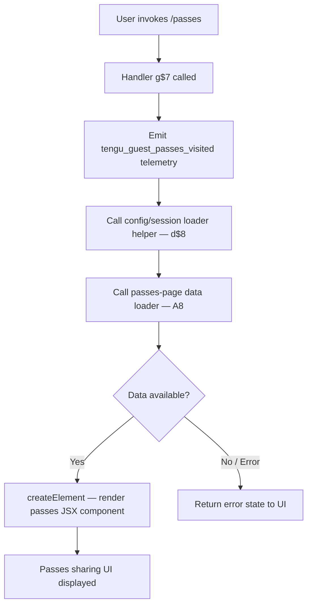

# `/passes`

> Analysis basis: CC v2.1.132 bundle.js (AST extraction + Claude interpretation)
> Minimum version: v2.1.132

---

## Overview

The `/passes` command surfaces a guest-pass sharing interface that lets the current user give friends a free week of Claude Code access. It is a `local-jsx` command, meaning its output is a rendered JSX component rather than a plain text response. On invocation, the handler fires a `tengu_guest_passes_visited` telemetry event and constructs a React element for display.

---

## Registration

| Field | Value |
|---|---|
| type | `local-jsx` |
| name | `passes` |
| description | `Share a free week of Claude Code with friends` |
| isHidden | `null` (visible in command palette) |
| module_id | `Hfq` |
| load_inline | `true` |
| handler | `g$7` (AsyncFunction, resolved via `module_id` path) |
| loc_byte span | `+11114636` – `+11114956` |
| `loc_byte_end` | `11114956` |
| `arbor_handler.name` | `g$7` |
| `arbor_handler.kind` | `AsyncFunction` |
| `arbor_handler.resolution_path` | `module_id` |
| `arbor_handler.fqn` | `claude-2.1.132::g$7` |
| `arbor_handler.n_hits` | `2` |

Analysis basis: CC v2.1.132 bundle.js:+11114636

---

## Input Branching

The command accepts no free-text arguments. Its handler performs a fixed sequence: emit telemetry, load supporting data via two helpers, then render a JSX element. There is no user-input-dependent branching at the top level.



Analysis basis: CC v2.1.132 bundle.js:+11114319 (g$7 → R6), +11114353 (g$7 → d$8), +11114359 (g$7 → A8), +11114508 (g$7 → createElement)

---

## Behavioral Spec

### Top-level Handler

```
async function passesCommandHandler(context):
    emit telemetry("tengu_guest_passes_visited")
    sessionData   = await loadSessionAndConfig(context)     // d$8
    passesData    = await loadPassesPageData(context)       // A8
    element       = createElement(PassesComponent, {
                        session: sessionData,
                        passes:  passesData,
                        ...context
                    })
    return element
```

Analysis basis: CC v2.1.132 bundle.js:+11114319, +11114353, +11114359, +11114457, +11114459, +11114508

---

### Session and Configuration Loader (`d$8`)

This helper resolves the current user session and loads the global configuration object. It delegates to two sub-helpers:

- **Application initializer** (`g7`): sets up environment, validates API credentials (checks `ANTHROPIC_API_KEY` or OAuth token), and configures the runtime session.
- **Config reader** (`R6`): reads the persisted configuration from disk (UTF-8 encoded JSON via `readFileSync`), handles config-parse errors, manages backup rotation (up to 5 backups, stored in a `backups/` subdirectory), and guards against auth-data loss during writes (see `saveConfigWithLock` safety check).

```
async function loadSessionAndConfig(context):
    appSession = await initializeApplication(context)   // g7
    config     = await readGlobalConfig()               // R6
    return { appSession, config }
```

Key behaviors of the config reader sub-path:

- Reads config file as `"utf-8"` text.
- Parses content with `JSON.parse` via `jsonSafeParse` helper.
- On parse failure, fires `tengu_config_parse_error` telemetry.
- Maintains up to **5** backup copies (bundle.js:+3106328) in the `"backups"` subdirectory (bundle.js:+3106858), named with `.backup.` infix (bundle.js:+3106195).
- Refuses a write when a re-read config is missing auth data that the in-memory cache holds, logging: `"saveConfigWithLock: re-read config is missing auth…"` and firing `tengu_config_auth_loss_prevented`.
- Lock-contention situations emit `tengu_config_lock_contention`.
- Stale-write situations emit `tengu_config_stale_write`.

Analysis basis: CC v2.1.132 bundle.js:+10787323 (d$8 → g7), +10787371 (d$8 → R6), +3107290, +3107346, +3107373, +3107393, +3105725, +3105398, +3105534, +3105877, +3106195, +3106328, +3106858

---

### Passes-Page Data Loader (`A8`)

This helper assembles the data payload for the passes UI component. It coordinates several sub-operations:

```
async function loadPassesPageData(context):
    baseConfig   = readBaseConfig()                     // B2
    uiTheme      = resolveTheme()                       // H  (dark / auto / normal)
    featureFlags = loadFeatureFlags()                   // FbH
    passEntries  = buildPassEntryList()                 // CJ1  (Object.entries iteration)
    timestamps   = collectTimestamps()                  // gbH  (Date.now)
    configState  = readConfigWithLock()                 // k5H
    quota        = resolveQuota()                       // uq6
    displayData  = buildDisplayPayload()                // d
    backupData   = loadBackupData()                     // vt8
    return assemble(baseConfig, uiTheme, featureFlags,
                    passEntries, configState, quota,
                    displayData, backupData)
```

Theme values observed: `"dark"`, `"auto"`, `"normal"` (bundle.js:+3100666, +3100695, +3100724).

Config-state values observed in related config machinery:
`"unknown"`, `"local"`, `"migrated"`, `"native"`, `"installed"`, `"disabled"`, `"enabled"`, `"no_permissions"`, `"not_configured"`, `"global"` (bundle.js:+3103039–+3103266).

A 60,000 ms timeout governs a lock-acquisition attempt (bundle.js:+3101165).

Analysis basis: CC v2.1.132 bundle.js:+3102400, +3102404, +3102424, +3102456, +3102475, +3102500, +3102516, +3102581, +3102597, +3102733, +3102847, +3100666, +3100695, +3100724, +3101165

---

### Config Read with Locking (`k5H`)

This function is the low-level config accessor. It guards against premature access and provides atomic read-with-backup semantics:

```
function readConfigWithLock():
    if config not yet allowed:
        throw Error("Config accessed before allowed.")   // +3107290
    raw = fs.readFileSync(configPath, "utf-8")           // +3107346, +3107373
    parsed = jsonSafeParse(raw)                          // B6 → JSON.parse
    prefix = resolveConfigPrefix()                       // Fh → startsWith / slice
    if error code is "ENOENT":                           // +3107520
        handle missing file
    buildBackupEntry()                                   // bJ1
    makeHttpRequest()                                    // k
    logIfError("error")                                  // +3107841
    stat = fs.statSync(configPath)                       // +3107887
    postProcess(parsed)                                  // d
    destPath = path.join(basePath,
                   path.basename(configPath))            // +3108079
    targetDir = buildTargetDir()                         // kt8
    fs.mkdirSync(targetDir, {recursive:true})            // +3108106
    if dir error "EEXIST":                               // +3108141
        ignore
    entries = fs.readdirStringSync(configDir)            // +3108164
    filter entries not startsWith known prefix           // +3108199
    copyTs  = Date.now()                                 // +3108417
    fs.copyFileSync(src, dest)                           // +3108435
    return parsed
```

Analysis basis: CC v2.1.132 bundle.js:+3107284, +3107290, +3107331, +3107346, +3107373, +3107393, +3107396, +3107413, +3107467, +3107512, +3107520, +3107536, +3107771, +3107841, +3107868, +3107887, +3107925, +3108079, +3108106, +3108141, +3108164, +3108199, +3108318, +3108417, +3108435

---

### Backup Entry Builder (`bJ1`)

Manages the backup subdirectory for config files:

```
function buildBackupEntry(configPath):
    baseName  = path.basename(configPath)               // +3106898
    targetDir = buildJoinedPath("backups", baseName)    // kt8 → path.join
    entries   = fs.readdirStringSync(targetDir)         // +3106931
    filter entries not startsWith knownPrefix           // +3106966
    fullPaths = entries.map(e => path.join(targetDir,e))// +3107022
    parentDir = path.dirname(configPath)                // +3107048
    filter    = fullPaths.filter(p =>
                    p.startsWith(parentDir))            // +3107107
    stat each surviving path                            // +3107207
    return sorted backup list
```

Maximum backup count: **5** (bundle.js:+3106328).
Backup filename infix: `".backup."` (bundle.js:+3106195).
Backup directory name: `"backups"` (bundle.js:+3106858).
File permissions constant: **384** (octal `0600`) (bundle.js:+3106610).

Analysis basis: CC v2.1.132 bundle.js:+3106891, +3106898, +3106915, +3106931, +3106966, +3107022, +3107048, +3107107, +3107207, +3106195, +3106328, +3106610

---

### Atomic Config Write (`vt8` / `QyH`)

When a config write is needed (e.g., claim of a pass), the write path uses atomic rename semantics:

```
function atomicWriteConfig(targetPath, content):
    dir      = path.dirname(targetPath)
    tempName = randomBytes(6).toString("hex")           // +3106610 region, 952797
    tempPath = path.join(dir, tempName)
    fd       = fs.openSync(tempPath, ...)               // +952331
    fs.writeFileSync(fd, content)                       // +953233
    fs.fchmodSync(fd, 384)                              // +953291  (0600)
    fs.fsyncSync(fd)                                    // +953357
    fs.closeSync(fd)                                    // +952318
    fs.renameSync(tempPath, targetPath)                 // +953485
    // cleanup on failure:
    fs.unlinkSync(tempPath)                             // +953642
```

Analysis basis: CC v2.1.132 bundle.js:+952172, +952192, +952211, +952222, +952239, +952318, +952331, +952445, +952487, +952567, +952797, +953233, +953291, +953357, +953485, +953642

---

### Background Session Machinery (reachable via `A8` → `k5H` → `w`)

The passes page loader touches the background-session subsystem for daemon management. The relevant behaviors visible at depth 2:

- Background session creation fires `"daemon_bg_session_create"` (bundle.js:+14130282).
- SIGKILL escalation fires `tengu_bg_dispatch_sigkill_escalate` (bundle.js:+14129972).
- Spare-session lifecycle events: `tengu_bg_spare_enable`, `tengu_bg_spare_spawn`, `tengu_bg_spare_claim`, `tengu_bg_spare_claim_fail`.
- Retry-exhausted path logs `"dup_retry_exhausted"` (bundle.js:+14130309).
- Connection failures use `"ECONNREFUSED"` / `"econnrefused"` checks (bundle.js:+14131080, +14131095).
- Issue URL referenced in error messages: `"https://github.com/anthropics/claude-code/issues"` (bundle.js:+14130618).

Analysis basis: CC v2.1.132 bundle.js:+14129972, +14130282, +14130309, +14130767, +14130821, +14130886, +14131149

---

## State & Side Effects

| Item | Detail |
|---|---|
| Telemetry — primary | `tengu_guest_passes_visited` fired on every invocation (bundle.js:+11114459) |
| Telemetry — config | `tengu_config_parse_error`, `tengu_config_lock_contention`, `tengu_config_stale_write`, `tengu_config_auth_loss_prevented` |
| Telemetry — background | `tengu_bg_dispatch_sigkill_escalate`, `tengu_bg_spare_enable`, `tengu_bg_spare_spawn`, `tengu_bg_spare_claim`, `tengu_bg_spare_claim_fail`, `tengu_bg_sendclaim_failed` |
| Telemetry — MCP | `tengu_mcp_retry_failed_remote` |
| Telemetry — feature flags | `tengu_feature_ok`, `tengu_feature_bad` |
| File I/O | Reads global config (`readFileSync`); may write backup copies under `backups/` subdirectory |
| Config backup rotation | Maintains up to 5 backups; files named with `.backup.` infix; permissions set to `0600` (384) |
| Config lock | Acquires a file lock with a 60,000 ms timeout before writing |
| Auth-loss guard | Refuses to overwrite config if re-read copy is missing auth data present in memory cache |
| JSX render | Returns a `chA.createElement`-constructed React element to the UI shell |
| Background session | May interact with background daemon session infrastructure (spawn, claim, kill) |
| Sound | <!-- TODO: not found in depth-2 traversal; needs --depth 4 --> |
| appState changes | <!-- TODO: not found in depth-2 traversal; needs --depth 4 --> |

---

## Version History

| Version | Change |
|---|---|
| v2.1.132 | Initial analysis — `local-jsx` passes sharing command with `tengu_guest_passes_visited` telemetry |

---

## Common Mistakes

1. **Expecting text output**: `/passes` is a `local-jsx` command. It renders a React component, not plain text. Piping its output to text-only consumers will yield nothing useful.
2. **Invoking with arguments**: The handler signature does not parse free-text input. Any text after `/passes` is silently ignored.
3. **Assuming immediate availability**: The handler is async and must load both session/config data (`d$8`) and passes-page data (`A8`) before rendering. In environments with slow config I/O the UI may be briefly delayed.
4. **Triggering in locked-config states**: If another Claude Code process holds the config lock, the 60,000 ms timeout will block the render path. The contention is reported via `tengu_config_lock_contention` telemetry but is not surfaced as a user-visible error message in all cases.
5. **Expecting the command in all environments**: The command is not hidden (`isHidden: null`) but requires a valid authenticated session. Without `ANTHROPIC_API_KEY` or a valid OAuth token the session loader will throw before the passes component renders.

---

## Appendix — Identifier Mapping

> For bundle debugging only. Identifiers change across versions.

| Identifier | Role |
|---|---|
| `g$7` | Top-level `/passes` command handler (AsyncFunction) |
| `R6` | Global config reader / file watcher setup |
| `F6` | Logging / error-formatting utility |
| `Et8` | Config path resolver |
| `k5H` | Config read-with-lock implementation |
| `q` | Filesystem module reference (node `fs`) |
| `B6` | JSON safe-parse wrapper |
| `Fh` | Config prefix extractor (startsWith / slice) |
| `H` | Random / timing utility (Math.random, setTimeout) |
| `A` | Virtual filesystem or abstracted fs helper |
| `j8` | Structured logger or debug emitter |
| `bJ1` | Backup entry builder |
| `kt8` | Directory path joiner helper |
| `M` | MCP / remote server registry |
| `$` | Disposable / resource manager |
| `k` | HTTP request executor |
| `Lsq` | HTTP transport layer sub-helper |
| `RH` | JSON stringify wrapper |
| `mf` | String redaction / sanitisation helper |
| `gNH` | Log-level router |
| `Msq` | File-based HTTP request helper (Buffer.byteLength, fsq.bind) |
| `fH` | Background task / stream processor |
| `HA` | Error normaliser |
| `yH` | String coercion utility |
| `kq` | Essential-traffic network helper |
| `$wL` | Queue rotation helper (shift / push) |
| `d` | App-state or context object |
| `w` | Background session manager (spawn, kill, claim) |
| `_` | Key-value store or Map-like state container |
| `y` | Process handle / child-process wrapper |
| `mH` | Session-state OK reporter (`tengu_feature_ok`) |
| `SH` | Session-state bad reporter (`tengu_feature_bad`) |
| `j6` | Background session dispatcher |
| `LFA` | Daemon claim-and-connect helper |
| `OFA` | Background task lifecycle manager |
| `K` | Process / event-loop manager (process.exit) |
| `Y` | Background session orchestrator (recursive) |
| `R` | Supervisor / mtime-watch handler |
| `DPK` | File-watch registration helper (watchFile / unwatchFile) |
| `Wd` | Watch-event debouncer or handler |
| `N1` | Reactive state subscription helper |
| `vrq` | Undefined-safe accessor |
| `d$8` | Session and configuration loader |
| `g7` | Application initialiser |
| `nY` | Auth / session bootstrap |
| `tL` | String encoding helper |
| `GS` | Session credential resolver |
| `o$` | OAuth / API-key flow handler |
| `B96` | Credential string formatter |
| `A8` | Passes-page data loader |
| `Nt8` | Config-with-backup reader |
| `Wc_` | Object merge / assign helper |
| `Bg8` | Config merge sub-helper |
| `uq6` | Quota resolver |
| `Z` | Config entry filter predicate |
| `P` | MCP / SDK connection provider |
| `gX8` | MCP server registry helper |
| `I` | Config entry slice helper |
| `QyH` | Atomic file writer (rename-based) |
| `O` | Filesystem stat / lstat wrapper |
| `D8` | Structured debug emitter |
| `f` | Stream / socket handle |
| `FbH` | Feature-flag loader |
| `CJ1` | Pass-entry list builder (Object.entries) |
| `gbH` | Timestamp collector (Date.now) |
| `vt8` | Backup-aware config write helper |