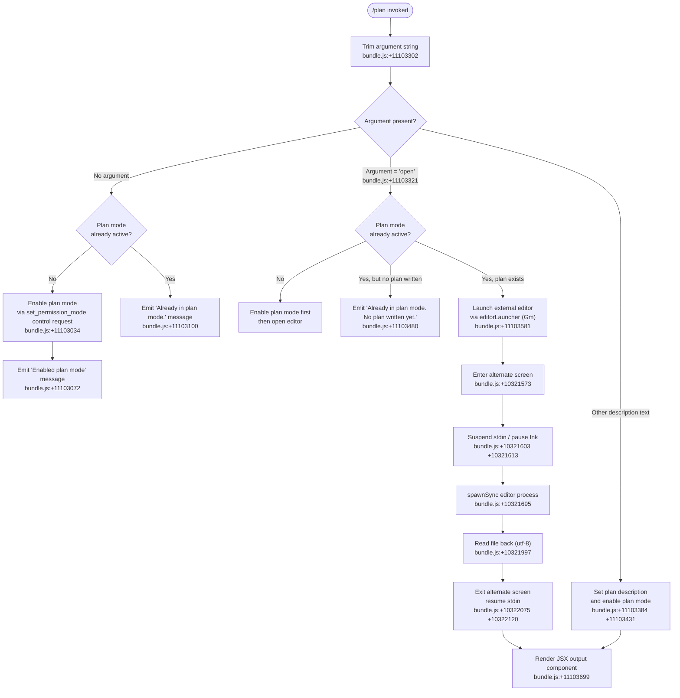

# `/plan`

> Analysis basis: CC v2.1.132 bundle.js (AST extraction + Claude interpretation)
> Minimum version: v2.1.132

---

## Overview

The `/plan` slash command enables **plan mode** for the current Claude Code session or displays the session's current plan document. When invoked with `open` or a description argument, it launches an external editor workflow or sets a plan description; when invoked with no argument it toggles plan mode on and surfaces any existing plan content.

---

## Registration

| Field | Value |
|---|---|
| type | `local-jsx` |
| name | `plan` |
| description | `Enable plan mode or view the current session plan` |
| argumentHint | `[open\|<description>]` |
| module_id | `B5q` |

Analysis basis: CC v2.1.132 bundle.js:+11103921

---

## Input Branching

The command handler (`planCommandHandler`) reads the trimmed argument string and branches across four distinct paths.

Analysis basis: CC v2.1.132 bundle.js:+11103302, +11103321, +11103480, +11103072, +11103100



---

## Behavioral Spec

### 1. Plan Mode Activation

When no argument is supplied and plan mode is not yet active, the handler issues a `set_permission_mode` control request tagged with the `session` scope.

Analysis basis: CC v2.1.132 bundle.js:+11103034, +11102989

```
function activatePlanMode(sessionState, controlChannel):
    requestPayload = {
        type: "set_permission_mode",
        scope: "session",          // literal "session", loc +11102989
        mode: "plan"
    }
    controlChannel.sendControlRequest(requestPayload)  // loc +11103004
    return "Enabled plan mode"                         // loc +11103072
```

If plan mode is already active and no `open` argument was passed, the handler returns early with the message `"Already in plan mode."` and performs no state mutation.

Analysis basis: CC v2.1.132 bundle.js:+11103100

---

### 2. Permission-Mode Control Request Dispatch

The `sendControlRequest` path (internal identifier `M`) constructs a structured request, routes it through the active MCP connection layer, and applies any resulting permission-rule updates.

Analysis basis: CC v2.1.132 bundle.js:+13846520, +13846539, +13846850

```
function sendControlRequest(payload):
    activeConnections = connectionRegistry.values()    // loc +13846642

    for each connection in activeConnections:
        if connection supports control channel:
            result = dispatchToConnection(connection, payload)  // UZH, loc +13846520
            applyMcpUpdate(result)                              // ZBq, loc +13846850

    // Connection types handled: stdio, sse, http, sse-ide, ws-ide
    // loc +9462075, +9462109, +9462141, +9462174, +9462210
```

Connections whose status is `"disabled"` or `"needs-auth"` are skipped.

Analysis basis: CC v2.1.132 bundle.js:+9461973, +9462602, +9462668

---

### 3. Permission-Rule Processing (`cf`)

The `setMode` sub-operation inside the control request processor handles rule additions, replacements, and removals keyed on named rule lists.

Analysis basis: CC v2.1.132 bundle.js:+3884795, +3884817, +3885159, +3885507, +3886164

```
function processPermissionMode(update, currentRules):
    if update.operation == "setMode":
        if update.target == "bypassPermissions":
            if bypassPermissionsUnavailable():
                log("debug", BYPASS_REJECTED_MESSAGE)   // loc +3884883
                return   // silently ignore
        applyModeChange(update.target)

    if update.operation == "addRules":                  // loc +3885159
        for rule in update.rules:
            if rule.effect == "allow":                  // loc +3885344
                currentRules.alwaysAllowRules.add(rule) // loc +3885352
            else if rule.effect == "deny":              // loc +3885384
                currentRules.alwaysDenyRules.add(rule)  // loc +3885391
            else:
                currentRules.alwaysAskRules.add(rule)   // loc +3885409

    if update.operation == "replaceRules":              // loc +3885507
        replaceEntireRuleSet(update.rules)

    if update.operation == "addDirectories":            // loc +3885818
        addToDirectoryAllowList(update.paths)

    if update.operation == "removeRules":               // loc +3886164
        pruneMatchingRules(currentRules, update.rules)  // uses K.has, loc +3886489

    if update.operation == "removeDirectories":         // loc +3886548
        pruneAllowedDirectories(update.paths)
```

---

### 4. Plan Description Path (`$UH` / `kW`)

When the argument is non-empty and is not the literal `"open"`, the handler treats it as a free-text plan description. It normalises the text and stores it in session state.

Analysis basis: CC v2.1.132 bundle.js:+11103384, +11103431

```
function setPlanDescription(rawArg, sessionState):
    normalised = normalisePlanText(rawArg)    // $UH → FLH + v6, loc +11103384
    planRecord = buildPlanRecord(normalised)  // kW → YG, F6, D8, fH, loc +11103431

    // buildPlanRecord:
    //   - joins lines with Mu.join            loc +5011602
    //   - reads existing plan file (utf-8)    loc +5011736
    //   - handles ENOENT gracefully           loc +134118

    sessionState.plan = planRecord
    renderOutputComponent(planRecord)         // UG.createElement, loc +11103699
```

---

### 5. `open` Argument — External Editor Launch (`Gm`)

When argument equals `"open"` and a plan document exists, the handler suspends the Ink rendering loop, spawns the user's configured editor synchronously, reads the result, and resumes rendering.

Analysis basis: CC v2.1.132 bundle.js:+11103581, +10321573, +10321695, +10321997, +10322075

```
function openPlanInEditor(sessionState, inkInstance):
    if inkInstance == null:
        throw Error("Ink instance not found - cannot pause rendering")  // loc +10321420

    planFilePath = resolvePlanFilePath(sessionState)   // p4.get, loc +10321379
    if not fileExists(planFilePath):                   // A.statSync, loc +10321513
        // File not found branch handled upstream (emits "No plan written yet")
        return

    editorCmd = resolveEditor(planFilePath)            // jJ, loc +10321795
    // resolveEditor: lower-cases env vars, extracts basename  loc +5031774, +5031832

    inkInstance.enterAlternateScreen()                 // loc +10321573
    inkInstance.pause()                                // loc +10321603
    process.stdin.suspendStdin()                       // loc +10321613

    args = editorCmd.split(" ")                        // loc +10321652
    args = args.slice(...)                             // loc +10321677
    result = child_process.spawnSync(editorCmd, args, {
        stdio: "inherit"                               // loc +10321727
    })                                                 // loc +10321695

    updatedContent = fs.readFileSync(planFilePath, "utf-8")  // loc +10321997

    inkInstance.exitAlternateScreen()                  // loc +10322075
    process.stdin.resumeStdin()                        // loc +10322104
    inkInstance.resume()                               // loc +10322120

    return updatedContent
```

---

### 6. Output Rendering (`Zw9` / `KgH`)

The JSX output component subscribes to a data event stream and renders plan content through the Ink `createElement` pipeline.

Analysis basis: CC v2.1.132 bundle.js:+11103695, +7361466, +7361533

```
function renderPlanOutput(planContent):
    stream = createOutputStream()
    stream.on("data", handler)                 // KgH, loc +7361466
    // handler stringifies chunk               loc +7361503
    // passes through ANSI-strip utility       loc +7361530 (Nx)

    element = React.createElement(outputComponent, { content: planContent })
    // Bun.stripANSI used for non-TTY paths   k5, loc +3575974

    return element
```

---

### 7. MCP Retry Telemetry Hook

The `sendControlRequest` path registers an MCP retry-failure handler that fires when all previously-failed remote MCP servers have recovered and the retry loop is terminated.

Analysis basis: CC v2.1.132 bundle.js:+13846663

```
function onMcpRetryComplete(servers):
    if allServersRecovered(servers):
        log("info", "[MCP] Retry: all remote servers recovered, stopping")  // loc +13847420
        emitTelemetry("tengu_mcp_retry_failed_remote")                      // loc +13846663
        stopRetryLoop()
```

---

## State & Side Effects

| Item | Detail |
|---|---|
| Telemetry | `tengu_mcp_retry_failed_remote` — emitted when MCP retry loop terminates after full recovery (bundle.js:+13846663) |
| Control request | Issues a `set_permission_mode` typed request over active MCP connections (bundle.js:+11103034) |
| Session scope | Permission mode change is scoped to `"session"` (bundle.js:+11102989) |
| `appState.plan` | Written when a description argument is provided; not mutated on bare `/plan` toggle |
| Rule lists mutated | `alwaysAllowRules`, `alwaysDenyRules`, `alwaysAskRules`, directory allow-list — depending on control-request operation (bundle.js:+3885352, +3885391, +3885409) |
| File I/O | `open` path: `fs.statSync`, `fs.readFileSync("utf-8")` on plan file; temporary file deleted via `tgq.unlinkSync` in cleanup (bundle.js:+10321513, +10321997, +14110155) |
| Ink / terminal | `open` path: enters alternate screen, suspends stdin, spawns editor, exits alternate screen, resumes stdin (bundle.js:+10321573–+10322120) |
| `bypassPermissions` guard | Attempting to set `bypassPermissions` mode when disallowed is silently rejected with a debug log; no error is surfaced to the user (bundle.js:+3884883) |
| MCP cleanup | `ZBq` calls `_.cleanup` on connection teardown (bundle.js:+13846979) |
| Sound | <!-- TODO: not found in depth-2 traversal; needs --depth 4 --> |

---

## Version History

| Version | Change |
|---|---|
| v2.1.132 | Initial analysis — `local-jsx` registration, `open` editor path, `set_permission_mode` control request, MCP retry telemetry hook confirmed |

---

## Common Mistakes

1. **Passing `open` when no plan exists yet.** The command emits `"Already in plan mode. No plan written yet."` and exits without launching an editor. Write a plan description first (e.g. `/plan <description>`) so the plan file exists before using `open`. Analysis basis: CC v2.1.132 bundle.js:+11103480

2. **Expecting immediate persistence.** `/plan` sends a `set_permission_mode` control request over the MCP layer; if all MCP connections are in `"disabled"` or `"needs-auth"` state the request silently finds no targets and plan mode is not applied server-side.

3. **Conflating `/plan` with `bypassPermissions` mode.** Issuing a `setMode bypassPermissions` control request when the session was not launched with bypass permissions enabled is silently discarded with a debug-only log message and produces no user-visible error. Analysis basis: CC v2.1.132 bundle.js:+3884883

4. **Assuming the editor is always interactive.** The editor is launched via `child_process.spawnSync` with `stdio: "inherit"`. If the terminal is not a proper TTY (e.g., inside a pipe or IDE terminal that doesn't forward raw input), the editor spawn may behave unexpectedly. Analysis basis: CC v2.1.132 bundle.js:+10321727

5. **Calling `/plan open` from an IDE-embedded terminal.** The `resolveEditor` helper lower-cases environment variables and checks for an `"IDE"` context literal. Analysis basis: CC v2.1.132 bundle.js:+5031719. In IDE mode the alternate-screen/stdin-suspend sequence may conflict with the host IDE's terminal emulation.

---

## Appendix — Identifier Mapping

> For bundle debugging only. Identifiers change across versions.

| Identifier | Role |
|---|---|
| `R$7` | Top-level plan command handler function |
| `q` | Temporary-file unlink / cleanup utility |
| `A3` | Session state accessor initialiser |
| `ywH` | Session state hydration helper |
| `Di` | Plan-mode active flag reader |
| `L` | Output line list / mapped render array |
| `K` | Connection or rule-set registry |
| `f` | File descriptor / stream handle |
| `cf` | Permission-mode update processor |
| `k` | Rule normalisation and key-lookup helper |
| `i4` | Rule condition parser |
| `RH` | JSON serialisation wrapper |
| `_` | General mutable state store (set/delete) |
| `HZH` | MCP server info aggregator |
| `WIA` | MCP server capability resolver |
| `bN` | Server metadata builder |
| `g9H` | Entry-to-rule-list mapper |
| `lF` | Rule list flattener / push aggregator |
| `M` | Control request dispatcher (sendControlRequest host) |
| `UZH` | Per-connection control request dispatcher |
| `ZBq` | MCP update applicator and connection cleanup handler |
| `$` | Miscellaneous state getter wrapper |
| `j6` | MCP retry deduplication tracker |
| `$F7` | MCP client filter and reconnect orchestrator |
| `H` | Jitter / random delay utility (Math.random + setTimeout) |
| `$UH` | Plan text normalisation entry point |
| `FLH` | Plan text formatter |
| `v6` | Plan text validation helper |
| `kW` | Plan record builder entry point |
| `YG` | Plan record line-join assembler |
| `F6` | Plan file path resolver |
| `D8` | File existence / ENOENT guard |
| `fH` | File read orchestrator with error logging |
| `Gm` | External editor launcher (alternate-screen orchestration) |
| `b17` | Pre-editor state snapshot helper |
| `jJ` | Editor command resolver (basename + lowercase) |
| `Zw9` | Output render stream factory |
| `KgH` | Data-event stream handler and Ink element creator |
| `k5` | ANSI-strip post-processor (Bun.stripANSI wrapper) |