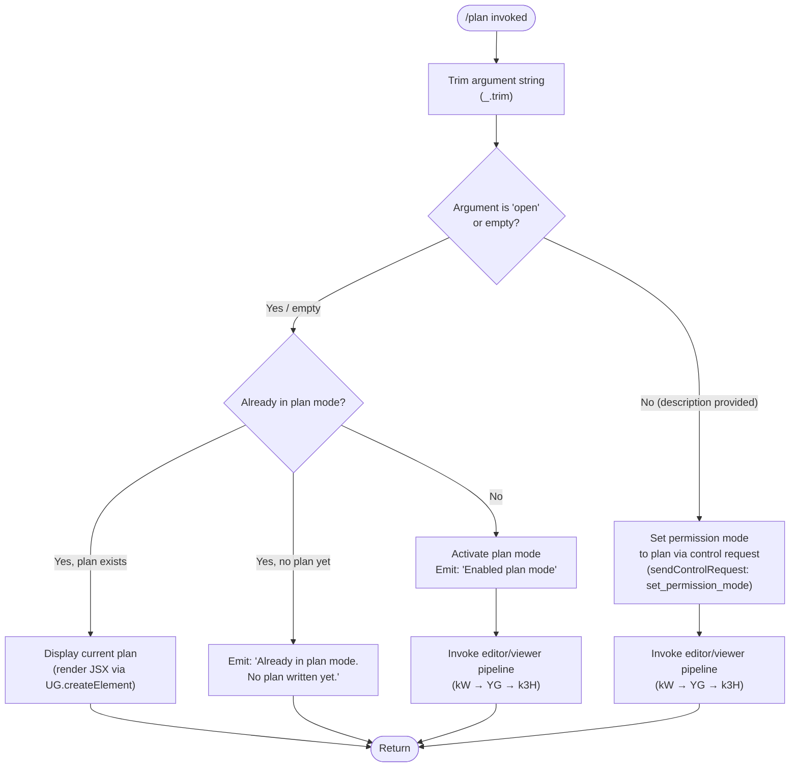

# `/plan`

> Analysis basis: CC v2.1.132 bundle.js (AST extraction + Claude interpretation)
> Minimum version: v2.1.132

---

## Overview

The `/plan` command enables **plan mode** for the current Claude Code session — a restricted permission mode where the agent may analyze and describe intended actions without executing them. When invoked without arguments (or with `open`), it either activates plan mode and records the initial plan text, or displays the current plan if plan mode is already active. The command is implemented as an async handler (`R$7`) registered in module `B5q` as a `local-jsx` command.

---

## Registration

| Field | Value |
|---|---|
| type | `local-jsx` |
| name | `plan` |
| description | `Enable plan mode or view the current session plan` |
| argumentHint | `[open\|<description>]` |
| module_id | `B5q` |
| load_inline | `true` |
| handler | `R$7` (AsyncFunction, resolved via `module_id` path) |
| `loc_byte_end` | `11104120` |
| `arbor_handler.name` | `R$7` |
| `arbor_handler.kind` | `AsyncFunction` |
| `arbor_handler.resolution_path` | `module_id` |
| `arbor_handler.fqn` | `claude-2.1.132::R$7` |
| `arbor_handler.n_hits` | `0` |

Analysis basis: CC v2.1.132 bundle.js:+11103921 – +11104120

---

## Input Branching

The handler (`R$7`) examines the trimmed user argument and the current session state to determine one of several execution paths.



Analysis basis: CC v2.1.132 bundle.js:+11103004, +11103072, +11103100, +11103302, +11103321, +11103480

---

## Behavioral Spec

### 1. Handler Entry and Argument Parsing

```
async function planCommandHandler(context):
    rawArg = context.argument
    trimmedArg = rawArg.trim()                  // _.trim  (+11103302)

    alreadyInPlanMode = checkCurrentPermissionMode(context)

    if trimmedArg == "open" or trimmedArg == "":
        if alreadyInPlanMode:
            planText = getCurrentPlan(context)
            if planText exists:
                return renderPlanView(planText)  // UG.createElement (+11103699)
            else:
                return emit("Already in plan mode. No plan written yet.")
                       // literal: +11103480
        else:
            activatePlanMode(context)            // sendControlRequest +11103004
            emit("Enabled plan mode")            // literal: +11103072
            return openPlanEditorOrViewer(context)
    else:
        // argument is a plan description
        if alreadyInPlanMode:
            emit("Already in plan mode.")        // literal: +11103100
        else:
            activatePlanMode(context)
            emit("Enabled plan mode")
        return openPlanEditorOrViewer(context, trimmedArg)
```

Analysis basis: CC v2.1.132 bundle.js:+11103070, +11103302, +11103321, +11103384, +11103431

---

### 2. Permission Mode Activation

The handler issues a control request with the action string `"set_permission_mode"` (literal: +11103034) to the session manager (`M.sendControlRequest` at +11103004). This call internally routes through the MCP server management layer (`UZH`, `ZBq`) and updates the session's permission state.

```
function activatePlanMode(context):
    context.session.sendControlRequest({
        action: "set_permission_mode",     // +11103034
        mode: "plan"                       // inferred from literal "plan" at +11102861
    })
```

Analysis basis: CC v2.1.132 bundle.js:+11103004, +11103034

---

### 3. Editor / Viewer Pipeline

The plan editor/viewer is coordinated by `kW` (+11103431), which calls into `YG` (+11103438) and `k3H`. The pipeline:

1. Resolves the working path for the plan file via the file-path utility (`k3H` → `Mu.join`, `F6`).
2. Reads or initializes the plan file (uses `q.get`, `q.set` for cache/store access).
3. Launches the external editor subprocess via the editor-spawn utility (`Gm` at +11103581), which:
   - Enters the alternate terminal screen (`_.enterAlternateScreen` at +10321573).
   - Suspends stdin (`_.suspendStdin` at +10321613) and pauses rendering (`_.pause` at +10321603).
   - Spawns the editor synchronously (`fHq.spawnSync` at +10321695) with `inherit` stdio (+10321727).
   - Exits the alternate screen and resumes stdin/rendering on return (+10322075, +10322104, +10322120).
4. Reads back the updated plan file content.
5. If the session context indicates an IDE environment (literal `"IDE"` at +5031719), the `jJ` utility adjusts the editor resolution path accordingly.

```
function openPlanEditorOrViewer(context, initialDescription?):
    planPath = resolvePlanFilePath(context)    // k3H via kW/YG
    if initialDescription:
        writePlanFile(planPath, initialDescription)

    editorBinary = resolveEditor(context)      // jJ (+11103674)
    if editorBinary:
        enterAlternateScreen()
        pauseRendering()
        suspendStdin()
        spawnEditor(editorBinary, planPath)    // fHq.spawnSync
        resumeStdin()
        resumeRendering()
        exitAlternateScreen()
    else:
        renderPlanView(readPlanFile(planPath)) // UG.createElement (+11103699)

    renderOutput = buildOutputComponent(readPlanFile(planPath), context)
    return renderOutput
```

Analysis basis: CC v2.1.132 bundle.js:+11103431, +11103438, +11103581, +11103665, +11103674, +11103699, +10321573, +10321603, +10321613, +10321695, +10321727

---

### 4. JSX Rendering Pipeline

The command is registered as type `local-jsx`, meaning its return value is a JSX element tree rendered by Ink. The rendering utility (`Zw9` at +11103695) uses `KgH` which sets up an event listener (`L.on`) and creates an Ink component (`is.createElement`) with `Nx`/`TZ1` for terminal rendering. ANSI codes are stripped via `Bun.stripANSI` (`k5` at +7361694) before output is finalized.

```
function renderPlanOutput(planContent, context):
    stripped = Bun.stripANSI(planContent)     // k5 +3575974
    component = is.createElement(             // KgH +7361533
        PlanViewComponent,                    // Nx +7361530
        { content: stripped }
    )
    return component
```

Analysis basis: CC v2.1.132 bundle.js:+11103695, +11103699, +7361533, +7361530, +3575974

---

### 5. Permission Bypass Guard

The `cf` function (+11102917) enforces that the `"bypassPermissions"` mode cannot be activated when the session was not launched with bypass permissions enabled. A specific rejection message is emitted when this guard fires:

> *"Ignoring permission update: setMode 'bypassPermissions' rejected — mode is not available (disableBypassPermissionsMode set, or session not launched in bypassPermissions mode)"* (literal: +3884883)

This guard is relevant to `/plan` because the plan-mode activation pathway passes through the same permission-mode-setting infrastructure (`cf`).

```
function permissionModeSetGuard(requestedMode, sessionConfig):
    if requestedMode == "bypassPermissions":    // literal +3884817
        if not sessionConfig.bypassPermissionsAllowed:
            log("Ignoring permission update: ...")  // +3884883
            return REJECTED
    return ALLOWED
```

Analysis basis: CC v2.1.132 bundle.js:+11102917, +3884817, +3884883

---

### 6. Telemetry Integration Path

Telemetry events are not emitted directly inside `R$7` at the top level of the `/plan` handler — they are fired by the infrastructure functions invoked transitively (MCP layer, OAuth layer, daemon layer). No `tengu_plan_*` event was found in the depth-2 traversal. The events listed in **State & Side Effects** below are reachable transitively through the call graph.

---

## State & Side Effects

| Item | Detail |
|---|---|
| Telemetry — `tengu_auto_mode_config` | Fired when the auto-mode configuration is consulted during provider resolution (reachable via `AbH` at +2856069) |
| Telemetry — `tengu_mcp_oauth_flow_start` | Fired if an MCP OAuth flow is triggered transitively during control-request processing (+9393502) |
| Telemetry — `tengu_mcp_oauth_flow_success` | Fired on successful MCP OAuth completion (+9397849) |
| Telemetry — `tengu_mcp_oauth_flow_error` | Fired on MCP OAuth failure (+9398936) |
| Telemetry — `tengu_bg_spare_enable` | Fired when a background spare session is enabled (+14129457) |
| Telemetry — `tengu_bg_spare_spawn` | Fired when a background spare session is spawned (+14129749) |
| Telemetry — `tengu_daemon_config_reload` | Fired on daemon config reload (+14143280) |
| Telemetry — `tengu_config_auth_loss_prevented` | Fired when a config write that would lose auth data is refused (+3102735) |
| Telemetry — `tengu_daemon_control` | Fired on daemon control events (+14164048) |
| Telemetry — `tengu_daemon_yield` | Fired when the daemon yields to a foreground service (+14147314) |
| Telemetry — `tengu_config_parse_error` | Fired on config parse failure (+3107927) |
| Telemetry — `tengu_mcp_retry_failed_remote` | Fired when an MCP remote-server retry fails (+13846663) |
| Permission mode change | Sets session permission mode to `"plan"` via `sendControlRequest` ("set_permission_mode") |
| Plan file I/O | Reads and optionally writes the plan file on disk; uses `YV.appendFile`, `YV.mkdir`, `YV.rename`, `YV.unlink` via the `fsq`/`JnA` file utilities |
| Terminal state | Temporarily enters alternate screen and suspends stdin while the external editor is open (`Gm` pipeline) |
| Config cache | May update the permission-rules cache (`cf` → `_.set`, `_.delete`) |
| appState changes | Registers/deregisters permission rules in session state (`N1` → `J08.add`, `J08.delete`, `Object.assign`) |
| Sound | None observed in depth-2 traversal |
| Hook registration | No explicit hook registration observed at the `/plan` command level; Ink component event listener registered transiently during render (`KgH` → `L.on`) |

---

## Version History

| Version | Change |
|---|---|
| v2.1.132 | Initial analysis — `local-jsx` command; async handler `R$7` in module `B5q`; supports `open` keyword and free-text description argument |

---

## Common Mistakes

1. **Invoking `/plan` when already in plan mode with a description argument** — The handler emits `"Already in plan mode."` (+11103100) and then still opens the editor pipeline; it does not silently discard the description, but it also does not re-activate plan mode or change the permission level.

2. **Expecting `/plan open` to display the plan when no plan has been written yet** — If plan mode is already active but no plan content exists, the handler returns `"Already in plan mode. No plan written yet."` (+11103480) rather than opening the editor.

3. **Assuming `/plan` works in `bypassPermissions` mode without explicit launch flags** — The permission guard (`cf`) will reject a mode change to `bypassPermissions` unless the session was originally started with that flag. This does not block `/plan` itself but can affect adjacent permission infrastructure invoked during the control request.

4. **Expecting immediate tool restrictions** — Plan mode is set via an async control request; any tool calls issued in the same turn before the control request resolves may not yet be subject to plan-mode restrictions.

5. **Using `/plan` in an IDE context without an editor configured** — In IDE environments (`"IDE"` literal at +5031719), the editor-resolution path (`jJ`) behaves differently; if no suitable editor is found, the command falls back to inline JSX rendering rather than spawning an external editor process.

---

## Appendix — Identifier Mapping

> For bundle debugging only. Identifiers change across versions.

| Identifier | Role |
|---|---|
| `R$7` | Main async handler for the `/plan` command (entry point) |
| `q` | File-unlink / process-exit utility (cleanup helper) |
| `A3` | Auxiliary initialization helper called early in handler |
| `ywH` | Sub-utility called by `A3` |
| `Di` | Context/state accessor called from handler |
| `L` | List/map utility used for padded output formatting |
| `K` | Process-exit guard / file-write coordinator |
| `vH` | String conversion helper |
| `AZ` | Synchronous file-write utility (`FNH.writeFileSync`) |
| `f` | Terminal/stream close and process-writer utility |
| `_` | String/stream utilities (close, toLowerCase, lastIndexOf, slice) |
| `cf` | Permission-mode setter and rule manager |
| `k` | Telemetry/logging utility with debug label |
| `Lsq` | Permission sub-utility coordinator |
| `rdA` | Rule-resolution helper within permission layer |
| `H` | General-purpose variable (context, string, or collection depending on call site) |
| `RH` | JSON serialization helper (`JSON.stringify`) |
| `A` | String/array utility (toUpperCase, general) |
| `mf` | String-manipulation helper (replace, lastIndexOf, slice) |
| `MnA` | Map-array transformer |
| `gNH` | Write-to-stream coordinator |
| `slA` | Low-level stream writer (`H.write`) |
| `Msq` | File-append / session-log persistence coordinator |
| `GNH` | Buffered-output timer manager (clearTimeout, setTimeout, setImmediate) |
| `pHH` | Path-join and file utility accessor |
| `F6` | Path/directory utility |
| `JG8` | File handle utility (`j8`) |
| `jnA` | Path-join helper for session log |
| `JnA` | File rename/unlink coordinator (`YV.stat`, `YV.rename`, `YV.unlink`) |
| `fsq` | Async file-append helper (`YV.mkdir`, `YV.appendFile`) |
| `N1` | Session-state permission-set updater (`J08.add`, `J08.delete`) |
| `i4` | String escaping utility (used in permission rule formatting) |
| `CPL` | String replaceAll helper |
| `HZH` | MCP tool-list / command-list aggregator |
| `WIA` | Policy settings resolver |
| `Fp` | Policy-settings accessor |
| `R8` | Settings layer reader (user/local/flag settings) |
| `dy` | Provider/mode resolver |
| `JIA` | Provider key resolver |
| `AbH` | Auto-mode / provider telemetry emitter |
| `xq` | Provider-option resolver |
| `JS8` | Policy settings secondary reader |
| `bN` | Command-list utility called from `HZH` |
| `g9H` | Object-entries iterator for tool list |
| `lF` | Tool-list builder / filter |
| `Q$` | Tool name formatter |
| `xPL` | Tool name prefix utility |
| `XE` | `Object.hasOwn` wrapper |
| `uPL` | Tool name substring utility |
| `bPL` | Tool name replaceAll utility |
| `DIA` | Tool-entry descriptor builder |
| `cn9` | Tool-entry sub-classifiers |
| `zIA` | Path-relative utility for tool entries |
| `tn9` | Tool-source inclusion checker |
| `en9` | Tool-entry cache updater |
| `M` | MCP server manager / control-request dispatcher |
| `UZH` | MCP server connection orchestrator |
| `qt` | MCP server configuration reader |
| `VEH` | MCP server configuration validator and loader |
| `_t` | SDK-type MCP entry builder |
| `LO6` | SSE/HTTP MCP connection handler |
| `wI` | MCP transport wrapper |
| `oM` | Transport-type router |
| `nwA` | Transport utility |
| `qA` | General accumulator |
| `Qw6` | Connection filter utility |
| `Nr4` | MCP needs-auth cache reader |
| `XZA` | MCP cache file reader (`p9H.readFile`) |
| `a18` | MCP client builder |
| `jl` | MCP client base constructor |
| `o18` | MCP client option extractor |
| `WJ` | MCP client hasher (SHA-256) |
| `K8` | MCP debug logger |
| `tTA` | MCP connection lifecycle manager |
| `Ci4` | Connection initialization helper |
| `Bp` | Auth token reader |
| `ot` | MCP OAuth server and connection runner |
| `pcH` | In-flight connection deduplicator |
| `Y` | Background spare session spawner |
| `hf8` | MCP needs-auth cache unlinker |
| `QF` | MCP reconnect orchestrator |
| `Rb` | Token/credential key resolver |
| `D` | Daemon/supervisor MCP config reload handler |
| `Z7` | MCP error logger |
| `bi4` | Auth completion helper |
| `Ri4` | SSH environment detector |
| `eTA` | MCP complete-authentication tool handler |
| `mcH` | In-flight connection getter |
| `UcH` | In-flight connection getter (alternate path) |
| `mc9` | MCP needs-auth cache writer |
| `Qf8` | MCP cache file path builder |
| `aTA` | MCP token-clear utility |
| `EK` | Config read helper |
| `Nw6` | MCP token-store updater |
| `gwA` | MCP tool-list fetcher |
| `A8` | Global config save helper |
| `J` | Background session process killer |
| `v` | Blur/focus timer for background sessions |
| `S` | Background session writer |
| `z` | Daemon stop/start controller |
| `d` | General async deferred utility |
| `Cc9` | Promise-queue controller |
| `zMH` | Async iterator / event-target mapper |
| `dw6` | Integer parser (base 10) |
| `PZA` | Integer parser (base 20) |
| `ZBq` | MCP server apply-update handler |
| `df8` | MCP update serializer |
| `bI` | MCP server cleanup coordinator |
| `dcH` | MCP server cleanup serializer |
| `$` | MCP state writer utility |
| `mzq` | MCP state persistence writer |
| `Er` | MCP state formatter |
| `lY` | Atomic file writer (randomBytes + writeFile + rename) |
| `PX6` | MCP state file path builder |
| `j6` | Model/provider registry accessor |
| `hq6` | Model registry helper |
| `Rq6` | Model registry helper |
| `Oo` | Model metadata accessor |
| `yH` | String formatter (wraps `String()`) |
| `Mo` | Model option resolver |
| `uQ6` | Model cache lookup and registrar |
| `Lt8` | Model instantiator (emits `GrowthbookExperimentEvent`) |
| `Dt8` | Model descriptor builder |
| `R6` | Config watch / file-monitor helper |
| `Et8` | Config watch entry |
| `k5H` | Config file reader (readFileSync, statSync, readdirStringSync) |
| `DPK` | Config file watcher (`lQ6.watchFile` / `unwatchFile`) |
| `$F7` | MCP server retry-all-remote orchestrator |
| `t18` | MCP client capability checker |
| `o8` | Timeout/abort signaling utility |
| `O` | Output queue |
| `$UH` | Plan-file path / FLH accessor |
| `FLH` | Plan file path constant/builder |
| `v6` | OS home-directory or path helper |
| `kW` | Plan editor entry coordinator |
| `YG` | Plan file path resolver (Mu.join, AO) |
| `k3H` | Plan file cache get/set and path builder |
| `Jt8` | String-split utility |
| `mbH` | Path-component helper (`Cq6`) |
| `pQ6` | Path-join helper (`Cq6`) |
| `D8` | File existence check utility (`j8`) |
| `j8` | Low-level file-stat utility |
| `fH` | Error/log formatter and output emitter |
| `HA` | Error-to-string converter |
| `kq` | Log-line formatter |
| `h1_` | Log-line sub-formatter |
| `$wL` | Rolling log buffer manager (shift/push) |
| `Gm` | External editor spawner (enterAlternateScreen, spawnSync, exitAlternateScreen) |
| `b17` | Editor binary name resolver |
| `_NA` | Editor binary path locator (basename, find) |
| `a9` | String index/slice utility |
| `jJ` | Editor path resolver with IDE-context awareness |
| `Zw9` | Ink rendering pipeline coordinator |
| `KgH` | Ink event-listener and createElement wrapper |
| `Nx` | Ink component factory |
| `TZ1` | Ink createElement thin wrapper |
| `k5` | ANSI-strip utility (`Bun.stripANSI`) |