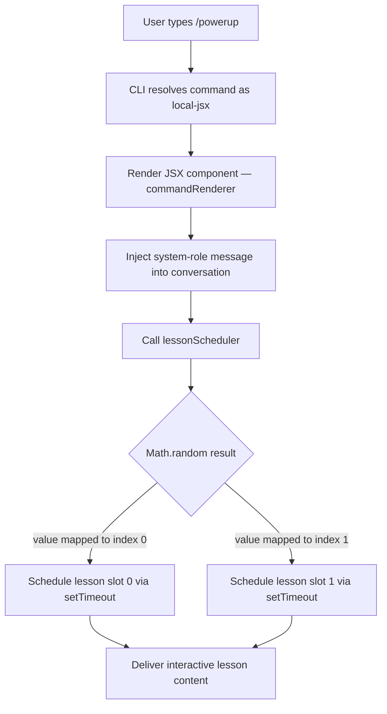

# `/powerup`

> Analysis basis: CC v2.1.132 bundle.js (AST extraction + Claude interpretation)
> Minimum version: v2.1.132

---

## Overview

`/powerup` is a local JSX slash command that delivers quick interactive lessons to help users discover Claude Code features. When invoked, it renders a JSX component that injects a system-role message into the conversation and triggers a randomised timing mechanism to orchestrate lesson delivery.

---

## Registration

| Field | Value |
|---|---|
| type | `local-jsx` |
| name | `powerup` |
| description | `Discover Claude Code features through quick interactive lessons` |
| module\_id | `f9q` |

Analysis basis: CC v2.1.132 bundle.js:+10750140

---

## Input Branching

The command takes no user-supplied arguments. All branching is driven by internal state after the component mounts.



Analysis basis: CC v2.1.132 bundle.js:+10750014, +10750049, +12264283, +12264285, +12264299, +12264322

---

## Behavioral Spec

### Command Renderer

```
function commandRenderer(props):
    element = createElement(lessonComponent, props)
    return element
```

Analysis basis: CC v2.1.132 bundle.js:+10750014

---

### System Message Injection

When the JSX component mounts, it injects a message with role `"system"` into the active conversation context. This message is used to prime the model with context relevant to the interactive lesson that is about to be delivered.

```
function injectSystemMessage(conversationContext):
    message = buildMessage(role = "system", content = lessonPrompt)
    conversationContext.prepend(message)
    return conversationContext
```

Analysis basis: CC v2.1.132 bundle.js:+10750062

---

### Lesson Scheduler

The lesson scheduler selects one of two lesson slots using a uniform random draw and schedules delivery via `setTimeout`. The two discrete slot indices (0 and 1) correspond to distinct lesson content paths.

```
function lessonScheduler():
    slotCount = 2                          // total available slots
    slotIndex = floor(Math.random() * slotCount)   // 0 or 1

    if slotIndex == 0:
        delayMs = computeDelay(slot = 0)
    else:
        delayMs = computeDelay(slot = 1)

    setTimeout(deliverLesson, delayMs, slotIndex)
```

- Total lesson slot count: `2` (bundle.js:+12264283)
- Slot index upper bound: `1` (bundle.js:+12264299)
- `Math.random` call site: bundle.js:+12264285
- `setTimeout` call site: bundle.js:+12264322

The exact value of `delayMs` and the content of each lesson slot are:
<!-- TODO: not found in depth-2 traversal; needs --depth 4 -->

---

### Lesson Delivery

```
function deliverLesson(slotIndex):
    lessonContent = resolveLessonContent(slotIndex)
    renderLessonUI(lessonContent)
```

The implementation of `resolveLessonContent` and `renderLessonUI` are:
<!-- TODO: not found in depth-2 traversal; needs --depth 4 -->

---

## State & Side Effects

| Item | Detail |
|---|---|
| Telemetry | None detected in depth-2 traversal |
| System message injection | Prepends a `"system"`-role message to the active conversation (bundle.js:+10750062) |
| Randomisation | `Math.random` is called once per invocation to select a lesson slot (bundle.js:+12264285) |
| Async scheduling | `setTimeout` is registered once per invocation; timer lifetime is not bounded in depth-2 data (bundle.js:+12264322) |
| appState changes | <!-- TODO: not found in depth-2 traversal; needs --depth 4 --> |
| Sound | <!-- TODO: not found in depth-2 traversal; needs --depth 4 --> |
| Hook registration | <!-- TODO: not found in depth-2 traversal; needs --depth 4 --> |

---

## Version History

| Version | Change |
|---|---|
| v2.1.132 | Initial analysis |

---

## Common Mistakes

1. **Expecting deterministic lesson selection** — because lesson slot selection uses `Math.random`, re-invoking `/powerup` in the same session may deliver a different lesson. Do not rely on a fixed ordering.
2. **Assuming telemetry is emitted** — depth-2 traversal found zero `tengu_*` events. Absence of telemetry means invocation is not tracked in usage dashboards as of v2.1.132.
3. **Passing arguments** — the command is registered with no argument schema. Any text appended after `/powerup` is silently ignored by the CLI resolver.
4. **Expecting instant output** — lesson content is delivered via `setTimeout`, so there is a deliberate async delay between command invocation and visible output; the exact delay value requires deeper traversal to confirm.
5. **Confusing the system message with a user turn** — the injected message carries role `"system"`, not `"user"` or `"assistant"`, and will not appear as a visible chat bubble in standard UI rendering.

---

## Appendix — Identifier Mapping

> For bundle debugging only. Identifiers change across versions.

| Identifier | Role |
|---|---|
| `e47` | Command renderer — the top-level JSX component function for `/powerup` |
| `H` | Lesson scheduler — contains the `Math.random` draw and `setTimeout` registration |