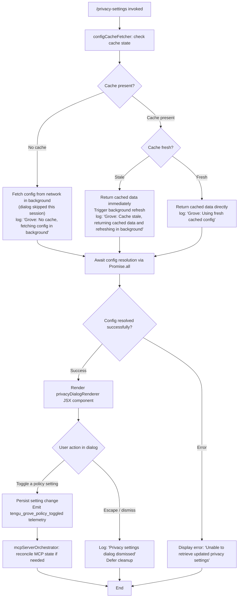

# `/privacy-settings`

> Analysis basis: CC v2.1.132 bundle.js (AST extraction + Claude interpretation)
> Minimum version: v2.1.132

---

## Overview

The `/privacy-settings` command opens an interactive dialog that allows the user to view and toggle Grove policy (privacy) settings. It employs a tiered configuration cache strategy — returning cached data immediately when fresh, refreshing in the background when stale, or fetching from the network when no cache exists — and persists any toggled settings, emitting telemetry on each change.

---

## Registration

| Field | Value |
|---|---|
| type | `local-jsx` |
| name | `privacy-settings` |
| description | `View and update your privacy settings` |
| module\_id | `Kfq` |
| loc\_line | 6878 |

Analysis basis: CC v2.1.132 bundle.js:+11126017

---

## Input Branching

The command entry point (the **commandHandler** function) first resolves the current privacy configuration via the **configCacheFetcher** function, which applies a three-way cache freshness check. The result is then passed to the **privacyDialogRenderer** JSX component for display.



Analysis basis: CC v2.1.132 bundle.js:+6451957, +6452077, +6452183, +11125335, +11125209, +11125557

---

## Behavioral Spec

### Config Cache Fetcher

The **configCacheFetcher** function determines how configuration data is sourced before the dialog is shown. It checks for the existence and age of a local cache, then takes one of three paths.

```
function configCacheFetcher():
    timestamp = Date.now()
    cache = readLocalConfigCache()

    if cache is absent:
        log("Grove: No cache, fetching config in background (dialog skipped this session)")
        scheduleBackgroundFetch()
        return null

    age = timestamp - cache.fetchedAt
    if age > FRESHNESS_THRESHOLD:
        log("Grove: Cache stale, returning cached data and refreshing in background")
        scheduleBackgroundRefresh()
        return cache.data

    log("Grove: Using fresh cached config")
    return cache.data
```

Analysis basis: CC v2.1.132 bundle.js:+6451957, +6452077, +6452183, +6451931

---

### Command Handler (Entry Point)

The **commandHandler** function is the top-level handler registered for `/privacy-settings`. It orchestrates config resolution and renders the dialog.

```
async function commandHandler(inputArgs):
    registerKeyHandler("escape", "defer", onDialogDismiss)

    configData = await Promise.all([
        configCacheFetcher(),
        fetchApplicationState()
    ])

    if configData is error or null:
        displayErrorMessage("Unable to retrieve updated privacy settings")
        return

    renderComponent(
        privacyDialogRenderer,
        { config: configData, context: "settings" }
    )
```

Analysis basis: CC v2.1.132 bundle.js:+11125061, +11125079, +11125184, +11125198, +11125335, +11125618, +11125664

---

### Dialog Dismiss Handler

When the user presses `Escape` or otherwise dismisses the dialog without saving, the **onDialogDismiss** handler runs.

```
function onDialogDismiss():
    log("Privacy settings dialog dismissed")
    deferCleanup()
    releaseKeyHandler("escape")
```

Analysis basis: CC v2.1.132 bundle.js:+11125184, +11125198, +11125209

---

### Privacy Policy Toggle Handler

When the user toggles a privacy/Grove policy setting inside the dialog, the **policyToggleHandler** function is called. It persists the change and emits telemetry.

```
function policyToggleHandler(settingKey, newValue):
    persistSetting(settingKey, newValue)
    emitTelemetry("tengu_grove_policy_toggled", { key: settingKey, value: newValue })
    reconcileMcpServersIfNeeded()
```

Analysis basis: CC v2.1.132 bundle.js:+11125557

---

### MCP Server Orchestrator

The **mcpServerOrchestrator** function is invoked after a policy change to reconcile the state of connected MCP servers. It iterates over registered servers, checks their transport types and connection states, and applies updates or retries as needed.

```
function mcpServerOrchestrator(serverRegistry):
    entries = Object.entries(serverRegistry)
    for each [serverName, serverConfig] in entries:
        transport = serverConfig.transport  // one of: "stdio", "sse", "http", "sse-ide", "ws-ide"

        if serverConfig.state == "disabled":
            skip

        if serverConfig.cachedState == "needs-auth":
            log("Skipping connection (cached needs-auth)")
            skip

        if transport == "claudeai-proxy":
            handleProxyServer(serverConfig)
            continue

        result = attemptServerConnection(serverConfig)

        if result.state == "connected":
            markConnected(serverName)
        elif result.state == "failed":
            scheduleRetry(serverName)
            if allRemoteServersRecovered():
                log("[MCP] Retry: all remote servers recovered, stopping")
                emitTelemetry("tengu_mcp_retry_failed_remote")
                stopRetryLoop()

    applyMcpUpdate(serverRegistry)
```

Analysis basis: CC v2.1.132 bundle.js:+9461973, +9462075, +9462109, +9462141, +9462174, +9462210, +9462482, +9462602, +9462668, +9462770, +9463337, +13847420, +13846663

---

### Debug Logging Guard

All internal log calls within the command pipeline pass through a **debugLoggingGuard** check. Only messages at the `"debug"` log level (or higher) pass through to output.

```
function debugLoggingGuard(level, message):
    if level == "debug":
        normalizeAndEmit(message)
    else:
        suppress(message)
```

Analysis basis: CC v2.1.132 bundle.js:+161637

---

### Input Normalizer

The **inputNormalizer** function sanitizes raw command input before further dispatch. It trims whitespace, uppercases where needed for key matching, and checks inclusion against a known-values list.

```
function inputNormalizer(rawInput, knownValues):
    trimmed = rawInput.trim()
    upper = trimmed.toUpperCase()
    if knownValues.includes(upper):
        return upper
    return trimmed
```

Analysis basis: CC v2.1.132 bundle.js:+161701, +161763, +161786

---

### Randomized Delay Helper

The **randomizedDelayHelper** function introduces a small randomized delay (using `Math.random` scaled by `2`) before executing a callback, used during background refresh scheduling to avoid thundering-herd fetch patterns.

```
function randomizedDelayHelper(callback):
    delayMs = Math.random() * 2 * BASE_DELAY
    setTimeout(callback, delayMs)
```

Analysis basis: CC v2.1.132 bundle.js:+12264283, +12264285, +12264322

---

## State & Side Effects

| Item | Detail |
|---|---|
| Telemetry | `tengu_grove_policy_toggled` (bundle.js:+11125557) — fired on each privacy setting toggle; `tengu_mcp_retry_failed_remote` (bundle.js:+13846663) — fired when all remote MCP servers recover and the retry loop stops |
| Hook registration | Registers an `"escape"` key handler with `"defer"` disposition on dialog open; releases it on dismiss (bundle.js:+11125184, +11125198) |
| appState changes | Persists toggled Grove policy settings to application state; triggers MCP server reconciliation after each toggle (bundle.js:+11125557) |
| Background fetch | Schedules a background config fetch (with randomized delay) when cache is absent or stale (bundle.js:+6451957, +6452077) |
| Error display | Renders inline error `"Unable to retrieve updated privacy settings"` if config resolution fails (bundle.js:+11125335) |
| Sound | <!-- TODO: not found in depth-2 traversal; needs --depth 4 --> |
| MCP side effects | `applyMcpUpdate` is called on the server registry after reconciliation; `_.cleanup` is invoked for servers being torn down (bundle.js:+13846850, +13846979) |

---

## Version History

| Version | Change |
|---|---|
| v2.1.132 | Initial analysis |

---

## Common Mistakes

1. **Assuming the dialog always fetches live data on open.** The command uses a three-tier cache strategy; if the cache is fresh, no network call is made. Users may see slightly stale privacy settings if the cache has not yet expired.

2. **Expecting immediate MCP reconnection after toggling a setting.** MCP server reconciliation is scheduled asynchronously after a toggle. Servers in `"needs-auth"` or `"disabled"` states are explicitly skipped during reconciliation and will not automatically reconnect.

3. **Pressing Escape and expecting the change to be saved.** The `"escape"` key dismisses the dialog via `onDialogDismiss`, which runs cleanup without persisting any in-progress changes. Only confirmed toggles trigger `tengu_grove_policy_toggled` and persistence.

4. **Conflating `tengu_mcp_retry_failed_remote` with a privacy event.** This telemetry event is emitted by the MCP retry subsystem triggered as a side effect of privacy setting changes, not by the privacy dialog itself directly.

5. **Running `/privacy-settings` in a non-interactive context.** The command is registered as type `local-jsx`, meaning it renders a JSX UI component. Invoking it in a headless or pipe-only environment will likely produce no visible output or an error.

---

## Appendix — Identifier Mapping

> For bundle debugging only. Identifiers change across versions.

| Identifier | Role |
|---|---|
| `n$7` | commandHandler — top-level `/privacy-settings` command entry point |
| `xBH` | configCacheFetcher — tiered cache resolution for Grove config |
| `kPH` | cacheReadHelper — reads and validates local config cache entries |
| `g7` | cacheAgeCalculator — computes cache staleness relative to current time |
| `R6` | telemetryEmitter — emits structured telemetry events with timestamps |
| `k` | inputNormalizer — trims, uppercases, and validates raw input strings |
| `zL9` | backgroundRefreshScheduler — schedules deferred background config refresh |
| `H` | randomizedDelayHelper — applies Math.random-based delay before callback |
| `M` | mcpServerOrchestrator — reconciles MCP server states after policy change |
| `UZH` | mcpConnectionManager — iterates servers and manages connect/retry logic |
| `ZBq` | mcpUpdateApplier — applies computed MCP update and runs server cleanup |
| `K` | processExitGuard — handles uncaught errors with process.exit fallback |
| `$` | stateSerializer — serializes app state via mzq helper |
| `j6` | deduplicationTracker — tracks seen server names to prevent duplicate processing |
| `$F7` | serverFilterAndDispatch — filters server entries and dispatches connect/retry |
| `d` | privacyDialogRenderer — JSX component that renders the privacy settings UI |