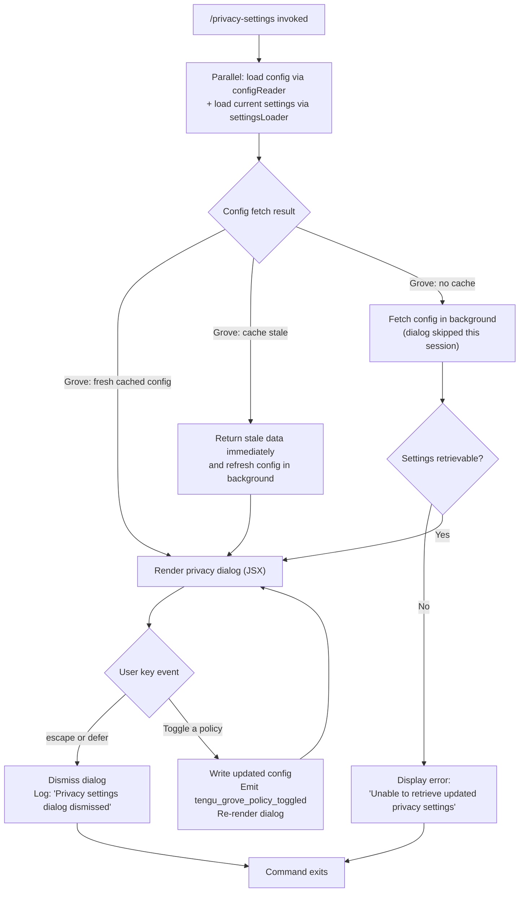

# `/privacy-settings`

> Analysis basis: CC v2.1.132 bundle.js (AST extraction + Claude interpretation)
> Minimum version: v2.1.132

---

## Overview

The `/privacy-settings` command opens an interactive dialog that reads the current privacy configuration, presents it to the user, and persists any changes back to the global config store. It is implemented as a `local-jsx` command that renders a React JSX component, and it emits a `tengu_grove_policy_toggled` telemetry event whenever a setting is changed. The handler is an async function (`n$7`) resolved from module `Kfq` via the `module_id` resolution path.

---

## Registration

| Field | Value |
|---|---|
| type | `local-jsx` |
| name | `privacy-settings` |
| description | `View and update your privacy settings` |
| module_id | `Kfq` |
| load_inline | `true` |
| handler | `n$7` (AsyncFunction, resolved via `module_id`) |
| loc_byte span | `11126017` – `11126209` |
| `loc_byte_end` | `11126209` |
| `arbor_handler.name` | `n$7` |
| `arbor_handler.kind` | `AsyncFunction` |
| `arbor_handler.resolution_path` | `module_id` |
| `arbor_handler.fqn` | `claude-2.1.132::n$7` |
| `arbor_handler.n_hits` | `0` |

Analysis basis: CC v2.1.132 bundle.js:+11126017

---

## Input Branching

The handler (`n$7`) does not accept free-form text arguments. Its branching is driven by key-press events inside the rendered JSX dialog and by the state of the config cache.



Analysis basis: CC v2.1.132 bundle.js:+11125021, +11125184, +11125198, +11125209, +11125335, +6451957, +6452077, +6452183

---

## Behavioral Spec

### 1. Handler Entry Point

The async handler (`n$7`) is the top-level entry for this command. It initiates a `Promise.all` to concurrently resolve the config state and the application-state object before constructing the JSX view.

```
async function privacySettingsHandler(commandContext):
    [configState, appState] = await Promise.all([
        loadConfig(),          // via configReader (xBH)
        loadAppState()         // via rc / A$H
    ])

    if configState is not available:
        return renderErrorMessage("Unable to retrieve updated privacy settings")

    return renderPrivacyDialog(configState, appState)
```

Analysis basis: CC v2.1.132 bundle.js:+11125021, +11125061, +11125074, +11125079, +11125335

---

### 2. Config Loading and Cache Strategy (Grove)

Config reading passes through a caching layer (the "Grove" subsystem, `xBH` → `zL9`). The cache has three states, each producing a distinct log message.

```
function loadConfigWithGroveCache():
    cacheEntry = readCacheEntry()

    if cacheEntry is missing:
        log("Grove: No cache, fetching config in background (dialog skipped this session)")
        triggerBackgroundFetch()
        return null   // dialog may be skipped

    if cacheEntry.isStale():
        log("Grove: Cache stale, returning cached data and refreshing in background")
        triggerBackgroundFetch()
        return cacheEntry.data   // serve stale immediately

    log("Grove: Using fresh cached config")
    return cacheEntry.data
```

Constants:
- Log string `"Grove: No cache, fetching config in background (dialog skipped this session)"` (bundle.js:+6451957)
- Log string `"Grove: Cache stale, returning cached data and refreshing in background"` (bundle.js:+6452077)
- Log string `"Grove: Using fresh cached config"` (bundle.js:+6452183)

Analysis basis: CC v2.1.132 bundle.js:+6451863, +6452037

---

### 3. Config Read/Write with Locking

Underlying config I/O (`k5H`, `Nt8`, `A8`) uses a file-based lock to prevent concurrent writes across multiple Claude instances.

```
function readConfigWithLock(configPath):
    if not lockAcquiredInTime():
        emit("tengu_config_lock_contention")
        log("Lock acquisition took longer than expected - another Claude instance may be running")

    rawBytes = fs.readFileSync(configPath, "utf-8")

    try:
        parsed = JSON.parse(rawBytes)
    except ParseError:
        emit("tengu_config_parse_error")
        return defaultConfig

    return parsed

function writeConfigWithLock(configPath, newConfig):
    // Re-read before write to guard against auth loss (GH #3117)
    reRead = readConfigWithLock(configPath)

    if reRead is missing auth fields that cache has:
        emit("tengu_config_stale_write")
        log("saveConfigWithLock: re-read config is missing auth that cache has; refusing to write...")
        return  // abort write

    if authLossPrevented(reRead, newConfig):
        emit("tengu_config_auth_loss_prevented")
        return

    // Rotate backups; keep at most 5 (bundle.js:+3106328)
    rotateBackups(configPath, maxBackups=5)
    // Backup file name pattern includes ".backup." prefix (bundle.js:+3106195)
    fs.copyFileSync(configPath, backupPath)
    atomicWrite(configPath, newConfig)
```

Constants:
- Encoding: `"utf-8"` (bundle.js:+3107373)
- Error code for missing file: `"ENOENT"` (bundle.js:+3107520)
- Error code for existing dir: `"EEXIST"` (bundle.js:+3108141)
- Max backups retained: `5` (bundle.js:+3106328)
- Lock timeout threshold: `60000` ms (bundle.js:+3106079)
- Backup filename segment: `".backup."` (bundle.js:+3106195)

Analysis basis: CC v2.1.132 bundle.js:+3107290, +3105309, +3105725, +3105877, +3102607

---

### 4. Dialog Key Handling and Dismissal

The JSX dialog listens for two key events that close it without saving.

```
function handleKeyEvent(key, dialogState):
    if key == "escape" or key == "defer":
        log("Privacy settings dialog dismissed")
        closeDialog()
        return

    if key is a toggle action:
        updatedSettings = applyToggle(dialogState.settings, key)
        persistSettings(updatedSettings)
        emitTelemetry("tengu_grove_policy_toggled", { setting: key })
        rerenderDialog(updatedSettings)
```

- Key constant `"escape"` (bundle.js:+11125184)
- Key constant `"defer"` (bundle.js:+11125198)
- Dismissal log string (bundle.js:+11125209)
- Telemetry event emitted on toggle: `tengu_grove_policy_toggled` (bundle.js:+11125557)

Analysis basis: CC v2.1.132 bundle.js:+11125184, +11125198, +11125209, +11125557

---

### 5. Privacy Settings Persistence

When a policy is toggled, the new value is written to the global config under the `"settings"` key. The write path uses the same locking mechanism described in §3.

```
function persistSettings(updatedSettings):
    globalConfig = readConfigWithLock(globalConfigPath)
    globalConfig["settings"] = updatedSettings
    writeConfigWithLock(globalConfigPath, globalConfig)
```

- Config section key: `"settings"` (bundle.js:+11125618)

Analysis basis: CC v2.1.132 bundle.js:+11125618, +11125557

---

### 6. MCP Subsystem Interactions (Indirect)

The call graph reaches the MCP manager (`UZH`, `$F7`, `ZBq`) and several server-type constants. These are reached through the application-state load path (`M`) rather than being directly invoked by the privacy dialog itself. They are documented here for completeness but do not directly affect the privacy settings UI flow.

MCP server type literals encountered in the traversal:
- `"stdio"` (bundle.js:+9462075)
- `"sse-ide"` (bundle.js:+9462174)
- `"ws-ide"` (bundle.js:+9462210)
- `"claudeai-proxy"` (bundle.js:+9462482)
- `"enterprise"` (bundle.js:+7466710)

These are MCP transport/type classification constants; they are not privacy policy values.

Analysis basis: CC v2.1.132 bundle.js:+9461875, +13846520, +13847618

---

## State & Side Effects

| Item | Detail |
|---|---|
| Telemetry — `tengu_grove_policy_toggled` | Fired each time the user toggles a privacy policy within the dialog (bundle.js:+11125557) |
| Telemetry — `tengu_config_parse_error` | Fired if the config file cannot be JSON-parsed during read (bundle.js:+3107927) |
| Telemetry — `tengu_config_lock_contention` | Fired when the config file lock takes longer than expected (bundle.js:+3105398) |
| Telemetry — `tengu_config_stale_write` | Fired when a write is aborted because a re-read returned stale data (bundle.js:+3105534) |
| Telemetry — `tengu_config_auth_loss_prevented` | Fired when a write is blocked to prevent erasing auth credentials (bundle.js:+3105877) |
| Telemetry — `tengu_mcp_retry_failed_remote` | Reached through app-state load; fired on MCP remote server retry failure (bundle.js:+13846663) |
| Config write | Updates the `"settings"` key in the global config file (`~/.claude.json`) |
| Config backups | Rotates up to 5 backup copies of the config file before each write |
| File lock | Acquires a file-system lock for the duration of each config read/write cycle |
| Background cache refresh | Grove layer may trigger an async background config fetch when the cache is stale or absent |
| JSX render | Mounts a React JSX component for the interactive dialog; unmounted on dismiss |
| appState changes | Privacy policy flags under `"settings"` are updated in the in-memory app state after a successful write |
| Sound | <!-- TODO: not found in depth-2 traversal; needs --depth 4 --> |
| Hook registration | <!-- TODO: not found in depth-2 traversal; needs --depth 4 --> |

---

## Version History

| Version | Change |
|---|---|
| v2.1.132 | Initial analysis |

---

## Common Mistakes

1. **Dismissing with `defer` vs. saving**: Pressing `defer` (or `escape`) closes the dialog without persisting any in-progress toggle changes. Users who toggle a setting and then press `defer` will lose those changes silently.

2. **Concurrent Claude instances**: If another Claude process holds the config file lock, the write will be delayed and `tengu_config_lock_contention` will be emitted. The dialog does not surface this delay to the user visually.

3. **Auth-loss guard (GH #3117)**: The config writer re-reads the file before committing. If a concurrent process has already written a version that is missing auth credentials that the in-memory cache holds, the write is aborted entirely. This is a silent no-op from the user's perspective and may appear as if the setting change was not saved.

4. **Stale cache on first invocation**: If the Grove cache is absent (first run or cleared), the dialog may be skipped for the current session. Re-running `/privacy-settings` after the background fetch completes will show the dialog normally.

5. **`local-jsx` type**: This command renders a JSX component, not a plain text response. Environments or wrappers that strip JSX output will receive no visible output from this command.

---

## Appendix — Identifier Mapping

> For bundle debugging only. Identifiers change across versions.

| Identifier | Role |
|---|---|
| `n$7` | Primary async handler for `/privacy-settings` command |
| `xBH` | Config reader — Grove cache wrapper entry point |
| `kPH` | Config read sub-routine (account type resolution) |
| `F9` | Account/auth state builder |
| `wx_` | Auth state field extractor A |
| `Yx_` | Auth state field extractor B |
| `nY` | API key / auth resolution helper |
| `R_` | Config reader alternate path |
| `fU` | Boolean coercion utility |
| `PDK` | Config read finalizer |
| `g7` | Grove config-read entry (initial load) |
| `R6` | File-based config reader (low-level) |
| `F6` | File-system existence checker |
| `Et8` | Config schema validator |
| `k5H` | Config file read with backup rotation |
| `DPK` | File watcher / watch-file manager |
| `k` | Logger / structured log writer |
| `Lsq` | Log transport layer |
| `rdA` | Log formatter |
| `H` | Randomised delay / jitter utility |
| `RH` | JSON serializer |
| `A` | Generic utility (string/object helpers) |
| `mf` | Log message formatter |
| `MnA` | Log token mapper |
| `_` | String utilities (lowercase, slice, lastIndexOf) |
| `gNH` | Stdout write helper |
| `slA` | Raw handle write |
| `Msq` | Async file writer (append/rotate) |
| `GNH` | Debounced write scheduler |
| `pHH` | Write path resolver |
| `JG8` | JSON parse wrapper |
| `jnA` | File path joiner for log output |
| `JnA` | Atomic rename helper |
| `fsq` | File write session (mkdir + appendFile + rotate) |
| `N1` | Subscription / listener manager |
| `zL9` | Grove cache state machine |
| `A8` | Global config save (fallback path) |
| `Nt8` | Config write with lock + backup rotation |
| `FbH` | Config pre-write validator |
| `CJ1` | Config entry enumerator |
| `gbH` | Config timestamp updater |
| `uq6` | Config path resolver |
| `d` | Error logger |
| `vt8` | Config write (non-locking path) |
| `M` | MCP manager orchestrator |
| `UZH` | MCP server collection manager |
| `qt` | MCP server group builder |
| `VEH` | MCP server instance constructor |
| `_t` | MCP SDK server builder |
| `LO6` | MCP server registry (map-based) |
| `wI` | MCP client initializer |
| `oM` | MCP connection opener |
| `nwA` | MCP connection normalizer |
| `L` | Output formatter (padEnd columns) |
| `K` | Process / TTY manager |
| `f` | TTY/stream handle |
| `qA` | Generic resolver/accessor |
| `Qw6` | MCP server filter utility |
| `Nr4` | Needs-auth cache reader |
| `XZA` | Needs-auth file reader |
| `a18` | MCP server identity hasher |
| `jl` | Config value accessor |
| `o18` | Encoding key builder |
| `WJ` | Hash generator (SHA-256) |
| `K8` | MCP debug logger |
| `tTA` | MCP transport connector |
| `Ci4` | OAuth client builder |
| `Bp` | OAuth token store accessor |
| `ot` | MCP OAuth flow runner |
| `pcH` | In-flight request tracker |
| `Y` | Background spare process manager |
| `hf8` | Needs-auth cache cleaner |
| `QF` | MCP reconnect orchestrator |
| `Rb` | Token read helper |
| `D` | Daemon supervisor |
| `Z7` | MCP error logger |
| `vH` | String coercion wrapper |
| `bi4` | OAuth pre-check |
| `Ri4` | SSH-environment detector |
| `eTA` | MCP server reconnect handler |
| `mcH` | In-flight map getter |
| `UcH` | Pending-request getter |
| `mc9` | Needs-auth cache writer |
| `Qf8` | Needs-auth cache path builder |
| `aTA` | MCP token clear helper |
| `EK` | Config store accessor |
| `Nw6` | Token storage updater |
| `gwA` | MCP server capability checker |
| `J` | Process kill list manager |
| `v` | Background worker process |
| `S` | Daemon write stream |
| `z` | Daemon stream manager |
| `Cc9` | Concurrent-request limiter |
| `zMH` | Async iterator / concurrency mapper |
| `dw6` | Integer parser (radix 10) |
| `PZA` | Integer parser (radix 20) |
| `ZBq` | MCP update applier |
| `df8` | MCP update serializer |
| `bI` | MCP client cleanup helper |
| `dcH` | MCP disconnect helper |
| `$` | Config persistence entry (mzq wrapper) |
| `mzq` | Config atomic write coordinator |
| `Er` | Config write error handler |
| `lY` | Atomic file writer (randomBytes temp name) |
| `PX6` | Daemon status file path builder |
| `j6` | Conversation/session manager |
| `hq6` | Session store reader |
| `Rq6` | Session store writer |
| `Oo` | Session metadata builder |
| `yH` | String converter |
| `Mo` | Model selector |
| `uQ6` | Session cache getter/setter |
| `Lt8` | Session initializer (emits GrowthbookExperimentEvent) |
| `Dt8` | Session lifecycle manager |
| `$F7` | MCP server state reconciler |
| `t18` | Tool permission checker |
| `q` | Temp-file cleanup (unlinkSync) |
| `o8` | Child process launcher |
| `O` | Output queue manager |