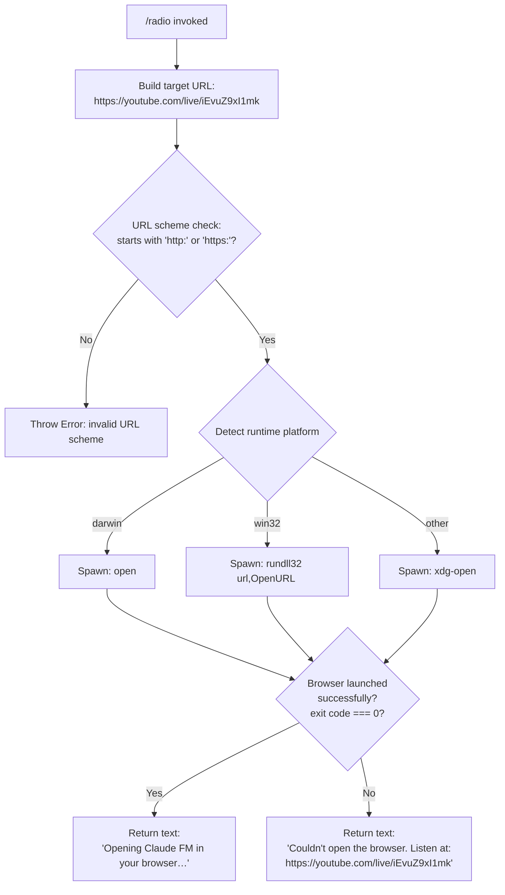

```
---
type: feature-spec
feature: "radio"
cc_version: "2.1.132"
updated: "2026-05-18"
tags: ["radio", "commands", "slash-commands"]
source: "bundle-analysis"
bundle_verified: true
analysis_basis: "CC v2.1.132 bundle.js (AST extraction + Claude interpretation)"
author: "ryujaeuk <ryujaeuk@gmail.com>"
repository: "https://github.com/MyLittleLuckyDog/cc-gnothi"
license: "AGPL-3.0-only"
---

# `/radio`

> Analysis basis: CC v2.1.132 bundle.js (AST extraction + Claude interpretation)
> Minimum version: v2.1.132

---

## Overview

The `/radio` command opens the Claude FM lo-fi radio stream in the user's default web browser by launching the URL `https://youtube.com/live/iEvuZ9xI1mk`. It uses a platform-aware browser-open mechanism (Windows, macOS, or Linux/other) and falls back to printing the URL in the terminal if the browser cannot be launched. The command is interactive-only and emits no telemetry events.

---

## Registration

| Field | Value |
|---|---|
| type | `local` |
| name | `radio` |
| description | `Listen to Claude FM lo-fi radio` |
| supportsNonInteractive | `false` |
| module_id | `S$q` |

Analysis basis: CC v2.1.132 bundle.js:+11306347

---

## Input Branching

The command accepts no user-supplied arguments. All branching is internal to the browser-open logic.



Analysis basis: CC v2.1.132 bundle.js:+11306075, +7355236, +7355286, +7355308, +7355558, +7355574, +7355658, +7355670, +7355732, +7355739, +7355806

---

## Behavioral Spec

### Command Entry Point

```
function radioCommandHandler(context):
    url = "https://youtube.com/live/iEvuZ9xI1mk"
    result = openInBrowser(url)
    if result.success:
        return { type: "text", content: "Opening Claude FM in your browser…" }
    else:
        return { type: "text", content: "Couldn't open the browser. Listen at: https://youtube.com/live/iEvuZ9xI1mk" }
```

Analysis basis: CC v2.1.132 bundle.js:+11306075, +11306078, +11306130, +11306143, +11306211

---

### URL Validation

Before any process is spawned, the URL scheme is validated against the allowlist `["http:", "https:"]`. If the scheme does not match either value, an `Error` is thrown and execution stops.

```
function validateURLScheme(url):
    scheme = extractScheme(url)          // everything up to and including ':'
    if scheme not in ["http:", "https:"]:
        throw Error("invalid URL scheme")
    return true
```

Analysis basis: CC v2.1.132 bundle.js:+7355236, +7355286, +7355308

---

### Platform-Aware Browser Open

After validation, the implementation selects a system command based on `process.platform` and spawns it as a child process. The exit code of the spawned process determines success or failure.

```
function openInBrowser(url):
    validateURLScheme(url)

    platform = getPlatform()             // reads process.platform

    if platform == "darwin":
        cmd  = "open"
        args = [url]
    else if platform == "win32":
        cmd  = "rundll32"
        args = ["url,OpenURL", url]
    else:
        cmd  = "xdg-open"
        args = [url]

    exitCode = spawnAndWait(cmd, args)   // synchronous or awaited spawn

    if exitCode == 0:
        return { success: true }
    else:
        return { success: false }
```

Exit-code success threshold: `0` (bundle.js:+987933).
Numeric constant `10` present in the same proximity — likely a spawn timeout or retry limit:
`<!-- TODO: not found in depth-2 traversal; needs --depth 4 -->`

Analysis basis: CC v2.1.132 bundle.js:+7355523, +7355558, +7355574, +7355607, +7355658, +7355670, +7355732, +7355739, +7355806, +987899, +987933, +987954, +988065

---

### Process Spawn Utilities

Two helper functions (`spawnProcess` and `waitForExit`) are reached at depth 2 via the browser-open function. Their detailed internals require deeper traversal.

```
function spawnProcess(cmd, args):
    // spawns child process for cmd with args
    // returns process handle
    <!-- TODO: not found in depth-2 traversal; needs --depth 4 -->

function waitForExit(processHandle):
    // waits for child process to exit
    // returns integer exit code
    <!-- TODO: not found in depth-2 traversal; needs --depth 4 -->
```

Analysis basis: CC v2.1.132 bundle.js:+987954, +988065

---

## State & Side Effects

| Item | Detail |
|---|---|
| Telemetry | None — `telemetry` array is empty; no `tengu_*` events are emitted by this command |
| Hook registration | None observed in depth-2 traversal |
| appState changes | None observed in depth-2 traversal |
| Sound / media | No in-process audio; stream is delegated entirely to the external browser |
| Child process | A short-lived OS process (`open`, `rundll32`, or `xdg-open`) is spawned and awaited |
| Output type | Plain `text` message returned to the CLI renderer (Analysis basis: CC v2.1.132 bundle.js:+11306130) |
| Non-interactive support | `false` — the command must not be used in `--no-interactive` / pipe mode (Analysis basis: CC v2.1.132 bundle.js:+11306347) |

---

## Version History

| Version | Change |
|---|---|
| v2.1.132 | Initial analysis — command confirmed present with YouTube Live target URL |

---

## Common Mistakes

1. **Running in non-interactive mode** — because `supportsNonInteractive` is `false`, invoking `/radio` inside a pipeline or with `--no-interactive` will be rejected or silently skipped before the URL is ever opened.
2. **Expecting in-terminal audio** — the command only launches an external browser tab; it does not stream audio inside the terminal or the Claude Code UI itself.
3. **Firewall / sandbox environments** — if `xdg-open`, `open`, or `rundll32` are blocked by a sandbox policy, the command will return the fallback error message with the raw URL rather than silently succeeding. Users should copy the URL manually in that case: `https://youtube.com/live/iEvuZ9xI1mk`.
4. **WSL without a Windows browser bridge** — on Windows Subsystem for Linux the detected platform is `linux` (not `win32`), so `xdg-open` is used; if no X11/Wayland display or `xdg-open` shim is configured, the spawn will fail and the fallback message will be shown.
5. **Assuming telemetry confirms usage** — no telemetry events are fired; usage of this command cannot be inferred from telemetry logs.

---

## Appendix — Identifier Mapping

> For bundle debugging only. Identifiers change across versions.

| Identifier | Role |
|---|---|
| `ZD7` | Radio command handler / entry-point function |
| `LL` | Browser-open orchestrator (validates URL scheme, selects platform command, interprets exit code) |
| `T04` | URL scheme validator (throws `Error` on non-HTTP/HTTPS schemes) |
| `Y8` | Child-process spawn-and-wait wrapper (platform-specific process launcher) |
```