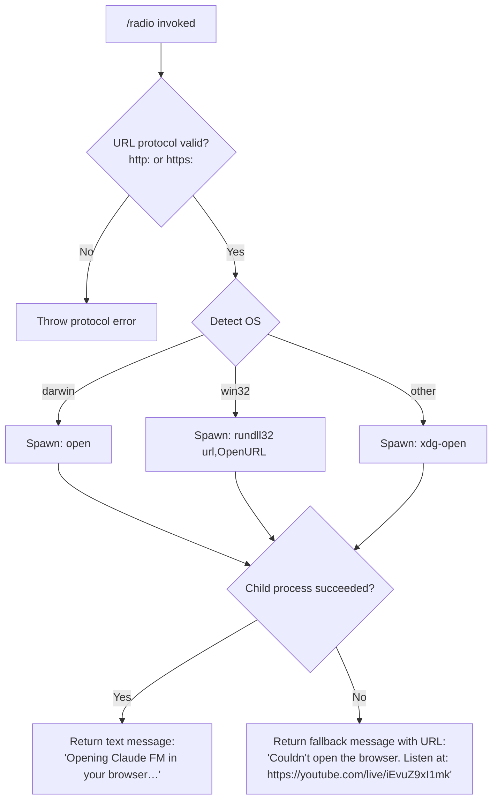

# `/radio`

> Analysis basis: CC v2.1.132 bundle.js (AST extraction + Claude interpretation)
> Minimum version: v2.1.132

---

## Overview

`/radio` is a local slash command that opens the Claude FM lo-fi radio stream (`https://youtube.com/live/iEvuZ9xI1mk`) in the user's default web browser. It requires an interactive session and returns a short status message indicating whether the browser was launched successfully or providing the URL as a fallback. The command contains no AI agent invocation — it is purely a side-effect launcher.

---

## Registration

| Field | Value |
|---|---|
| type | `local` |
| name | `radio` |
| description | `Listen to Claude FM lo-fi radio` |
| module_id | `S$q` |
| load_inline | `true` |
| supportsNonInteractive | `false` |
| handler (Arbor-resolved) | `ZD7` (AsyncFunction, resolved via `module_id`) |
| `loc_byte_end` | `11306552` |
| `arbor_handler.name` | `ZD7` |
| `arbor_handler.kind` | `AsyncFunction` |
| `arbor_handler.resolution_path` | `module_id` |
| `arbor_handler.fqn` | `claude-2.1.132::ZD7` |
| `arbor_handler.n_hits` | `0` |

Analysis basis: CC v2.1.132 bundle.js:+11306347 – +11306552

---

## Input Branching

The command accepts no meaningful user-supplied arguments. All branching is determined by the runtime environment (operating system) and whether the browser-open system call succeeds.



Analysis basis: CC v2.1.132 bundle.js:+11306075 (handler entry), +7355236 (protocol check), +7355523 (URL validator), +7355558 (OS branching), +7355658 (win32 launcher), +7355732 (macOS/Linux launchers)

---

## Behavioral Spec

### Handler Entry Point

The async handler (`ZD7`) is the sole entry point for this command, resolved by Arbor via the `module_id` path `S$q`. It immediately invokes the URL-opener utility with the hard-coded radio URL.

```
async function radioCommandHandler(context):
    TARGET_URL = "https://youtube.com/live/iEvuZ9xI1mk"
    result = await openUrlInBrowser(TARGET_URL)
    if result.success:
        return { type: "text", content: "Opening Claude FM in your browser…" }
    else:
        return { type: "text", content: "Couldn't open the browser. Listen at: " + TARGET_URL }
```

Analysis basis: CC v2.1.132 bundle.js:+11306075, +11306130, +11306143, +11306211

---

### URL Validation (Protocol Guard)

Before any OS-level call is attempted, the URL-opener utility validates that the URL's protocol is either `http:` or `https:`. Any other scheme causes an immediate error to be thrown rather than passed to the shell.

```
function validateUrl(url):
    protocol = extractProtocol(url)
    if protocol not in ["http:", "https:"]:
        throw Error("Unsupported protocol: " + protocol)
    return url
```

Analysis basis: CC v2.1.132 bundle.js:+7355236, +7355286, +7355308

---

### OS-Specific Browser Launch

After validation the opener selects a platform-appropriate subprocess to launch the URL:

```
function launchBrowser(url):
    platform = process.platform
    if platform == "darwin":
        spawn("open", [url])
    else if platform == "win32":
        spawn("rundll32", ["url,OpenURL", url])
    else:
        spawn("xdg-open", [url])
```

| Platform value | Command used |
|---|---|
| `darwin` | `open` |
| `win32` | `rundll32 url,OpenURL` |
| all others (Linux, etc.) | `xdg-open` |

Analysis basis: CC v2.1.132 bundle.js:+7355558 (`darwin`), +7355574 (`win32`), +7355658 (`rundll32`), +7355670 (`url,OpenURL`), +7355732 (`open`), +7355739 (`xdg-open`)

---

### Background Process / Spare Management

The call graph reaches a background-spare subsystem (`Y`) that emits telemetry events `tengu_bg_spare_enable` and `tengu_bg_spare_spawn`. This subsystem manages a pool of pre-warmed background processes. The `/radio` command itself does not directly control this pool — it is triggered as a side effect of the session infrastructure invoked during command dispatch. The spare loop uses a 2000 ms interval (`2000`, bundle.js:+14129682) and tracks timing via `Date.now()` (bundle.js:+14129658).

Analysis basis: CC v2.1.132 bundle.js:+14129457, +14129749, +14129682

---

### Notification / Output Rendering

The command routes its result through a text-content renderer. The `type` field of the return value is set to the literal `"text"` (bundle.js:+11306130), which instructs the CLI shell to display the message directly to the user in the terminal.

Analysis basis: CC v2.1.132 bundle.js:+11306130

---

### Audio Stream Management

The command does not itself stream audio or manage any audio playback process — it only opens the YouTube Live URL in the default browser. All audio delivery is handled by the external browser and the YouTube platform.

---

## State & Side Effects

| Item | Detail |
|---|---|
| Telemetry — `tengu_bg_spare_enable` | Fired by the background spare subsystem during command dispatch infrastructure (bundle.js:+14129457) |
| Telemetry — `tengu_bg_spare_spawn` | Fired when a new background spare process is spawned (bundle.js:+14129749) |
| Hook registration | <!-- TODO: not found in depth-2 traversal; needs --depth 4 --> |
| appState changes | None directly attributable to `/radio`; background spare pool state may update |
| Sound / Media | No in-process audio; external browser is launched to play the stream |
| Subprocess spawned | One short-lived OS subprocess (`open` / `rundll32` / `xdg-open`) to open the browser |
| Hard-coded URL | `https://youtube.com/live/iEvuZ9xI1mk` (bundle.js:+11306078, +11306211) |
| Non-interactive support | `false` — command is blocked in non-interactive (CI/pipe) contexts |
| Max spare pool items | 10 (bundle.js:+987899), initial index 0 (bundle.js:+987933) |
| Spare pool size limit | 1 000 000 (bundle.js:+988421) |

---

## Version History

| Version | Change |
|---|---|
| v2.1.132 | Initial analysis — command registered as `local` type, opens Claude FM at `https://youtube.com/live/iEvuZ9xI1mk` |

---

## Common Mistakes

1. **Running `/radio` in non-interactive mode (e.g., CI pipelines or `--no-interactive` flags):** The registration explicitly sets `supportsNonInteractive: false`. The command will be unavailable or rejected in those contexts.
2. **Expecting in-terminal audio playback:** `/radio` does not stream audio inside the CLI. It solely opens an external browser URL; if no graphical browser is available (e.g., headless servers), the command will fail and return the fallback URL message.
3. **Assuming the YouTube link is dynamic:** The URL `https://youtube.com/live/iEvuZ9xI1mk` is a hard-coded string literal in the bundle. If the stream moves to a different URL, a bundle update is required.
4. **Passing arguments to `/radio`:** The command ignores all user-supplied arguments; there is no parameter parsing in the handler.
5. **Confusing the fallback message with an error state:** When the browser cannot be opened, the command returns a human-readable text message (not a thrown exception visible to the user) containing the URL so the user can open it manually.

---

## Appendix — Identifier Mapping

> For bundle debugging only. Identifiers change across versions.

| Identifier | Role |
|---|---|
| `ZD7` | `/radio` async command handler (Arbor-resolved entry point via module `S$q`) |
| `LL` | URL-opener orchestration function (dispatches to protocol validator and OS launcher) |
| `T04` | URL protocol validator (checks `http:`/`https:`, throws on invalid scheme) |
| `Y8` | Session/context resolution wrapper called by URL opener |
| `PA` | Browser launch coordinator; invokes spare-pool helper and output formatter |
| `rJH` | Low-level OS subprocess spawn helper (platform-specific child process logic) |
| `Y` | Background spare process loop (manages pre-warmed process pool, emits telemetry) |
| `ujL` | String coercion utility used during launch parameter construction |
| `fH` | Output/notification renderer (formats text response, logs errors via `EQ.logError`) |
| `N6` | Context/store accessor called during session resolution |
| `Qv6` | AsyncLocalStorage store reader (`gv6.getStore`) |
| `_A` | Fallback or null-context handler reached after store lookup |