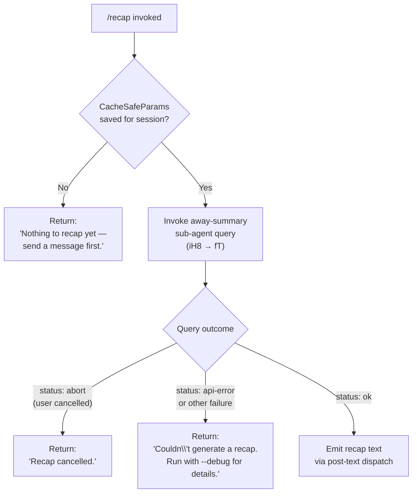

# `/recap`

> Analysis basis: CC v2.1.132 bundle.js (AST extraction + Claude interpretation)
> Minimum version: v2.1.132

---

## Overview

The `/recap` command triggers an immediate, on-demand generation of a one-line session recap summarising the current conversation. It dispatches an "away summary" sub-agent query against the existing conversation context and emits the resulting text as a post-text response to the CLI. If no conversation turns exist yet, or if the recap generation fails, it returns a short diagnostic message instead.

---

## Registration

| Field | Value |
|---|---|
| type | `local` |
| name | `recap` |
| description | `Generate a one-line session recap now` |
| supportsNonInteractive | `false` |
| thinClientDispatch | `post-text` |
| load_inline | `true` |
| load_ident | `lX7` |
| handler_kind | `AsyncFunction` (Arbor: `load_ident` resolution) |
| `loc_byte_end` | `11613140` |
| `arbor_handler.name` | `lX7` |
| `arbor_handler.kind` | `AsyncFunction` |
| `arbor_handler.resolution_path` | `load_ident` |
| `arbor_handler.fqn` | `claude-2.1.132::lX7` |
| `arbor_handler.n_hits` | `0` |

Analysis basis: CC v2.1.132 bundle.js:+11612924 – +11613140

---

## Input Branching

The handler (`lX7`) evaluates the session state before attempting recap generation. Three early-exit conditions are checked before the away-summary query is launched.



Analysis basis: CC v2.1.132 bundle.js:+11612532 (handler entry), +11612674 (no-turn guard), +11612766 (cancellation message), +11612824 (failure message), +6472961 (away-summary guard log)

---

## Behavioral Spec

### 1. Handler Entry and Pre-flight Guard

```
async function recapHandler(context):
    params = awayQueryContext(context)           // iH8 → OGH
    if params is null or undefined:
        log.debug("[awaySummary] no CacheSafeParams saved, skipping")
        return textResponse("Nothing to recap yet — send a message first.")

    abortController = new AbortController()
    attachAbortListener(context, abortController)   // iH8 → H.addEventListener
```

Analysis basis: CC v2.1.132 bundle.js:+6472940 (CacheSafeParams fetch), +6472961 (skip-log literal), +11612674 (user-facing guard text), +6473056 (abort listener attachment)

### 2. Away-Summary Sub-Agent Query Dispatch

The core query is handled by the fork-agent query function (`fT`), which is the same machinery used for background sub-agent turns. The call is made with a special tool-permission override that **denies** all tool use for the recap turn.

```
async function dispatchAwaySummary(params, abortController):
    // Tool permission context overrides deny all tools
    permissionOverride = { mode: "deny", reason: "Away summary cannot use tools" }

    // fT dispatches a forked agent query; category tag = "away_summary"
    result = await forkedAgentQuery(
        params       = params,
        category     = "away_summary",
        permissions  = permissionOverride,
        abort        = abortController.signal
    )
    return result
```

Analysis basis: CC v2.1.132 bundle.js:+6473134 (forked-agent query call `fT`), +6473252 (deny literal), +6473267 (tool-denial reason literal), +6473335 ("away_summary" category literal)

### 3. Result Dispatch and Error Handling

After the sub-agent query resolves, the handler inspects the outcome status string and routes to the appropriate response.

```
function handleRecapResult(result):
    match result.status:
        case "abort":
            return textResponse("Recap cancelled.")

        case "api-error":
            return textResponse(
                "Couldn't generate a recap. Run with --debug for details."
            )

        case "ok":
            recapText = result.outputText
            return postTextResponse(recapText)     // thinClientDispatch = "post-text"

        default:
            // Treat any other status (e.g. "failed") as a soft failure
            return textResponse(
                "Couldn't generate a recap. Run with --debug for details."
            )
```

Analysis basis: CC v2.1.132 bundle.js:+6473479 ("aborted" status), +6473568 ("api-error" status), +6473629 ("ok" status), +6473648 ("failed" status), +11612766 (cancellation text), +11612824 (failure text)

### 4. Forked Agent Query Internals (fT)

The forked-agent query function (`fT`) is shared infrastructure used by `/recap` and other background-summary features. Relevant behaviour at depth-2:

```
async function forkedAgentQuery(params, category, permissions, abort):
    sessionId  = generateSessionId()         // ju → xs1.randomBytes (8 bytes, hex)
    requestId  = ms1.randomUUID()

    turnResult = await runAgentLoop(         // HMA → Wv → ug4
        params      = params,
        permissions = permissions,
        abort       = abort,
        mode        = category              // "away_summary"
    )

    // Emit progress events during streaming
    // Collect final turn output
    // Attach result metadata
    return structuredResult(turnResult)
```

```
function collectSubAgentResults(rawResults):
    // CL9 → H.flatMap: flatten tool/text content blocks
    // fT → Y.push / Y.map: accumulate turn messages
    // fT → d: finalise result record
    return finalResult
```

Analysis basis: CC v2.1.132 bundle.js:+5256657 (Date.now in fT), +5256934 (session-id generation), +5256958 (runAgentLoop entry zs), +5257047 (H.at turn access), +5257108 (ZR agent-loop runner), +5257367–5257544 (result collection), +6473585 (CL9 flat-map call), +5252064 (randomBytes 8-byte key)

### 5. Conversation-Log Write-Through (Msq / fsq)

During the sub-agent query the away-summary turn is persisted to the session conversation log using the same append-file pipeline as normal turns.

```
async function appendTurnToLog(turnData, logPath):
    ensure directory exists          // fsq → YV.mkdir
    content = serialiseToText(turnData)
    await YV.appendFile(logPath, content)

    // Rotate if byte length exceeds threshold
    byteSize = Buffer.byteLength(content)
    if rotation is due:              // JnA → YV.rename / YV.unlink
        rotateLogs(logPath)
    updateLogIndex()                 // JG8 → j8
```

Analysis basis: CC v2.1.132 bundle.js:+160903 (mkdir), +160962 (appendFile), +161055 (Buffer.byteLength in fsq), +160659 (rename), +160699 (unlink), +134150 (log-index update)

### 6. Abort / Cancellation Path

If the user sends an interrupt signal while the recap is in progress, the abort controller fires and the sub-agent stream is terminated.

```
function onAbort(abortController, subAgentStream):
    abortController.signal.addEventListener("abort", () => {
        subAgentStream.abort()        // iH8 → _.abort (6473087)
    })
```

Analysis basis: CC v2.1.132 bundle.js:+6473056 (addEventListener), +6473087 (_.abort), +6473075 ("abort" literal)

---

## State & Side Effects

| Item | Detail |
|---|---|
| Telemetry — auto-compact | `tengu_auto_compact_rapid_refill_breaker`, `tengu_auto_compact_succeeded` (fired inside the shared agent-loop if compaction runs during the recap turn) |
| Telemetry — query lifecycle | `tengu_query_error`, `tengu_malformed_tool_use_response`, `tengu_model_fallback_triggered`, `tengu_ptl_surfaced_to_user` |
| Telemetry — streaming tools | `tengu_streaming_tool_execution_used`, `tengu_streaming_tool_execution_not_used` |
| Telemetry — tool execution | `tengu_post_autocompact_turn`, `tengu_query_before_attachments`, `tengu_query_after_attachments`, `tengu_mcp_tools_refreshed_mid_turn` |
| Telemetry — forked agent | `tengu_forked_agent_default_turns_exceeded`, `tengu_fork_agent_query` |
| Telemetry — feature health | `tengu_feature_ok`, `tengu_feature_bad` |
| Telemetry — background spare | `tengu_bg_spare_enable`, `tengu_bg_spare_spawn` |
| Telemetry — orphan cleanup | `tengu_orphaned_messages_tombstoned` |
| Tool permissions | All tools **denied** for the recap turn (`"Away summary cannot use tools"`) |
| Conversation log | Away-summary turn appended via `YV.appendFile`; log rotation via `YV.rename` / `YV.unlink` if size threshold exceeded |
| AbortController | Registered on the session's abort signal; cleans up on completion or cancellation |
| appState changes | `H.getAppState` / `TH.getAppState` queried inside the agent loop; no documented write-back unique to `/recap` |
| Sound | None identified in depth-2 traversal |
| Non-interactive support | `supportsNonInteractive: false` — command is disabled in non-interactive (pipe/CI) mode |
| thinClientDispatch | `"post-text"` — successful recap text is emitted as a post-text message back to the CLI shell |

---

## Version History

| Version | Change |
|---|---|
| v2.1.132 | Initial analysis |

---

## Common Mistakes

1. **Running `/recap` before any messages have been sent.** The handler checks for saved `CacheSafeParams` and immediately returns `"Nothing to recap yet — send a message first."` without making any API call.
2. **Expecting tool use inside the recap.** The away-summary turn runs with all tools denied. Any prompt or configuration that relies on tool calls will not work here.
3. **Using `/recap` in non-interactive mode.** `supportsNonInteractive` is `false`; invoking the command from a script or pipe will have no effect.
4. **Interpreting a `"Recap cancelled."` response as an error.** This is the normal outcome when the user interrupts the command with Ctrl-C; it is not an API failure.
5. **Expecting the recap to appear in the normal turn history.** The recap is dispatched as a forked/away-summary sub-agent turn and emitted via `post-text` dispatch; it is not inserted into the primary conversation as a user or assistant message.

---

## Appendix — Identifier Mapping

> For bundle debugging only. Identifiers change across versions.

| Identifier | Role |
|---|---|
| `lX7` | `/recap` command handler (AsyncFunction; resolved via `load_ident`) |
| `iH8` | Away-summary dispatcher — validates CacheSafeParams, attaches abort listener, calls forked-agent query |
| `OGH` | CacheSafeParams retrieval function |
| `k` | Recap/away-summary prompt construction function |
| `Lsq` | Prompt segment builder (calls redaction and slice helpers) |
| `rdA` | Sub-segment formatter |
| `RH` | JSON serialiser wrapper (calls `JSON.stringify`) |
| `mf` | Text post-processing: apply redaction replacement, slice to last sentence boundary |
| `MnA` | Token/segment map builder |
| `gNH` | Log-stream write helper |
| `slA` | Low-level write function (`H.write`) |
| `Msq` | Conversation-log append/rotate orchestrator |
| `GNH` | Debounced log-flush writer (uses `clearTimeout` / `setTimeout` / `setImmediate`) |
| `pHH` | Log-path builder and content assembler |
| `JG8` | Log-index updater |
| `jnA` | Log path join helper |
| `JnA` | Log rotation checker and renamer |
| `fsq` | Filesystem append worker (mkdir → appendFile → rotate → index) |
| `N1` | Active-request tracker (Set add/delete + Object.assign) |
| `fT` | Forked-agent query entry point (Date.now → HMA → zs → k → ZR) |
| `HMA` | Agent-loop setup: getAppState, getToolPermissionContext, UUID generation |
| `Wv` | Agent-loop runner (abort propagation, bind helpers) |
| `z_H` | Conversation state loader/dumper |
| `SMH` | <!-- TODO: not found in depth-2 traversal; needs --depth 4 --> |
| `Am1` | <!-- TODO: not found in depth-2 traversal; needs --depth 4 --> |
| `Ne6` | <!-- TODO: not found in depth-2 traversal; needs --depth 4 --> |
| `ju` | Session-ID generator (8-byte `randomBytes` → hex) |
| `zs` | Agent-loop coordinator (hK → PP6) |
| `hK` | Active-request registry lookup |
| `PP6` | Turn-filter and sub-agent router |
| `ZR` | Agent-loop execution wrapper (ug4 / me6 / SH / mH) |
| `ug4` | Core agent-loop function (model calls, compaction, tool execution, streaming) |
| `me6` | Sub-agent exit handler (cache lookup / delete) |
| `SH` | Turn-success finaliser |
| `mH` | Turn-failure finaliser |
| `c3H` | <!-- TODO: not found in depth-2 traversal; needs --depth 4 --> |
| `he6` | <!-- TODO: not found in depth-2 traversal; needs --depth 4 --> |
| `Y` | Background spare process manager (spawn / dispose / Date.now loop) |
| `j6` | Spare-process slot allocator |
| `$` | Spare-process disposer |
| `qFA` | Background PTY host spawner (Bun.spawn, mkdir, unlink, kill) |
| `d` | Shared result/data record constructor |
| `fH` | Feature-flag evaluator (ok/bad telemetry emitter) |
| `F64` | Forked-agent result finaliser |
| `$8` | UUID generator wrapper (`SG.randomUUID`) |
| `q` | Temporary-socket cleanup helper (`tgq.unlinkSync`) |
| `CL9` | Sub-agent output collector (`H.flatMap` over content blocks) |