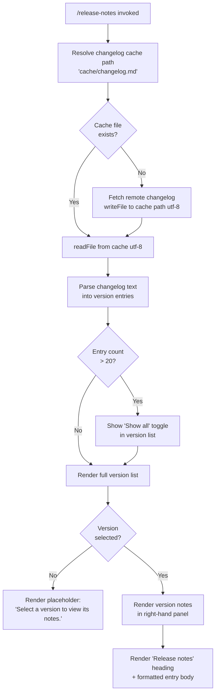

# `/release-notes`

> Analysis basis: CC v2.1.132 bundle.js (AST extraction + Claude interpretation)
> Minimum version: v2.1.132

---

## Overview

The `/release-notes` command presents a versioned, interactive changelog viewer rendered as a JSX component directly inside the Claude Code terminal UI. It reads a locally cached `changelog.md` file, parses each entry into structured version records, and renders a navigable two-column layout where the user selects a version on the left and views its notes on the right. The command is type `local-jsx`, meaning its output is a React component tree rather than a plain-text prompt response.

---

## Registration

| Field | Value |
|---|---|
| type | `local-jsx` |
| name | `release-notes` |
| description | `View release notes` |
| module_id | `G9q` |
| load_inline | `true` |
| handler | `_77` (async function, resolved via `module_id` path) |
| loc_byte span | `10755368` – `10755509` |
| `loc_byte_end` | `10755509` |
| `arbor_handler.name` | `_77` |
| `arbor_handler.kind` | `AsyncFunction` |
| `arbor_handler.resolution_path` | `module_id` |
| `arbor_handler.fqn` | `claude-2.1.132::_77` |
| `arbor_handler.n_hits` | `0` |

Analysis basis: CC v2.1.132 bundle.js:+10755368

> Handler `_77` was resolved by Arbor via the `module_id` resolution path (`G9q` → module exports → `_77`). The load shape is an inline `load:()=>Promise.resolve({call: handler})` pattern; no separate module boundary is crossed at call time.

---

## Input Branching

The command takes no user-supplied arguments. All branching is driven by internal state: whether the changelog cache is populated, whether a version entry is selected, and how many entries exist relative to a display threshold.



Analysis basis: CC v2.1.132 bundle.js:+10753688, +10750367, +10750989, +10754014, +10753941, +10754656, +10755040

---

## Behavioral Spec

### 1. Handler Entry Point

The async handler (`_77`) is the top-level entry for the command. It orchestrates three primary steps: setting up a timeout race, fetching/caching the changelog, and returning the JSX component tree.

```
async function releaseNotesHandler(commandContext):
    timeoutPromise = new Promise((_, reject) =>
        setTimeout(() => reject(new Error("Timeout")), 500)
    )

    changelogResult = await Promise.race([
        fetchChangelogWithCache(commandContext),
        timeoutPromise
    ])

    versionList  = parseChangelog(changelogResult)
    displayState = buildDisplayState(versionList)

    return renderReleaseNotesComponent(displayState)
```

Analysis basis: CC v2.1.132 bundle.js:+10753624, +10753642, +10753648, +10753660, +10753674, +10753688

> The 500 ms timeout constant is a hard-coded number literal. If `fetchChangelogWithCache` does not resolve within 500 ms, the race rejects with `"Timeout"`.

**Timeout constant:** 500 milliseconds (bundle.js:+10753660)

---

### 2. Changelog Cache Resolution and Fetch (`ckA`)

The cache-fetch function computes the on-disk path for the changelog, reads it if present, or downloads and writes it.

```
async function fetchChangelogWithCache(context):
    cacheDir      = joinPath(configDir, "cache")          // literal "cache"
    changelogPath = joinPath(cacheDir, "changelog.md")    // literal "changelog.md"

    cached = httpGetCache.get(changelogPath)
    if cached and (Date.now() - cached.timestamp) < 200:  // 200 ms freshness window
        return cached.content

    await mkdir(dirname(changelogPath), { recursive: true })

    content = await fetchRemoteChangelog()                 // network request
    await writeFile(changelogPath, content, "utf-8")      // literal "utf-8"

    httpGetCache.set(changelogPath, { content, timestamp: Date.now() })
    return content
```

Analysis basis: CC v2.1.132 bundle.js:+10750345, +10750354, +10750359, +10750367, +10750687, +10750711, +10750765, +10750775, +10750812, +10750840, +10750862

**Cache freshness window:** 200 ms (bundle.js:+10750711)
**Cache subdirectory literal:** `"cache"` (bundle.js:+10750359)
**Filename literal:** `"changelog.md"` (bundle.js:+10750367)
**File encoding:** `"utf-8"` (bundle.js:+10750840)

---

### 3. Local Read Path (`lkA`)

When the changelog is requested without re-fetching (e.g., a second invocation within the freshness window), a dedicated read helper is used.

```
function readCachedChangelog(context):
    changelogPath = resolveCacheDir(context)    // same cacheDir + "changelog.md"
    return readFile(changelogPath, encoding)
```

Analysis basis: CC v2.1.132 bundle.js:+10750967, +10750989

---

### 4. Changelog Parsing (`Y9q`, `y$8`, `k$8`)

The raw markdown text is split into per-version sections and each section is structured into a display record.

```
function parseChangelog(markdownText):
    sections = splitIntoVersionSections(markdownText)   // split on version headers
    entries  = []

    for each section in sections:
        versionHeader = extractVersionHeader(section)   // indexOf + slice
        bodyLines     = section.slice(after header)

        // Trim blank lines; format bullet items with "- " prefix
        formattedLines = bodyLines
            .split("\n")
            .map(line => line.trim())
            .filter(line => line != "")
            .map(line => "- " + line)                  // literal "- "

        entries.push({
            version: versionHeader,
            body:    formattedLines.join("\n"),
            label:   versionHeader + " - " + firstLineOfBody  // literal " - "
        })

    return entries
```

Analysis basis: CC v2.1.132 bundle.js:+10751128, +10751177, +10751254, +10751259, +10751294, +10751317, +10751337, +10751767, +10751784, +10751798, +10751825, +10751898

**Label separator literal:** `" - "` (bundle.js:+10751259)
**Bullet prefix literal:** `"- "` (bundle.js:+10751337)

---

### 5. JSX Component Rendering (`W9q`, `P9q`, `nkA`)

The component returned by the handler renders a two-panel layout. The version list (left column) and note body (right column) are composed from the parsed entries.

```
function renderReleaseNotesComponent(state):
    { entries, selectedVersion, showAll } = state

    displayedEntries = showAll ? entries : entries.slice(0, 20)

    versionListItems = displayedEntries.map(entry =>
        renderVersionListItem(entry, isSelected=(entry == selectedVersion))
    )

    if entries.length > 20 and not showAll:
        versionListItems.append(renderShowAllButton("Show all"))  // literal "Show all"

    selectedBody = selectedVersion
        ? renderNoteBody(selectedVersion.body)
        : renderPlaceholder("Select a version to view its notes.")  // literal

    return JSX layout(
        direction = "column",                    // literal "column"
        children  = [
            JSX heading("Release notes"),        // literal "Release notes"
            JSX row(
                left  = versionListItems,
                right = selectedBody
            )
        ]
    )
```

Analysis basis: CC v2.1.132 bundle.js:+10753756, +10753793, +10753935, +10754014, +10753941, +10754112, +10754217, +10754257, +10754319, +10754337, +10754504, +10754589, +10754656, +10755040

**Maximum entries shown before "Show all":** 20 (bundle.js:+10753941)
**"Show all" button label:** `"Show all"` (bundle.js:+10754014)
**Placeholder text:** `"Select a version to view its notes."` (bundle.js:+10754656)
**Panel layout direction:** `"column"` (bundle.js:+10754589)
**Panel heading text:** `"Release notes"` (bundle.js:+10755040)
**React memo cache sentinel:** `"react.memo_cache_sentinel"` (bundle.js:+10754515)

The component uses React's compiler memo-cache (sentinel value detected), meaning repeated renders within a session are deduplicated where props have not changed.

---

### 6. Version List Item Rendering (`P9q`, `nkA`)

Each item in the left-hand list is produced by a small helper. Selection state is tracked via a `Symbol.for`-keyed sentinel to integrate with the React memo cache.

```
function renderVersionListItem(entry, isSelected):
    label = entry.label
    style = isSelected ? SELECTED_STYLE : DEFAULT_STYLE

    return JSX listItem(
        key      = entry.version,
        label    = label,
        style    = style,
        onSelect = () => setState({ selectedVersion: entry })
    )

function buildVersionLabel(entry):
    // Pads the version string then appends trimmed first-body-line
    padded = entry.version.padEnd(PAD_WIDTH, " ")  // pad character literal "  "
    return padded + entry.summary
```

Analysis basis: CC v2.1.132 bundle.js:+10753424, +10753499, +10753525, +10753552, +10754504

---

### 7. Config Persistence Layer (Indirect — `A8`, `Nt8`, config helpers)

The changelog cache write path calls into the global config persistence subsystem, which includes safe-write logic (temp file + atomic rename) and lock contention detection.

```
function safeWriteConfigWithLock(path, data):
    acquired = acquireLock(path, timeoutMs=60000)

    if not acquired within expected time:
        emit telemetry("tengu_config_lock_contention")
        log warning: "Lock acquisition took longer than expected - another Claude instance may be running"

    reReadConfig = readConfigFromDisk(path)

    if reReadConfig.auth is missing and cache.auth exists:
        emit telemetry("tengu_config_auth_loss_prevented")
        abort: "saveConfigWithLock: re-read config is missing auth that cache has; refusing to write..."

    writeToTempFile(data, permissions=0o600)  // octal 384 decimal
    atomicRename(tempFile, path)
    releaseLock()

    if staleWriteDetected:
        emit telemetry("tengu_config_stale_write")
```

Analysis basis: CC v2.1.132 bundle.js:+3105266, +3105303, +3105309, +3105398, +3105534, +3105664, +3105709, +3105725, +3105725, +3105877, +3106079, +3106610

**Lock timeout:** 60 000 ms (bundle.js:+3106079)
**Contention threshold log:** 100 ms (bundle.js:+3105303)
**Temp file permissions (decimal):** 384 = `0o600` (bundle.js:+3106610)
**Auth-loss guard message fragment:** `"saveConfigWithLock: re-read config is missing auth"` (bundle.js:+3105725)
**Error code handled:** `"ENOENT"` (bundle.js:+3105664)

This layer is shared with general config writes; its presence in the call graph reflects the file write path used when populating the changelog cache for the first time.

---

### 8. Atomic File Write Helper (`QyH`)

Safe writes use a temp-file-plus-rename strategy with filesystem-level integrity checks.

```
function atomicWriteFile(targetPath, content):
    randomSuffix = randomBytes(6).toString("hex")   // 6 bytes, hex string
    tempPath     = targetPath + "." + randomSuffix

    fd = openSync(tempPath, flags)
    writeFileSync(fd, content)
    fchmodSync(fd, originalPermissions)             // log: "Applied original permissions to temp file"
    fsyncSync(fd)
    closeSync(fd)
    renameSync(tempPath, targetPath)

    if oldTempExists:
        unlinkSync(oldTempPath)
```

Analysis basis: CC v2.1.132 bundle.js:+952172, +952192, +952211, +952222, +952239, +952318, +952331, +952445, +952458, +952471, +952487, +952567, +952585, +952749, +952797, +952813, +952825, +952862, +952964, +953233, +953291, +953312, +953357, +953485, +953642

**Random suffix byte count:** 6 (bundle.js:+952813)
**Suffix encoding:** `"hex"` (bundle.js:+952825)
**Permissions log message fragment:** `"Applied original permissions to temp file"` (bundle.js:+953312)
**Error codes handled in symlink resolution:** `"ELOOP"` (bundle.js:+952458), `"ENOTDIR"` (bundle.js:+952471)

---

### 9. Config Backup Rotation (`Nt8`, `kt8`)

As part of config-adjacent writes, up to 5 rolling backups are maintained.

```
function rotateConfigBackups(configPath):
    backupDir  = joinPath(configDir, "backups")   // literal "backups"
    backupFiles = readdirStringSync(backupDir)
                  .filter(name => name.startsWith(".backup."))  // literal ".backup."

    sorted = backupFiles.sortedByNumericSuffix()  // Number(), split, isNaN guard

    if sorted.length >= 5:                        // max backup count = 5
        oldest = sorted.slice(0, sorted.length - 4)
        for each f in oldest:
            unlinkSync(joinPath(backupDir, f))

    newBackupName = ".backup." + Date.now()
    copyFileSync(configPath, joinPath(backupDir, newBackupName))
```

Analysis basis: CC v2.1.132 bundle.js:+3106087, +3106122, +3106180, +3106187, +3106195, +3106218, +3106263, +3106302, +3106328, +3106431, +3106446, +3106568, +3106845, +3106858

**Maximum backup count:** 5 (bundle.js:+3106328)
**Backup directory literal:** `"backups"` (bundle.js:+3106858)
**Backup filename prefix literal:** `".backup."` (bundle.js:+3106195)

---

## State & Side Effects

| Item | Detail |
|---|---|
| Telemetry — `tengu_config_lock_contention` | Emitted when acquiring the config write lock takes longer than 100 ms (bundle.js:+3105398) |
| Telemetry — `tengu_config_stale_write` | Emitted when a config write is detected to be stale (concurrent write collision) (bundle.js:+3105534) |
| Telemetry — `tengu_config_parse_error` | Emitted when the on-disk config cannot be parsed during a re-read (bundle.js:+3107927) |
| Telemetry — `tengu_config_auth_loss_prevented` | Emitted when a write is aborted because re-reading the config would lose auth credentials (bundle.js:+3105877) |
| File write — changelog cache | Writes `<configDir>/cache/changelog.md` (utf-8) on first invocation or cache miss (bundle.js:+10750367, +10750840) |
| File write — config backups | Up to 5 rolling backups under `<configDir>/backups/` (bundle.js:+3106858) |
| File write — atomic temp | Temp file with random hex suffix created and renamed atomically (bundle.js:+952797) |
| React memo cache | Component subtree is memoized using React compiler sentinel `"react.memo_cache_sentinel"` (bundle.js:+10754515) |
| appState changes | Selected version state is held in local component state; no global appState mutation detected at depth ≤ 2 |
| Sound | <!-- TODO: not found in depth-2 traversal; needs --depth 4 --> |
| Hook registration | <!-- TODO: not found in depth-2 traversal; needs --depth 4 --> |
| Network | Remote changelog fetched if cache is absent or stale (>200 ms old) (bundle.js:+10750711) |
| `process.exit` | Called from uncaught-exception handler (`"spare_uncaught"`) reached deep in the file-write path; not triggered under normal operation (bundle.js:+14110307, +14110289) |

---

## Version History

| Version | Change |
|---|---|
| v2.1.132 | Initial analysis. `local-jsx` type; async handler `_77`; 500 ms timeout; 20-entry display limit; "Show all" toggle; atomic changelog cache write with 200 ms freshness window. |

---

## Common Mistakes

1. **Expecting plain-text output.** Because the command type is `local-jsx`, the response is a rendered React component, not a markdown string. Attempting to pipe or capture its output as text in a scripted context will not yield the changelog text.

2. **Assuming the changelog is always fresh.** The cache freshness window is only 200 ms. Invoking `/release-notes` twice in rapid succession within a session will serve the cached file on the second call. If the local cache file is stale or corrupted, delete `<configDir>/cache/changelog.md` to force a re-fetch.

3. **Expecting all versions to be visible immediately.** When there are more than 20 versions in the changelog, only the first 20 are rendered. The user must activate the "Show all" control to see older entries.

4. **Confusing the "Timeout" error with a network failure.** The 500 ms timeout races against the entire fetch-and-cache pipeline. On slow disks or networks, the command may silently lose the race and surface a `"Timeout"` rejection rather than a network-specific error message.

5. **Treating the config-write telemetry events as release-notes-specific.** The four `tengu_config_*` events are emitted by the shared config persistence subsystem, which is incidentally exercised when the changelog cache file is written. They are not meaningful indicators of a release-notes-specific problem.

6. **Relying on the handler identifier `_77` across versions.** The Arbor-resolved handler name is a minified bundle symbol that will change between releases. Use the registration `name: "release-notes"` as the stable identifier.

---

## Appendix — Identifier Mapping

> For bundle debugging only. Identifiers change across versions.

| Identifier | Role |
|---|---|
| `_77` | Main async handler for `/release-notes` (Arbor-resolved, `module_id` path via `G9q`) |
| `ckA` | Changelog cache-fetch function (resolves path, checks freshness, writes file) |
| `lkA` | Cached changelog read helper (reads `changelog.md` from cache dir) |
| `dkA` | Cache directory path builder (`joinPath(configDir, "cache", "changelog.md")`) |
| `Y9q` | Top-level changelog parser (splits markdown into version entry records) |
| `y$8` | Per-section entry parser (splits lines, trims, formats bullets) |
| `k$8` | Version header extractor (called from `Y9q`) |
| `a9` | String slice/indexOf helper used during header extraction |
| `W9q` | JSX release-notes component renderer (two-column layout) |
| `P9q` | Version list renderer (maps entries to list items, applies slice) |
| `nkA` | Individual version list-item builder |
| `MW` | Shared UI layout/box primitive used in component tree |
| `A8` | Global config save orchestrator (safe-write with lock) |
| `Nt8` | Config write-with-backup implementation (atomic rename + rotation) |
| `k5H` | Config file copier / backup rotation helper |
| `kt8` | Backup path builder (`joinPath(backupDir, name)`) |
| `QyH` | Atomic file write helper (temp file + fchmod + fsync + rename) |
| `vt8` | Config write variant calling `QyH` |
| `gbH` | Timestamp-stamped config write helper |
| `CJ1` | Config entries serializer (`Object.entries`) |
| `FbH` | Config format/stringify helper |
| `Wc_` | Config object merge helper (`Object.assign`) |
| `uq6` | Config read helper called during re-read validation |
| `fH` | Logging/error reporting helper used in parse path |
| `HA` | Error construction and string coercion helper |
| `$wL` | Rolling log buffer manager (shift/push on fixed-size queue) |
| `kq` | Config accessor (called from `ckA` and `fH`) |
| `h1_` | Config key normaliser |
| `yH` | String coercion utility (wraps `String()`) |
| `vH` | String coercion utility (wraps `String()`) |
| `RH` | JSON serializer wrapper (`JSON.stringify`) |
| `k` | Log-level / telemetry event emitter |
| `d` | Structured logger (debug/error level) |
| `j8` | Error-code classifier |
| `f` | File handle / stream close helper |
| `_` | String normaliser (`toLowerCase`) |
| `q` | Filesystem module reference (fs sync methods) |
| `K` | Secondary filesystem module reference |
| `AZ` | File write + path join utility (`writeFileSync` + `join`) |
| `L` | Array map + padEnd formatter for display strings |
| `$` | Telemetry event emitter / session logger |
| `mzq` | Telemetry record builder (`Date.now`, event id, payload) |
| `H` | Utility function with `Math.random` + `setTimeout` (jitter helper) |
| `Z` | String variable used in backup filename `startsWith` check |
| `P` | SDK connection manager (`Promise.all`, connection state) |
| `I` | Array slice target in backup rotation |
| `B2` | Config state container reference |
| `F6` | Filesystem error guard / try-catch wrapper |
| `WV` | Config object validator |