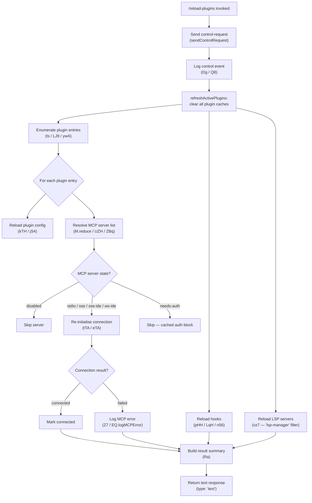

# `/reload-plugins`

> Analysis basis: CC v2.1.132 bundle.js (AST extraction + Claude interpretation)
> Minimum version: v2.1.132

---

## Overview

The `/reload-plugins` command activates pending plugin changes in the current CLI session without requiring a full restart. It clears all plugin-related caches, re-resolves and reconnects active MCP servers, hooks, and LSP servers associated with installed plugins, and reports the resulting status back to the user. The command dispatches a `control-request` to the session layer, making it a session-management operation rather than a direct agent prompt.

---

## Registration

| Field | Value |
|---|---|
| type | `local` |
| name | `reload-plugins` |
| description | `Activate pending plugin changes in the current session` |
| supportsNonInteractive | `false` |
| thinClientDispatch | `control-request` |
| module_id | `I3q` |
| load_inline | `true` |
| handler (Arbor) | `Nz7` (AsyncFunction, resolved via `module_id`) |
| `loc_byte_end` | `11257474` |
| `arbor_handler.name` | `Nz7` |
| `arbor_handler.kind` | `AsyncFunction` |
| `arbor_handler.resolution_path` | `module_id` |
| `arbor_handler.fqn` | `claude-2.1.132::Nz7` |
| `arbor_handler.n_hits` | `0` |

Analysis basis: CC v2.1.132 bundle.js:+11257255 – +11257474

---

## Input Branching

The handler (`Nz7`) takes no user-supplied argument text. All branching is internal, driven by the current state of plugin registrations and MCP connection health.



Analysis basis: CC v2.1.132 bundle.js:+11256278 (handler entry), +11256315 (sendControlRequest call), +11254400 (cache-clear log), +11254509 (Promise.all fan-out), +11254856 (LSP config reload), +11254950 (MCP reduce), +11256761 (result assembly)

---

## Behavioral Spec

### 1. Handler Entry and Control-Request Dispatch

```
async function reloadPluginsHandler(context):
    sendControlRequest(context)                   // notifies session layer
    logControlEvent(Dg, Q8)                       // internal audit log
    result = await refreshAndReconnect(context)
    return { type: "text", content: result }
```

The command sends a `control-request` (registration field `thinClientDispatch`) before performing any work, ensuring the session layer is aware of the reload operation.

Analysis basis: CC v2.1.132 bundle.js:+11256315, +11256390, +11256658

The string `"ccr"` is used as the control-request identifier.

Analysis basis: CC v2.1.132 bundle.js:+11256296

The telemetry event name associated with the reload action is `"reload_plugins"`.

Analysis basis: CC v2.1.132 bundle.js:+11256345

---

### 2. Plugin Cache Clearing (`refreshActivePlugins`)

```
function refreshActivePlugins():
    log("refreshActivePlugins: clearing all plugin caches")
    clearInstalledPluginsCache()          // Og9 / k — "Cleared installed plugins cache"
    clearPluginStateMap($3 / PcH)         // PEA.clear()
    invalidateMarketplaceEntries()
```

The log line `"refreshActivePlugins: clearing all plugin caches"` is emitted at the start.

Maximum cache-clearing scope: all installed plugin entries and the plugin state map are wiped before re-enumeration.

Analysis basis: CC v2.1.132 bundle.js:+11254400, +11254454, +11254460

---

### 3. Plugin Configuration Re-enumeration (`ts` / `LJ9` / `ywA`)

```
async function enumeratePlugins(context):
    entries = []
    for configFile in [".mcp.json", ".lsp.json", ...]:
        raw = await readFile(configFile, "utf-8")
        parsed = jsonParse(raw)
        for [name, spec] of Object.entries(parsed):
            if spec.status starts with "http" or "download":
                markNetworkSource(name)
            entries.push(normalizeEntry(name, spec))
    return entries
```

Files consulted include `.mcp.json` (MCP server config) and `.lsp.json` (LSP server config).

Analysis basis: CC v2.1.132 bundle.js:+7419169 (`ywA`), +7419180 (`.mcp.json` literal), +8218101 (`.lsp.json` literal), +7419311 (`LJ9`), +7418739 (`"http"` literal), +7418760 (`"download"` literal)

---

### 4. Plugin Manifest Validation (`kTH` / `jS4`)

```
async function loadPluginManifest(pluginPath):
    manifestPath = join(pluginPath, ".lsp.json")
    raw = await readFile(manifestPath)
    parsed = jsonParse(raw)
    validated = schema.record(schema.string()).parse(parsed)
    if validation fails:
        logError("lsp-config-invalid")
        return null
    for each subPlugin of validated:
        absPath = resolve(pluginPath, subPlugin.path)
        relPath = relative(pluginPath, absPath)
        if relPath starts with "..":
            warn("Invalid path: must be relative and within plugin directory")
            continue
        mergedConfig = Object.assign({}, baseConfig, subPlugin)
        entries.push(mergedConfig)
    return entries
```

Path traversal is actively blocked: any resolved sub-plugin path that escapes the plugin directory root (relative path starts with `".."`) is rejected with a warning.

Analysis basis: CC v2.1.132 bundle.js:+8218101, +8218164, +8218173, +8218184, +8218363, +8218000 (`".."` literal), +8219294 (path-escape warning literal), +8219208 (`"warn"` literal)

---

### 5. MCP Server Reconnection (`M` / `UZH` / `ZBq`)

```
async function reconnectMcpServers(pluginEntries):
    results = pluginEntries.reduce((acc, entry) => {
        serverDefs = getMcpServerDefsForPlugin(entry)    // UZH
        for serverDef of serverDefs:
            if serverDef.status == "disabled":
                skip
            if serverDef.transportType in ["stdio","sse","sse-ide","ws-ide","sdk"]:
                connectionResult = await connectOrReuse(serverDef)   // tTA / eTA
                acc.push(connectionResult)
            if serverDef.status == "needs-auth":
                log("Skipping connection (cached needs-auth)")
                skip
        applyMcpUpdate(acc)     // ZBq / H.applyMcpUpdate
        return acc
    }, [])
    return results
```

Supported transport types: `"stdio"`, `"sse"`, `"sse-ide"`, `"ws-ide"`, `"sdk"`, `"claudeai-proxy"`.

Analysis basis: CC v2.1.132 bundle.js:+9462075, +9462109, +9462174, +9462210, +9459106, +9462482, +9461973 (`"disabled"`), +9462602 (`"Skipping connection (cached needs-auth)"`), +9462668 (`"needs-auth"`)

Failed connections are classified as `"failed"` and logged via the MCP error logger.

Analysis basis: CC v2.1.132 bundle.js:+9463337 (`"failed"` literal), +912085 (`EQ.logMCPError`)

---

### 6. OAuth / Auth-Required MCP Servers (`tTA`)

```
async function handleOAuthServer(serverDef):
    // Offer an "authenticate" tool with instructions for OAuth flow
    authTool = {
        name: "authenticate",
        description: "Call to start OAuth flow — receive authorization URL"
    }
    result = await Promise.race([
        initiateOAuthFlow(serverDef),
        timeout(10000)
    ])
    if result.status == "complete_authentication":
        finalizeConnection(serverDef)
    else if result.status == "unsupported":
        markServerUnsupported(serverDef)
```

The OAuth tool is exposed with the name `"authenticate"` and a timeout of 10 000 ms.

Analysis basis: CC v2.1.132 bundle.js:+9416726 (`"authenticate"`), +9416952 (10000 ms timeout), +9418242 (`"complete_authentication"`), +9417231 (`"unsupported"`)

---

### 7. Hook Reloading (`LqH` / `n56`)

```
async function reloadHooks(pluginEntries):
    hookMap = new Map()
    for entry of pluginEntries:
        configData = readPluginConfig(entry)        // qf / S0H / y7A
        parsedHooks = parseHookBlocks(configData)   // p76 / R8
        for hook of parsedHooks:
            if hook.type == "hook":
                registerHook(hookMap, hook)
            if hook.type == "plugin LSP server":
                registerLspEntry(hookMap, hook)
            if dependencyUnsatisfied(hook):
                markError(hook, "dependency-unsatisfied")
            if notFound(hook):
                markError(hook, "not-found")
        hookMap.set(entry.id, parsedHooks)
    return hookMap
```

Hook type strings observed: `"hook"`, `"plugin LSP server"`.

Analysis basis: CC v2.1.132 bundle.js:+11256934, +11256993, +10504094 (`"dependency-unsatisfied"`), +10504131 (`"not-found"`)

---

### 8. LSP Server Filtering and Reloading (`vz7`)

```
function filterAndReloadLspServers(allEntries):
    lspEntries = allEntries.filter(e => e.serverType == "lsp-manager"
                                     || e.id.startsWith("plugin:"))
    for lspEntry of lspEntries:
        if lspEntry has genericError:
            markStatus(lspEntry, "generic-error")
    return lspEntries
```

The `"lsp-manager"` tag and `"plugin:"` prefix are used to identify LSP-related plugin entries during the reload pass.

Analysis basis: CC v2.1.132 bundle.js:+11255847, +11255882, +11255994 (`"generic-error"`)

---

### 9. Result Assembly (`Ra`)

```
function buildResultSummary(pluginResults, mcpResults, hookResults):
    lines = []
    for result of pluginResults (up to 5 items per group):
        line = formatLine(result.name, result.status)
        lines.push(line)
    if lines is empty:
        lines.push(defaultNoPluginsMessage)
    return lines.join(" · ")
```

The separator between result items is `" · "` (U+00B7 middle dot surrounded by spaces).

Maximum items rendered per result group before truncation: 5.

Analysis basis: CC v2.1.132 bundle.js:+11256528 (`" · "` separator), +4411302 (number `5` limit), +11256761 (`Ra` call site)

---

### 10. Error Path — Plugin Type Unsupported

```
if pluginSourceType not in knownSourceTypes:
    throw Error(
        "This plugin uses a source type your Claude Code version does not support. " +
        "Update Claude Code and try again."
    )
```

Analysis basis: CC v2.1.132 bundle.js:+4930893

---

## State & Side Effects

| Item | Detail |
|---|---|
| Plugin cache | All installed-plugin caches cleared before re-enumeration (Analysis basis: +11254402) |
| Plugin state map | `PEA.clear()` wipes the in-memory plugin state map (Analysis basis: +9113840) |
| MCP connections | Active MCP server connections are torn down and re-initiated where applicable (`ZBq / H.applyMcpUpdate`) (Analysis basis: +13846850) |
| Hook registry | Hook registrations rebuilt from disk config (Analysis basis: +10504216) |
| LSP server entries | LSP server list refreshed via `vz7` filtering pass (Analysis basis: +11255048) |
| Event emission | `Dz8.emit` fires after plugin state update (Analysis basis: +11255442) |
| Telemetry — `tengu_mcp_retry_failed_remote` | Emitted when a remote MCP server fails to reconnect (Analysis basis: bundle.js:+13846663) |
| Telemetry — `tengu_iron_gate_closed` | Emitted when a plugin source is blocked by the iron-gate policy check (Analysis basis: bundle.js:+7930461) |
| Telemetry — `tengu_daemon_control` | Emitted on daemon control path touched by the control-request dispatch (Analysis basis: bundle.js:+14164048) |
| Sound | None observed in traversal |
| appState changes | Plugin state map and MCP client registry updated in-place |

---

## Version History

| Version | Change |
|---|---|
| v2.1.132 | Initial analysis |

---

## Common Mistakes

1. **Running in non-interactive mode**: `supportsNonInteractive` is `false`. Invoking `/reload-plugins` from a script or headless pipeline will be rejected or silently ignored.

2. **Expecting immediate tool availability**: MCP servers with `"needs-auth"` status are skipped during reload; OAuth must be completed through the interactive auth flow before those tools become available.

3. **Assuming all transport types are reconnected**: Only `stdio`, `sse`, `sse-ide`, `ws-ide`, `sdk`, and `claudeai-proxy` are handled; servers with `"disabled"` status are unconditionally skipped.

4. **Plugin paths with directory traversal**: Sub-plugin paths that resolve outside the plugin root directory (i.e., relative path beginning with `".."`) are rejected with a warning. Symlink-based escapes may also be blocked by the atomic-write guard (`QyH`).

5. **Conflating `/reload-plugins` with a full restart**: The command clears and re-reads plugin configuration in-process; it does not restart the CLI process, daemon, or agent session. Deeply cached state outside the plugin subsystem is unaffected.

6. **Yarn or pnpm lockfiles in plugin packages**: If a plugin package contains `yarn.lock` or `pnpm-lock.yaml`, the installation step (triggered during reload if a plugin is pending install) is skipped with the message about unsupported lockfiles. Use `bun` or `npm` lockfiles instead.

---

## Appendix — Identifier Mapping

> For bundle debugging only. Identifiers change across versions.

| Identifier | Role |
|---|---|
| `Nz7` | Main async handler for `/reload-plugins` (AsyncFunction, module `I3q`) |
| `A3` | Helper called at handler entry (pre-dispatch utility) |
| `ywH` | Sub-utility called by `A3` |
| `Dg` | Control-event logger (wraps `Q8`) |
| `Q8` | Low-level event emit primitive |
| `pDH` | `refreshActivePlugins` — orchestrates full plugin cache clear and reconnect |
| `k` | Generic async logger / debug emitter |
| `Lsq` | Debug log formatter |
| `rdA` | Log routing helper |
| `RH` | JSON serialiser wrapper |
| `mf` | Log-line string formatter (redacts sensitive fields) |
| `MnA` | Redaction map builder |
| `gNH` | Stream write helper |
| `slA` | Low-level handle writer |
| `Msq` | File-append log writer |
| `GNH` | Debounced log flush |
| `pHH` | Hook-entry writer |
| `F6` | Process data directory resolver |
| `JG8` | File size checker |
| `jnA` | Log-file path builder |
| `JnA` | Log-file rotation handler |
| `fsq` | Log file rotate-and-append |
| `N1` | Writer-lock manager |
| `Og9` | Installed-plugin cache invalidator |
| `$3` | Plugin state-map rebuilder |
| `Ed4` | Plugin descriptor factory |
| `qT` | Descriptor field validator |
| `N58` | Plugin name normaliser |
| `Cs6` | Plugin capability classifier |
| `Je6` | Plugin scope checker |
| `UfA` | Plugin root resolver |
| `fH` | Error constructor helper |
| `js6` | Plugin JSON schema validator |
| `yEA` | Plugin feature-flag reader |
| `aF9` | Plugin policy enforcer |
| `nt` | Settings-layer plugin reader |
| `a_H` | User settings accessor |
| `cF9` | Project settings accessor |
| `s58` | Local settings accessor |
| `m7A` | Capability set merger |
| `l7A` | Plugin list sorter |
| `PcH` | Plugin state-map clear |
| `VE9` | MCP version negotiator |
| `Oh9` | Plugin health checker |
| `_A` | Async context store accessor |
| `L` | Column-format text padder |
| `ts` | Plugin config file enumerator |
| `ywA` | MCP JSON config reader |
| `D8` | Error classifier (ENOENT / EISDIR) |
| `B6` | JSON parse wrapper |
| `dB` | File-extension filter (`.mcpb`, `.dxt`) |
| `LJ9` | Plugin directory scanner |
| `F56` | MCPB archive extractor |
| `kTH` | LSP config loader and validator |
| `HA` | Error string normaliser |
| `jS4` | LSP sub-plugin path validator |
| `JS4` | Path escape checker |
| `M` | MCP server reconnect orchestrator (reduce loop) |
| `UZH` | Single MCP server connection manager |
| `qt` | MCP transport factory |
| `wI` | MCP stdio transport builder |
| `qA` | MCP transport option assembler |
| `Qw6` | MCP transport capability filter |
| `Nr4` | MCP connection attempt timer |
| `a18` | MCP server tool registrar |
| `K8` | MCP debug logger |
| `tTA` | OAuth MCP server connector |
| `eTA` | SSE MCP server connector |
| `mc9` | MCP server state persister |
| `aTA` | MCP server auth-state updater |
| `gwA` | MCP server capability includer |
| `J` | Process kill list builder |
| `S` | Output stream enqueuer |
| `Z7` | MCP error logger |
| `Cc9` | MCP state snapshot builder |
| `dw6` | Retry count parser (base 10) |
| `PZA` | Timeout value parser (base 10) |
| `ZBq` | MCP update applier (`applyMcpUpdate`) |
| `df8` | MCP diff serialiser |
| `bI` | MCP client cleanup helper |
| `$` | MCP event timestamper |
| `mzq` | Event record builder |
| `j6` | MCP dedup/cache key manager |
| `hq6` | Cache hit logger |
| `Rq6` | Cache miss logger |
| `Oo` | Tool-call logger |
| `uQ6` | Server-level dedup checker |
| `R6` | Tool invocation dispatcher |
| `$F7` | Remote server retry orchestrator |
| `t18` | Remote server health checker |
| `o8` | Abort-signal timeout wrapper |
| `dcH` | MCP client cleanup + serialise |
| `vz7` | LSP/plugin server entry filterer |
| `Z3q` | LSP status aggregator |
| `LqH` | Hook + plugin resolver (main) |
| `lB` | Marketplace-config reader |
| `qf` | Plugin config file reader |
| `R58` | Known-marketplaces path builder |
| `p76` | Hook definition parser |
| `R8` | Tool-permission cache reader/writer |
| `IdA` | Permission cache lookup |
| `G7_` | Permission policy evaluator |
| `VdA` | Permission cache writer |
| `LR` | Managed-scope error thrower |
| `P1` | Path include/split helper |
| `bX` | Plugin network-source validator |
| `F76` | URL-source permission checker |
| `PLA` | Host-pattern matcher |
| `om1` | Host-pattern error builder |
| `am1` | Path-pattern error builder |
| `pFK` | GitHub/git/URL/npm source handler |
| `j_H` | File/directory source handler |
| `mFK` | File install helper |
| `S0H` | Installed-plugin config reader |
| `eY6` | `.claude-plugin` directory reader |
| `REA` | Plugin marketplace.json parser |
| `j8` | Generic error logger |
| `zG` | Plugin config resolver |
| `y7A` | Plugin config file reader (per-scope) |
| `Oq7` | Hook duplicate checker |
| `n56` | Full plugin installation / registration pipeline |
| `Iv` | Plugin source-type normaliser |
| `vs6` | Plugin local-source installer |
| `_66` | Local-source `./` prefix checker |
| `O` | Plugin ID map |
| `N6` | Async-context plugin getter |
| `Qv6` | Async-store reader |
| `DG` | Plugin env-var config loader |
| `bEA` | Env-file reader |
| `xEA` | Env-var entry parser |
| `P` | Dynamic MCP server connection manager |
| `gX8` | Dynamic MCP server factory |
| `sx` | Semver range constructor |
| `yo6` | Semver satisfier |
| `W` | Plugin state-change debouncer |
| `z` | Plugin state broadcaster |
| `BfH` | Config-change event builder |
| `uuH` | Policy-settings change checker |
| `gm1` | Dependency graph walker |
| `CA` | Plugin settings writer |
| `EO` | Settings file path resolver |
| `wE` | Settings file atomic writer |
| `Wh8` | Settings write-time recorder |
| `E6H` | Settings resolved-path builder |
| `QyH` | Atomic file writer (symlink-safe) |
| `C2` | Permission cache clearer |
| `NN6` | Log file writer for settings |
| `xb` | `.claude` directory path builder |
| `ub` | Settings load-from-disk orchestrator |
| `Ns6` | Plugin install path sandbox checker |
| `g` | Permission classifier (deny/classify/ask) |
| `aq8` | Iron-gate policy checker |
| `Bt` | Permission request handler |
| `Q` | Conversation-file accessor |
| `pJ6` | Conversation file reader |
| `_e9` | Conversation file deleter |
| `$H` | MCP message stream handler |
| `Zi9` | MCP model config reader |
| `fS` | MCP stream router |
| `p` | Output progress writer |
| `v6` | Void/empty result builder |
| `c` | Plugin source filter |
| `r` | Plugin source list |
| `u76` | NPM version range resolver |
| `YLA` | NPM package version lister |
| `Gs6` | Git-subdir installer |
| `Wn1` | Git installer |
| `Es6` | NPM/Git/URL installer |
| `JaK` | Install lock acquirer |
| `Y8` | Install event emitter |
| `w` | MCP subprocess manager |
| `l56` | Full plugin source installer |
| `i56` | MCPB / archive-type installer |
| `ys6` | Plugin binary hash checker |
| `hn1` | Plugin pre-install hook |
| `N_H` | Plugin content hasher |
| `Ec` | Plugin EW flag reader |
| `j` | Subprocess wrapper |
| `So6` | Plugin npm-install runner |
| `cB` | Plugin install logger |
| `spH` | Post-install EW writer |
| `Vs6` | Plugin cleanup (rm) helper |
| `v7A` | Plugin list updater (Added/Updated) |
| `y` | Clipboard image handler |
| `aiH` | PNG clipboard reader |
| `siH` | JPEG clipboard reader |
| `Y` | Background session process manager |
| `HH` | MCP elicitation handler |
| `_H` | Elicitation in-flight set |
| `d` | Generic disposable resource |
| `Rw6` | MCP elicitation response dispatcher |
| `Lgq` | Elicitation queue manager |
| `Cw6` | MCP elicitation result handler |
| `EF` | Notification event builder |
| `t` | Voice-focus silence timer |
| `C` | Output stream coordinator |
| `R` | Output chunk writer |
| `qH` | Voice-toggle silence timer |
| `o` | Conversation loader / session resumption handler |
| `XaK` | Plugin dependency spec parser |
| `u` | Plugin install options mapper |
| `qR` | Plugin name case-normaliser |
| `W$` | Plugin scope validator |
| `yH` | String cast utility |
| `T4` | OTEL metric emitter |
| `LW8` | OTEL attribute builder |
| `rmH` | OTEL span builder |
| `jaH` | OTEL event recorder |
| `Ra` | Result-summary formatter (final output builder) |