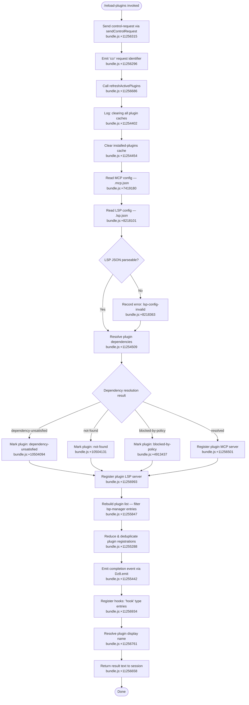

# `/reload-plugins`

> Analysis basis: CC v2.1.132 bundle.js (AST extraction + Claude interpretation)
> Minimum version: v2.1.132

---

## Overview

The `/reload-plugins` command activates any pending plugin changes in the current Claude Code session without requiring a full restart. It does this by clearing all cached plugin state, re-reading plugin configuration files (`.mcp.json` and `.lsp.json`), resolving dependencies, re-registering plugin MCP and LSP servers, and emitting a completion event. The command dispatches its work via a thin-client control request, making it unavailable in non-interactive mode.

---

## Registration

| Field | Value |
|---|---|
| type | `local` |
| name | `reload-plugins` |
| description | `Activate pending plugin changes in the current session` |
| supportsNonInteractive | `false` |
| thinClientDispatch | `control-request` |
| module\_id | `I3q` |

Analysis basis: CC v2.1.132 bundle.js:+11257255

---

## Input Branching

The command handler (`commandHandler`) takes no user-supplied arguments. All branching occurs internally during the plugin refresh pipeline. The following flowchart captures the top-level control flow derived from the call graph rooted at `commandHandler`.



Analysis basis: CC v2.1.132 bundle.js:+11256278, +11256315, +11256686, +11254509, +11255442

---

## Behavioral Spec

### 1. Command Entry and Control-Request Dispatch

```
function commandHandler(context):
    send control-request with identifier "ccr"    // bundle.js:+11256296, +11256315
    normalize command name to lowercase            // bundle.js:+14153948
    call refreshActivePlugins(context)             // bundle.js:+11256686
    call resolveAndRegisterPlugins(context)        // bundle.js:+11256718
    call resolveDisplayNames(context)              // bundle.js:+11256761
    return result as { type: "text", content: ... } // bundle.js:+11256658
```

Analysis basis: CC v2.1.132 bundle.js:+11256278

---

### 2. Refresh Active Plugins (Cache Clear)

This sub-routine is the first substantive step. It logs that it is clearing all plugin caches, then invalidates every cached plugin entry so that subsequent reads pull fresh data from disk.

```
function refreshActivePlugins(context):
    log DEBUG "refreshActivePlugins: clearing all plugin caches"   // bundle.js:+11254402
    call clearInstalledPluginsCache()                               // bundle.js:+11254454
    log "Cleared installed plugins cache"                          // bundle.js:+9167667
    fetch plugin config via getPluginConfig()                      // bundle.js:+11254460
    fetch VE9-scoped state                                         // bundle.js:+11254465
    fetch VW-scoped state                                          // bundle.js:+11254483
    fetch Oh9-scoped state                                         // bundle.js:+11254488
    await Promise.all([mcpConfigLoad(), lspConfigLoad()])          // bundle.js:+11254509
    call postLoadHook()                                            // bundle.js:+11254522
    call internalStateUpdate()                                     // bundle.js:+11254528, +11254531
    map over plugin list L                                         // bundle.js:+11254610
    enumerate Object.keys of plugin map                            // bundle.js:+11254650
    call pluginServerSetup()                                       // bundle.js:+11254695
    call lspConfigReader()                                         // bundle.js:+11254856
    reduce plugin map M                                            // bundle.js:+11254925
    reduce dependency set $                                        // bundle.js:+11254950
    apply jitter delay H (Math.random * 2, setTimeout)            // bundle.js:+11254973, +12264285, +12264322
    call pluginStatusFilter()                                      // bundle.js:+11255048
    call YK8-scoped update                                         // bundle.js:+11255172
    call fileSystemSync fs                                         // bundle.js:+11255197
    call pluginLoadHandler()                                       // bundle.js:+11255216
    call stringNormalizer()                                        // bundle.js:+11255273
    reduce plugin registration list L                              // bundle.js:+11255288
    enumerate Object.values of plugin registry                     // bundle.js:+11255341
    emit reload-complete event via eventEmitter.emit               // bundle.js:+11255442
```

Analysis basis: CC v2.1.132 bundle.js:+11254400

---

### 3. MCP Configuration Loading

The MCP server configuration is read from `.mcp.json` files discovered in the project hierarchy.

```
function mcpConfigLoader(paths):
    for each candidate path in paths:
        read file at path + ".mcp.json" (encoding: utf-8)   // bundle.js:+7419180
        if Array.isArray(result):                            // bundle.js:+7419399
            await Promise.all(parseEntries(result))          // bundle.js:+7419429
            map entries via L.map                            // bundle.js:+7419441
            apply per-entry normalizer k                     // bundle.js:+7419571
            enumerate Object.keys of merged map              // bundle.js:+7419725
        else:
            treat as object map and merge directly
    return merged MCP config
```

Analysis basis: CC v2.1.132 bundle.js:+7419169

---

### 4. LSP Configuration Loading

The LSP server configuration is read from `.lsp.json` files. If JSON parsing fails, an error code is recorded but execution continues.

```
function lspConfigReader(paths):
    for each candidate path in paths:
        joined_path = path_segments.join(separator)         // bundle.js:+8218085
        raw = readFile(joined_path + ".lsp.json", "utf-8") // bundle.js:+8218130, +8218145
        try:
            parsed = JSON.parse(raw)
            validate parsed against record schema            // bundle.js:+8218164, +8218173
            apply schema filter $hH                         // bundle.js:+8218184
            merged = Object.assign(accumulator, parsed)     // bundle.js:+8218217
        catch error:
            record error code "lsp-config-invalid"          // bundle.js:+8218363
            log "Failed to parse JSON file"                 // bundle.js:+8218799
            push error to error list A                      // bundle.js:+8218350
        apply D8 post-processing                            // bundle.js:+8218489
        apply HA finalization                               // bundle.js:+8218649
        call jS4 hook                                       // bundle.js:+8218888
        enumerate Object.keys of result                     // bundle.js:+8218950
    return { config: merged, errors: errorList }
```

Analysis basis: CC v2.1.132 bundle.js:+11254856

---

### 5. Plugin Status Filtering

After configs are loaded, plugins are filtered by their operational status. The `lsp-manager` label is used to exclude internal manager entries from the user-visible list; entries prefixed `plugin:` are retained as real plugin registrations.

```
function pluginStatusFilter(pluginMap, knownSet):
    filtered = pluginMap.filter(entry => entry.source !== "lsp-manager")  // bundle.js:+11255847
    realPlugins = filtered.map(entry => entry)                             // bundle.js:+11255904
    active = realPlugins.filter(entry => entry.prefix === "plugin:")       // bundle.js:+11255882, +11255926
    deduplicated = active.filter(entry => !knownSet.has(entry.id))        // bundle.js:+11255941
    call dependencyResolutionHelper(deduplicated)                          // bundle.js:+11255947
    return deduplicated
```

Analysis basis: CC v2.1.132 bundle.js:+11255048

---

### 6. Plugin Resolution and Registration

This is the main dependency-resolution loop. It handles multiple failure modes with distinct error codes and registers successfully resolved plugins.

```
function resolveAndRegisterPlugins(context):
    pluginMap = Map()
    errorList = []
    dependencySet = Set()

    for each plugin entry in context.pluginList:
        // Read plugin record from cache or disk
        record = readPluginRecord(entry)                        // bundle.js:+10504158, +10504194

        // Check scope restrictions
        if record.scope === "managed":                          // bundle.js:+4398529
            raise Error("Cannot install plugins to managed scope")  // bundle.js:+4398551

        // Resolve source location
        if record.source is local AND has no location:
            mark error "local-source-no-location"               // bundle.js:+4913653

        // Check policy gates
        if policyGate.blocks(record):
            mark error "blocked-by-policy"                      // bundle.js:+4913437
        if marketplacePolicy.blocks(record):
            mark error "marketplace-blocked-by-policy"          // bundle.js:+4913529

        // Resolve dependencies via p76 (Object.entries + Array.isArray checks)
        deps = resolveDependencies(record)                      // bundle.js:+10504343, +4410159, +4410224

        for each dep in deps:
            if dep.status === "resolution-failed":              // bundle.js:+4914648
                mark error "dependency-unsatisfied"             // bundle.js:+10504094
            if dep.status === "dependency-blocked-by-policy":   // bundle.js:+4914763
                mark error "dependency-blocked-by-policy"
            if dep.status === "dependency-marketplace-blocked-by-policy": // bundle.js:+4914873
                mark error "dependency-marketplace-blocked-by-policy"
            if dep.status === "range-conflict":                 // bundle.js:+4916193
                mark error "range-conflict"
            if dep.status === "no-matching-tag":                // bundle.js:+4916373
                mark error "no-matching-tag"
            if dep.status === "installed-unsatisfied":          // bundle.js:+4917672
                mark error "installed-unsatisfied"

        if no errors for this plugin:
            // Register plugin:
            pluginMap.set(record.id, record)                    // bundle.js:+10504194
            dependencySet.add(record.id)                        // bundle.js:+10504216

            // Validate host/path patterns for MCP registration
            validate record.hostPattern                         // bundle.js:+4417006
            validate record.pathPattern                         // bundle.js:+4417050

            // Register "plugin MCP server" entry
            register(record, type="plugin MCP server")          // bundle.js:+11256501

            // Register "plugin LSP server" entry
            register(record, type="plugin LSP server")          // bundle.js:+11256993

            // Register hooks
            register(record, type="hook")                       // bundle.js:+11256934

            // Emit telemetry if MCP retry failed
            if mcpRetryFailed:
                emit "tengu_mcp_retry_failed_remote"            // bundle.js:+13846663

        else:
            errorList.push({ plugin: record.id, errors: errors })  // bundle.js:+10504437

    // Dependency-resolution summary pass
    summarize(dependencySet, type="dependency-resolution")      // bundle.js:+10505106

    // Include/exclude based on current inclusion list L
    for each id in inclusionList L:
        if not L.includes(id):                                  // bundle.js:+10505184
            L.push(id)                                          // bundle.js:+10505198

    return { registered: pluginMap, errors: errorList }
```

Analysis basis: CC v2.1.132 bundle.js:+11256718, +10504158

---

### 7. Display Name Resolution

After registration, each plugin entry is assigned a user-facing display name. The name is built by mapping up to 5 path components, joining them, and optionally appending a `dependency` or `dependencies` suffix.

```
function resolveDisplayNames(pluginList):
    for each plugin in pluginList:
        segments = plugin.path.split(separator)         // bundle.js:+4398382
        // Take at most 5 trailing segments              // bundle.js:+4411302
        relevant = segments.slice(-5)
        parts = relevant.map(seg => formatSegment(seg)) // bundle.js:+4411306
        joined = parts.join(" · ")                      // bundle.js:+11256528, +4411343
        // Trim trailing slice if too long
        display = joined.slice(0, maxLen)               // bundle.js:+4411359

        // Append dependency label if needed
        if plugin.dependencyCount === 1:
            display += " dependency"                    // bundle.js:+4411416
        else if plugin.dependencyCount > 1:
            display += " dependencies"                  // bundle.js:+4411429

        // Finalize via Q8 formatter
        plugin.displayName = finalizeDisplayName(display, plugin)  // bundle.js:+4411411

    return pluginList
```

Analysis basis: CC v2.1.132 bundle.js:+11256761

---

### 8. Plugin Load Handler (Error Accumulation)

Individual plugin load operations accumulate errors and log them without aborting the whole pipeline.

```
function pluginLoadHandler(plugin):
    result = loadPlugin(plugin)                         // bundle.js:+911541, +911554
    if result is error:
        push error to kyH error list                    // bundle.js:+911901
        log error via EQ.logError                       // bundle.js:+911941
        apply $wL error formatter                       // bundle.js:+911883
    return result
```

Analysis basis: CC v2.1.132 bundle.js:+11255216

---

### 9. Plugin Config Schema Validation

Each plugin config entry is validated using a schema that requires a `record` type with string fields. Entries failing validation are flagged with `"lsp-config-invalid"`.

```
function validatePluginConfig(raw):
    schema = { type: record, valueType: string }    // bundle.js:+8218164, +8218173
    filtered = applySchemaFilter(raw, schema)       // bundle.js:+8218184
    if invalid:
        record error "lsp-config-invalid"           // bundle.js:+8218363
    return filtered
```

Analysis basis: CC v2.1.132 bundle.js:+8218156

---

### 10. Settings Write Failure Handling

If writing plugin state back to the settings store fails, the error code `"settings-write-failed"` is recorded and execution continues.

```
function settingsWriter(state):
    try:
        writeSettings(state)
    catch:
        record error "settings-write-failed"    // bundle.js:+4915150
```

Analysis basis: CC v2.1.132 bundle.js:+4915150

---

## State & Side Effects

| Item | Detail |
|---|---|
| Telemetry | `tengu_mcp_retry_failed_remote` — emitted when an MCP server retry exhaustion occurs during reload (bundle.js:+13846663) |
| Hook registration | Entries of type `"hook"` are re-registered for each successfully resolved plugin after reload (bundle.js:+11256934) |
| Plugin MCP server | Re-registered as `"plugin MCP server"` for each resolved plugin (bundle.js:+11256501) |
| Plugin LSP server | Re-registered as `"plugin LSP server"` for each resolved plugin (bundle.js:+11256993) |
| Cache invalidation | All installed-plugin caches are cleared unconditionally at the start of every reload (bundle.js:+11254402) |
| Event emission | A reload-complete event is emitted via the internal event emitter (`Dz8.emit`) after plugin registration (bundle.js:+11255442) |
| File reads | `.mcp.json` is read from the project hierarchy (bundle.js:+7419180); `.lsp.json` is read with `utf-8` encoding (bundle.js:+8218101, +8218145) |
| Error accumulation | Plugin load errors are accumulated in a list and logged individually; they do not abort the pipeline (bundle.js:+911901, +911941) |
| Settings write | Plugin state is persisted back to settings; failure is recorded as `"settings-write-failed"` (bundle.js:+4915150) |
| Jitter delay | A random delay using `Math.random * 2` and `setTimeout` is applied during plugin server setup to stagger connections (bundle.js:+12264285, +12264322) |
| Dependency deduplication | Dependency IDs are tracked in a `Set` to prevent double-registration (bundle.js:+10504216) |
| Non-interactive | `supportsNonInteractive: false` — the command cannot be invoked in headless/non-interactive mode (bundle.js:+11257255) |
| Dispatch mechanism | `thinClientDispatch: "control-request"` — the command is forwarded as a control-plane request in thin-client deployments (bundle.js:+11257255) |
| Column padding | Display output columns are padded to 40 characters width (bundle.js:+14154022) |
| Separator | Plugin display name segments are joined with ` · ` (middle dot) (bundle.js:+11256528) |

---

## Version History

| Version | Change |
|---|---|
| v2.1.132 | Initial analysis — command registered as `local` type with `control-request` thin-client dispatch; full pipeline documented |

---

## Common Mistakes

1. **Running `/reload-plugins` in non-interactive mode.** Because `supportsNonInteractive` is `false`, the command will not execute in headless or scripted sessions. Use an interactive terminal session instead.

2. **Expecting immediate MCP server availability.** A jitter delay (`Math.random * 2` seconds via `setTimeout`) is deliberately applied during plugin server setup to stagger connections. Plugins may not be immediately contactable right after the command returns.

3. **Ignoring `lsp-config-invalid` errors.** If `.lsp.json` contains malformed JSON, the error is recorded and logged but the command still continues. Users may miss that their LSP config was silently skipped. Check the session log for `"Failed to parse JSON file"` messages.

4. **Assuming managed-scope plugins can be reinstalled.** Any plugin with `scope: "managed"` will be rejected with `"Cannot install plugins to managed scope"` during the resolution pass. These plugins must be managed externally.

5. **Confusing `dependency-unsatisfied` with `not-found`.** Both are distinct error codes. `not-found` means the plugin itself could not be located; `dependency-unsatisfied` means the plugin was found but one or more of its dependencies failed resolution.

6. **Not accounting for `settings-write-failed`.** If the settings store is read-only or locked, plugin state may not be persisted after reload. The command will appear to succeed but the next session start may revert to the previous state.

7. **Expecting hook re-registration to be atomic.** Hooks (`"hook"` type entries) are re-registered per plugin sequentially. If the session is used during reload, some hooks may be briefly unavailable.

---

## Appendix — Identifier Mapping

> For bundle debugging only. Identifiers change across versions.

| Identifier | Role |
|---|---|
| `Nz7` | Command handler — top-level entry point for `/reload-plugins` |
| `A3` | Pre-dispatch initializer called before control-request is sent |
| `ywH` | Internal initialization helper called from pre-dispatch initializer |
| `Dg` | Display/output formatter for command result |
| `Q8` | Display name finalizer used by both output formatter and display name resolver |
| `pDH` | `refreshActivePlugins` — main plugin cache-clear and reload pipeline |
| `k` | Per-entry plugin normalizer / config key processor |
| `Og9` | Clear-installed-plugins-cache routine |
| `$3` | Plugin config reader / schema provider |
| `VE9` | Scoped state fetcher (first auxiliary state) |
| `Oh9` | Scoped state fetcher (second auxiliary state) |
| `_A` | Internal state updater after config load |
| `L` | Plugin list / padded column mapper |
| `ts` | MCP config loader (reads `.mcp.json`) |
| `kTH` | LSP config reader (reads `.lsp.json`) |
| `M` | Plugin map reducer — merges plugin entries with MCP retry logic |
| `$` | Dependency set reducer |
| `H` | Jitter delay helper — applies `Math.random * 2` + `setTimeout` |
| `vz7` | Plugin status filter — separates `lsp-manager` from real plugin entries |
| `fH` | Plugin load handler — accumulates errors without aborting |
| `vH` | String normalizer (wraps `String()` constructor) |
| `LqH` | `resolveAndRegisterPlugins` — dependency resolution and plugin registration loop |
| `A` | Plugin record accumulator / cache store |
| `lB` | Dependency lookup helper |
| `p76` | Dependency resolver using `Object.entries` and `Array.isArray` |
| `LR` | Scope restriction enforcer (raises Error for `"managed"` scope) |
| `P1` | Path segment splitter / inclusion-check helper |
| `K` | Process exit / fatal error handler (calls `process.exit`) |
| `bX` | Host/path pattern validator for MCP registration |
| `S0H` | Plugin record reader (reads plugin file from disk) |
| `zG` | Plugin schema resolver and qualifier checker |
| `Oq7` | Deduplication checker using `Set.has` |
| `n56` | Full plugin installation/resolution sub-routine (handles all error codes) |
| `Ra` | Display name resolver — maps path segments and appends dependency labels |
| `q` | Unlink/cleanup helper (calls `tgq.unlinkSync` for stale plugin files) |