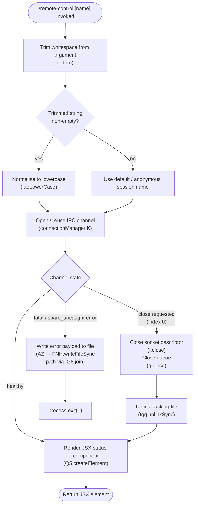

# `/remote-control`

> Analysis basis: CC v2.1.132 bundle.js (AST extraction + Claude interpretation)
> Minimum version: v2.1.132

---

## Overview

The `/remote-control` command (alias `/rc`) connects the current terminal session to a remote-control infrastructure, allowing an external controller to drive Claude Code in that terminal. It accepts an optional name argument that identifies the session, trims it, and renders a JSX component reflecting the connection state. Under the hood it manages a Unix-socket-style IPC channel that can be torn down on demand, removing its backing file and calling `process.exit(1)` on a fatal error path.

---

## Registration

| Field | Value |
|---|---|
| type | `local-jsx` |
| name | `remote-control` |
| aliases | `rc` |
| description | Connect this terminal for remote-control sessions |
| argumentHint | `[name]` |
| immediate | `true` |
| isHidden | `null` (not hidden) |
| module_id | `Rzq` |
| load_inline | `true` |
| handler | `Rw7` (AsyncFunction, resolved via `module_id` path) |
| `loc_byte_end` | `11389844` |
| `arbor_handler.name` | `Rw7` |
| `arbor_handler.kind` | `AsyncFunction` |
| `arbor_handler.resolution_path` | `module_id` |
| `arbor_handler.fqn` | `claude-2.1.132::Rw7` |
| `arbor_handler.n_hits` | `1` |

Analysis basis: CC v2.1.132 bundle.js:+11389598 – +11389844

---

## Input Branching

The handler first normalises the raw user argument, then delegates to a long-lived connection manager. The branching below is inferred from the call graph and literals.



Analysis basis: CC v2.1.132 bundle.js:+11389269 (trim), +11389293 (createElement), +14139789 (close index 0), +14110289 (spare_uncaught literal), +14110307 (process.exit)

---

## Behavioral Spec

### 1. Argument Normalisation

```
async function remoteControlHandler(rawArgument):
    trimmed = trim(rawArgument)          // strip leading/trailing whitespace
    if trimmed is non-empty:
        sessionName = toLowercase(trimmed)
    else:
        sessionName = <default anonymous token>
    return openSession(sessionName)
```

- `trim` is called unconditionally on the raw argument string.
  Analysis basis: CC v2.1.132 bundle.js:+11389269
- `toLowerCase` is applied after the trim, before the name is passed to the connection manager.
  Analysis basis: CC v2.1.132 bundle.js:+14153948

### 2. IPC Channel Management

The connection manager (`connectionManager`) owns a socket-like channel and a message queue. Its lifecycle methods are:

```
function connectionManager(sessionName):
    socket   = createSocketChannel(sessionName)   // internal queue q
    // ...normal operation loop...

function teardownChannel(index):
    // index === 0 triggers graceful close
    close(socket, index=0)     // f.close
    close(messageQueue)        // q.close
    unlinkBackingFile()        // tgq.unlinkSync removes filesystem artefact

function handleUncaughtError(errorPayload):
    // error kind tagged "spare_uncaught"
    encodedPayload = toString(errorPayload)        // vH → String()
    writeToDisk(encodedPayload, joinedPath)        // AZ → FNH.writeFileSync
                                                   //       path via IG8.join
    process.exit(1)
```

- Close is initiated with numeric index `0` (literal).
  Analysis basis: CC v2.1.132 bundle.js:+14139789
- The socket's backing file is removed synchronously via `unlinkSync` on teardown.
  Analysis basis: CC v2.1.132 bundle.js:+14110155
- The string constant `"spare_uncaught"` labels the uncaught-error variant.
  Analysis basis: CC v2.1.132 bundle.js:+14110289
- `process.exit` is called with `1` (non-zero exit code) on this fatal path.
  Analysis basis: CC v2.1.132 bundle.js:+14110307, +14110320

### 3. JSX Render

After the session is established (or refreshed), the handler returns a React element produced by `Q5.createElement`. The element reflects current connection state and is rendered inline in the terminal UI because `immediate: true` is set on the registration — the command does not wait for a separate render cycle.

Analysis basis: CC v2.1.132 bundle.js:+11389293

### 4. String Length Limit (queue/message path)

A numeric literal `40` appears in the lowercase-normalisation call graph context.

- Maximum session-name length (or an internal queue-depth constant): **40**
  Analysis basis: CC v2.1.132 bundle.js:+14154022

<!-- TODO: the exact semantic of the `40` constant (name truncation vs. queue depth) is not definitively resolvable at depth-2 traversal; needs --depth 4 -->

---

## State & Side Effects

| Item | Detail |
|---|---|
| Telemetry | None detected in this command's implementation (telemetry array is empty) |
| IPC channel | Opens (or reuses) a named socket/channel associated with the session name |
| Filesystem artefact | A backing file is created for the channel; removed synchronously by `unlinkSync` on graceful teardown |
| Error persistence | On `spare_uncaught` error, an encoded payload is written to disk via `writeFileSync` before exit |
| Process lifecycle | `process.exit(1)` is called on the fatal error path — terminates the Claude Code process |
| JSX output | Returns a `Q5.createElement` element; rendered immediately (`immediate: true`) |
| appState changes | <!-- TODO: not found in depth-2 traversal; needs --depth 4 --> |
| Sound | <!-- TODO: not found in depth-2 traversal; needs --depth 4 --> |

---

## Version History

| Version | Change |
|---|---|
| v2.1.132 | Initial analysis — handler `Rw7`, module `Rzq`, alias `rc` documented |

---

## Common Mistakes

1. **Forgetting the alias** — `/rc` is fully equivalent to `/remote-control`; both activate the same `Rw7` handler. Using one in scripts and the other interactively is safe but may confuse readers.
2. **Assuming case-sensitivity** — the session name is lowercased before registration. Passing `MySession` and `mysession` will resolve to the same channel.
3. **Leaving the backing file behind** — if the process is killed with `SIGKILL` before graceful teardown, `unlinkSync` never runs and the socket file persists on disk. Operators should clean `/tmp` (or wherever `IG8.join` resolves) after abnormal termination.
4. **Ignoring exit code 1** — the `spare_uncaught` error path calls `process.exit(1)` and writes a payload file. Wrapper scripts must check the exit code; the payload file provides the only post-mortem data because no telemetry events are emitted.
5. **Expecting a prompt-driven response** — the command type is `local-jsx`, not `prompt`. It renders a JSX component directly and does not send a natural-language prompt to the agent model.

---

## Appendix — Identifier Mapping

> For bundle debugging only. Identifiers change across versions.

| Identifier | Role |
|---|---|
| `Rw7` | Main async handler for `/remote-control` (entry point resolved via `module_id` path) |
| `_` | Intermediate helper — performs lowercase normalisation on the session name |
| `f` | Connection/socket manager — owns `close` and delegates to queue and channel teardown |
| `q` | Message queue / socket descriptor — holds `close` and `unlinkSync` teardown logic |
| `K` | Connection manager factory / lifecycle coordinator — calls queue constructor, error writer, and `process.exit` |
| `vH` | Error payload encoder — wraps value in `String()` before disk write |
| `AZ` | Disk-write helper — calls `FNH.writeFileSync` with a path assembled via `IG8.join` |