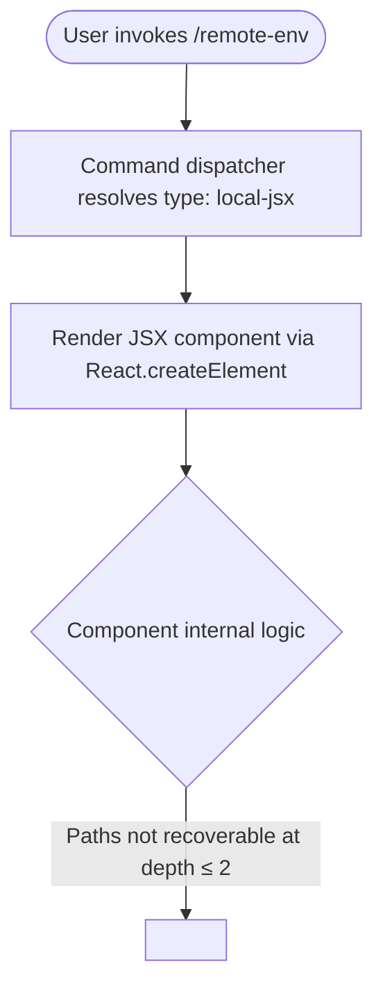

# `/remote-env`

> Analysis basis: CC v2.1.132 bundle.js (AST extraction + Claude interpretation)
> Minimum version: v2.1.132

---

## Overview

The `/remote-env` slash command allows users to configure the default remote environment used for Teleport sessions within Claude Code. It is registered as a local JSX command, meaning its user-facing interface is rendered as a React component directly within the CLI's terminal UI layer. Its core mechanism is to present configuration controls for the remote environment target that Claude Code connects to when operating in remote/Teleport mode.

---

## Registration

| Field | Value |
|---|---|
| type | `local-jsx` |
| name | `remote-env` |
| description | `Configure the default remote environment for teleport sessions` |
| module\_id | `pOq` |

Analysis basis: CC v2.1.132 bundle.js:+11356255

---

## Input Branching

Because the depth-2 call graph for this command yields only a single React element creation call and no branching literals or conditional telemetry events, the full input-branching tree cannot be reconstructed from the available traversal data.



Analysis basis: CC v2.1.132 bundle.js:+11356139

---

## Behavioral Spec

### JSX Component Rendering

The command's handler is implemented as a React functional component. When invoked, the CLI command dispatcher identifies the registration type as `local-jsx` and delegates rendering responsibility to the component instead of executing a plain text or async handler.

```
function remoteEnvCommand(props):
    element = createReactElement(RemoteEnvComponent, props)
    return element
```

The call to the React element factory is the sole depth-2–visible operation performed by this command's top-level handler.

Analysis basis: CC v2.1.132 bundle.js:+11356139

### Configuration Target

The registration description states the command configures "the default remote environment for teleport sessions." This implies the component manages persistent state (e.g., a hostname, cluster name, or connection profile) associated with Teleport remote sessions.

<!-- TODO: not found in depth-2 traversal; needs --depth 4 -->

Internal sub-operations such as reading current configuration, validating user input, writing updated values, and confirming success are all encapsulated within the JSX component and were not reachable at traversal depth ≤ 2.

---

## State & Side Effects

| Item | Detail |
|---|---|
| Telemetry | None detected at depth ≤ 2 traversal (`telemetry: []`) |
| Hook registration | <!-- TODO: not found in depth-2 traversal; needs --depth 4 --> |
| appState changes | <!-- TODO: not found in depth-2 traversal; needs --depth 4 --> |
| Sound | <!-- TODO: not found in depth-2 traversal; needs --depth 4 --> |
| Persistence | <!-- TODO: not found in depth-2 traversal; needs --depth 4 --> |

> **Note on telemetry absence:** No `tengu_*` event strings were found within the depth-2 traversal scope. It is possible that telemetry calls exist deeper in the component tree but were not reached by the extractor.

---

## Version History

| Version | Change |
|---|---|
| v2.1.132 | Initial analysis — command registered as `local-jsx` type under module `pOq` |

---

## Common Mistakes

1. **Assuming `/remote-env` applies to local development sessions.** The registration description explicitly scopes this command to *Teleport sessions*. Invoking it outside a Teleport-connected context may produce no effect or an error not captured in this traversal.
2. **Expecting plain-text output.** Because the command type is `local-jsx`, its output is a rendered React component, not a simple string printed to stdout. Tooling or scripts that parse `/remote-env` output as plain text will not work correctly.
3. **Assuming telemetry-free operation is permanent.** No telemetry events were found at depth ≤ 2, but deeper component logic may emit events. Do not rely on the absence of telemetry as a guaranteed behavioral property of this command.
4. **Treating the configured value as session-only.** The word "default" in the description ("Configure the *default* remote environment") implies the value persists across sessions, though the exact persistence mechanism is not confirmed at this traversal depth.

---

## Appendix — Identifier Mapping

> For bundle debugging only. Identifiers change across versions.

| Identifier | Role |
|---|---|
| `RY7` | Top-level JSX component function / command handler for `/remote-env` |