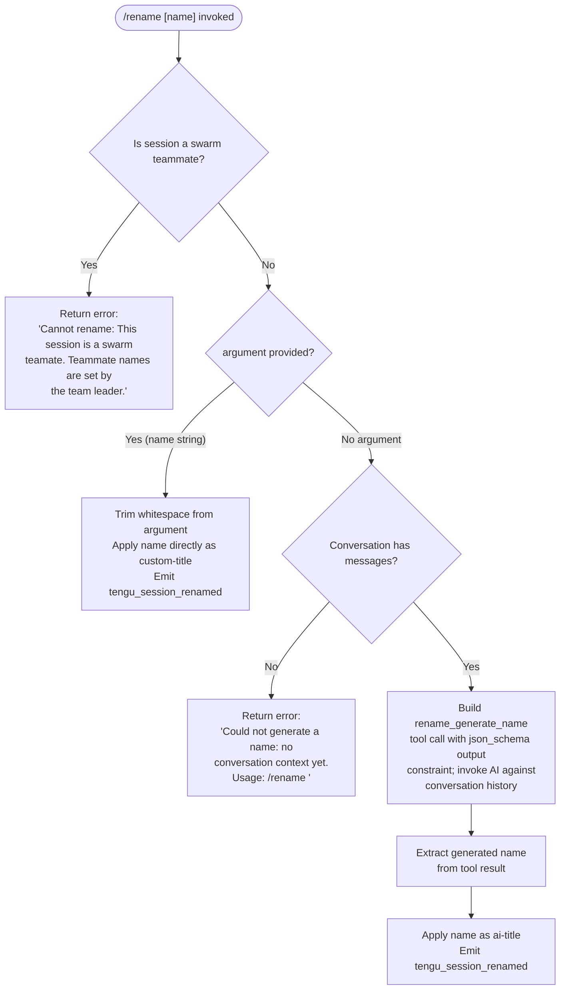

# `/rename`

> Analysis basis: CC v2.1.132 bundle.js (AST extraction + Claude interpretation)
> Minimum version: v2.1.132

---

## Overview

The `/rename` command sets or regenerates the display name of the current conversation session. When called with an explicit `[name]` argument, it applies that string directly as a custom title. When called with no argument, it attempts to auto-generate a name by invoking a JSON-schema-constrained tool call (`rename_generate_name`) against the conversation history; if no conversation context exists yet, it returns an error message instead of making the API call.

---

## Registration

| Field | Value |
|---|---|
| type | `local-jsx` |
| name | `rename` |
| description | `Rename the current conversation` |
| argumentHint | `[name]` |
| immediate | `true` |
| aliases | `["name"]` |
| module_id | `v9q` |
| load_inline | `true` |
| handler (Arbor) | `M77` (AsyncFunction, resolved via `module_id`) |
| `loc_byte_end` | `10759798` |
| `arbor_handler.name` | `M77` |
| `arbor_handler.kind` | `AsyncFunction` |
| `arbor_handler.resolution_path` | `module_id` |
| `arbor_handler.fqn` | `claude-2.1.132::M77` |
| `arbor_handler.n_hits` | `0` |

Analysis basis: CC v2.1.132 bundle.js:+10759599 – +10759798

---

## Input Branching

The top-level handler (`M77`) dispatches to three sub-handlers depending on the runtime context and input argument.



Analysis basis: CC v2.1.132 bundle.js:+10758744, +10758764, +10758869, +10758903, +10758965

---

## Behavioral Spec

### Swarm-teammate guard

```
function renameSentinelCheck(sessionContext):
    if sessionContext.isSwarmTeammate == true:
        return errorResult(
            "Cannot rename: This session is a swarm teammate. " +
            "Teammate names are set by the team leader."
        )
    return null  // proceed
```

When the current session is participating as a swarm teammate, the command is rejected immediately with the hard-coded error string. No title mutation or telemetry occurs beyond this early return.

Analysis basis: CC v2.1.132 bundle.js:+10758764

---

### Direct rename (argument provided)

```
async function applyExplicitName(rawArgument, sessionState):
    trimmedName = rawArgument.trim()
    if trimmedName == "":
        // treat as auto-rename path (fall through)
        return autoRename(sessionState)
    sessionState.setTitle(trimmedName, kind="custom-title")
    emitTelemetry("tengu_session_renamed")
    return renderSuccess(trimmedName)
```

The argument is trimmed of leading and trailing whitespace before application. The title is tagged with the `custom-title` origin label, distinguishing it from AI-generated names.

Analysis basis: CC v2.1.132 bundle.js:+10758869, +11811227

---

### Auto-rename via AI (no argument)

```
async function autoRename(sessionState):
    messages = getCurrentConversationMessages(sessionState)
    if messages.length == 0:
        return errorResult(
            "Could not generate a name: no conversation context yet. " +
            "Usage: /rename <name>"
        )

    toolSpec = {
        name: "rename_generate_name",
        outputFormat: "json_schema"
    }

    // Build a summarization request constrained to the tool schema
    result = await invokeAIWithTool(
        conversationSlice(messages),
        tool=toolSpec
    )

    if result has no assistant message:
        return errorResult("No assistant message found")

    generatedName = extractNameFromToolResult(result)
    sessionState.setTitle(generatedName, kind="ai-title")
    emitTelemetry("tengu_session_renamed")
    return renderSuccess(generatedName)
```

The auto-rename path calls into the shared conversation-query infrastructure (`j2q`) that handles streaming, retries, and normalization. The tool name `rename_generate_name` constrains the model output to a JSON schema so the name can be extracted deterministically. The title origin is tagged `ai-title` to distinguish it from user-supplied names.

Analysis basis: CC v2.1.132 bundle.js:+10758168, +10758903, +10758965, +11811391, +12027577

---

### Conversation-message extraction (`h$8`)

```
function extractConversationSlice(allMessages):
    filtered = []
    for msg in allMessages:
        if msg.role in ["user", "assistant"]:
            if not msg.isMeta:
                if msg.origin == "human" or msg.type == "text":
                    filtered.push(msg)
    return filtered.slice(...)   // implementation truncates to relevant window
```

This helper filters the raw message log to only the human/assistant exchange needed for the name-generation prompt. It excludes meta messages and non-text content blocks.

Analysis basis: CC v2.1.132 bundle.js:+10755652, +10755669, +10755693, +10755728, +10755768, +10755886, +10755907, +10755832, +10755948, +10755980

---

### Session-store persistence (`_m` / `gt` / `I9H`)

```
function persistSessionTitle(sessionStore, name, kind):
    // kind is "custom-title" or "ai-title"
    entry = sessionStore.getOrCreate(sessionId)
    entry.title = name
    entry.titleKind = kind
    appendToLogFile(entry)            // LVH: appendFileSync, mkdirSync
    sessionStore.emit("wP6", "agent-name", name)
    emitTelemetry("tengu_agent_name_set")
```

Title persistence is handled by the session-store module (`JZH`). Log writes use synchronous `appendFileSync` with `mkdirSync` for directory creation. Two telemetry events may fire on this path: `tengu_session_renamed` (command layer) and `tengu_agent_name_set` (store layer).

Analysis basis: CC v2.1.132 bundle.js:+11811227, +11811391, +11811306, +11813457, +11813542, +11813555, +11810274, +11810313

---

### Standalone-agent context injection (`C$8`)

```
async function renameCommandHandler(args, appContext):
    sentinelError = renameSentinelCheck(appContext)
    if sentinelError: return sentinelError

    conversationContext = getCurrentStore(appContext)   // p7 → NP → Dg8.getStore
    sessionLog = initSessionLog(appContext)             // JZH
    appContext.setStandaloneAgentContext(sessionLog)    // A.setStandaloneAgentContext

    if args.name:
        return applyExplicitName(args.name, conversationContext)
    else:
        return autoRename(conversationContext)
```

Before branching on the presence of a name argument, the handler installs a standalone-agent context on the application state. This makes the session object available to downstream query infrastructure without a full REPL loop.

Analysis basis: CC v2.1.132 bundle.js:+10759072, +10759090, +10759104, +10759148

---

## State & Side Effects

| Item | Detail |
|---|---|
| Telemetry: `tengu_session_renamed` | Fired after every successful title mutation (both explicit and AI-generated paths). bundle.js:+11811319 |
| Telemetry: `tengu_agent_name_set` | Fired by the session-store layer when the agent-name field is updated. bundle.js:+11813555 |
| Telemetry: `tengu_chair_sermon` | Reachable via the conversation-normalization sub-graph (`jG`). bundle.js:+9698604 |
| Telemetry: `tengu_off_switch_query` | Reachable via the AI-query path (`j2q`). bundle.js:+12031066 |
| Telemetry: `tengu_api_before_normalize` | Fired before message normalization in the auto-rename query. bundle.js:+12032592 |
| Telemetry: `tengu_api_after_normalize` | Fired after message normalization in the auto-rename query. bundle.js:+12033079 |
| Telemetry: `tengu_streaming_idle_timeout` | May fire if the AI call stalls. bundle.js:+12038201 |
| Telemetry: `tengu_api_slow_first_byte` | May fire if first chunk is delayed. bundle.js:+12038984 |
| Telemetry: `tengu_advisor_strip_retry` | Retry path in query infrastructure. bundle.js:+12039894 |
| Telemetry: `tengu_streaming_stall` | Streaming watchdog event in query path. bundle.js:+12041953 |
| Telemetry: `tengu_streaming_fallback_to_non_streaming` | Fallback path. bundle.js:+12048762 |
| File system | Session log updated via synchronous `appendFileSync`; parent directory created with `mkdirSync` if absent. |
| App-state mutation | `A.setStandaloneAgentContext` is called unconditionally to inject the session object. bundle.js:+10759104 |
| Session-store event | `wP6.emit` fires with `"agent-name"` key after title write. bundle.js:+11811306 |
| Hook registration | <!-- TODO: not found in depth-2 traversal; needs --depth 4 --> |
| Sound | <!-- TODO: not found in depth-2 traversal; needs --depth 4 --> |

---

## Error Messages

| Condition | Message |
|---|---|
| Session is a swarm teammate | `"Cannot rename: This session is a swarm teammate. Teammate names are set by the team leader."` |
| Auto-rename with empty conversation | `"Could not generate a name: no conversation context yet. Usage: /rename <name>"` |
| AI call returned no assistant message | `"No assistant message found"` |

Analysis basis: CC v2.1.132 bundle.js:+10758764, +10758965, +12027577

---

## Version History

| Version | Change |
|---|---|
| v2.1.132 | Initial analysis |

---

## Common Mistakes

1. **Calling `/rename` before any messages exist** — the auto-rename path checks for conversation context and returns an error rather than silently producing a generic title. Provide a name explicitly or send at least one message first.
2. **Expecting `/rename` to work in swarm-teammate sessions** — the command is unconditionally blocked for swarm teammates; only the team leader can control teammate names.
3. **Confusing the `name` alias** — `/name <text>` is a registered alias and is behaviorally identical to `/rename <text>`; there is no difference between the two forms.
4. **Assuming the AI-generated name is instant** — the auto-rename path runs a full streaming API call through the conversation-query infrastructure and is subject to the same latency, retry, and streaming-fallback behavior as any other AI request.
5. **Expecting whitespace-only input to apply a blank name** — the argument is trimmed before use; an all-whitespace argument falls through to the auto-rename path rather than setting an empty title.

---

## Appendix — Identifier Mapping

> For bundle debugging only. Identifiers change across versions.

| Identifier | Role |
|---|---|
| `M77` | Top-level async handler for `/rename` (Arbor-resolved entry point) |
| `C$8` | Core rename dispatch function: swarm guard → store init → branch on argument |
| `R$8` | Helper invoked at the start of the handler (pre-dispatch setup) |
| `QW` | Called by both `R$8` and `jG`; likely shared app-state accessor |
| `p7` | Retrieve current conversation store |
| `NP` | Unwrap store from async context (`Dg8.getStore`) |
| `wnH` | Orchestrates the auto-rename AI call and name extraction |
| `h$8` | Conversation message slice/filter builder |
| `Xv` | AI query session constructor (wraps `j2q`, `lIH`, `jf8`) |
| `jf8` | Session-file read/write and conversation serialization |
| `Jf8` | File-path resolver for conversation sessions |
| `jG` | Message normalization and context-window builder |
| `Qn4` | Content-block mapper within normalization |
| `j2q` | Core streaming AI query engine |
| `lIH` | Thin wrapper that initializes the query context and calls `j2q` |
| `pTA` | Pre-query setup: loads session, pushes messages |
| `N6` | Utility used inside session serialization |
| `RH` | JSON serialization utility (`JSON.stringify`) |
| `B6` | JSON deserialization utility (`JSON.parse`) |
| `Wd9` | Conversation write-back helper |
| `yH` | String coercion utility |
| `vL` | Message filter helper (used in `wnH`) |
| `k` | Terminal output / display-name renderer |
| `Lsq` | Title display formatting pipeline |
| `rdA` | Low-level display-name utilities |
| `mf` | String sanitization for displayed names (replace, slice) |
| `MnA` | Character-map builder for name sanitization |
| `gNH` | Output writer for rendered name |
| `slA` | Low-level `H.write` call within output writer |
| `Msq` | Session-log persistence orchestrator |
| `GNH` | Debounced writer with `clearTimeout`/`setTimeout`/`setImmediate` |
| `pHH` | Compose log path and write entry |
| `F6` | Shared path/config accessor |
| `JG8` | Low-level file-handle utility |
| `jnA` | Path joiner for session files |
| `JnA` | File rename/unlink helper (`YV.stat`, `YV.rename`, `YV.unlink`) |
| `fsq` | Append-file + rename pipeline (`YV.mkdir`, `YV.appendFile`) |
| `N1` | Pending-write set manager (`J08.add/delete`, `Object.assign`) |
| `vH` | String coercion wrapper (wraps `String`) |
| `v6` | App-state or config accessor (frequently called) |
| `JZH` | Session-store module (title persistence, event emission) |
| `_m` | Session-store write path: calls `qN`, `LVH`, `hK`, emits `wP6` |
| `gt` | Alternate session-store update path |
| `qN` | Log-entry formatter before write |
| `LVH` | Sync file appender with `mkdirSync` guard |
| `hK` | Post-write hook dispatcher |
| `I9H` | Session-name persistence: reads/writes session metadata file, emits `agent-name` event |
| `YU` | Session metadata read/write via `QV.readFile`/`QV.writeFile` |
| `mA6` | Underlying file I/O for session metadata |
| `xfH` | Standalone-agent context builder (injected via `A.setStandaloneAgentContext`) |
| `UL` | Agent working-directory resolver |
| `DW` | Path join utility for agent dirs |
| `AG` | Basename extractor for agent context |
| `Jq` | File-stat cache loader for agent context |
| `YW` | Cache invalidation helper |
| `jM` | Atomic-write helper (uses `lY`) |
| `lY` | Atomic file write via random-byte temp file + rename |
| `fH` | Error-boundary wrapper around agent context setup |
| `HA` | Error formatter |
| `kq` | Queue processor inside error boundary |
| `h1_` | Inner queue handler |
| `$wL` | Shift/push queue manager |
| `M` | MCP server manager (reached via `JZH`; manages tool connections) |
| `UZH` | MCP client initializer and tool-schema builder |
| `ZBq` | MCP update applier |
| `$F7` | MCP connection orchestrator |
| `j6` | Conversation-persistence scheduler |
| `Oo` | Conversation save helper |
| `uQ6` | Deduplication cache for conversation saves |
| `R6` | Timed persistence flusher |
| `dcH` | Conversation serializer |
| `df8` | Conversation write utility |
| `bI` | MCP client cleanup handler |
| `$` | Background-task scheduler |
| `mzq` | Timed task runner (`Date.now`, `lY`, `RH`) |
| `Lj` | Conversation-header builder |
| `WRH` | Header renderer |
| `fW` | Footer/tail builder for conversation display |
| `gq` | Shared async-queue or gate primitive |
| `Bl` | Store binding helper |
| `tf` | Path/config accessor used in store setup |
| `gy` | Store initialization helper |
| `ul` | Session-unlock or release helper |
| `A3` | Agent-context secondary initializer |
| `ywH` | Sub-component of agent-context init |
| `KY` | Session-key or identifier generator |