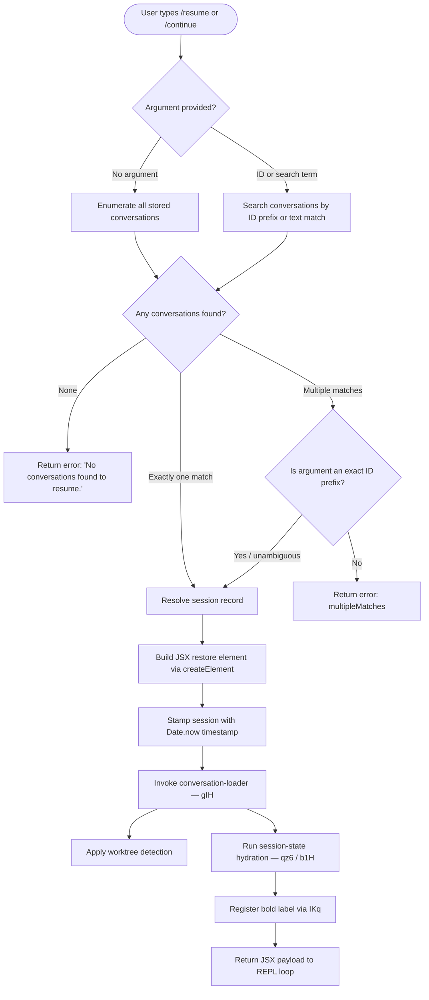

# `/resume`

> Analysis basis: CC v2.1.132 bundle.js (AST extraction + Claude interpretation)
> Minimum version: v2.1.132

---

## Overview

The `/resume` command (alias `/continue`) allows the user to re-enter a previously saved conversation by supplying either an exact conversation ID or a free-text search term. It queries persisted conversation records, resolves an unambiguous match, constructs a JSX session-restore payload, and hands off execution to the main agent loop — effectively continuing the prior session's context.

---

## Registration

| Field | Value |
|---|---|
| type | `local-jsx` |
| name | `resume` |
| aliases | `["continue"]` |
| description | `Resume a previous conversation` |
| argumentHint | `[conversation id or search term]` |
| module\_id | `NKq` |
| load\_inline | `true` |
| handler (Arbor) | `MM7` (AsyncFunction, resolved via `module_id`) |
| `loc_byte_end` | `10915075` |
| `arbor_handler.name` | `MM7` |
| `arbor_handler.kind` | `AsyncFunction` |
| `arbor_handler.resolution_path` | `module_id` |
| `arbor_handler.fqn` | `claude-2.1.132::MM7` |
| `arbor_handler.n_hits` | `0` |

Analysis basis: CC v2.1.132 bundle.js:+10914878 – +10915075

---

## Input Branching

The handler (`MM7`) accepts an optional string argument (conversation ID or search term) and branches on whether any matching sessions are found.



Analysis basis: CC v2.1.132 bundle.js:+10913558, +10913681, +10913782, +10913808, +10913931, +10911425, +10911496

---

## Behavioral Spec

### 1. Conversation Discovery (`conversationFilter` / `vKq`)

On invocation the handler first calls the conversation-filter helper to narrow the global conversation list.

```
function conversationFilter(allConversations, rawArg):
    filtered = allConversations.filter(session => matchesTerm(session, rawArg))
    sorted   = applySort(filtered)          // via EM
    return sorted
```

- When `rawArg` is absent, all stored conversations are returned unsorted.
- When `rawArg` is present, each conversation record is matched against the argument (case-insensitive text search and/or UUID prefix).

Analysis basis: CC v2.1.132 bundle.js:+10913558, +10913588

### 2. Session Lookup and Error Cases (`conversationLookup` / `gIH`)

`gIH` implements the detailed lookup logic including worktree awareness.

```
async function conversationLookup(searchTerm, conversationList):
    // Worktree detection: runs "git worktree list --porcelain"
    worktreeInfo = detectWorktrees()          // emits tengu_worktree_detection

    // Normalise search term to NFC unicode
    term = searchTerm.normalize("NFC")

    if term.startsWith("worktree "):
        // Strip "worktree " prefix (9 chars) and resolve against worktree map
        branchName = term.slice(9)
        candidate  = conversationList.find(s => s.worktree == branchName)
    else:
        // Attempt exact-ID match first
        candidate = conversationList.find(s => s.id.startsWith(term))
        if not candidate:
            // Fall back to fuzzy text search; sort by localeCompare
            candidates = conversationList.filter(s => fuzzyMatch(s, term))
            candidates.sort((a, b) => a.title.localeCompare(b.title))
            if candidates.length == 0:
                return { error: "sessionNotFound" }
            if candidates.length > 1:
                return { error: "multipleMatches" }
            candidate = candidates[0]

    return candidate
```

Literal constants observed:
- `"worktree "` prefix string (9 characters) — bundle.js:+10911000, +10911031
- Unicode normalisation form `"NFC"` — bundle.js:+10911044
- Error token `"sessionNotFound"` — bundle.js:+10911425
- Error token `"multipleMatches"` — bundle.js:+10911496

Analysis basis: CC v2.1.132 bundle.js:+10910737, +10910962, +10910987, +10911023, +10911139, +10911158, +10911185, +10911218

### 3. Empty-Result Guard

When the filtered conversation list is empty after all lookup attempts:

```
if resolvedSession == null:
    return renderError("No conversations found to resume.")
```

The exact error message string is `"No conversations found to resume."` — bundle.js:+10913931

### 4. Session State Hydration (`sessionStateHydrator` / `qz6` and `b1H`)

Once a session record is resolved, the handler hydrates full in-memory state:

```
async function hydrateSession(sessionRecord):
    // Load transcript chain from disk (b1H → Jt → nW7/lW7)
    transcript = await loadTranscriptChain(sessionRecord.path)

    // Reconstruct message index maps (wY8, JY8, C1H, uW7, CW7, LXq)
    messageIndex = buildMessageIndex(transcript)

    // Apply session metadata fields from stored keys:
    //   "summary", "last-prompt", "custom-title", "ai-title", "tag",
    //   "agent-name", "agent-color", "agent-setting", "mode",
    //   "permission-mode", "isolation-latch", "worktree-state",
    //   "pr-link", "fork-context-ref", "file-history-snapshot",
    //   "attribution-snapshot", "content-replacement",
    //   "marble-origami-commit", "marble-origami-snapshot"
    applyMetadata(sessionRecord.metadata, messageIndex)

    // Sort restored messages by timestamp (YY8 / Date.parse)
    sortedMessages = sortByTimestamp(transcript)
    return { transcript: sortedMessages, index: messageIndex }
```

Metadata key literals observed at bundle.js:+11822319 through +11823802.

Analysis basis: CC v2.1.132 bundle.js:+10914237, +11826006, +11815345, +11816266, +11816296, +11804261

### 5. JSX Payload Construction (`MM7` main body)

```
async function MM7(commandArgs):
    { term } = parseArgs(commandArgs)           // vH — string coercion

    // Step 1: Filter conversations
    candidates = conversationFilter(allSessions, term)   // vKq

    // Step 2: Lookup / error-gate
    session = await conversationLookup(term, candidates) // gIH
    if session.error == "sessionNotFound" or candidates.length == 0:
        return renderMessage("No conversations found to resume.")

    // Step 3: Hydrate
    state = await hydrateSession(session)                // qz6

    // Step 4: Gather conversation files for display (rF → OXq → KVH)
    fileList = await buildConversationFileList(session)

    // Step 5: Register bold label
    labelTag = boldLabel(sessionTitle)                   // IKq → M6.bold

    // Step 6: Stamp timestamp and render
    startTime = Date.now()
    element   = createElement(ResumeView, {
        session: state,
        files:   fileList,
        label:   labelTag,
        startedAt: startTime,
    })

    // Step 7: Record telemetry identifiers
    recordSlashCommandMeta({
        slash_command_session_id: session.id,   // loc:+10914192
        slash_command_title:      session.title // loc:+10914416
    })

    return element
```

Analysis basis: CC v2.1.132 bundle.js:+10913681, +10913717, +10913746, +10913782, +10913808, +10913853, +10913857, +10913871, +10914032, +10914050, +10914064, +10914158, +10914170, +10914298, +10914317, +10914466

### 6. Conversation File Enumeration (`conversationFileBuilder` / `rF`)

`rF` orchestrates file discovery for the selected session:

```
function conversationFileBuilder(session, options):
    // Determine conversation directory (OXq → Mn → D$.join / "projects")
    dir = path.join(projectsRoot, session.id)

    // List JSONL files via yK.readdir
    entries = await fs.readdir(dir)

    // Filter to conversation files, sort by modification time
    files = entries
        .filter(e => e.startsWith(session.id))
        .map(e => loadConversationFile(e))       // sDH, MP6
        .sort()

    // Apply lowercase normalisation and dedup
    normalized = Array.from(new Set(files.map(f => f.toLowerCase())))

    return normalized
```

Analysis basis: CC v2.1.132 bundle.js:+11816562, +11816580, +11816602, +11816622, +11816647, +11816869, +11816895, +11816961, +11829350

### 7. Transcript Chain Loading (`transcriptChainLoader` / `b1H` + `Jt`)

The transcript chain loader reads raw JSONL records from disk, links parent-child message relationships, and detects anomalies:

```
async function transcriptChainLoader(sessionPath):
    // Open file with synchronous read (nW7 → jN.openSync / readSync)
    rawBytes = fs.openSync(sessionPath, flags)
    records  = parseJSONL(rawBytes)              // lW7, AjH

    // Walk parent-chain; emit telemetry on anomalies:
    //   tengu_transcript_phantom_parent  — missing parent node
    //   tengu_transcript_parent_cycle    — cycle detected
    //   tengu_chain_parent_cycle         — chain-level cycle
    //   tengu_chain_timestamp_fallback   — missing timestamp, using fallback
    //   tengu_chain_parallel_tr_recovered — parallel branch recovered
    chain = linkMessages(records)

    // Sort chain by YY8 (Date.parse on ISO timestamp field)
    return chain.sort((a, b) => Date.parse(a.timestamp) - Date.parse(b.timestamp))
```

Analysis basis: CC v2.1.132 bundle.js:+11815345, +11815380, +11815477, +11815560, +11816495, +11824009, +11824120, +11824172, +11824192

---

## State & Side Effects

| Item | Detail |
|---|---|
| Telemetry — worktree detection | `tengu_worktree_detection` fired on every invocation (bundle.js:+10910881) |
| Telemetry — transcript anomalies | `tengu_transcript_phantom_parent`, `tengu_transcript_parent_cycle`, `tengu_chain_parent_cycle`, `tengu_chain_timestamp_fallback`, `tengu_chain_parallel_tr_recovered` (bundle.js:+11821189, +11824601, +11804378, +11804527, +11806393) |
| Telemetry — relink walk | `tengu_relink_walk_broken` on broken parent chain (bundle.js:+11803362) |
| appState changes | Session ID and title written to slash-command metadata fields `slash_command_session_id` and `slash_command_title` (bundle.js:+10914192, +10914416) |
| Filesystem reads | JSONL transcript files read via synchronous `fs.openSync` / `fs.readSync`; directory enumerated via `fs.readdir` |
| Filesystem writes | None on the happy path; error logger (`EQ.logError`) may write on chain anomalies (bundle.js:+911941) |
| Hook registration | `H.on("exit", ...)` registered inside subprocess-pool helper (`hL_`) reached transitively through session-start path (bundle.js:+981626) |
| Sound | None identified in depth-2 traversal |
| Subprocess | Background daemon session machinery (`PA → Y → qFA → Bun.spawn`) may be activated if the restored session requires a background worker (bundle.js:+14111281) |
| Error logging | `EQ.logError` called with level `"error"` on chain anomalies (bundle.js:+911916, +911941) |

---

## Version History

| Version | Change |
|---|---|
| v2.1.132 | Initial analysis |

---

## Common Mistakes

1. **Ambiguous search terms**: Providing a non-unique partial term that matches multiple conversation titles causes a `multipleMatches` error. Use a longer UUID prefix or the full conversation title to disambiguate.
2. **Wrong alias expectation**: The command is also registered as `/continue`; either name is valid, but tooling that hard-codes `/resume` may break if the alias list changes in a future version.
3. **Worktree prefix not spelled exactly**: The worktree branch-based lookup requires the literal prefix `"worktree "` (with a trailing space) before the branch name. Omitting the space causes the argument to be treated as a plain text search.
4. **Expecting instant load for large transcripts**: The transcript chain loader reads files synchronously and walks the full parent chain in memory. Very large conversation histories may cause a perceptible pause before the session is restored.
5. **Assuming all metadata keys are always present**: Not all sessions will have every metadata key (e.g., `"custom-title"`, `"ai-title"`, `"marble-origami-commit"`). Code that depends on these fields must handle absent values gracefully.

---

## Appendix — Identifier Mapping

> For bundle debugging only. Identifiers change across versions.

| Identifier | Role |
|---|---|
| `MM7` | Main `/resume` handler (AsyncFunction, entry point) |
| `vKq` | Conversation filter — narrows session list by argument |
| `EM` | Sort/rank helper for filtered conversation list |
| `gIH` | Conversation lookup — resolves single session from candidates |
| `rF` | Conversation file builder — enumerates session JSONL files |
| `OXq` | Directory scanner — reads conversation project directory |
| `KVH` | File-level conversation record loader |
| `sDH` | Conversation file segment parser |
| `MP6` | Conversation file cache manager |
| `qz6` | Session state hydrator — top-level coordinator |
| `$Xq` | Session state hydrator — inner initialiser |
| `b1H` | Transcript chain loader — orchestrates JSONL read + link |
| `Jt` | Transcript session builder — constructs in-memory session object |
| `nW7` | JSONL binary reader — low-level synchronous file read |
| `lW7` | JSONL text parser — UTF-8 line parser |
| `AjH` | Supplemental JSONL frame parser |
| `C1H` | Message chain linker — resolves parent-child references |
| `uW7` | Message index builder — per-role index maps |
| `CW7` | Chain sorter — reorders messages by timestamp |
| `LXq` | Parallel branch resolver |
| `xW7` | Chain anomaly detector (NaN timestamp, missing parents) |
| `wY8` | Conversation metadata getter (summary, last-prompt, etc.) |
| `JY8` | Conversation metadata multi-value getter |
| `YY8` | Timestamp parser wrapper (`Date.parse`) |
| `AbA` | Aggregated message-content accessor |
| `DbA` | Message text normaliser / compactor |
| `AQH` | Message map transformer |
| `wbA` | Message filter helper (content type checks) |
| `mW7` | Message trim/array validator |
| `pW7` | Array-type content validator |
| `gjq` | Session graph walker — relink broken parent chains |
| `iW7` | Supplemental synchronous file reader |
| `gj6` | Message body parser — command-args / bash-input extraction |
| `jq` | Regex-based message content tokeniser |
| `IKq` | Bold label renderer for session title display |
| `jqH` | Conversation display formatter |
| `vH` | String coercion helper for raw argument |
| `fH` | Async error logger / structured log emitter |
| `HA` | Error constructor wrapper |
| `yH` | String identity helper |
| `kq` | UUID / ID normaliser |
| `h1_` | ID formatter (delegates to `yH`) |
| `$wL` | Circular buffer for recent conversation IDs |
| `PA` | Session process allocator — daemon session launcher |
| `rJH` | Subprocess runner — low-level process spawn |
| `lL_` | Process binary resolver (platform-aware, `.exe` on win32) |
| `hy8` | Stdout stream binder |
| `Sy8` | Stderr stream binder |
| `Cy8` | Combined stream handler |
| `eq_` | Timeout validator (`Number.isFinite`) |
| `VH6` | Process output accumulator |
| `yy8` | Reflect-based property interceptor |
| `hL_` | Exit-event hook registrar |
| `tq_` | Promise-race timeout wrapper |
| `HL_` | SIGTERM kill helper |
| `aq_` | Stdout line handler (bound) |
| `sq_` | Kill-on-signal handler (bound) |
| `kL_` | Multi-stream promise combiner |
| `yH6` | Stream result collector |
| `vL_` | Pipe configurator |
| `NL_` | Signal-add helper |
| `LL_` | Stream bind helper |
| `Uc` | UUID regex tester |
| `Wl` | Conversation list state atom |
| `N0` | Recursive directory walker |
| `rW7` | Conversation project path resolver |
| `lg` | Path segment helper |
| `Mn` | Projects-root path joiner |
| `GO` | Path sanitiser / replacer |
| `T1` | Async task scheduler |
| `Lsq` | Module-level configuration resolver |
| `RH` | JSON serialiser wrapper |
| `mf` | Path redaction helper (`[REDACTED]`) |
| `gNH` | Filename normaliser |
| `Msq` | Context-file loader (reads project files, checks `Buffer.byteLength`) |
| `XO8` | Session render coordinator |
| `XP6` | JSX session-restore element builder |
| `k` | Command context builder / message formatter |
| `hj` | Helper — session header builder |
| `xu` | Session-title extractor |
| `HnA` | Markdown/text content normaliser |
| `elA` | Regex-based content tester |
| `d` | Logger / diagnostic sink |
| `ujL` | String coercion for session ID display |
| `Y` | Background daemon session manager |
| `j6` | Session registry lookup |
| `qFA` | Background PTY host spawner (`Bun.spawn`) |
| `$` | Session disposer |
| `s6` | Session path resolver |
| `LFA` | Unix socket connector |
| `OFA` | Session lifecycle manager |
| `w` | Session state machine |
| `mH` | Session state — `"ok"` handler |
| `SH` | Session state — `"stopped"` handler |
| `pC` | Graceful-exit coordinator (`Promise.race`) |
| `Jx` | Daemon control command dispatcher |
| `z` | Background session wrapper |
| `M` | MCP session coordinator |
| `UZH` | MCP server connection manager |
| `ZBq` | MCP update applier |
| `$F7` | MCP client filter / dispatcher |
| `DH` | Notification manager |
| `W` | Debounce / skill-update scheduler |
| `BfH` | Policy-settings batch emitter |
| `uuH` | Active-session presence checker |
| `nt` | Composite state snapshot builder |
| `F` | Plugin-list filter |
| `wH` | Tool-use / streaming message handler |
| `E` | Keyboard-event interceptor |
| `CP` | Remote-control startup handler |