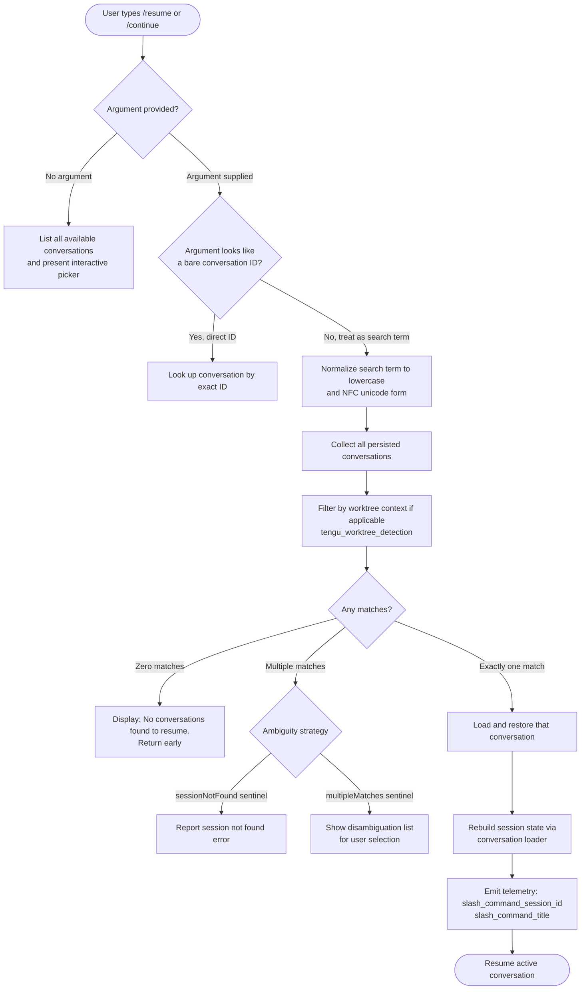

# `/resume`

> Analysis basis: CC v2.1.132 bundle.js (AST extraction + Claude interpretation)
> Minimum version: v2.1.132

---

## Overview

The `/resume` command (also accessible as `/continue`) allows the user to re-enter a previous Claude Code conversation by supplying either its exact conversation ID or a free-text search term. It queries persisted conversation records, applies optional fuzzy/prefix matching, and, upon a unique match, restores the full session state and resumes interaction as if the conversation had never ended.

---

## Registration

| Field | Value |
|---|---|
| type | `local-jsx` |
| name | `resume` |
| description | Resume a previous conversation |
| argumentHint | `[conversation id or search term]` |
| aliases | `continue` |
| module_id | `NKq` |

Analysis basis: CC v2.1.132 bundle.js:+10914878

---

## Input Branching

The command entry point (`commandHandler`) receives the raw argument string, then follows the branching logic below.



Analysis basis: CC v2.1.132 bundle.js:+10913558, +10913588, +10913931, +10911425, +10911496

---

## Behavioral Spec

### Conversation Discovery and Filtering

```
function discoverConversations(rawArgument, allConversations):
    # Filter out conversations that are not resumable (e.g., flagged "skip")
    candidates = allConversations.filter(c => c.resumable != "skip")

    # Detect git worktree context; emit telemetry event
    worktreeInfo = detectWorktree()           # runs: git worktree list --porcelain
    emit("tengu_worktree_detection", worktreeInfo)

    if worktreeInfo is active:
        candidates = candidates.filter(c => matchesWorktree(c, worktreeInfo))

    return candidates
```

Analysis basis: CC v2.1.132 bundle.js:+10913558, +10913699, +10910781, +10910792, +10910799, +10910881

---

### Worktree Detection

```
function detectWorktree():
    # Invoke git to enumerate worktrees in machine-readable format
    output = exec("git", ["worktree", "list", "--porcelain"])

    for each line in output:
        if line.startsWith("worktree "):
            # Strip the 9-character prefix "worktree " to isolate the path
            path = line.slice(9)
            normalizedPath = path.normalize("NFC")
            # compare against current working directory
            if normalizedPath matches cwd:
                return { active: true, path: normalizedPath }

    return { active: false }
```

Analysis basis: CC v2.1.132 bundle.js:+10910962, +10910987, +10911000, +10911023, +10911031, +10911044

---

### Search Term Matching

```
function matchConversations(searchTerm, candidates):
    normalized = searchTerm.toLowerCase()

    # Attempt prefix match on conversation ID first
    prefixMatches = candidates.filter(c => c.id.startsWith(normalized))
    if prefixMatches.length > 0:
        return prefixMatches

    # Fall back to locale-aware comparison across title fields
    ranked = candidates
        .filter(c => titleOf(c).localeCompare(normalized) contains match)
        .sort(byLocaleCompare)

    return ranked
```

Analysis basis: CC v2.1.132 bundle.js:+10911139, +10911158, +10911185, +10911218

---

### Result Handling

```
function handleMatchResult(matches):
    if matches.length == 0:
        displayMessage("No conversations found to resume.")
        return

    if matches.length == 1:
        loadAndResumeConversation(matches[0])
        return

    # More than one candidate
    sentinel = classifyAmbiguity(matches)
    if sentinel == "sessionNotFound":
        reportError("sessionNotFound")
    else if sentinel == "multipleMatches":
        presentDisambiguationUI(matches)
```

Analysis basis: CC v2.1.132 bundle.js:+10913931, +10911425, +10911496

---

### Conversation Loading and State Restoration

The session loader (`conversationLoader`) is the heavyweight step. It reconstructs the full conversation object from persisted storage, including all message chain data.

```
function loadAndResumeConversation(conversationRecord):
    # Resolve parent chain, guard against cycles
    messageChain = buildMessageChain(conversationRecord)
    # Truncate chain to at most 200 messages if oversized
    if messageChain.length > 200:
        messageChain = messageChain.slice(0, 200)

    # Reconstruct metadata fields from persisted keys
    metadata = {
        summary:              readField("summary"),
        lastPrompt:           readField("last-prompt"),
        customTitle:          readField("custom-title"),
        aiTitle:              readField("ai-title"),
        tag:                  readField("tag"),
        agentName:            readField("agent-name"),
        agentColor:           readField("agent-color"),
        agentSetting:         readField("agent-setting"),
        mode:                 readField("mode"),
        permissionMode:       readField("permission-mode"),
        isolationLatch:       readField("isolation-latch"),
        worktreeState:        readField("worktree-state"),
        prLink:               readField("pr-link"),
        fileHistorySnapshot:  readField("file-history-snapshot"),
        attributionSnapshot:  readField("attribution-snapshot"),
        contentReplacement:   readField("content-replacement"),
        forkContextRef:       readField("fork-context-ref"),
        marbleOrigamiCommit:  readField("marble-origami-commit"),
        marbleOrigamiSnapshot:readField("marble-origami-snapshot"),
    }

    # Rebuild message objects; skip attachment/system/progress messages
    # where applicable
    messages = messageChain.map(m => reconstructMessage(m))

    # Emit conversation-level telemetry identifiers
    emit("slash_command_session_id", conversationRecord.id)
    emit("slash_command_title",      metadata.aiTitle ?? metadata.customTitle)

    activateSession(messages, metadata)
```

Analysis basis: CC v2.1.132 bundle.js:+11802282, +11822319, +11822386, +11822482, +11822560, +11822630, +11822691, +11822765, +11822841, +11822921, +11822984, +11823068, +11823142, +11823226, +11823357, +11823419, +11823490, +11823696, +11823751, +11823802, +11808980, +11808997, +11809010, +10914192, +10914416

---

### Message Chain Cycle Guard

```
function buildMessageChain(root):
    visited = new Set()
    chain   = []
    current = root

    while current is not null:
        if visited.has(current.id):
            emit("tengu_transcript_parent_cycle")   # or tengu_chain_parent_cycle
            break
        visited.add(current.id)
        chain.push(current)
        current = lookupParent(current.parentId)

    return chain.reverse()
```

Analysis basis: CC v2.1.132 bundle.js:+11824601, +11804378

---

### Timestamp Fallback

When a conversation record is missing a valid ISO timestamp, the loader falls back to a secondary sorting strategy and emits a telemetry event.

```
function sortConversationsByDate(conversations):
    return conversations.sort((a, b) => {
        tsA = Date.parse(a.timestamp)
        tsB = Date.parse(b.timestamp)
        if isNaN(tsA) or isNaN(tsB):
            emit("tengu_chain_timestamp_fallback")
            return fallbackCompare(a, b)
        return tsB - tsA    # newest first
    })
```

Analysis basis: CC v2.1.132 bundle.js:+11804158, +11804527

---

### Summary Truncation

When rendering the conversation summary for the picker UI, the text is capped and any placeholder is substituted.

```
function renderSummaryLine(conversation):
    raw = conversation.lastPrompt ?? "No prompt"
    # Truncate to 200 characters
    truncated = raw.slice(0, 200)
    # Normalize whitespace
    display = truncated.replaceAll(multipleSpaces, " ")
    return bold(display)
```

Analysis basis: CC v2.1.132 bundle.js:+11802282, +11802334, +11802241, +11802288, +10911460

---

### Conversation Picker UI (No-Argument Path)

When no argument is given, an interactive list is rendered using JSX.

```
function renderConversationPicker(conversations):
    sorted = sortConversationsByDate(conversations)
    items  = sorted.map(c => {
        label    = formatTitle(c)
        sublabel = renderSummaryLine(c)
        value    = c.id
        return { label, sublabel, value }
    })
    return createElement(InteractivePicker, { items, onSelect: loadAndResumeConversation })
```

Analysis basis: CC v2.1.132 bundle.js:+10913782, +10913808, +10913853

---

## State & Side Effects

| Item | Detail |
|---|---|
| Telemetry — `tengu_worktree_detection` | Fired during worktree discovery; carries detected path info (bundle.js:+10910881) |
| Telemetry — `tengu_transcript_parent_cycle` | Fired when a cycle is detected in the message parent chain (bundle.js:+11824601) |
| Telemetry — `tengu_chain_parent_cycle` | Fired on a cycle detected in the chain-building loop (bundle.js:+11804378) |
| Telemetry — `tengu_chain_timestamp_fallback` | Fired when a conversation timestamp cannot be parsed (bundle.js:+11804527) |
| Telemetry — `tengu_mcp_retry_failed_remote` | Fired when an MCP remote retry is exhausted during session restoration (bundle.js:+13846663) |
| Telemetry — `tengu_bg_dispatch_sigkill_escalate` | Fired when background session dispatch requires SIGKILL escalation (bundle.js:+14129972) |
| Telemetry — `tengu_bg_spare_enable` | Fired when a spare background session slot is enabled (bundle.js:+14130767) |
| Telemetry — `tengu_bg_spare_claim` | Fired when a spare slot is successfully claimed (bundle.js:+14130886) |
| Telemetry — `tengu_bg_spare_claim_fail` | Fired when spare slot claim fails (bundle.js:+14131149) |
| Telemetry — `tengu_daemon_control` | Fired on daemon control operations triggered by resume (bundle.js:+14164048) |
| Telemetry — `tengu_daemon_config_reload` | Fired when daemon configuration is reloaded as part of session activation (bundle.js:+14143280) |
| Telemetry — `tengu_bg_spare_spawn` | Fired when a new spare background session is spawned (bundle.js:+14129749) |
| Slash-command telemetry literal — `slash_command_session_id` | The ID of the resumed conversation is emitted as a telemetry property (bundle.js:+10914192) |
| Slash-command telemetry literal — `slash_command_title` | The title of the resumed conversation is emitted as a telemetry property (bundle.js:+10914416) |
| Hook registration | Session loader (`conversationLoader`) registers file-stat hooks to validate conversation storage paths (bundle.js:+11823912) |
| appState changes | Full message chain, metadata map, mode, permission-mode, isolation-latch, and worktree-state are written into application state maps (bundle.js:+11822068, +11822084, +11822093) |
| Background session | If a daemon spare slot is available, it is claimed and the restored session is attached to it; SIGKILL escalation is possible if prior session is hung (bundle.js:+14130020, +14130031) |
| Sound | <!-- TODO: not found in depth-2 traversal; needs --depth 4 --> |

---

## Version History

| Version | Change |
|---|---|
| v2.1.132 | Initial analysis |

---

## Common Mistakes

1. **Providing an ambiguous prefix** — If the search term matches more than one conversation ID or title, the command enters disambiguation mode rather than resuming immediately. Use enough characters to uniquely identify the target conversation.
2. **Expecting resume to work across unrelated worktrees** — The command filters conversations by detected git worktree. A conversation started in worktree A will not appear when `/resume` is invoked from worktree B.
3. **Using `/resume` after a session was marked `skip`** — Conversations internally flagged as non-resumable (sentinel value `"skip"`) are excluded from the candidate list and will never be surfaced by this command.
4. **Assuming all historical prompts appear in full** — The summary shown in the picker is truncated to 200 characters. Very long initial prompts will be cut off; use the conversation ID for unambiguous lookup rather than relying on the displayed snippet.
5. **Confusing `/continue` with in-conversation continuation** — The `/continue` alias invokes exactly the same resume flow as `/resume`; it does not mean "continue generating the current response."

---

## Appendix — Identifier Mapping

> For bundle debugging only. Identifiers change across versions.

| Identifier | Role |
|---|---|
| `vKq` | Top-level command entry point / argument preprocessor |
| `MM7` | Main resume command handler (orchestrates all sub-steps) |
| `gIH` | Worktree detection and conversation filtering function |
| `rF` | Search-term matching and ranking function |
| `b1H` | Conversation (session) loader and state restoration function |
| `qz6` | Session state serializer / state map builder |
| `Jt` | Application state writer (sets all metadata keys into state maps) |
| `YY8` | Date-parse and timestamp comparator for conversation sorting |
| `C1H` | Message chain builder with cycle detection |
| `AQH` | Message list mapper / formatter |
| `DbA` | Summary truncation and whitespace normalization function |
| `wbA` | Message type classifier (attachment / system / progress) |
| `AbA` | Conversation summary line assembler |
| `OXq` | File-system conversation directory reader (readdir + filter) |
| `KVH` | Buffer-based conversation record serializer |
| `XO8` | Conversation picker UI component dispatcher |
| `XP6` | Interactive picker list renderer |
| `IKq` | Bold text formatter for picker labels |
| `EM` | Error/empty-state renderer (displays "No conversations found" message) |
| `fH` | Async task runner / promise queue manager |
| `HA` | Error-type assertion helper |
| `yH` | String coercion utility |
| `kq` | Network traffic policy enforcer ("essential-traffic" mode) |
| `$wL` | Async queue shift/push cycle manager |
| `vH` | String-to-identifier converter |
| `PA` | Conversation fetch/load coordinator |
| `_A` | Application state accessor |
| `Uc` | UUID / session ID validator (regex test) |
| `Wl` | Conversation list store reference |
| `jqH` | JSX element factory helper for picker rows |
| `wY8` | Per-conversation metadata cache getter/setter |
| `JY8` | Conversation list value enumerator (Array.from + values) |
| `W` | Debounced event emitter / skills dispatcher |
| `E` | Remote-control startup event handler |
| `G` | Global configuration store accessor |
| `M` | MCP connection/retry state manager |
| `O` | Background session registry |
| `w` | Background session lifecycle manager (spawn / SIGKILL / dispose) |
| `J` | Background session kill coordinator |
| `j` | Background session proxy accessor |
| `X` | IPC buffer reader / socket data handler |
| `z` | Daemon stop/control handler |
| `D` | Daemon supervisor and config-reload manager |
| `Y` | Background spare session spawner |
| `d` | Generic utility / value accessor (context-dependent) |
| `_` | Lowercase normalizer / generic collection reference (context-dependent) |
| `$` | Locale-compare / string prefix matcher (context-dependent) |
| `K` | Process-exit / session terminator (context-dependent) |
| `A` | Generic object / array reference (context-dependent) |
| `I` | Daemon instance set / has-check reference |
| `Z` | Message accumulator push reference |
| `L` | Column formatter / padEnd utility |
| `f` | Conversation file handle / filter reference |
| `q` | Queue / get reference (context-dependent) |
| `$Xq` | Session state initializer (Object.assign based) |
| `nW7` | File-system stat watcher registration helper |
| `iW7` | Idle-state watcher initializer |
| `lW7` | Log writer helper |
| `AjH` | Async job helper |
| `T9` | Timer / timeout token reference |
| `gjq` | Generic job queue reference |
| `xW7` | Chain reversal post-processor |
| `uW7` | Chain unique-entry deduplicator |
| `CW7` | Chain metadata coercion helper |
| `LXq` | Chain output formatter |
| `mW7` | Attachment message type handler |
| `pW7` | Progress message type handler |
| `gj6` | Summary field extractor |
| `h1_` | Network policy constant reference ("essential-traffic") |
| `uv6` | Queue buffer (shift/push pair) |
| `kyH` | Error accumulator array |
| `EQ` | Error logger (logError method) |
| `rJH` | Remote fetch initiator |
| `ujL` | URL/path resolver |
| `HnA` | Hook registration helper |
| `hj` | Hook handler reference |
| `T1` | Promise task wrapper |
| `sDH` | Directory entry stat helper |
| `f$` | File path joiner |
| `MP6` | Path concatenation helper |
| `GO` | Case normalizer helper |
| `D$` | Directory path builder |
| `Mn` | Metadata key normalizer |
| `q07` | Buffer write helper |
| `BfH` | Debounce flush helper |
| `uuH` | Skill update helper |
| `s58` | Skill set reference |
| `nt` | Event name token |
| `PcH` | Skill emit post-processor |
| `CP` | Remote-control config reader |
| `UZH` | MCP connection pool reference |
| `ZBq` | MCP retry back-off helper |
| `j6` | Session ID generator |
| `$F7` | MCP failure reporter |
| `Q8` | Background session queue reference |
| `SH` | Daemon socket handler |
| `mH` | Daemon message handler |
| `Jx` | Daemon stop signal dispatcher |
| `pC` | Daemon pipe closer |
| `LFA` | Background session log appender |
| `OFA` | Background session output formatter |
| `j8` | Session attachment helper |
| `qFA` | Spare session claim validator |
| `s6` | Platform (windows) guard helper |
| `uQ7` | IPC chunk decoder |
| `$f` | IPC data event name constant ("data") |
| `VQq` | Daemon config validator |
| `lDH` | Daemon write helper |
| `Hwq` | Daemon config diff helper |
| `Qw6` | Global config reader |
| `gX8` | Global config cache reference |
| `mzq` | String prefix normalizer |