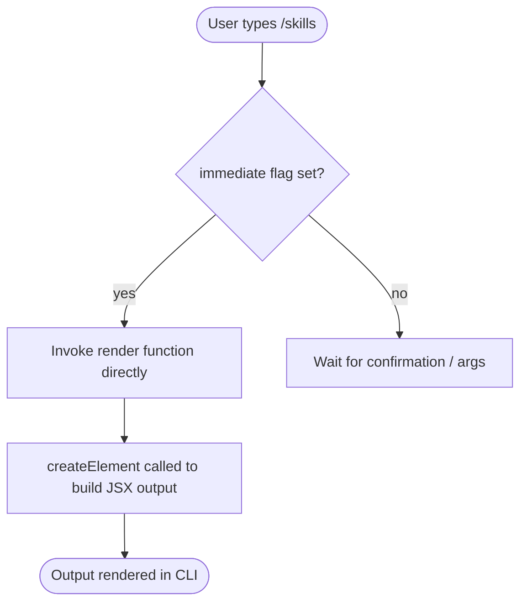

# `/skills`

> Analysis basis: CC v2.1.132 bundle.js (AST extraction + Claude interpretation)
> Minimum version: v2.1.132

---

## Overview

The `/skills` command is a local, immediately-executed slash command that lists the skills available to Claude Code in the current session. Its output is rendered as a JSX component directly in the CLI interface, requiring no additional user input or asynchronous operations to produce its result.

## Registration

| Field | Value |
|---|---|
| type | `local-jsx` |
| name | `skills` |
| description | `List available skills` |
| immediate | `true` |
| module_id | `b4q` |

Analysis basis: CC v2.1.132 bundle.js:+10970438

## Input Branching

Because `immediate: true` is set on this command's registration, the CLI executes the handler as soon as the user submits `/skills` without waiting for any additional arguments or confirmations. The call graph extracted at depth ≤ 2 shows a single rendering path with no conditional branches.



Analysis basis: CC v2.1.132 bundle.js:+10970300 (call edge to `OhA.createElement`), +10970438 (`immediate: true` field)

## Behavioral Spec

### Skill List Rendering

The entire output path of `/skills` resolves to a single JSX render function. There are no string literals, numeric constants, or telemetry events captured within the depth-2 traversal, which means the list of skills and their labels are assembled dynamically at render time rather than from hard-coded strings embedded adjacent to the command handler itself.

```
function renderSkillsOutput():
    skillList = collectAvailableSkills()   // source: runtime context
    element   = createElement(SkillListComponent, { skills: skillList })
    return element
```

Analysis basis: CC v2.1.132 bundle.js:+10970300

### Immediate Execution Contract

Commands registered with `immediate: true` bypass the standard argument-collection loop. The `/skills` handler therefore:

```
on userInput("/skills"):
    // No argument parsing step
    result = renderSkillsOutput()
    displayInline(result)
    // Execution complete — no follow-up prompt
```

Analysis basis: CC v2.1.132 bundle.js:+10970438

### Dynamic Skill Discovery

<!-- TODO: not found in depth-2 traversal; needs --depth 4 -->

The internal function that enumerates available skills (`collectAvailableSkills` in the pseudocode above) is not reachable within the depth-2 call graph. Its exact enumeration strategy — whether it reads from a registry, the session context, or a configuration object — cannot be verified from the current extraction.

## State & Side Effects

| Item | Detail |
|---|---|
| Telemetry | None detected within depth-2 traversal |
| Hook registration | None detected within depth-2 traversal |
| appState changes | None detected within depth-2 traversal |
| Sound | None detected within depth-2 traversal |
| Argument parsing | Skipped entirely (`immediate: true`) |
| Output mechanism | JSX element constructed via `createElement` and rendered inline |

## Version History

| Version | Change |
|---|---|
| v2.1.132 | Initial analysis |

## Common Mistakes

1. **Expecting argument support**: Because the command is flagged `immediate: true` and the depth-2 call graph contains no argument-parsing edges, passing additional text after `/skills` is unlikely to affect output. Users should not expect filtered or scoped skill listings via arguments without further verification.
2. **Assuming a static list**: The absence of string literals in the extracted data indicates the skill list is built dynamically at runtime. The displayed skills may vary by session context, loaded extensions, or project configuration — do not treat any observed list as exhaustive or fixed.
3. **Confusing type `local-jsx` with `local`**: The `local-jsx` type means the command returns a rendered React/JSX element rather than plain text. Tooling that expects plain-text output from local commands will not handle `/skills` output correctly.

## Appendix — Identifier Mapping

> For bundle debugging only. Identifiers change across versions.

| Identifier | Role |
|---|---|
| `O37` | Render function: constructs and returns the JSX element representing the skills list |