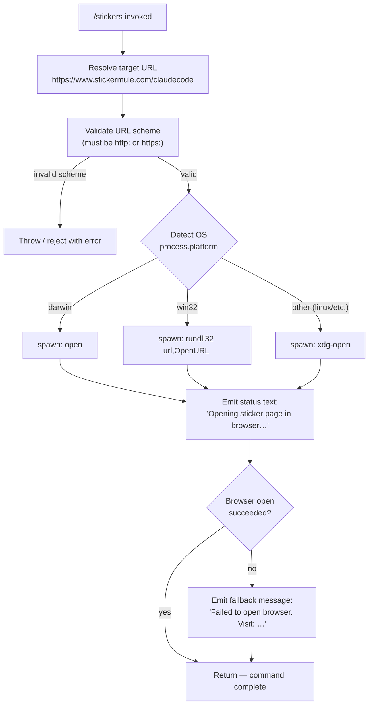

# `/stickers`

> Analysis basis: CC v2.1.132 bundle.js (AST extraction + Claude interpretation)
> Minimum version: v2.1.132

---

## Overview

`/stickers` is a local slash command that opens the Claude Code sticker ordering page (`https://www.stickermule.com/claudecode`) in the user's default system browser. It is a purely side-effect-oriented command: it invokes the platform-appropriate URL-open mechanism, emits a brief status message to the user, and exits immediately. No AI model call is made.

---

## Registration

| Field | Value |
|---|---|
| type | `local` |
| name | `stickers` |
| description | `Order Claude Code stickers` |
| supportsNonInteractive | `false` |
| module_id | `k$q` |
| load_inline | `true` |
| handler (Arbor) | `ED7` (AsyncFunction, resolved via `module_id` path) |
| `loc_byte_end` | `11306000` |
| `arbor_handler.name` | `ED7` |
| `arbor_handler.kind` | `AsyncFunction` |
| `arbor_handler.resolution_path` | `module_id` |
| `arbor_handler.fqn` | `claude-2.1.132::ED7` |
| `arbor_handler.n_hits` | `0` |

Analysis basis: CC v2.1.132 bundle.js:+11305840 – +11306000

---

## Input Branching

The command accepts no meaningful user-supplied arguments. Its branching is entirely determined by the **host operating system** and by whether the URL-open system call succeeds or fails.



Analysis basis: CC v2.1.132 bundle.js:+7355236, +7355286, +7355308, +7355558, +7355574, +7355658, +7355670, +7355732, +7355739, +11305576, +11305643, +11305714

---

## Behavioral Spec

### 1 — Handler entry point (`ED7`)

```
async function stickersCommandHandler(commandContext):
    targetUrl = "https://www.stickermule.com/claudecode"
    await openUrlInBrowser(targetUrl)
    // openUrlInBrowser defined below
```

Analysis basis: CC v2.1.132 bundle.js:+11305573, +11305576

---

### 2 — URL validation (`urlValidator` / `T04`)

Before any process is spawned, the URL scheme is checked against an allow-list.

```
function validateUrlScheme(url):
    parsed = new URL(url)
    if parsed.protocol not in ["http:", "https:"]:
        throw new Error("URL scheme not permitted")
    return parsed
```

Supported schemes: `"http:"` (bundle.js:+7355286) and `"https:"` (bundle.js:+7355308).  
Any other scheme causes an immediate rejection via `Promise.reject` (bundle.js:+983679).

Analysis basis: CC v2.1.132 bundle.js:+7355236, +7355286, +7355308

---

### 3 — Platform-aware browser open (`openUrl` / `LL` + `Y8`)

```
async function openUrlInBrowser(url):
    validateUrlScheme(url)           // throws on bad scheme
    platform = process.platform

    if platform == "darwin":
        command = "open"
        args    = [url]
    else if platform == "win32":
        command = "rundll32"
        args    = ["url,OpenURL", url]
    else:                            // linux, freebsd, etc.
        command = "xdg-open"
        args    = [url]

    result = await spawnProcess(command, args)
    return result
```

String constants used:
- `"darwin"` — macOS branch (bundle.js:+7355558)
- `"win32"` — Windows branch (bundle.js:+7355574)
- `"rundll32"` with argument `"url,OpenURL"` (bundle.js:+7355658, +7355670)
- `"open"` — macOS launcher (bundle.js:+7355732)
- `"xdg-open"` — Linux/other launcher (bundle.js:+7355739)

Analysis basis: CC v2.1.132 bundle.js:+7355523, +7355558, +7355574, +7355607

---

### 4 — Status message emission (`PA` / output layer)

Two user-visible string literals are emitted depending on outcome:

| Situation | Message |
|---|---|
| URL open attempted | `"Opening sticker page in browser…"` |
| Browser open failed | `"Failed to open browser. Visit: https://www.stickermule.com/claudecode"` |

The happy-path message is a `"text"`-typed output node (bundle.js:+11305630, +11305643).  
On failure the fallback message embeds the full URL so the user can copy it manually (bundle.js:+11305714).

Analysis basis: CC v2.1.132 bundle.js:+11305630, +11305643, +11305714

---

### 5 — Subprocess / process management layer (`rJH`, `Y`, `fH`)

The call graph reveals a subprocess-management subsystem reached through `PA → rJH`. Key behavioural facts visible at depth 2:

- A concurrency limit of **10** simultaneous child processes applies in this layer (bundle.js:+987899).
- A size/buffer cap of **1 000 000 bytes** (`1_000_000`) is enforced on subprocess output (bundle.js:+988421).
- The system uses a retry/back-off loop with a **2 000 ms** delay constant (bundle.js:+14129682), consistent with the background-spare-process pool seen in telemetry.
- `Promise.reject` is used for hard failures when the subprocess cannot be started (bundle.js:+983679).
- An error-level log entry is emitted via the internal logging system on subprocess failure (bundle.js:+911916, +911941).

```
// Simplified subprocess dispatch (pseudocode only)
async function spawnProcess(command, args):
    if activeProcessCount >= 10:
        await waitForSlot()
    child = spawn(command, args, {maxOutputBytes: 1_000_000})
    try:
        await child.completion
    catch err:
        logError("error", err)
        raise err
```

Analysis basis: CC v2.1.132 bundle.js:+987899, +988421, +983679, +911916, +911941

---

### 6 — Context / store access (`N6`, `Qv6`)

`Y8` reaches a store-access utility (`N6 → Qv6`) that calls `getStore()` on an AsyncLocalStorage-style context (bundle.js:+918237). This is the standard mechanism by which the command handler obtains the current session/app context — no special sticker-specific state is stored.

Analysis basis: CC v2.1.132 bundle.js:+988065, +918288, +918237

---

## State & Side Effects

| Item | Detail |
|---|---|
| Telemetry — `tengu_bg_spare_enable` | Fired within the background-process pool layer (`Y`) when a spare process slot is enabled (bundle.js:+14129457) |
| Telemetry — `tengu_bg_spare_spawn` | Fired when a spare background process is actually spawned (bundle.js:+14129749) |
| Browser process | Spawns one OS-level child process (`open` / `rundll32` / `xdg-open`) to open the sticker URL |
| appState changes | None detected at depth-2 traversal; the command does not mutate conversation or session state |
| Hook registration | None detected specific to this command |
| Sound | None detected |
| Non-interactive support | `false` — the command will not run in `--no-interactive` / headless mode |
| Return value | A text message node; no assistant model response is generated |

---

## Version History

| Version | Change |
|---|---|
| v2.1.132 | Initial analysis — command opens `https://www.stickermule.com/claudecode` via platform browser |

---

## Common Mistakes

1. **Running in non-interactive mode** — `supportsNonInteractive: false` means invoking `/stickers` in a headless or CI pipeline will be rejected or silently skipped. Use an interactive terminal session.
2. **Expecting a model response** — this command never calls the Claude model. Users should not wait for an AI reply; the only output is the short status text message.
3. **Firewall / sandbox environments** — if `open`, `rundll32`, or `xdg-open` are blocked, the fallback message is shown. The URL must then be visited manually: `https://www.stickermule.com/claudecode`.
4. **Passing arguments** — the command ignores any text typed after `/stickers`. The URL is hardcoded; no customisation is possible via arguments.
5. **Assuming cross-platform parity** — on Linux the command depends on `xdg-open` being present; minimal container images (Alpine, distroless) often omit it, causing the failure branch to fire.

---

## Appendix — Identifier Mapping

> For bundle debugging only. Identifiers change across versions.

| Identifier | Role |
|---|---|
| `ED7` | Main async handler for `/stickers`; entry point resolved via `module_id` path |
| `LL` | URL-open orchestrator; validates scheme then dispatches to OS launcher |
| `T04` | URL scheme validator; throws on non-http(s) protocols |
| `Y8` | Wrapper that combines browser-open with context/store retrieval |
| `PA` | Process-management facade; enforces concurrency limit and output-size cap |
| `rJH` | Low-level subprocess executor; handles spawn lifecycle, rejection, and error logging |
| `Y` | Background spare-process pool manager; fires `tengu_bg_spare_*` telemetry |
| `ujL` | Output stringification utility (uses `String()` coercion) |
| `fH` | Error-logging helper; pushes entries to internal log and calls `EQ.logError` |
| `N6` | Context accessor; delegates to store-retrieval layer |
| `Qv6` | AsyncLocalStorage `getStore()` wrapper for session context |
| `_A` | Auxiliary helper reached from context layer; role unclear at depth-2 traversal |

<!-- TODO: roles of lL_, hy8, Sy8, Cy8, eq_, VH6, yy8, hL_, tq_, HL_, aq_, sq_, Sq_, kL_, yH6, vL_, NL_, LL_, HA, yH, kq, $wL, kyH, ng, j6, s6, qFA, d not found in depth-2 traversal; needs --depth 4 -->