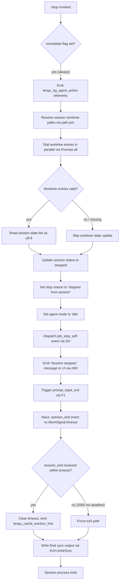

# `/stop`

> Analysis basis: CC v2.1.132 bundle.js (AST extraction + Claude interpretation)
> Minimum version: v2.1.132

---

## Overview

The `/stop` command terminates the current background session by transitioning its state to `"stopped"` and dispatching a self-directed stop job, while preserving both the session transcript and any associated worktree on disk. It executes immediately upon invocation (no confirmation prompt) and emits a single status message before triggering a graceful process-exit flow.

---

## Registration

| Field | Value |
|---|---|
| type | `local-jsx` |
| name | `stop` |
| description | `Stop this background session; transcript and worktree are kept` |
| immediate | `true` |
| module_id | `rJq` |

Analysis basis: CC v2.1.132 bundle.js:+11693574

---

## Input Branching

The command accepts no user-supplied arguments. Upon invocation the runtime routes through two sequential phases: a background-agent action dispatch, and a graceful session-exit sequence.



Analysis basis: CC v2.1.132 bundle.js:+11693293, +11693303, +11693071, +11693103, +11693123

---

## Behavioral Spec

### 1. Random Jitter Utility

Used internally by the jitter helper called early in the dispatch chain.

```
function computeJitter():
    base   = Math.random() * 2      # upper bound: literal 2
    offset = 1                       # additive constant: literal 1
    return base + offset
```

Analysis basis: CC v2.1.132 bundle.js:+12264283, +12264285, +12264299, +12264322

The result feeds a `setTimeout` delay, smoothing concurrent stop requests to avoid thundering-herd conditions on the daemon socket.

---

### 2. Background-Agent Action Dispatch

```
function dispatchBgAgentStop(sessionContext):
    emit telemetry("tengu_bg_agent_action", { action: "stop" })
    resolveWorktreePaths(sessionContext)        # uses NX.join
    updateSessionState(sessionContext)
```

Analysis basis: CC v2.1.132 bundle.js:+11692712, +11692710, +11692744

The string `"stop"` is passed as the action discriminator.
Analysis basis: CC v2.1.132 bundle.js:+11692744

---

### 3. Session Type Guard

Before mutating session state the implementation checks the session type field against the string `"bg"`.

```
function assertBackgroundSession(session):
    if session.type != "bg":
        return early             # no-op for non-background sessions
    proceed with stop logic
```

Analysis basis: CC v2.1.132 bundle.js:+2121117, +2121124

The daemon-facing label `"daemon"` is also present in this guard path, indicating that daemon-mode sessions share the same stop gate.
Analysis basis: CC v2.1.132 bundle.js:+2121183

---

### 4. Worktree State Resolution (`Jq`)

```
function resolveWorktreeState(sessionDir):
    fullPath   = NX.join(sessionDir, ...)       # path construction
    entries    = Promise.all(vX.stat(fullPath)) # parallel stat
    if entries[0].size == 0:                    # literal 0
        log warning "warn"
        return null
    rawText    = vX.readFile(fullPath, "utf-8") # literal "utf-8"
    parsed     = parseStateFile(rawText)        # internal parser (lRK / B6)
    if Number.isFinite(parsed.order):           # validates "order" field
        stateCache.set(key, parsed)             # bfH.set
    else:
        stateCache.delete(key)                  # bfH.delete
    if stateCache.size > 1000:                  # literal 1000
        stateCache.clear()                      # bfH.clear — eviction
    return parsed
```

Analysis basis: CC v2.1.132 bundle.js:+3875058, +3875143, +3875156, +3875223, +3875422, +3875556, +3875085, +3875106, +3875808, +3875863, +3875920, +3876020, +3876025

- Cache eviction threshold: **1000 entries** (bundle.js:+3876020)
- State file encoding: **utf-8** (bundle.js:+3875556)
- Validated fields: `"order"` (bundle.js:+3875085) and `"stateOrder"` (bundle.js:+3875106)

---

### 5. Session State Mutation (`eD8`)

```
function executeStop(session):
    worktreeState = resolveWorktreeState(session.dir)   # Jq
    sessionStatus = getActiveStatus()                    # tY → "active" check
    if sessionStatus == "active":
        session.status    = "stopped"                   # literal "stopped"
        session.stopReason = "stopped from session"     # literal
        session.agentMode  = "idle"                     # literal "idle"
    dispatchSelfStopJob(session)                         # Ju6
    showMessage("Session stopped.")                      # n9H, literal
    triggerExit()                                        # F1
```

Analysis basis: CC v2.1.132 bundle.js:+11692843, +11692856, +11692868, +11692885, +11692902, +11692931, +11693044, +11693071, +11693075

- Status value written: `"stopped"` (bundle.js:+11692885)
- Stop reason written: `"stopped from session"` (bundle.js:+11692902)
- Agent mode written: `"idle"` (bundle.js:+11692931)
- UI confirmation string: `"Session stopped."` (bundle.js:+11693075)

---

### 6. Active-Status Check (`tY`)

```
function isSessionActive(session):
    status = lookupSessionStatus(session)   # UE
    return status == "active"               # literal "active"
```

Analysis basis: CC v2.1.132 bundle.js:+3881163, +3881186

---

### 7. Self-Stop Job Dispatch (`SH`)

```
function dispatchSelfStopJob(session):
    emit telemetry("tengu_feature_ok", { job: "job_stop_self" })
    enqueueJob("job_stop_self", session)    # literal "job_stop_self"
```

Analysis basis: CC v2.1.132 bundle.js:+906459, +906461, +11693103, +11693106

---

### 8. Graceful Exit Sequence (`F1`)

```
function triggerGracefulExit(context):
    Promise.resolve()                        # start async chain
    scheduleCleanup(cK, L)                   # internal cleanup hooks
    delay = Math.max(5000, 3500)             # literals; effective floor 5000 ms
    timer = setTimeout(forceExit, delay)
    timer.unref()                            # h3H.unref — non-blocking
    waitSignal = ENH()                       # builds abort signal
    result = Promise.race([
        waitForEvent("session_end"),         # literal "session_end"
        AbortSignal.timeout(2000)            # literal 2000 ms hard deadline
    ])
    clearTimeout(timer)
    emit telemetry("tengu_cache_eviction_hint")
    finalize(yk, jo, $, O)
    sleep(500)                               # literal 500 ms final drain
    XUH.writeSync(finalOutput)               # synchronous last write
```

Analysis basis: CC v2.1.132 bundle.js:+5044176, +5044206, +5044219, +5044227, +5044244, +5044250, +5044256, +5044264, +5044273, +5044280, +5044289, +5044369, +5044393, +5044447, +5044458, +5044470, +5044518, +5044535, +5044571, +5044584, +5044596, +5044607, +5044644, +5044740, +5044783, +5044824, +5044870, +5044874, +5044880, +5044883, +5044920

- Graceful shutdown outer timeout: **5000 ms** (bundle.js:+5044273)
- Inner shutdown outer timeout: **3500 ms** (bundle.js:+5044280)
- `Promise.race` hard deadline: **2000 ms** (bundle.js:+5044458)
- Final drain sleep: **500 ms** (bundle.js:+5044883)
- The timer is unreffed so it does not keep the Node.js event loop alive if everything else resolves first.

---

### 9. Worktree Path Helpers (`jM`)

```
function buildWorktreePaths(baseDir):
    root      = getLocalYarnRoot()          # lY
    joined    = NX.join(root, baseDir)      # NX.join
    ref       = resolveRef(joined)          # RH
    workspace = resolveWorkspace(joined)    # YW
    return { ref, workspace }
```

Analysis basis: CC v2.1.132 bundle.js:+3874825, +3874828, +3874843, +3874857

---

### 10. Top-Level Command Handler (`I27`)

```
function stopCommandHandler(args, context):
    jitterDelay = computeJitter()              # H
    await sleep(jitterDelay)
    result = await executeStop(context)        # eD8
    emit telemetry("stop_command")             # literal "stop_command"
    return result
```

Analysis basis: CC v2.1.132 bundle.js:+11693293, +11693303, +11693307

The `"stop_command"` literal is emitted after `executeStop` returns, serving as a completion marker distinct from the in-flight `tengu_bg_agent_action` emitted inside `executeStop`.
Analysis basis: CC v2.1.132 bundle.js:+11693307

---

## State & Side Effects

| Item | Detail |
|---|---|
| Telemetry — `tengu_bg_agent_action` | Fired at entry to the stop dispatch with `action: "stop"` (bundle.js:+11692712) |
| Telemetry — `tengu_feature_ok` | Fired when `job_stop_self` is successfully enqueued (bundle.js:+906461) |
| Telemetry — `tengu_cache_eviction_hint` | Fired after `Promise.race` resolves during graceful exit (bundle.js:+5044609) |
| Telemetry — `stop_command` literal | Emitted as completion marker by the top-level handler (bundle.js:+11693307) |
| Session status field | Mutated to `"stopped"` (bundle.js:+11692885) |
| Session stop-reason field | Mutated to `"stopped from session"` (bundle.js:+11692902) |
| Agent mode field | Mutated to `"idle"` (bundle.js:+11692931) |
| Worktree on disk | **Preserved** — no deletion performed; paths are read/stat'd only |
| Transcript on disk | **Preserved** — per registration description (bundle.js:+11693574) |
| Worktree state cache (`bfH`) | May be evicted if entry count exceeds 1000 (bundle.js:+3876020) |
| Job queue | `job_stop_self` job enqueued for self-directed shutdown (bundle.js:+11693106) |
| Process exit | Triggered via graceful exit sequence with 2000 ms race deadline and 500 ms final drain (bundle.js:+5044458, +5044883) |
| Synchronous output flush | `XUH.writeSync` called as last action before process exits (bundle.js:+5044920) |
| Timer (unreffed) | A `setTimeout` of up to 5000 ms is set but unreffed so it does not block event-loop exit (bundle.js:+5044273, +5044289) |
| `prompt_input_exit` hook | Registered/triggered during exit sequence (bundle.js:+11693128) |

---

## Version History

| Version | Change |
|---|---|
| v2.1.132 | Initial analysis |

---

## Common Mistakes

1. **Invoking `/stop` outside a background session** — The type guard at bundle.js:+2121124 checks for `"bg"` session type. Running `/stop` in a foreground interactive session will silently no-op the state mutation path; no error is surfaced to the user.

2. **Expecting the worktree to be deleted** — The registration description explicitly states "transcript and worktree are kept." Users who want cleanup must remove the worktree manually after stopping.

3. **Relying on immediate process exit** — The graceful exit sequence involves up to a 2000 ms `Promise.race`, a 500 ms final drain, and an outer 5000 ms timer. Scripted callers that poll for process death should allow at least 5–6 seconds before treating non-exit as a hang.

4. **Calling `/stop` when session is not `"active"`** — If the `tY` active-status check (bundle.js:+3881186) returns false, the status/stopReason/agentMode fields are not mutated. The `job_stop_self` job is still dispatched, but downstream systems that depend on the `"stopped"` status value will not see it.

5. **Assuming no jitter** — The top-level handler applies a random jitter delay (`Math.random() * 2 + 1` ms range) before executing. Automated tests that assert timing-sensitive behavior immediately after `/stop` may encounter race conditions.

---

## Appendix — Identifier Mapping

> For bundle debugging only. Identifiers change across versions.

| Identifier | Role |
|---|---|
| `I27` | Top-level stop command handler; entry point registered under `"stop"` |
| `H` | Jitter delay utility; computes `Math.random()`-based sleep duration |
| `eD8` | Core stop execution function; orchestrates state mutation and exit |
| `d` | General-purpose logger / diagnostic utility (called from both `eD8` and `F1`) |
| `v6` | Session context accessor called early in `eD8` |
| `Z27` | Internal helper called during state setup in `eD8` |
| `G9` | Background-session type-guard; checks `"bg"` and `"daemon"` type strings |
| `Jq` | Worktree state resolver; performs path stat, file read, and cache management |
| `tY` | Active-status checker; returns true when session status equals `"active"` |
| `jM` | Worktree path builder; resolves `ref` and `workspace` paths via `NX.join` |
| `Ju6` | Self-stop job dispatcher; enqueues `job_stop_self` |
| `n9H` | UI message emitter; outputs `"Session stopped."` to the user |
| `SH` | Feature-telemetry wrapper; emits `tengu_feature_ok` on successful job enqueue |
| `F1` | Graceful exit sequence orchestrator; manages timeouts, `Promise.race`, and final sync write |