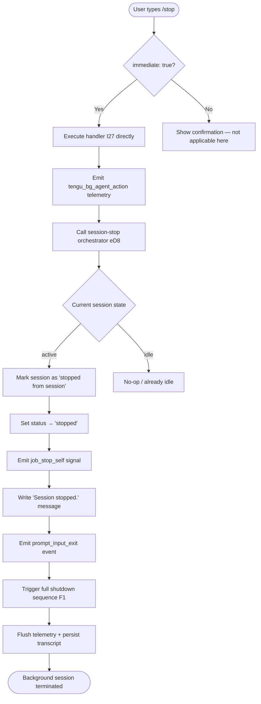

# `/stop`

> Analysis basis: CC v2.1.132 bundle.js (AST extraction + Claude interpretation)
> Minimum version: v2.1.132

---

## Overview

The `/stop` command terminates the current **background session** immediately, transitioning it to the `stopped` state while preserving both the conversation transcript and the associated worktree on disk. It is classified as `local-jsx`, meaning its execution is handled locally in the CLI process rather than being forwarded to the AI model as a prompt. The command fires a `tengu_bg_agent_action` telemetry event and emits a `job_stop_self` signal before initiating the full session-shutdown sequence.

---

## Registration

| Field | Value |
|---|---|
| `type` | `local-jsx` |
| `name` | `stop` |
| `description` | Stop this background session; transcript and worktree are kept |
| `immediate` | `true` |
| `module_id` | `rJq` |
| `load_inline` | `true` |
| `handler` | `I27` (AsyncFunction, resolved via `module_id` path) |
| `loc_byte_end` | `11693776` |
| `arbor_handler.name` | `I27` |
| `arbor_handler.kind` | `AsyncFunction` |
| `arbor_handler.resolution_path` | `module_id` |
| `arbor_handler.fqn` | `claude-2.1.132::I27` |
| `arbor_handler.n_hits` | `0` |

Analysis basis: CC v2.1.132 bundle.js:+11693574 – +11693776

---

## Input Branching

Because `immediate: true` is set, the command bypasses any confirmation prompt and executes the handler (`I27`) directly upon invocation. There are no user-supplied arguments processed by this command.



---

## Behavioral Spec

### 1. Handler Entry — `stopCommandHandler` (`I27`)

The top-level handler is an `AsyncFunction`. On invocation it:

1. Calls the random-delay utility (`H`) — uses `Math.random` and `setTimeout` — to introduce a small randomized jitter (bounded by values `1` and `2` found at bundle.js:+12264283 / +12264299) before proceeding. This prevents thundering-herd effects when multiple background sessions are stopped simultaneously.
2. Immediately delegates to the session-stop orchestrator (`eD8`).

```
async function stopCommandHandler():
    jitter = randomJitterDelay(min=1, max=2)   // H; loc +12264285/+12264322
    await wait(jitter)
    await sessionStopOrchestrator()            // eD8; loc +11693303
```

Analysis basis: CC v2.1.132 bundle.js:+11693293, +11693303

---

### 2. Session-Stop Orchestrator — `sessionStopOrchestrator` (`eD8`)

This is the core coordination function. It executes the following sequence:

```
async function sessionStopOrchestrator():
    emit telemetry("tengu_bg_agent_action")    // loc +11692712
    readSessionState()                         // d; loc +11692710
    resolveVersionInfo()                       // v6; loc +11692773
    lookupSessionRecord()                      // Z27; loc +11692786
    checkSessionMode()                         // G9 → Tr; loc +11692795
        // G9 checks mode strings: "bg", "daemon", "daemon-worker"
        // (loc +2121040, +2121050, +2121064)

    sessionFileMetadata = loadSessionMetadata()  // Jq; loc +11692843
        // Jq: path.join, Promise.all, fs.stat, readFile("utf-8"),
        //     sorts by "order"/"stateOrder" fields,
        //     uses cache (bfH.get/set/delete/clear),
        //     JSON.parse; loc +3875058–+3876025

    sessionStatus = getSessionStatus()          // tY → UE → RuH; loc +11692856
        // Recognises states: "done","success","failed","failure","stopped","active"
        // (loc +3881005–+3881186)

    if sessionStatus == "active":
        persistSessionRecord()                  // jM; loc +11692868
            // jM: path.join, JSON.stringify (RH), atomic write via lY
            //     (randomBytes hex token, writeFile "utf8", rename, copyFile,
            //      unlink); updates cache (YW → bfH.delete)
        updateStatusField("stopped from session")  // literal loc +11692902
        setSessionIdle("idle")                  // literal loc +11692931

    emitJobStopSelf()                           // Ju6; loc +11693044
        // sends "job_stop_self" control signal (loc +11693106)

    displayMessage("Session stopped.")          // n9H; literal loc +11693075

    emitFeatureOk()                             // SH → d; loc +11693103
        // fires tengu_feature_ok (loc +906461)
        // with label "prompt_input_exit" (loc +11693128)

    triggerShutdownSequence()                   // F1; loc +11693123
```

Analysis basis: CC v2.1.132 bundle.js:+11692710 – +11693123

---

### 3. Shutdown Sequence — `shutdownSequence` (`F1`)

`F1` is the general-purpose CLI exit/shutdown orchestrator invoked after the session stop signal has been emitted. It performs ordered teardown:

```
async function shutdownSequence():
    resolvePromise()                           // Promise.resolve; loc +5044176
    collectOpenHandles()                       // cK; loc +5044206
    renderShutdownUI()                         // L → K.map, f.padEnd; loc +5044219
        // K: closes UI streams (_.close, q.close), may call process.exit
        //    with label "spare_uncaught" (loc +14110289)
        // f: handles stream lifecycle

    setTimeout(gracePeriod)                    // loc +5044227
    flushOutput()                              // WUH; loc +5044244
        // WUH: XUH.writeSync, p4.get, H.unmount, mk, nc6
        //      nc6: bo.writeSync, saves terminal cursor (ESC-7/ESC-8
        //           at loc +3522762/+3522773), CE

    printSessionSummary()                      // X5A; loc +5044250
        // X5A: tT, vh, v6, Tf6 (log path stat via q.statSync),
        //      k$ (version check v6/hK),
        //      A.replaceAll (escapes "\\" and "\"" in paths,
        //           loc +5042758/+5042781),
        //      Cr1, XUH.writeSync, M6.dim

    forceExitIfNeeded()                        // P5A; loc +5044256
        // P5A: clearTimeout, p4.get, process.exit, process.kill("SIGKILL")
        //      (loc +5043097); throws Error("unreachable") (loc +5043120)

    shutdownTimeout = Math.max(5000, 3500)     // loc +5044273/+5044280
        // effectively 5000 ms outer, 3500 ms inner grace window

    h3H.unref()                                // unref timer; loc +5044289

    tearDownManagedProcesses()                 // ENH; loc +5044369
        // ENH: Promise.all, Array.from, H (jitter helper)

    Promise.race([shutdownTimeout, ...])       // loc +5044393

    supervisorShutdown()                       // D; loc +5044447
        // D: lDH (eYq.readFile supervisor config, qCA, vH, Z9, _CA,
        //         Object.keys, L.has),
        //    q.write, Hwq (Object.keys, Math.max, i3 column formatter),
        //    f.get, E.stop (remoteControlAtStartup), f.delete,
        //    I.stop / I.updateConfig / I.start,
        //    VQq (heartbeat, loc +14141709/+14141722),
        //    f.set, Z.start, d
        //    fires tengu_daemon_config_reload (loc +14143280)

    abortSignal = AbortSignal.timeout(2000)    // loc +5044535/+5044458

    flushStartupPerfData()                     // WsH; loc +5044571
        // WsH: SnA (perf marks, _.set/get, Object.entries, Math.round,
        //           fires tengu_startup_perf at loc +170315),
        //      hnA (SE6.join, l8, v6),
        //      SE6.dirname, F6, KE (atomic fsync write),
        //      VnA (checkpoint formatting, yE6, tg, _.join), k

    emitScrollSummary()                        // ft6; loc +5044584
        // ft6: tT, Rr1, d, Sr1 (Date.now, Math.max/round, Object.assign,
        //           yr1), r_
        //      fires tengu_scroll_summary (loc +5043828)
        // r_: determines rendering mode:
        //     "local-agent" (loc +3188394),
        //     fullscreen / default (loc +3188939/+3188965),
        //     detects tmux -CC / ConPTY (loc +3188549/+3188735)

    emitCacheEvictionHints()                   // soH; loc +5044596
        // fires tengu_cache_eviction_hint (loc +5044609)
        // emits "session_end" event (loc +5044644)

    persistFinalState()                        // d; loc +5044607
    Promise.all([...finalFlushes])             // loc +5044740

    yk()                                       // loc +5044783
    jo()                                       // loc +5044824

    backgroundSessionCleanup()                 // $; loc +5044870
        // $: mzq (Er, Date.now, lY atomic write, PX6, RH JSON.stringify)
        // label: "background session" (loc +14163925)

    renderExitCode()                           // O → Q8; loc +5044874
    waitForDrain()                             // o8; loc +5044880
        // o8: L, Error("aborted"/"abort"), q, setTimeout(500),
        //     O, clearTimeout, K.unref

    XUH.writeSync(finalNewline)                // loc +5044920
```

Analysis basis: CC v2.1.132 bundle.js:+5044176 – +5044920

---

### 4. Telemetry Emission Order

Events are emitted in the order the call graph resolves:

| # | Event | Emission Point | loc_byte |
|---|---|---|---|
| 1 | `tengu_bg_agent_action` | Entry of `sessionStopOrchestrator` | +11692712 |
| 2 | `tengu_feature_ok` | After "Session stopped." message, via `featureOk` helper | +906461 |
| 3 | `tengu_daemon_config_reload` | During supervisor teardown | +14143280 |
| 4 | `tengu_startup_perf` | During startup-perf flush | +170315 |
| 5 | `tengu_scroll_summary` | During scroll-summary emission | +5043828 |
| 6 | `tengu_pewter_brook` | Via rendering-mode detection (`r_`) | +3189030 |
| 7 | `tengu_cache_eviction_hint` | Cache eviction hint + "session_end" signal | +5044609 |

---

## State & Side Effects

| Item | Detail |
|---|---|
| **Telemetry events** | `tengu_bg_agent_action`, `tengu_feature_ok`, `tengu_daemon_config_reload`, `tengu_startup_perf`, `tengu_scroll_summary`, `tengu_pewter_brook`, `tengu_cache_eviction_hint` |
| **Session status transition** | `active` → `"stopped from session"` → `"idle"` (literals at +11692902, +11692931) |
| **Control signal emitted** | `job_stop_self` (literal at +11693106) |
| **User-visible message** | `"Session stopped."` printed to terminal (literal at +11693075) |
| **Transcript preservation** | Session transcript file is retained on disk; only the live process is stopped |
| **Worktree preservation** | Git worktree is not removed; confirmed by command description and absence of worktree-deletion calls in depth-2 graph |
| **Session record persistence** | Atomic write (randomBytes token → writeFile → rename) via `lY`; cache invalidated via `bfH` operations |
| **Supervisor lifecycle** | `I.stop`, `I.updateConfig`, `I.start` called during daemon reconfiguration; heartbeat loop stopped |
| **Process termination** | `process.exit` and `process.kill("SIGKILL")` available in `P5A` as last-resort exit path |
| **Timer management** | `setTimeout` / `clearTimeout` / `h3H.unref()` used for graceful shutdown windows (5000 ms outer, 3500 ms inner, 2000 ms AbortSignal timeout, 500 ms drain wait) |
| **Terminal state** | ESC-7 / ESC-8 cursor-save/restore sequences emitted by `nc6`; Ink React tree unmounted (`H.unmount`) |
| **Cache side effects** | `bfH` (session metadata cache) entries deleted and cleared during session cleanup |
| **Startup perf log** | Written atomically with fsync via `KE` if startup profiling was enabled |
| **Session-end event** | `"session_end"` string emitted (literal at +5044644) alongside cache eviction hints |
| **Sound** | <!-- TODO: not found in depth-2 traversal; needs --depth 4 --> |
| **Hook registration** | <!-- TODO: not found in depth-2 traversal; needs --depth 4 --> |

---

## Version History

| Version | Change |
|---|---|
| v2.1.132 | Initial analysis — `local-jsx`, `immediate: true`, handler `I27` via module `rJq` |

---

## Common Mistakes

1. **Confusing `/stop` with a model-side abort.** Because `type` is `local-jsx` and `immediate: true`, the command runs entirely in the CLI process. It does not send any prompt to the model and will not appear in the conversation transcript as a user turn.

2. **Expecting worktree deletion.** The description explicitly states "transcript and worktree are kept." Developers should not rely on `/stop` to clean up git worktrees — a separate cleanup command or manual `git worktree remove` is required.

3. **Running `/stop` outside a background session.** The command checks session mode flags (`"bg"`, `"daemon"`, `"daemon-worker"`). Invoking it in a standard interactive session may produce unexpected behavior or a no-op because the mode guards in `G9` will not match.

4. **Assuming instant termination.** The shutdown sequence (`F1`) includes multiple grace periods: a 5000 ms outer timeout, a 3500 ms inner window, a 2000 ms `AbortSignal.timeout`, and a 500 ms drain wait. The process may remain alive for several seconds after `/stop` is issued.

5. **Misreading session state after invocation.** The status transitions through `"stopped from session"` before settling. Any tooling that reads session state immediately after issuing `/stop` may observe the intermediate value rather than the final `"stopped"` state.

---

## Appendix — Identifier Mapping

> For bundle debugging only. Identifiers change across versions.

| Identifier | Role |
|---|---|
| `I27` | Top-level `/stop` command handler (AsyncFunction, entry point) |
| `H` | Random jitter delay utility (uses `Math.random` + `setTimeout`) |
| `eD8` | Session-stop orchestrator (main coordination function) |
| `d` | Application state reader / state accessor |
| `v6` | Version/config resolver |
| `Z27` | Session record lookup |
| `G9` | Session mode checker (`bg` / `daemon` / `daemon-worker`) |
| `Tr` | Mode classification helper called by `G9` |
| `Jq` | Session metadata file loader (stat, readFile, cache, JSON.parse) |
| `D8` | ENOENT error code handler |
| `j8` | Filesystem error helper |
| `k` | HTTP/request utility (used in metadata loading) |
| `Lsq` | Sub-request handler inside `k` |
| `RH` | JSON serializer (`JSON.stringify` wrapper) |
| `A` | String/path utility |
| `mf` | Path manipulation helper (lastIndexOf, slice, replace) |
| `gNH` | Logging/debug helper |
| `Msq` | HTTP write/buffer utility (Buffer.byteLength, ZE6.then, fsq.bind, N1) |
| `B6` | JSON parser (`JSON.parse` wrapper) |
| `tY` | Session status resolver |
| `UE` | Status normalizer |
| `RuH` | Raw status string classifier |
| `jM` | Session record persistence (atomic write + cache invalidation) |
| `lY` | Atomic file write (randomBytes token, writeFile, rename, copyFile, unlink) |
| `YW` | Cache invalidation helper (`bfH.delete`) |
| `Ju6` | Job-stop-self signal emitter |
| `n9H` | "Session stopped." message display |
| `SH` | Feature-ok emitter (fires `tengu_feature_ok`) |
| `F1` | Full CLI shutdown/exit sequence orchestrator |
| `L` | UI handle collector / shutdown renderer |
| `K` | Stream/process lifecycle manager (`_.close`, `q.close`, `process.exit`) |
| `f` | Stream lifecycle object |
| `WUH` | Output flush + Ink unmount helper |
| `mk` | Unmount helper called by `WUH` |
| `nc6` | Terminal cursor save/restore (ESC-7/ESC-8) + final write |
| `yH` | String coercion utility |
| `X5A` | Session summary printer (path escaping, dim styling, writeSync) |
| `tT` | Terminal/TTY handle |
| `vh` | Terminal width/height accessor |
| `Tf6` | Log file path stat checker |
| `k$` | Version compatibility checker |
| `Cr1` | Summary formatter |
| `P5A` | Force-exit handler (clearTimeout, process.exit, SIGKILL) |
| `ENH` | Managed-process teardown (Promise.all + Array.from) |
| `D` | Supervisor shutdown orchestrator |
| `lDH` | Supervisor config reader (eYq.readFile, qCA, vH, Z9, _CA) |
| `q` | Process/stream write handle |
| `Hwq` | Column-width formatter (Object.keys, Math.max, i3) |
| `E` | Remote-control stop handler (`remoteControlAtStartup`) |
| `I` | Daemon lifecycle object (stop / updateConfig / start) |
| `VQq` | Heartbeat loop manager |
| `Z` | Secondary process start wrapper |
| `WsH` | Startup-perf flush + atomic write orchestrator |
| `SnA` | Perf mark recorder (_.set/get, Object.entries, Math.round, `tengu_startup_perf`) |
| `hnA` | Perf file path builder |
| `F6` | Directory ensure/mkdir helper |
| `KE` | Atomic fsync file writer (openSync, writeFileSync, fsyncSync, closeSync) |
| `VnA` | Checkpoint table formatter |
| `ft6` | Scroll summary emitter (`tengu_scroll_summary`) |
| `Rr1` | Scroll state accessor |
| `Sr1` | Scroll metrics calculator (Date.now, Math.max/round, Object.assign) |
| `r_` | Rendering mode detector (local-agent, fullscreen, tmux-CC, ConPTY) |
| `soH` | Cache eviction hint emitter (`tengu_cache_eviction_hint`, `session_end`) |
| `$` | Background session final cleanup (mzq → atomic write) |
| `mzq` | Session metadata finalizer (Er, Date.now, lY, PX6, RH) |
| `O` | Exit-code renderer |
| `Q8` | Exit code resolver for background session |
| `o8` | Output drain waiter (setTimeout 500 ms, clearTimeout, K.unref) |