# `/team-onboarding`

> Analysis basis: CC v2.1.132 bundle.js (AST extraction + Claude interpretation)
> Minimum version: v2.1.132

---

## Overview

`/team-onboarding` is a `prompt`-type slash command that reads the invoking user's local Claude Code session transcripts, derives a usage-data summary, and instructs the agent to co-author a ready-to-share `ONBOARDING.md` guide for teammates who are new to Claude Code. The command collects transcript data, formats it into a structured context block, and dispatches it via `getPromptForCommand` — the handler that lives as an inline `ObjectMethod` on the registration object (resolved directly by Arbor; `resolution_path: direct`).

---

## Registration

| Field | Value |
|---|---|
| type | `prompt` |
| name | `team-onboarding` |
| description | `Help teammates ramp on Claude Code with a guide from your usage` |
| isHidden | `false` |
| handler_method | `getPromptForCommand` |
| handler_method_start (byte) | 11631901 |
| handler_method_end (byte) | 11632557 |
| loc_byte | 11631563 |
| loc_byte_end | 11632558 |
| loc_line | 7784 |
| arbor_handler.name | `getPromptForCommand` |
| arbor_handler.fqn | `claude-2.1.132::getPromptForCommand` |
| arbor_handler.kind | `Method` |
| arbor_handler.resolution_path | `direct` |
| prompt_body length | 4539 characters |
| `handler_method_start` | `11631901` |
| `handler_method_end` | `11632557` |
| `prompt_body.length` | `4539` chars |
| `prompt_body.trace` | `identifier→$ (local→1 ext vars)` |
| `arbor_handler.n_hits` | `2` |

Analysis basis: CC v2.1.132 bundle.js:+11631563

---

## Input Branching

The handler executes a fixed pipeline with no user-supplied argument branching. All decision points are internal (data presence checks, numeric clamping, template substitution). The flowchart below captures every fork identified in the call graph.

```mermaid
flowchart TD
    A(["/team-onboarding invoked"]) --> B["Emit tengu_team_onboarding_invoked\n(+11632161)"]
    B --> C["Clamp look-back window\nMath.min / Math.max / Math.floor\ndefault ceiling = 365 days (+11632150)"]
    C --> D["collectUsageData — read transcript directory\n(ewq at +11622952)"]
    D --> E{".jsonl files found?"}
    E -- "none" --> F["USAGE_DATA = empty / zero-session object"]
    E -- "found" --> G["Parse each file: split lines,\nmatchAll for MCP calls (+11620976),\nexec PR-number regex (+11621239 +11621295),\nexec content-block regex (+11621470)"]
    G --> H["Build sessionDescriptors array\n(title, prNumbers, firstMessage,\ntoolCounts, mcpCounts)"]
    H --> I["readMcpConfig — load .mcp.json\n(ZP7 at +11623069)"]
    F --> I
    I --> J{".mcp.json readable?"}
    J -- "no / ENOENT" --> K["mcpServers = empty"]
    J -- "yes" --> L["Parse JSON, extract mcpServers block\n(key: 'mcpServers' +11622686)"]
    L --> M["resolveGitContext — run git commands\n(PA at +11623250)"]
    K --> M
    M --> N["git config user.name (+11623269)\ngit remote get-url origin (+11623344)"]
    N --> O["resolveCurrentRepo — basename of cwd\n(uD8.basename +11623441)"]
    O --> P["Build template variable map:\n{{WINDOW_DAYS}}, {{USAGE_DATA}},\n{{GUIDE_TEMPLATE}}"]
    P --> Q["A.replaceAll for each placeholder\n(+11632294)"]
    Q --> R["Emit tengu_flint_harbor_prompt\n(+11631938)"]
    R --> S["Dispatch filled prompt to agent\nvia getPromptForCommand"]
    S --> T["Agent produces ONBOARDING.md draft\n+ Review questions (turn 1)"]
    T --> U{Guide creator responds}
    U -- "provides team name / tips / task" --> V["Agent updates ONBOARDING.md,\nwrites file, emits completion line"]
    U -- "no further input" --> W["File left as draft"]
    V --> X["Emit tengu_team_onboarding_generated\n(+11632426)"]
    W --> X
```



Analysis basis: CC v2.1.132 bundle.js:+11631907 (handler entry), +11632104 (Math clamps), +11632285 (collectUsageData call), +11632403 (harborShare call)

---

## Behavioral Spec

### 1. Invocation & Telemetry Gate

```
function handleTeamOnboarding(appContext):
    emit("tengu_team_onboarding_invoked")          // +11632161
    windowDays = clampWindow(appContext.windowDays) // see §2
    usageData  = collectUsageData(windowDays)       // see §3
    mcpConfig  = readMcpConfig(appContext.cwd)      // see §4
    gitCtx     = resolveGitContext(appContext.cwd)  // see §5
    currentRepo = resolveCurrentRepo(appContext.cwd)
    prompt = buildPrompt(windowDays, usageData, mcpConfig, gitCtx, currentRepo)
    emit("tengu_flint_harbor_prompt")               // +11631938
    dispatchToAgent(prompt)
    // agent turn executes; upon completion:
    emit("tengu_team_onboarding_generated")         // +11632426
```

Analysis basis: CC v2.1.132 bundle.js:+11631907

---

### 2. Window Clamping

The look-back period passed to the usage scanner is clamped to a safe integer range. The upper bound constant extracted from the bundle is **365 days**.

```
function clampWindow(rawDays):
    // raw value comes from app state or default
    floored = Math.floor(rawDays)               // +11632122
    bounded = Math.max(1, floored)              // +11632113
    return  Math.min(365, bounded)              // +11632104, +11632150
```

Maximum look-back window: **365 days** (bundle.js:+11632150)

---

### 3. Usage Data Collection (`collectUsageData`)

Reads the user's local Claude Code project transcript store. Transcript files are stored as newline-delimited JSON (`*.jsonl`). The scanner is capped to files modified within the clamped window using a timestamp derived from `Date.now()` minus the window in milliseconds (hours × minutes × seconds × 1000, constants: 24, 60, 1000 at +11620404–11620413).

```
async function collectUsageData(windowDays):
    cutoffMs = Date.now() - windowDays * 24 * 60 * 60 * 1000  // +11620391–11620413
    projectsDir = resolveProjectsDir()                         // via $Z / k0 / myH.join
    entries = await readdir(projectsDir)                        // WiH.readdir +11620432
    jsonlFiles = entries
        .filter(name => extname(name) == ".jsonl")             // +11620502, +11620519
    statResults = await Promise.all(                           // +11620538
        jsonlFiles.map(f => stat(join(projectsDir, f)))        // +11620573, +11620603
    )
    inWindowFiles = jsonlFiles.filter((_, i) =>
        statResults[i].isFile() &&
        statResults[i].mtimeMs >= cutoffMs
    )

    sessions = []
    for file in inWindowFiles:
        raw = await readFile(file)                             // WiH.readFile +11620775
        lines = raw.split("\n")                                // $.split +11620889
        // filter to at most 10 lines per file                 // +11620915
        mcpMatches  = raw.matchAll(MCP_NAME_PATTERN)          // z.matchAll +11620976
            // pattern anchored to '"name":"mcp__'            // literal +11621098
        prMatches   = PR_REGEX.exec(raw)                      // PP7.exec +11621239
        contentMatches = CONTENT_REGEX.exec(raw)              // GP7.exec +11621470
            // pattern anchored to '"content":['             // literal +11621448
        firstMsg = extractFirstUserMessage(lines)              // Y.startsWith +11621555
            // startsWith check; slice to 3 chars for type   // Number +11621319, +11621551
        sessions.push({
            title:          deriveTitle(file),
            prNumbers:      prMatches ? parseNumbers(prMatches) : [],
            firstMessage:   firstMsg,
            toolCounts:     countTools(contentMatches),
            mcpCounts:      countMcpCalls(mcpMatches),
        })
    return buildUsagePayload(sessions)
```

Analysis basis: CC v2.1.132 bundle.js:+11622952 (ewq entry)

---

### 4. MCP Configuration Reading (`readMcpConfig`)

```
async function readMcpConfig(cwd):
    configPath = join(cwd, ".mcp.json")               // uD8.join +11622619, literal +11622630
    try:
        raw = await readFile(configPath, "utf8")      // AJq.readFile +11622606, +11622643
        parsed = jsonParse(raw)                        // B6 → JSON.parse +11622653
        return parsed["mcpServers"] ?? {}              // key literal +11622686
    catch:
        return {}                                      // ENOENT or parse error → empty
```

Analysis basis: CC v2.1.132 bundle.js:+11623069 (ZP7 entry)

---

### 5. Git Context Resolution (`resolveGitContext`)

Runs two `git` subprocesses to populate author name and remote origin URL. Both calls use the process-execution helper (`PA` / `rJH`) with a 1 000 000 byte output cap (bundle.js:+988421).

```
async function resolveGitContext(cwd):
    nameResult   = await runProcess("git", ["config", "user.name"], cwd)
        // literals: "git" +11623253, "config" +11623260, "user.name" +11623269
    originResult = await runProcess("git", ["remote", "get-url", "origin"], cwd)
        // literals: "remote" +11623325, "get-url" +11623334, "origin" +11623344
    return {
        authorName:  nameResult.stdout.trim()   // tJH → H.trim +1002357
        remoteOrigin: originResult.stdout.trim()
        // URL parsed for host/path via tJH → A.match +1002390
        // git/ prefix stripped via K.slice +1002635
    }
```

Analysis basis: CC v2.1.132 bundle.js:+11623250 (PA entry), +11623433 (tJH — git-URL parser)

---

### 6. Prompt Template Assembly (`buildPrompt`)

Three template placeholders are replaced via `String.replaceAll` in a single pass over the prompt body:

| Placeholder | Replaced With | Literal Location |
|---|---|---|
| `{{WINDOW_DAYS}}` | Clamped integer day count | bundle.js:+11632307 |
| `{{USAGE_DATA}}` | JSON-serialised session-descriptor array | bundle.js:+11632382 |
| `{{GUIDE_TEMPLATE}}` | Markdown guide skeleton (static string from bundle) | bundle.js:+11632347 |

```
function buildPrompt(windowDays, usageData, mcpConfig, gitCtx, currentRepo):
    base = PROMPT_BODY_CONSTANT               // resolved via identifier → $
    filled = base
        .replaceAll("{{WINDOW_DAYS}}", String(windowDays))   // +11632294, +11632325
        .replaceAll("{{USAGE_DATA}}",  JSON.stringify(usageData))
        .replaceAll("{{GUIDE_TEMPLATE}}", GUIDE_TEMPLATE_CONSTANT)
    return filled
```

Analysis basis: CC v2.1.132 bundle.js:+11632294 (A.replaceAll), +11632325 (String cast)

---

### 7. Agent Instruction Summary

The assembled prompt instructs the agent to execute a five-step sequence (grounded in the `getPromptForCommand` body; no verbatim quotation):

**Step 1 — Immediate acknowledgment.** The very first visible output must be a single acknowledgment line referencing the window length (e.g., "Looking at how you've used Claude over the last N days…"). No tool calls, no classification reasoning, no thinking blocks may precede this line.

**Step 2 — Work-type breakdown.** Each entry in `sessionDescriptors` is classified into one of seven canonical task-type labels (`build_feature`, `debug_fix`, `improve_quality`, `analyze_data`, `plan_design`, `prototype`, `write_docs`). The agent picks the top 3–5 by frequency and assigns rough percentages. Labels are rendered in title-case with spaces in the output (e.g., "Build Feature"). A new category may be introduced only when none of the seven applies. If no sessions exist, the breakdown section is left as a `TODO`.

**Step 3 — Context assembly.** The agent identifies relevant repositories (starting from `currentRepo`, checking sibling directories), and describes each MCP server entry by inferring its purpose from `name` and optional `urlOrigin`. Team Tips and Get Started sections are left as `TODO` placeholders pending review answers.

**Step 4 — Write `ONBOARDING.md`.** The agent fills the guide template with real numbers from the usage payload (not placeholder text). The author's display name comes from `generatedBy`; omitted if absent. ASCII bar charts use `█` (filled) and `░` (empty) at 20 characters wide. An HTML comment instruction at the bottom of the template is preserved verbatim.

**Step 5 — Render and close turn 1.** The draft guide is rendered inside a fenced code block. A `---` horizontal rule and `**Review**` heading separate it from three numbered questions: (1) team-name confirmation, (2) optional starter task link, (3) team tips not already in `CLAUDE.md`. After the guide creator replies, the agent updates `ONBOARDING.md`, writes the file, and outputs the fixed closing line (not paraphrased). Subsequent edits from the guide creator are applied to the file.

Analysis basis: CC v2.1.132 bundle.js:+11631901–11632557 (getPromptForCommand method span)

---

### 8. Harbor Share Integration

After the prompt is dispatched, a second call (`U78` at +11632403) reaches the "flint harbor share" subsystem (`tengu_flint_harbor_share` at +8869971). This path reuses the session-dispatch helper (`j6`) indicating the generated guide may optionally be surfaced through a shared session or workspace channel.

```
function maybeHarborShare(sessionContext, guideOutput):
    // calls U78 → kq → j6
    // emits tengu_flint_harbor_share (+8869971)
    // conditional on session sharing being enabled
```

Analysis basis: CC v2.1.132 bundle.js:+11632403 (U78 call), +8869971 (telemetry)

---

## State & Side Effects

| Item | Detail |
|---|---|
| Telemetry: invocation | `tengu_team_onboarding_invoked` (+11632161) — fired on every invocation before data collection |
| Telemetry: prompt dispatch | `tengu_flint_harbor_prompt` (+11631938) — fired immediately before the assembled prompt is sent to the agent |
| Telemetry: guide generated | `tengu_team_onboarding_generated` (+11632426) — fired after the agent completes guide generation |
| Telemetry: harbor share | `tengu_flint_harbor_share` (+8869971) — fired if guide is surfaced via shared-session subsystem |
| Telemetry: config parse error | `tengu_config_parse_error` (+3107927) — fired if the config subsystem encounters a malformed file during handler setup |
| Telemetry: feature flags | `tengu_feature_ok` (+906461) / `tengu_feature_bad` (+906517) — fired by feature-flag check helper |
| Telemetry: background session | `tengu_bg_spare_enable` (+14130767), `tengu_bg_spare_claim` (+14130886), `tengu_bg_spare_claim_fail` (+14131149), `tengu_bg_spare_spawn` (+14129749), `tengu_bg_dispatch_sigkill_escalate` (+14129972) — background session pool events (shared infrastructure, not command-specific) |
| Telemetry: daemon | `tengu_daemon_control` (+14164048) — daemon lifecycle event (shared infrastructure) |
| Telemetry: growthbook | `growthbook_experiment` (literal +3079712) — A/B experiment event via shared experiment subsystem |
| File write | Agent writes `ONBOARDING.md` in the current working directory during turn 2 |
| File read | Scanner reads `*.jsonl` files under the projects transcript directory (async, read-only) |
| File read | `.mcp.json` read from `cwd` (async, read-only) |
| Git subprocess | Two `git` subprocesses: `git config user.name` and `git remote get-url origin` |
| Config backup dir | Config subsystem maintains a `backups/` subdirectory (literal +3106858) |
| appState changes | None identified in depth-2 traversal beyond standard session dispatch |
| Sound | <!-- TODO: not found in depth-2 traversal; needs --depth 4 --> |
| Hook registration | <!-- TODO: not found in depth-2 traversal; needs --depth 4 --> |

---

## Version History

| Version | Change |
|---|---|
| v2.1.132 | Initial analysis; command confirmed present as non-hidden `prompt`-type registration at bundle.js:+11631563 |

---

## Common Mistakes

1. **Expecting output before the acknowledgment line.** The prompt explicitly forbids any reasoning, tool call, or classification output before the single acknowledgment line. Integrations that intercept the first streamed token should not assume it is a greeting or tool-call initiation.

2. **Providing no transcripts.** If the local Claude Code transcript directory is empty or all files fall outside the look-back window, the `sessionDescriptors` array is empty. The agent is instructed to leave the work-type breakdown as a `TODO` rather than hallucinating usage data — callers should not treat a `TODO` breakdown as an error.

3. **Expecting the closing line to be paraphrasable.** The prompt mandates an exact, fixed closing line after the file is written. Any downstream parsing that matches this line should use an exact-string comparison, not a semantic heuristic.

4. **Assuming `.mcp.json` is always present.** The MCP config reader silently returns an empty object on `ENOENT` or parse failure. Missing MCP server descriptions in the guide are therefore expected and not an error condition.

5. **Confusing look-back window with session count.** The 365-day upper bound is a time-window clamp, not a session count limit. Large repositories with many sessions within the window are all included in `sessionDescriptors`; the agent is given the full array.

6. **Running the command outside a Git repository.** The `git config user.name` and `git remote get-url origin` subprocesses will fail gracefully, but the resulting `generatedBy` and remote-URL fields will be absent. The agent omits the name rather than substituting a placeholder.

7. **Modifying `ONBOARDING.md` before the closing line.** The agent writes the file and immediately emits the exact closing line. Any external process that watches the file should wait for that line before treating the write as final, since a subsequent review round may trigger additional writes.

---

## Appendix — Identifier Mapping

> For bundle debugging only. Identifiers change across versions.

| Identifier | Role |
|---|---|
| `__handler_team-onboarding` | Synthetic BFS entry point for the registration's inline `getPromptForCommand` method |
| `j6` | Session-dispatch helper; routes the assembled prompt into the active agent session |
| `hq6` | Sub-helper called by session dispatcher (role not fully resolved at depth 2) |
| `Rq6` | Sub-helper called by session dispatcher (role not fully resolved at depth 2) |
| `Oo` | String coercion / normalization utility used during dispatch |
| `yH` | Primitive-to-string converter (calls `String`) |
| `Mo` | Model/session context accessor |
| `Yx` | Inner model resolver (calls `rjK`, `YH6`) |
| `uQ6` | Deduplication guard for session dispatch (checks `Kt8` set, `V5H` map) |
| `Lt8` | Session-creation helper; generates UUID, emits experiment event, calls `fo.emit` |
| `rPH` | First-party classification helper (literal `"firstParty"`) |
| `hU` | Random-bytes token generator (32 bytes hex) |
| `RH` | JSON serializer wrapper (`JSON.stringify`) |
| `BXK` | Post-session-creation callback |
| `Dt8` | Session-state updater after dispatch |
| `U41` | Dependency accessor used by session-state updater |
| `uA` | Utility called during state update (`ub`) |
| `EJ1` | Sub-step in session-state update |
| `jyH` | Feature-flag / allowlist check (`aDL.has`) |
| `R6` | Config file loader (reads and parses config, handles backups) |
| `F6` | Config path resolver |
| `Et8` | Config schema validator |
| `k5H` | Core config-read implementation (reads UTF-8 file, handles `ENOENT`, copies backups) |
| `q` | Node `fs` sync namespace proxy (used for `readFileSync`, `statSync`, `mkdirSync`, etc.) |
| `B6` | JSON parse wrapper |
| `Fh` | String prefix-strip utility (`startsWith` / `slice`) |
| `A` | Filesystem abstraction (async; `readdirStringSync`, `statSync`) |
| `j8` | Internal logging / debug emitter |
| `bJ1` | Sibling-repo directory scanner (reads parent dir, checks prefixes, `statSync`) |
| `k` | Log-level formatter (handles `debug`, uppercase, trim) |
| `fH` | Error-logging helper (`EQ.logError`, pushes to `kyH`) |
| `d` | App-state accessor (central state store getter) |
| `kt8` | Backup directory path builder (`join` + `"backups"` literal) |
| `w` | Daemon / background-process manager (spawn, kill, SIGKILL escalation) |
| `DPK` | Config file watcher (`lQ6.watchFile` / `unwatchFile`) |
| `Wd` | Watcher debounce / event handler |
| `N1` | Observer-set manager (`J08.add` / `J08.delete`, `Object.assign`) |
| `IP7` | Top-level usage-data pipeline orchestrator (calls `ewq`, `ZP7`, `PA`, `TP7`) |
| `_A` | Pre-flight check before data collection |
| `k0` | Projects-directory path resolver (calls `$Z`, `GO`) |
| `$Z` | Base projects path builder (`myH.join`, `l8`) |
| `GO` | Path segment replacer (`H.replace`, `A.slice`, `lwL`) |
| `H` | General-purpose utility / string helper (context-dependent; also used as process namespace) |
| `lwL` | Absolute-value + variant selector (`Math.abs`, `VyH`) |
| `ewq` | Async transcript scanner (reads `.jsonl` files, parses sessions, extracts descriptors) |
| `T9` | Internal async task wrapper |
| `L` | Padding / formatting helper (`f.padEnd`, `K.map`) |
| `K` | Process environment / exit wrapper |
| `f` | File descriptor / stream close helper |
| `O` | `stat` result wrapper (`isFile` check) |
| `Q8` | Stat-result constructor |
| `$` | Prompt-body constant holder (external variable referenced by `identifier→$` trace) |
| `mzq` | Transcript-entry parser (calls `Er`, `lY`, `PX6`, `RH`) |
| `z` | Background-session stop controller (`SH`, `mH`, `Jx`, `pC`) |
| `SH` | Stop-signal sender (calls `d`) |
| `mH` | Stop-state mutator (calls `d`) |
| `Jx` | Stop-completion handler (calls `Mo`, `rPH`, `qt8`) |
| `pC` | Stop race / timeout coordinator (`Promise.race`, `Promise.all`, 500 ms constant) |
| `Y` | Background-session lifecycle manager (spawn, dispose, wait loop, 2000 ms constant) |
| `qFA` | Daemon spare-session spawner (`Bun.spawn`, `--bg-pty-host`, `--bg-spare` flags) |
| `ZP7` | MCP config reader (reads `.mcp.json`, parses `mcpServers`) |
| `D8` | Async result unwrapper |
| `TP7` | Post-collection transform / trimmer |
| `PA` | Git-context resolver (runs `git config user.name` and `git remote get-url origin`) |
| `rJH` | Process-execution engine (timeout, kill, stream piping, 1 000 000 byte cap) |
| `lL_` | Argument list builder for subprocess |
| `hy8` | Stdin pipe helper |
| `Sy8` | Stdout pipe helper |
| `Cy8` | Stderr pipe helper |
| `eq_` | Numeric validation (`Number.isFinite`, throws `TypeError`) |
| `VH6` | Subprocess result parser (`iJL`, error on failure, `Boolean` exit check) |
| `yy8` | `Reflect.apply` / property-definition helper |
| `hL_` | Process exit-event listener (`H.on("exit")`) |
| `tq_` | Timeout wrapper (`setTimeout`, `clearTimeout`, `Promise.race`) |
| `HL_` | Subprocess kill helper (`H.kill`, `q.finally`) |
| `aq_` | Stdout data accumulator |
| `sq_` | SIGKILL escalation handler (`H.kill`) |
| `kL_` | Promise.all stream-drain coordinator |
| `yH6` | Output post-processor (`$y8`) |
| `vL_` | Stream pipe connector (`_.pipe`, `ON6`) |
| `NL_` | Writable-stream adapter (`ZL_.default`, `_.add`) |
| `LL_` | Bound stream-writer factory (`Wy8.bind`) |
| `ujL` | String coercion for git output |
| `tJH` | Git URL normalizer (trim, match, strip `git/` prefix, lowercase) |
| `KXL` | URL host extractor (calls `a9`) |
| `a9` | Index-of / slice URL parser |
| `U78` | Harbor-share dispatcher (calls `kq`, `E_`, `j6`; emits `tengu_flint_harbor_share`) |
| `kq` | Harbor session accessor (calls `h1_`) |
| `h1_` | Harbor state reader (calls `yH`) |