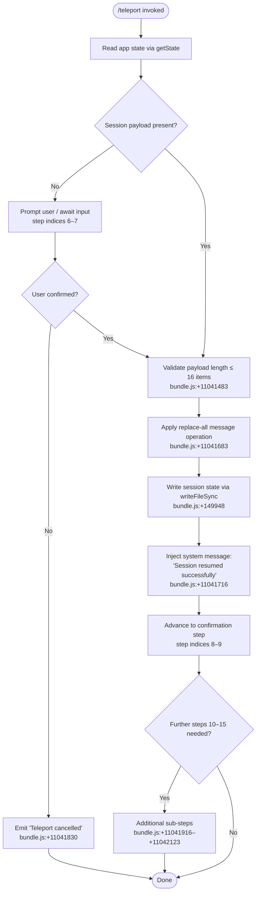

# `/teleport`

> Analysis basis: CC v2.1.132 bundle.js (AST extraction + Claude interpretation)
> Minimum version: v2.1.132

---

## Overview

The `/teleport` command (alias `/tp`) resumes a Claude Code session that was previously initiated or handed off from claude.ai. It works by ingesting a serialized session payload, replaying the message history into the current conversation via a `replace-all` message operation, and injecting a system-level confirmation message. If the user cancels at any prompt during the flow, the operation is cleanly aborted with a "Teleport cancelled" notification.

---

## Registration

| Field | Value |
|---|---|
| type | `local-jsx` |
| name | `teleport` |
| aliases | `["tp"]` |
| description | `Resume a Claude Code session from claude.ai` |
| isHidden | `null` (not hidden) |
| module\_id | `x7q` |
| load\_inline | `true` |
| handler ident | `g37` (resolved via `module_id` path) |
| handler kind | `AsyncFunction` |
| `loc_byte_end` | `11042601` |
| `arbor_handler.name` | `g37` |
| `arbor_handler.kind` | `AsyncFunction` |
| `arbor_handler.resolution_path` | `module_id` |
| `arbor_handler.fqn` | `claude-2.1.132::g37` |
| `arbor_handler.n_hits` | `1` |

Analysis basis: CC v2.1.132 bundle.js:+11042337 – +11042601

---

## Input Branching

The handler is an async function that drives a multi-step state machine. State transitions are tracked by integer step indices (0–16) stored in a `useState` hook, suggesting a React-rendered interactive wizard inside the CLI pane.



---

## Behavioral Spec

### Handler Entry Point

The real handler is the async function resolved as `g37` (Arbor resolution path: `module_id` → `x7q` → `g37`). The synthetic BFS entry `b7q` in the call graph is an internal bookkeeping alias and is not a real export.

```
async function teleportHandler(commandInput):
    appState  = readAppState()           // L.getState  bundle.js:+11041545
    uiContext = requireAppStateContext() // HK → N8A    bundle.js:+11041512

    if uiContext is missing:
        raise ReferenceError(
            "useAppState/useSetAppState cannot be called outside of..."
        )                                // bundle.js:+3581474

    [stepIndex, setStepIndex] = useState(0)  // bundle.js:+11041612

    return runSessionWizard(appState, stepIndex, setStepIndex, commandInput)
```

Analysis basis: CC v2.1.132 bundle.js:+11041477

---

### Session Wizard State Machine

The wizard advances through integer step indices. Key transitions observed from literals:

| Step range | Semantic meaning |
|---|---|
| 0 | Initial / idle state |
| 6–7 | Awaiting user confirmation / payload input |
| 8–9 | Post-apply confirmation display |
| 10–14 | Ancillary sub-steps (cleanup, file writes, exit paths) |
| 15 | Final `localCommand` classification step |
| 16 | Maximum item count / payload size guard |

```
function runSessionWizard(appState, step, setStep, input):

    // Guard: payload must not exceed 16 items
    if payloadItemCount(input) > 16:          // bundle.js:+11041483
        abort()

    match step:
        case 0:
            advance to step 6                 // bundle.js:+11041635

        case 6:
            render confirmation prompt
        case 7:
            if user cancelled:
                emitMessage("Teleport cancelled", role="system")
                                              // bundle.js:+11041830
                return
            advance to step 8                 // bundle.js:+11041784

        case 8:
            applyMessageOperation(
                opType = "replace-all",       // bundle.js:+11041683
                messages = deserializePayload(input)
            )                                 // bundle.js:+11041660
            advance to step 9                 // bundle.js:+11041814

        case 9:
            emitMessage(
                "Session resumed successfully",// bundle.js:+11041716
                role = "system"               // bundle.js:+11041756
            )
            advance to step 10

        case 10 .. 14:
            runAncillarySubSteps()            // bundle.js:+11041916–+11041984

        case 15:
            classifyAs("localCommand")        // bundle.js:+11042080
            finalize()                        // bundle.js:+11042123
```

Analysis basis: CC v2.1.132 bundle.js:+11041612

---

### Message History Replacement

The core side effect is a `replace-all` operation applied to the active conversation's message list. This operation is not additive — it replaces the entire visible message history with the payload received from claude.ai.

```
function applySessionReplay(messagePayload):
    op = buildMessageOp(
        type    = "replace-all",    // bundle.js:+11041683
        content = messagePayload
    )
    conversation.applyMessageOp(op) // bundle.js:+11041660
```

Analysis basis: CC v2.1.132 bundle.js:+11041660

---

### Session State Persistence

After replaying messages, the handler persists derived state to the filesystem. This involves path joining and a synchronous file write, typical of Claude Code's session-resume checkpoint pattern.

```
function persistSessionState(state, targetPath):
    fullPath = pathJoin(baseDir, targetPath)  // bundle.js:+149966
    writeFileSync(fullPath, serialize(state)) // bundle.js:+149948
```

If a stale or conflicting session file exists, it is removed before the write:

```
function cleanupStaleSession(filePath):
    unlinkSync(filePath)   // bundle.js:+14110155
```

Analysis basis: CC v2.1.132 bundle.js:+149948

---

### Terminal / Process Exit Path

Under certain error conditions (e.g., an uncaught spare error classified as `"spare_uncaught"`), the handler invokes `process.exit(1)` after writing a state file. This mirrors Claude Code's broader crash-recovery pattern.

```
function handleUncaughtSpare(error):
    writeStateFile(error, tag="spare_uncaught") // bundle.js:+14110289
    process.exit(1)                             // bundle.js:+14110307, value=1 at +14110320
```

Analysis basis: CC v2.1.132 bundle.js:+14110289

---

### Display Formatting

Session list entries rendered in the wizard pane are padded to a fixed width of 40 characters using two-space separators, maintaining alignment in the terminal UI.

```
function formatSessionEntry(label, detail):
    paddedLabel = label.padEnd(40)  // bundle.js:+14154022, width=40
    return paddedLabel + "  " + detail  // separator bundle.js:+14152051
```

Analysis basis: CC v2.1.132 bundle.js:+14152030

---

## State & Side Effects

| Item | Detail |
|---|---|
| Telemetry | None detected in depth-2 traversal |
| React state | `useState` hook manages step index (0–16); drives wizard progression (bundle.js:+11041612) |
| App state read | `L.getState` reads global app state at invocation (bundle.js:+11041545) |
| Message history | Replaced wholesale via `replace-all` op on `applyMessageOp` (bundle.js:+11041660, +11041683) |
| Filesystem write | Session state written synchronously via `writeFileSync` (bundle.js:+149948) |
| Filesystem delete | Stale session file removed via `unlinkSync` before write (bundle.js:+14110155) |
| Process exit | `process.exit(1)` triggered on `spare_uncaught` error path (bundle.js:+14110307) |
| System messages emitted | `"Session resumed successfully"` (bundle.js:+11041716); `"Teleport cancelled"` (bundle.js:+11041830) |
| Session classification | Marked as `"localCommand"` at step 15 (bundle.js:+11042080) |
| Context guard | Throws `ReferenceError` if called outside `<AppStateProvider />` (bundle.js:+3581474) |

---

## Version History

| Version | Change |
|---|---|
| v2.1.132 | Initial analysis — `replace-all` replay, 16-step wizard, filesystem persistence confirmed |

---

## Common Mistakes

1. **Running `/teleport` outside a valid session context** — the command requires an active `<AppStateProvider />` context. Invoking it in an environment that lacks this provider raises a `ReferenceError` immediately (bundle.js:+3581474).
2. **Passing a payload with more than 16 message items** — the handler enforces a hard item count ceiling of 16 (bundle.js:+11041483). Payloads exceeding this limit will be rejected before any state mutation occurs.
3. **Expecting an additive merge** — `/teleport` performs a full `replace-all` of the message history, not an append. Any locally typed messages not present in the claude.ai payload will be lost after teleportation.
4. **Assuming idempotency on repeated invocation** — each invocation unconditionally deletes any existing session file via `unlinkSync` before re-writing it (bundle.js:+14110155). Running `/teleport` twice in the same session may destroy the first checkpoint.
5. **Using `/tp` and expecting different behavior** — `tp` is a registered alias and is functionally identical to `/teleport` in all respects (registration bundle.js:+11042337).

---

## Appendix — Identifier Mapping

> For bundle debugging only. Identifiers change across versions.

| Identifier | Role |
|---|---|
| `g37` | Main async handler for `/teleport` (Arbor-resolved via `module_id` path) |
| `b7q` | BFS synthetic entry / internal call-graph alias for the handler |
| `HK` | App-state context accessor hook |
| `N8A` | Inner context guard — validates `<AppStateProvider />` presence; raises `ReferenceError` if absent |
| `L` | Session list manager; calls `K.map` to iterate sessions |
| `K` | Per-session operation unit — handles file deletion, state write, and `process.exit` |
| `q` | Low-level file removal utility (`unlinkSync` wrapper) |
| `vH` | String coercion helper (wraps `String()`) |
| `AZ` | File persistence helper (`writeFileSync` + path `join`) |
| `f` | Terminal/pane close coordinator; delegates to `K` for session ops |
| `_` | Case-normalization helper (`toLowerCase`) used in display formatting |