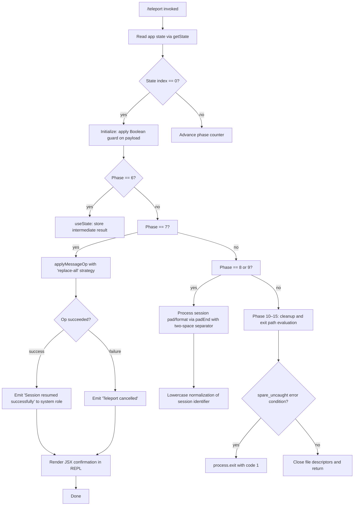

# `/teleport`

> Analysis basis: CC v2.1.132 bundle.js (AST extraction + Claude interpretation)
> Minimum version: v2.1.132

---

## Overview

`/teleport` (alias: `/tp`) is a local JSX slash command that resumes a Claude Code session originally initiated from claude.ai. It reads incoming session payload data, applies a full message-state replacement to the active conversation, and either confirms success with the message "Session resumed successfully" or cancels with "Teleport cancelled" depending on validation outcome.

---

## Registration

| Field | Value |
|---|---|
| type | `local-jsx` |
| name | `teleport` |
| description | Resume a Claude Code session from claude.ai |
| aliases | `["tp"]` |
| module_id | `x7q` |

Analysis basis: CC v2.1.132 bundle.js:+11042337

---

## Input Branching

The command implementation follows a multi-stage state machine. The integer literals `6` through `15` found in the implementation (Analysis basis: CC v2.1.132 bundle.js:+11041635 through +11042123) indicate an explicit numeric phase/step enumeration driving a reducer or generator-style async flow. The branching logic is summarized below.



Analysis basis: CC v2.1.132 bundle.js:+11041477, +11041524, +11041635, +11041645, +11041683, +11041716, +11041830, +11041916 through +11041984, +14110289, +14110307

---

## Behavioral Spec

### Phase Dispatch (State Machine Entry)

```
function teleportCommandEntrypoint(input):
    appState = globalStore.getState()           // L.getState
    if appState.phaseIndex == 0:
        payload = Boolean(input.sessionData)   // guard: non-empty check
        advancePhase(appState, payload)
    else:
        dispatchPhase(appState.phaseIndex, input)
```

Analysis basis: CC v2.1.132 bundle.js:+11041537, +11041545

---

### App State Context Guard

```
function requireAppStateContext():
    ctx = ReactContext.useContext(AppStateContext)
    if ctx is undefined or null:
        raise ReferenceError(
            "useAppState/useSetAppState cannot be called outside of an <AppStateProvider />"
        )
    return ctx
```

This guard is invoked during render to ensure the command's JSX component is mounted inside a valid `<AppStateProvider />` tree. If the context is missing, a `ReferenceError` is thrown immediately.

Analysis basis: CC v2.1.132 bundle.js:+3581427, +3581459, +3581474, +3581737

---

### Session Payload Ingestion (Phase 6–7)

```
function ingestSessionPayload(phase, sessionData):
    if phase == 6:
        [storedPayload, setStoredPayload] = useState(sessionData)  // rj6.useState
        return storedPayload

    if phase == 7:
        op = buildMessageOp(
            strategy = "replace-all",          // literal: "replace-all"
            payload  = storedPayload
        )
        result = messageStore.applyMessageOp(op)
        return result
```

- The `replace-all` strategy (Analysis basis: CC v2.1.132 bundle.js:+11041683) indicates the entire conversation message list is replaced, not merged, when teleporting in a session from claude.ai.
- Phase indices `6` and `7` mark, respectively, the local-state capture step and the store-write step.

Analysis basis: CC v2.1.132 bundle.js:+11041612, +11041635, +11041645, +11041660, +11041683

---

### Success / Cancellation Notification (Phase 8–9)

```
function emitTeleportOutcome(succeeded):
    if succeeded:
        appendSystemMessage(
            role    = "system",                // literal: "system"
            content = "Session resumed successfully"
        )
        renderJSXConfirmation()
    else:
        appendSystemMessage(
            role    = "system",
            content = "Teleport cancelled"
        )
```

- The `"system"` role literal places these messages in the conversation as system-level notices rather than assistant or user turns.
- Phase `8` maps to the success branch; phase `9` maps to the cancellation branch.

Analysis basis: CC v2.1.132 bundle.js:+11041716, +11041756, +11041784, +11041814, +11041830

---

### Session Identifier Formatting (Phase 10–13)

```
function formatSessionIdentifier(rawId):
    // Pad the identifier string to a fixed display width,
    // separating fields with a two-space separator ("  ")
    padded = rawId.padEnd(targetWidth, "  ")

    // Normalize to lowercase for comparison or storage
    normalized = padded.toLowerCase()

    // Width cap applied at 40 characters
    return normalized[:40]
```

- Two-space separator literal: `"  "` (Analysis basis: CC v2.1.132 bundle.js:+14152051)
- Maximum display width enforced at **40 characters** (Analysis basis: CC v2.1.132 bundle.js:+14154022)
- Phase indices `10`, `11`, `12`, `13` govern the sequential formatting sub-steps.

Analysis basis: CC v2.1.132 bundle.js:+11041916, +11041924, +11041962, +11041973, +14152030, +14152051, +14153948, +14154022

---

### Local-Command Finalizer (Phase 14–15)

```
function localCommandFinalizer(phase, context):
    if phase == 14:
        tag = "localCommand"                  // literal: "localCommand"
        markCommandComplete(tag, context)

    if phase == 15:
        // Final cleanup; command exits render loop
        unlinkSyncIfNeeded(tempFile)          // tgq.unlinkSync
        closeHandles()                        // _.close, q.close
```

- The literal `"localCommand"` (Analysis basis: CC v2.1.132 bundle.js:+11042080) is used as a command-type tag during finalization, consistent with the `type: local-jsx` registration.
- Phase `15` is the terminal phase; it performs file handle cleanup before the command returns.

Analysis basis: CC v2.1.132 bundle.js:+11041984, +11042080, +11042123, +14110155, +14139791, +14139801

---

### Error / Uncaught Exception Path

```
function handleUncaughtError(error, context):
    tag = "spare_uncaught"                    // literal
    logError(tag, error, context)

    // Map session worker processes
    workerList = sessionWorkerStore.map(workerRecord => ...)

    // Force exit
    process.exit(1)
```

- The `"spare_uncaught"` tag (Analysis basis: CC v2.1.132 bundle.js:+14110289) is applied to errors that escape the normal phase dispatch, indicating an unhandled exception in the teleport session worker.
- `process.exit` is called with code `1` in this path.

Analysis basis: CC v2.1.132 bundle.js:+14110218, +14110276, +14110286, +14110289, +14110307, +14110320

---

## State & Side Effects

| Item | Detail |
|---|---|
| Telemetry | None detected in depth-2 traversal (`telemetry: []`) |
| Hook registration | `rj6.useState` used to hold intermediate session payload across render cycles (Analysis basis: CC v2.1.132 bundle.js:+11041612) |
| appState changes | `L.getState` read on entry; phase index advanced through values `0` → `6` → `7` → `8`/`9` → `10`–`13` → `14` → `15` (Analysis basis: CC v2.1.132 bundle.js:+11041545) |
| Message store mutation | `applyMessageOp` with strategy `"replace-all"` replaces all conversation messages (Analysis basis: CC v2.1.132 bundle.js:+11041660, +11041683) |
| System messages emitted | `"Session resumed successfully"` or `"Teleport cancelled"` appended with role `"system"` (Analysis basis: CC v2.1.132 bundle.js:+11041716, +11041830) |
| File I/O | `tgq.unlinkSync` may delete a temporary file during finalization (Analysis basis: CC v2.1.132 bundle.js:+14110155) |
| File descriptors | `_.close` and `q.close` called during phase-15 cleanup (Analysis basis: CC v2.1.132 bundle.js:+14139791, +14139801) |
| Process exit | `process.exit(1)` invoked only on `spare_uncaught` error path (Analysis basis: CC v2.1.132 bundle.js:+14110307) |
| Sound | <!-- TODO: not found in depth-2 traversal; needs --depth 4 --> |

---

## Version History

| Version | Change |
|---|---|
| v2.1.132 | Initial analysis; command registered as `local-jsx` with alias `tp`; 15-phase state machine; `replace-all` message strategy confirmed |

---

## Common Mistakes

1. **Invoking `/teleport` without a valid claude.ai session payload** — The Boolean guard at phase 0 will evaluate the payload as falsy and the command will advance to the cancellation branch, emitting "Teleport cancelled" without performing any message replacement.

2. **Calling `/teleport` outside an `<AppStateProvider />` context** — The `requireAppStateContext` guard will throw a `ReferenceError` immediately, preventing any phase from executing. This is an internal wiring error; end users should not see it under normal CLI conditions.

3. **Expecting a merge instead of a full replace** — The `replace-all` strategy completely overwrites the local conversation message list. Any messages composed locally before issuing `/teleport` will be lost once the teleport succeeds.

4. **Using `/tp` alias expecting different behavior** — `/tp` is registered as a simple alias for `/teleport` and follows exactly the same code path; no behavioral difference exists between the two invocation forms.

5. **Assuming telemetry is emitted** — Unlike most other CC commands, `/teleport` emits no `tengu_*` telemetry events in v2.1.132. Monitoring pipelines that rely on telemetry to detect session-resume events will not receive signals from this command.

---

## Appendix — Identifier Mapping

> For bundle debugging only. Identifiers change across versions.

| Identifier | Role |
|---|---|
| `g37` | Module-level export wrapper for the teleport command module |
| `b7q` | Primary teleport command component / phase-dispatch function |
| `HK` | App-state hook accessor (calls into context layer) |
| `N8A` | Context retrieval utility; enforces `<AppStateProvider />` guard |
| `L` | Session worker store; exposes `getState` and `map` over worker records |
| `K` | Session worker record constructor / lifecycle manager; calls `process.exit` on fatal error |
| `f` | File/stream handle manager; exposes `padEnd` formatting and `close` |
| `q` | Message store / operation dispatcher; exposes `applyMessageOp` and `close` |
| `_` | String utility / identifier normalizer; exposes `toLowerCase` and `close` |