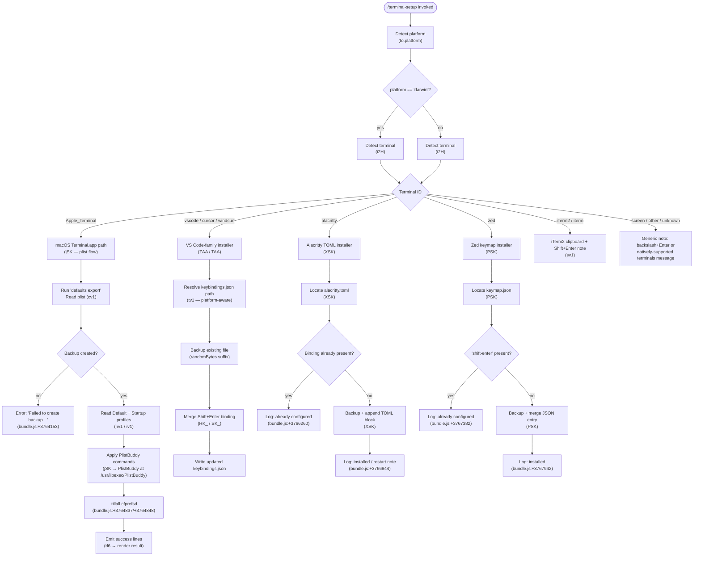

# `/terminal-setup`

> Analysis basis: CC v2.1.132 bundle.js (AST extraction + Claude interpretation)
> Minimum version: v2.1.132

---

## Overview

`/terminal-setup` detects the user's current terminal emulator and installs a Shift+Enter key binding that sends a newline escape sequence, allowing multi-line input without submitting a prompt. On macOS with Apple Terminal, the command additionally configures the terminal preferences plist directly (enabling Option-as-Meta and switching to a visual bell). On VS Code-family editors, Alacritty, and Zed it edits the respective JSON/TOML configuration files.

---

## Registration

| Field | Value |
|---|---|
| type | `local-jsx` |
| name | `terminal-setup` |
| description | `Install Shift+Enter key binding for newlines` |
| module_id | `ev1` |
| load_inline | `true` |
| isHidden | `null` (visible in the slash-command menu) |
| handler | `JSK` (AsyncFunction; resolved via `module_id` path) |
| `loc_byte_end` | `11055361` |
| `arbor_handler.name` | `JSK` |
| `arbor_handler.kind` | `AsyncFunction` |
| `arbor_handler.resolution_path` | `module_id` |
| `arbor_handler.fqn` | `claude-2.1.132::JSK` |
| `arbor_handler.n_hits` | `1` |

Analysis basis: CC v2.1.132 bundle.js:+11054823 – +11055361

---

## Input Branching

The main handler (`JSK`) first reads `process.platform` and the active terminal identifier, then dispatches to a per-terminal installer. The platform and terminal detection helper (`i2H`) maps environment variables and process ancestry to one of several symbolic terminal names.



Analysis basis: CC v2.1.132 bundle.js:+3758609 (platform check), +3756673 (terminal detection dispatch)

---

## Behavioral Spec

### 1. Terminal Detection (`terminalDetect` / `i2H`)

```
function terminalDetect():
    platform = process.platform          // "darwin", "win32", etc.
    termProgram = env.TERM_PROGRAM       // e.g. "Apple_Terminal", "vscode"
    checkForRemoteServerDirs():          // inspects home dir for
        // .vscode-server, .cursor-server, .windsurf-server markers
    if remoteServer detected:
        return corresponding IDE terminal name
    return termProgram or best-guess string
```

Recognized terminal literals (bundle.js:+3756689 – +3756846):
- `"darwin"` — macOS platform gate
- `"Apple_Terminal"` — macOS Terminal.app
- `"vscode"` — VS Code integrated terminal
- `"cursor"` — Cursor editor
- `"windsurf"` — Windsurf editor
- `"alacritty"` — Alacritty terminal
- `"zed"` — Zed editor

Remote-server directory markers (bundle.js:+3756261 – +3756321):
- `.vscode-server`
- `.cursor-server`
- `.windsurf-server`

Analysis basis: CC v2.1.132 bundle.js:+3756673

---

### 2. Apple Terminal.app Installer (`appleTerminalInstaller` / `jSK`)

```
async function appleTerminalInstaller():
    // Step 1: Export current preferences to a temp plist
    prefPath = buildPrefPath()          // ~/Library/Preferences/com.apple.Terminal.plist
    backupOk = createPlistBackup(prefPath)   // cv1
    if not backupOk:
        throw Error("Failed to create backup of Terminal.app preferences, bailing out")
        // bundle.js:+3764153

    // Step 2: Read default and startup profile names
    defaultProfile = readPlistKey("Default Window Settings")
                     // bundle.js:+3764291
    if not defaultProfile:
        throw Error("Failed to read default Terminal.app profile")
        // bundle.js:+3764351

    startupProfile = readPlistKey("Startup Window Settings")
                     // bundle.js:+3764468
    if not startupProfile:
        throw Error("Failed to read startup Terminal.app profile")
        // bundle.js:+3764528

    // Step 3: Apply PlistBuddy commands to each profile
    profiles = unique([defaultProfile, startupProfile])
    successFlags = []
    for profile in profiles:
        result = runPlistBuddy(prefPath, profile)   // nv1 / iv1
        // PlistBuddy binary: /usr/libexec/PlistBuddy (bundle.js:+3763396)
        if result.ok:
            successFlags.push(result)

    if successFlags is empty:
        throw Error("Failed to enable Option as Meta key or disable audio bell for any Terminal.app profile")
        // bundle.js:+3764738

    // Step 4: Flush prefs daemon
    exec("killall", "cfprefsd")         // bundle.js:+3764837, +3764848

    // Step 5: Report configured items
    lines = ["Configured Terminal.app settings:"]   // bundle.js:+3764890
    if optionMetaEnabled:
        lines.push('- Enabled "Use Option as Meta key"')  // bundle.js:+3764957
    if visualBellEnabled:
        lines.push("- Switched to visual bell")           // bundle.js:+3765019
    lines.push("Shift+Return will now enter a newline.")  // bundle.js:+3765064
    // or for Option+Enter path:
    // "Option+Enter will now enter a newline."           // bundle.js:+3765113
    lines.push("You must restart Terminal.app for changes to take effect.")
                                                          // bundle.js:+3765198
    return formatOutput(lines)
```

#### Plist path construction (`buildPrefPath` / `ZuH`)

Joins `os.homedir()` with path segments `"Library"`, `"Preferences"`, `"com.apple.Terminal.plist"`.

Analysis basis: CC v2.1.132 bundle.js:+3753732, +3753742, +3753756

#### Plist export (`exportPlist` / `cv1`)

Calls `defaults export com.apple.Terminal <tmpfile>` (bundle.js:+3753855, +3753867, +3753876), then `fs.stat` to confirm the file exists (bundle.js:+3753932).

#### Backup creation (`createBackup` / `cl6`)

1. Invokes `buildMenuEntry` (`YSK`) to record backup metadata via the global config writer (`R6`).
2. Stats the target path to confirm presence.
3. Marks status as `"no_backup"` (bundle.js:+3754139) on failure, `"import"` / `"failed"` / `"restored"` on transitions (bundle.js:+3754291, +3754348, +3754425).

Analysis basis: CC v2.1.132 bundle.js:+3754113

#### PlistBuddy profile editor (`editProfile` / `nv1` and `editStartupProfile` / `iv1`)

Both helpers call `/usr/libexec/PlistBuddy` (bundle.js:+3763396) with `-c` flag (bundle.js:+3763423) to set key-value pairs inside the named profile dictionary. On error they throw with the profile name embedded.

Analysis basis: CC v2.1.132 bundle.js:+3763393, +3763772

---

### 3. VS Code-Family Installer (`vscodeInstaller` / `ZAA` and `ZAA` variant `TAA`)

```
async function vscodeInstaller(editorName):
    // "VSCode" literal at bundle.js:+3761487
    // "warning" emitted if remote-server context detected (bundle.js:+3761520)

    keybindingsPath = resolveKeybindingsPath()   // tv1
    // Platform-specific resolution:
    //   win32  → %APPDATA%\Code\User\keybindings.json  (bundle.js:+3760211..3760249)
    //   darwin → ~/Library/Application Support/Code/User/keybindings.json
    //                                                    (bundle.js:+3760300)
    //   linux  → ~/.config/Code/User/keybindings.json   (bundle.js:+3760340)
    // Cursor and Windsurf substitute their own app-data folder names.

    mkdir(dirname(keybindingsPath), {recursive: true})
    existing = readFile(keybindingsPath) or "[]"    // bundle.js:+3762236

    parsed = parseJSON(existing)                     // Xh8 → T9

    // The binding to insert:
    newBinding = {
        key:     "shift+enter",                      // bundle.js:+3762622
        command: "workbench.action.terminal.sendSequence",  // bundle.js:+3762644
        args:    { text: "\x1b\r" },                 // bundle.js:+3762696
        when:    "terminalFocus"                      // bundle.js:+3762711
    }

    // Duplicate check + merge (RK_ for ZAA, SK_ for TAA)
    if binding already present:
        return "already configured" message
    else:
        backupFile = keybindingsPath + "." + randomHex + ".bak"
        copyFile(keybindingsPath → backupFile)        // JK6.randomBytes
        updated = insertBinding(parsed, newBinding)   // RK_ / SK_
        writeFile(keybindingsPath, JSON.stringify(updated, null, 2), "utf-8")
        // bundle.js:+3763122 / +3761226

    report success or failure via logOutput (fH)
```

`TAA` handles the `settings.json` flow for a separate VS Code setting path, resolving to `settings.json` (bundle.js:+3760512) and defaulting to `{}` (bundle.js:+3760539).

Analysis basis: CC v2.1.132 bundle.js:+3761502, +3762154, +3762263, +3762354

---

### 4. Alacritty Installer (`alacrittyInstaller` / `XSK`)

```
async function alacrittyInstaller():
    // Config search paths pushed to candidate list (_.push at bundle.js:+3765729)
    // File name: "alacritty.toml" (bundle.js:+3765758)
    // Resolved under os.homedir() on macOS/Linux (to.homedir, to.platform)

    configPath = findFirstExistingPath(candidates)
    if not configPath:
        throw Error("No valid config path found for Alacritty")
        // bundle.js:+3766119

    content = readFile(configPath)

    // Idempotency check:
    if content.includes('mods = "Shift"') and content.includes('key = "Return"'):
        // bundle.js:+3766187, +3766217
        log("Alacritty Shift+Enter key binding already configured")
        // bundle.js:+3766260
        return

    colorize output (M6.dim at bundle.js:+3766323)
    linkify paths (mS at bundle.js:+3766337)

    backupPath = configPath + "." + randomHex + ".bak"
    try:
        copyFile(configPath → backupPath)   // JK6.randomBytes at bundle.js:+3766359
    catch:
        throw Error("Error backing up existing Alacritty config. Bailing out.")
        // bundle.js:+3766470

    // Append TOML block for the binding
    if configPath.endsWith(...):            // K.endsWith at bundle.js:+3766672
        mkdir(dirname(configPath), {recursive: true})
    writeFile(configPath, updatedContent)   // bundle.js:+3766788

    log("Installed Alacritty Shift+Enter key binding")   // bundle.js:+3766844
    log("You may need to restart Alacritty for changes to take effect")
    // bundle.js:+3766914

    on error:
        log("Failed to install Alacritty Shift+Enter key binding")
        // bundle.js:+3767042
```

Analysis basis: CC v2.1.132 bundle.js:+3765729, +3765736, +3766006

---

### 5. Zed Installer (`zedInstaller` / `PSK`)

```
async function zedInstaller():
    keymapPath = path.join(os.homedir(), ..., "keymap.json")
    // "keymap.json" literal at bundle.js:+3767176

    mkdir(dirname(keymapPath), {recursive: true})   // bundle.js:+3767201
    existing = readFile(keymapPath)                  // bundle.js:+3767256
    parsed = parseJSON(existing)                     // T9 at bundle.js:+3767308

    if content.includes("shift-enter"):              // bundle.js:+3767342
        log("Zed Shift+Enter key binding already configured")  // bundle.js:+3767382
        return

    colorize (M6.dim at bundle.js:+3767439)
    linkify (mS at bundle.js:+3767453)

    backupPath = keymapPath + "." + randomHex + ".bak"
    try:
        copyFile(keymapPath → backupPath)            // bundle.js:+3767538
    catch:
        throw Error("Error backing up existing Zed keymap. Bailing out.")
        // bundle.js:+3767586

    // Build new binding entry:
    //   context: "Terminal"               (bundle.js:+3767795)
    //   action:  "terminal::SendText"     (bundle.js:+3767831)
    if not Array.isArray(parsed):
        parsed = []
    parsed.push(newEntry)                             // bundle.js:+3767779
    writeFile(keymapPath, JSON.stringify(parsed), "utf-8")  // RH at bundle.js:+3767886

    log("Installed Zed Shift+Enter key binding")     // bundle.js:+3767942

    on error:
        log("Failed to install Zed Shift+Enter key binding")  // bundle.js:+3768047
```

Analysis basis: CC v2.1.132 bundle.js:+3767126, +3767134

---

### 6. iTerm2 Handler (`iterm2Handler` / `sv1`)

```
async function iterm2Handler():
    // Reads iTerm2 preference: com.googlecode.iterm2 AllowClipboardAccess
    // bundle.js:+3757666, +3757690

    current = exec("defaults read com.googlecode.iterm2 AllowClipboardAccess")
    // Uses Y8 (runCommand) at bundle.js:+3757644

    if already "YES" / truthy:
        log("iTerm2 clipboard access already enabled")  // bundle.js:+3757765
    else:
        result = exec("defaults write com.googlecode.iterm2 AllowClipboardAccess -bool ...")
        // "write" at bundle.js:+3757853, "-bool" at bundle.js:+3757908
        if failed:
            log("Couldn't update iTerm2 clipboard setting.")  // bundle.js:+3757959
        else:
            log('Enabled "Applications in terminal may access clipboard" in iTerm2')
            // bundle.js:+3758050
            log("Restart iTerm2 for this to take effect. Undo: defaults write ...")
            // bundle.js:+3758133

    // Shift+Enter note: iTerm2 supports it natively — no file edits needed
```

Analysis basis: CC v2.1.132 bundle.js:+3757601, +3757644, +3757665

---

### 7. Main Handler Entry (`JSK`)

```
async function mainHandler(context):
    platform = to.platform()           // bundle.js:+3758609
    terminal = identifyTerminal(i2H)   // bundle.js:+3759156

    // iTerm2 / iTerm.app gate (bundle.js:+3758710)
    // screen gate (bundle.js:+3758759)
    // "your current terminal" fallback label (bundle.js:+3759182)

    if platform == "macos" (bundle.js:+3759225):
        if terminal == "iTerm2":       // bundle.js:+3759302
            iterm2Handler(sv1)
        elif terminal == "Apple_Terminal":
            appleTerminalInstaller(jSK)
        else:
            // Emit note: backslash+return works today (bundle.js:+3759602)
            // Emit note: iTerm2/WezTerm/Ghostty/Kitty/Warp/Windows Terminal
            //            support Shift+Enter natively (bundle.js:+3759937)

    // VS Code / Cursor / Windsurf / Alacritty / Zed dispatched via rl6
    rl6(terminal):
        dispatch to ZAA / TAA / XSK / PSK as appropriate

    render dimmed output (M6.dim at bundle.js:+3759450)
    join result lines (Y.join at bundle.js:+3765164)
    log via fH (bundle.js:+3765275)
    invoke cl6 (backup record) (bundle.js:+3765293)
```

Analysis basis: CC v2.1.132 bundle.js:+3758609, +3758805, +3758936, +3759156, +3760079

---

### 8. Command Runner (`runCommand` / `Y8`)

Wraps a child-process execution used throughout the installers (e.g., calling `defaults`, `/usr/libexec/PlistBuddy`, `killall`). Uses `PA` → `ujL` / `rJH` internally for stdio capture with a 1 000 000 µs timeout constant (bundle.js:+988421). Returns trimmed stdout.

Analysis basis: CC v2.1.132 bundle.js:+3764248, +987954

---

### 9. Terminal Output Formatting (`colorizeOutput` / `q_` and `applyAnsiColor` / `g5H`)

Applies `chalk`-style coloring (via `M6.*` methods) to status strings before they are printed. Handles the full ANSI-16, ANSI-256, and true-color (RGB / hex) palette. Parses `"foreground"` (bundle.js:+3546997), `"rgb("` (bundle.js:+3547054), `"ansi256("` (bundle.js:+3547095), and `"ansi:"` (bundle.js:+3547121) prefix formats.

Analysis basis: CC v2.1.132 bundle.js:+3547041, +3547137

---

## State & Side Effects

| Item | Detail |
|---|---|
| Telemetry — `tengu_config_auth_loss_prevented` | Fired by the global config writer if a stale-auth condition is detected (bundle.js:+3102735) |
| Telemetry — `tengu_config_lock_contention` | Fired when config file lock takes longer than expected (bundle.js:+3105398) |
| Telemetry — `tengu_config_stale_write` | Fired when a stale write is aborted (bundle.js:+3105534) |
| Telemetry — `tengu_config_parse_error` | Fired on JSON parse failure reading the global config (bundle.js:+3107927) |
| Telemetry — `tengu_bg_spare_enable` | Fired by the background-spare subsystem that may be triggered incidentally (bundle.js:+14129457) |
| Telemetry — `tengu_bg_spare_spawn` | Fired when a spare subprocess is spawned (bundle.js:+14129749) |
| Telemetry — `tengu_feature_ok` | General feature-success marker (bundle.js:+906461) |
| File mutations | Writes or updates: `keybindings.json`, `settings.json`, `alacritty.toml`, `keymap.json`, or `~/Library/Preferences/com.apple.Terminal.plist` depending on detected terminal |
| Backup files | Created at `<original>.<randomHex>.bak` before any destructive write; uses `crypto.randomBytes` (`JK6.randomBytes`) |
| macOS prefs daemon flush | `killall cfprefsd` executed after Apple Terminal plist edits (bundle.js:+3764837) |
| iTerm2 macOS defaults | `defaults write com.googlecode.iterm2 AllowClipboardAccess -bool true` if not already set |
| Config lock | Global config accessed via lock mechanism; contention logged at warn level |
| appState changes | None observed in depth-2 traversal |
| Sound | None |

---

## Version History

| Version | Change |
|---|---|
| v2.1.132 | Initial analysis |

---

## Common Mistakes

1. **Running on an unsupported terminal**: If the detected terminal is not one of the supported set (Apple Terminal, VS Code family, Alacritty, Zed, iTerm2), the command prints an informational note rather than modifying any file. No error is raised; the user may mistake the note for a success.

2. **Forgetting to restart the terminal**: Several installers emit explicit restart reminders (bundle.js:+3765198, +3766914). Changes to plist or JSON configuration files are not picked up by a running terminal process until it is restarted.

3. **Running inside a remote / SSH VS Code session**: The remote-server detection (`ov1`) may identify `.vscode-server` / `.cursor-server` / `.windsurf-server` directories in the home folder, triggering a `"warning"` log (bundle.js:+3761520) because the keybindings file path may differ from the expected local path.

4. **Backup file accumulation**: Each invocation of the installer creates a new `.bak` file with a random suffix. Re-running `/terminal-setup` multiple times will produce multiple backups with no automatic cleanup.

5. **Apple Terminal requires macOS**: The `jSK` flow calls `/usr/libexec/PlistBuddy` and `killall cfprefsd`, which are macOS-specific. The platform gate at bundle.js:+3758609 prevents this path on Linux/Windows, but any manual invocation in a cross-platform context will fail.

6. **Option-as-Meta vs Shift+Enter discrepancy**: For Apple Terminal the command outputs either `"Shift+Return will now enter a newline."` or `"Option+Enter will now enter a newline."` depending on which profile setting succeeded (bundle.js:+3765064, +3765113). Users should verify which binding is actually active.

---

## Appendix — Identifier Mapping

> For bundle debugging only. Identifiers change across versions.

| Identifier | Role |
|---|---|
| `JSK` | Main handler (`AsyncFunction`); entry point resolved via `module_id` path from registration at bundle.js:+11054823 |
| `jSK` | Apple Terminal.app plist installer (called from `JSK`) |
| `rl6` | Per-terminal dispatch router (VS Code / Alacritty / Zed / etc.) |
| `i2H` | Terminal detection helper; reads `TERM_PROGRAM`, platform, and home-dir markers |
| `sv1` | iTerm2 handler (clipboard access + note about native Shift+Enter) |
| `ZAA` | VS Code `keybindings.json` installer |
| `TAA` | VS Code `settings.json` installer |
| `XSK` | Alacritty `alacritty.toml` installer |
| `PSK` | Zed `keymap.json` installer |
| `cv1` | Apple Terminal plist exporter (`defaults export`) |
| `ZuH` | Apple Terminal plist path builder (`~/Library/Preferences/com.apple.Terminal.plist`) |
| `cl6` | Backup record writer (creates backup metadata via global config) |
| `YSK` | Backup menu-entry builder, called by `cl6` |
| `nv1` | PlistBuddy profile editor for default profile |
| `iv1` | PlistBuddy profile editor for startup profile |
| `jAA` | Workspace/CLAUDE.md state helper |
| `ov1` | Remote-server directory presence checker (`.vscode-server` etc.) |
| `tv1` | Platform-aware keybindings path resolver |
| `mS` | Path linkifier (converts filesystem paths to terminal hyperlinks) |
| `RK_` | JSON keybindings merger/insert for `ZAA` flow |
| `SK_` | JSON keybindings merger/insert for `TAA` flow |
| `Xh8` | JSON parse helper with error normalization |
| `Fh` | YAML/JSON comment stripper (`startsWith` / `slice`) |
| `T9` | JSON safe-parse utility (wraps `j8`) |
| `Y8` | Shell command runner (wraps child-process exec, returns trimmed stdout) |
| `PA` | Low-level process executor with stdio capture |
| `q_` | Terminal output colorizer dispatcher |
| `g5H` | ANSI/256/RGB color applicator (full chalk palette) |
| `A8` | Global config writer (used by backup and several sub-operations) |
| `Nt8` | Config file write-with-lock implementation |
| `k5H` | Config file reader with lock |
| `G$` | Project config writer |
| `EuH` | Onboarding / project-state init helper |
| `oM` | Project-state accessor |
| `Bv1` | Global config load helper |
| `N6` | Network/traffic queue helper |
| `R6` | Telemetry event emitter / analytics sender |
| `fH` | Structured log output writer |
| `HA` | Error formatter |
| `yH` | String normalizer |
| `kq` | Network request queue manager |
| `$wL` | Request queue shift/push helper |
| `DSK` | Config save fallback guard |
| `TuH` | Config write helper (shared with `cl6`) |
| `QyH` | Atomic file write helper (uses temp file + rename + fsync) |
| `vt8` | Config directory write helper |
| `kt8` | Backup directory path builder |
| `Wc_` | Config object merger (`Object.assign` wrapper) |
| `uq6` | Config field validator |
| `_N6` | Global config field accessor |
| `F6` | Config path constant |
| `B2` | Config schema accessor |
| `H` | Misc random/timer utility (also reused for string values in several scopes) |
| `d` | Date/time utility |
| `SH` | Session state accessor |
| `mzq` | Session disposal helper |
| `j6` | Background spare session manager |
| `qFA` | Spare subprocess spawner (Bun.spawn) |
| `KN` | Spare socket path helper |
| `Hg` | Spare temp-dir path builder |
| `Ye9` | Spare socket path (variant A) |
| `we9` | Spare socket path (variant B) |
| `yQ7` | Spare process monitor |
| `VQ7` | Spare process env builder |
| `Y` | Spare session list / spare enable orchestrator |
| `$` | Spare session disposer |
| `r0` | Terminal hyperlink support detector |
| `rv1` | `pathToFileURL` wrapper |
| `RH` | `JSON.stringify` thin wrapper |
| `B6` | `JSON.parse` thin wrapper |
| `RK_` | (see above — keybindings JSON merger for `ZAA`) |
| `Jh8` | JSON AST insert-node helper |
| `ZK_` | JSON AST array/object editor |
| `jh8` | JSON AST slice/edit helper |
| `SN6` | JSON substring utility |
| `RN6` | JSON node-type checker |
| `ll6` | (role not fully resolved at depth 2) <!-- TODO: not found in depth-2 traversal; needs --depth 4 --> |
| `IAA` | (role not fully resolved at depth 2) <!-- TODO: not found in depth-2 traversal; needs --depth 4 --> |
| `NAA` | Calls `R6` + `A8`; likely a named config-write operation |
| `VAA` | Calls `R6`; likely a telemetry-only config event |
| `vAA` | Calls `R6`; likely a telemetry-only config event |
| `hq6` | Spare session helper (called by `j6`) |
| `Rq6` | Spare session helper (called by `j6`) |
| `Oo` | Spare session output formatter |
| `uQ6` | Spare session dedup tracker |
| `Lt8` | Spare session list mutator |
| `Dt8` | Spare session state setter |
| `DPK` | Telemetry flush helper (called by `R6`) |
| `Et8` | Telemetry batch accumulator |
| `FbH` | Config field presence checker |
| `gbH` | Config timestamp updater |
| `P` | Multi-session parallel runner |
| `I` | Session index tracker |
| `Z` | Config key prefix matcher |
| `WV` | Config version stamper |
| `Mo` | Spare output line formatter |
| `Up` | ANSI reset applicator |
| `M0K` | ANSI-256 regex executor |
| `f0K` | RGB regex executor |