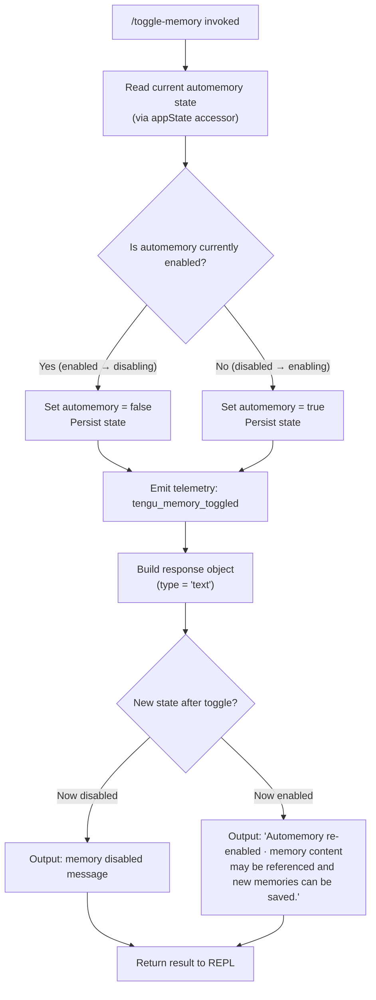

# `/toggle-memory`

> Analysis basis: CC v2.1.132 bundle.js (AST extraction + Claude interpretation)
> Minimum version: v2.1.132

---

## Overview

The `/toggle-memory` command flips the automemory feature on or off for the current session. When invoked, it reads the current automemory state, inverts it, persists the new state, emits a telemetry event, and responds with a confirmation message. Because `supportsNonInteractive` is `false`, this command is only available in interactive (REPL) sessions.

---

## Registration

| Field | Value |
|---|---|
| type | `local` |
| name | `toggle-memory` |
| description | `Toggle automemory off/on for this session` |
| supportsNonInteractive | `false` |
| thinClientDispatch | `post-text` |
| isHidden | `false` |
| module\_id | `DHq` |

Analysis basis: CC v2.1.132 bundle.js:+10325359

---

## Input Branching

The command handler (`F17`) takes no meaningful user-supplied argument text. Its branching is driven entirely by the **current automemory state** at invocation time.



Analysis basis: CC v2.1.132 bundle.js:+10324912 (state read), +10324924 (state write), +10324931 (telemetry dispatch), +10324979 (response type literal), +10325196 (re-enabled message literal)

---

## Behavioral Spec

### State Read and Write

```
function readCurrentAutomemoryState(appState):
    return appState.automemory  // boolean field
```

```
function persistNewAutomemoryState(appState, newValue):
    appState.automemory = newValue
    // persistence mechanism (e.g., write-through to config store)
    // <!-- TODO: not found in depth-2 traversal; needs --depth 4 -->
```

Analysis basis: CC v2.1.132 bundle.js:+10324912, +10324924

### Toggle Core Logic

```
function executeToggleMemory(appState, telemetryEmitter, respond):
    currentState = readCurrentAutomemoryState(appState)
    newState     = NOT currentState

    persistNewAutomemoryState(appState, newState)

    telemetryEmitter.emit("tengu_memory_toggled", { new_state: newState })

    message = buildResponseMessage(newState)
    respond({ type: "text", content: message })
```

Analysis basis: CC v2.1.132 bundle.js:+10324931 (telemetry), +10324979 (type literal "text")

### Response Message Construction

```
function buildResponseMessage(newState):
    if newState == true:
        return "Automemory re-enabled · memory content may be referenced and new memories can be saved."
    else:
        // Disabled-state message string
        // <!-- TODO: not found in depth-2 traversal; needs --depth 4 -->
        return <disabled confirmation string>
```

Analysis basis: CC v2.1.132 bundle.js:+10325196 (re-enabled string literal)

### Non-Interactive Guard

Because `supportsNonInteractive` is `false`, the CLI framework rejects this command before `executeToggleMemory` is ever called when running in a non-interactive (pipe / headless) context. No special guard code inside the handler itself is required.

Analysis basis: CC v2.1.132 bundle.js:+10325359 (registration field `supportsNonInteractive: false`)

### Thin-Client Dispatch

The `thinClientDispatch` value of `post-text` indicates that in thin-client configurations the command's result is forwarded as a plain text post rather than handled locally. The toggle action itself (state mutation) still occurs on the local side before dispatch.

Analysis basis: CC v2.1.132 bundle.js:+10325359 (registration field `thinClientDispatch: "post-text"`)

---

## State & Side Effects

| Item | Detail |
|---|---|
| Telemetry | `tengu_memory_toggled` — fired once per invocation, after the state flip (bundle.js:+10324933) |
| appState changes | `appState.automemory` boolean is inverted and persisted each invocation |
| Response type | Hardcoded `"text"` (bundle.js:+10324979) |
| Re-enabled message | `"Automemory re-enabled · memory content may be referenced and new memories can be saved."` (bundle.js:+10325196) |
| Disabled message | <!-- TODO: not found in depth-2 traversal; needs --depth 4 --> |
| Hook registration | <!-- TODO: not found in depth-2 traversal; needs --depth 4 --> |
| Sound | <!-- TODO: not found in depth-2 traversal; needs --depth 4 --> |
| Non-interactive mode | Command is blocked by framework; `supportsNonInteractive: false` |

---

## Version History

| Version | Change |
|---|---|
| v2.1.132 | Initial analysis — toggle-memory command registered as `local`, non-interactive blocked, `thinClientDispatch: post-text` |

---

## Common Mistakes

1. **Running in non-interactive mode**: Piping input to `claude` and attempting `/toggle-memory` will be rejected by the framework before the handler executes, because `supportsNonInteractive` is `false`. Use an interactive session instead.
2. **Expecting persistence across sessions**: The command description says "for this session." Whether the toggled state survives process restart depends on the underlying config-store implementation, which is not confirmed at depth-2 traversal. Do not assume cross-session durability without verification.
3. **Assuming a symmetric pair of messages**: Only the re-enabled (enabled → true) message is confirmed in the literals. The disabled-state message is not visible at depth-2 traversal. Do not hard-code or test against a guessed disabled string.
4. **Calling this from automation scripts**: `thinClientDispatch: post-text` means thin-client environments relay the text response but the automemory state change is local — scripts targeting the thin-client relay will receive the text acknowledgement without being able to confirm the state change took effect remotely.
5. **Treating the toggle as idempotent**: Each invocation unconditionally inverts the current state. Calling `/toggle-memory` twice in a row returns to the original state, not the desired one — check the current state before invoking if deterministic end-state is required.

---

## Appendix — Identifier Mapping

> For bundle debugging only. Identifiers change across versions.

| Identifier | Role |
|---|---|
| `F17` | Toggle-memory command handler function (main entry point) |
| `ig` | Automemory state reader / appState accessor (called at bundle.js:+10324912) |
| `jW8` | Automemory state writer / persistence function (called at bundle.js:+10324924) |
| `d` | Telemetry emitter / event dispatch function (called at bundle.js:+10324931) |