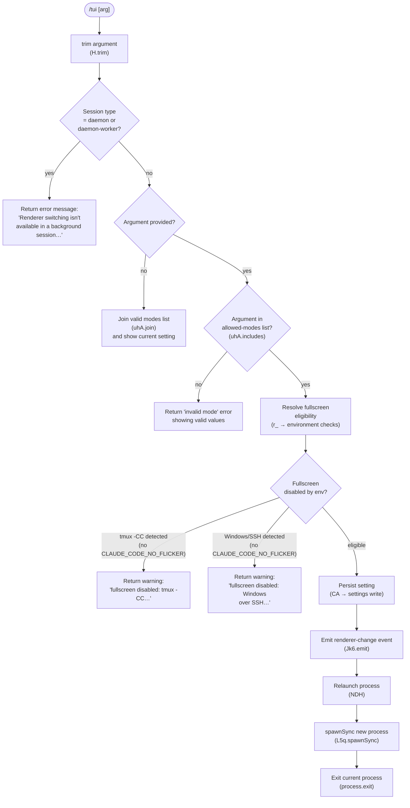

# `/tui`

> Analysis basis: CC v2.1.132 bundle.js (AST extraction + Claude interpretation)
> Minimum version: v2.1.132

---

## Overview

The `/tui` command switches the terminal UI renderer between `default` and `fullscreen` modes at runtime. It validates the requested mode against an allow-list, checks for environmental constraints that preclude fullscreen (such as tmux iTerm2-integration mode or Windows-over-SSH), and — if the switch is permitted — tears down the current renderer, persists the new setting, and relaunches the process with the updated mode. If the session is running as a background daemon, the command refuses the switch and instructs the user to detach first.

---

## Registration

| Field | Value |
|---|---|
| `type` | `local` |
| `name` | `tui` |
| `description` | `Set the terminal UI renderer (default \| fullscreen)` |
| `argumentHint` | `[default\|fullscreen]` |
| `supportsNonInteractive` | `false` |
| `module_id` | `$5q` |
| `load_inline` | `true` |
| `handler` | `$$7` (AsyncFunction; resolved via `module_id` path) |
| `loc_byte` span | `11075045`–`11075249` |
| `loc_byte_end` | `11075249` |
| `arbor_handler.name` | `$$7` |
| `arbor_handler.kind` | `AsyncFunction` |
| `arbor_handler.resolution_path` | `module_id` |
| `arbor_handler.fqn` | `claude-2.1.132::$$7` |
| `arbor_handler.n_hits` | `0` |

Analysis basis: CC v2.1.132 bundle.js:+11075045

---

## Input Branching

The handler (`$$7`) trims the raw argument string and routes through several gate checks before performing any renderer switch.



Analysis basis: CC v2.1.132 bundle.js:+11073687 (trim), +11073827 (join/includes), +11073960 (session-type check), +11073990 (background-session message), +11074252 (environment eligibility), +11074268 (settings persist), +11074371 (relaunch)

---

## Behavioral Spec

### 1. Argument Normalisation

```
async function tuiCommandHandler(options):
    rawArg = options.userInput
    arg = rawArg.trim()          // H.trim — loc +11073687
```

Analysis basis: CC v2.1.132 bundle.js:+11073687

---

### 2. Background-Session Guard

The handler checks the current session type string. If it equals `"daemon"` or `"daemon-worker"`, execution stops immediately and returns a fixed advisory message directing the user to detach and run `/tui` from a foreground session.

```
    sessionType = getCurrentSessionType()   // G9 → Tr
    if sessionType in ["daemon", "daemon-worker"]:
        return {
            type: "text",
            text: "Renderer switching isn't available in a background session " +
                  "— press ← to detach and run /tui from a foreground session."
        }
```

- Literal `"daemon"` — Analysis basis: CC v2.1.132 bundle.js:+2121050
- Literal `"daemon-worker"` — Analysis basis: CC v2.1.132 bundle.js:+2121064
- Advisory message literal — Analysis basis: CC v2.1.132 bundle.js:+11073990
- Session-type lookup — Analysis basis: CC v2.1.132 bundle.js:+11073960

---

### 3. Allowed-Modes Validation

The valid mode identifiers are held in a constant array (`uhA`). When no argument is supplied, the handler formats the list (using `uhA.join`) and returns the current setting. When an argument is present but not in the array, the handler returns an error listing the accepted values.

```
    VALID_MODES = ["default", "fullscreen"]   // uhA

    if arg == "":
        currentMode = readCurrentTuiSetting()
        return formatHelp(VALID_MODES.join(", "), currentMode)

    if arg not in VALID_MODES:
        return formatError("invalid mode; accepted: " + VALID_MODES.join(", "))
```

- `"fullscreen"` literal — Analysis basis: CC v2.1.132 bundle.js:+3188939
- `"default"` literal — Analysis basis: CC v2.1.132 bundle.js:+3188965
- `uhA.join` call — Analysis basis: CC v2.1.132 bundle.js:+11073827
- `uhA.includes` call — Analysis basis: CC v2.1.132 bundle.js:+11073849

---

### 4. Fullscreen Eligibility Resolution

The function `r_` (fullscreen-eligibility resolver) runs a series of environment probes and returns a descriptor object that includes the effective mode and a reason code. The reason codes found in the bundle are:

| Reason Code | Meaning |
|---|---|
| `env_off` | `CLAUDE_CODE_DISABLE_ALTERNATE_SCREEN` env var is set |
| `env_on` | `CLAUDE_CODE_NO_FLICKER` env var is set (forces fullscreen) |
| `tmux_cc_auto_off` | tmux iTerm2-integration (`-CC`) detected automatically |
| `win_ssh_auto_off` | Windows-over-SSH (ConPTY) detected automatically |
| `bg_forced_on` | Background mode forced fullscreen on |
| `settings_on` | Fullscreen enabled via settings |
| `settings_off` | Fullscreen disabled via settings |
| `downsell_on` | Downgrade/compatibility path engaged |
| `gb_on` | Growth-book flag enables fullscreen |
| `gb_off` | Growth-book flag disables fullscreen |

Analysis basis: CC v2.1.132 bundle.js:+3189320–+3189743

Environment variables checked:

| Variable | Effect |
|---|---|
| `CLAUDE_CODE_NO_FLICKER` | Override: suppress auto-disable warnings |
| `CLAUDE_CODE_DISABLE_ALTERNATE_SCREEN` | Force non-fullscreen mode |
| `CLAUDE_CODE_FORCE_FULLSCREEN_UPSELL` | Force upsell prompt regardless of state |

Analysis basis: CC v2.1.132 bundle.js:+11074830, +11074855, +11074894

Terminal-environment probes (inside `r_`):

```
function resolveFullscreenEligibility(requestedMode):
    // jyH: check terminal ID set (aDL)
    // PWK → XWK: check if terminal name starts with "iTerm.app" (loc +3187636)
    //             check TERM_PROGRAM for "screen" or "tmux" (loc +3187649, +3187674)
    //             probe tmux control-mode via spawnSync(
    //               "tmux display-message -p #{client_control_mode}",
    //               timeout=2000ms, encoding="utf8"
    //             )                                         (loc +3187837, +3187933)

    if tmuxControlModeDetected and not NO_FLICKER_override:
        return {
            mode: "default",
            reason: "tmux_cc_auto_off",
            message: "fullscreen disabled: tmux -CC (iTerm2 integration mode) detected " +
                     "· set CLAUDE_CODE_NO_FLICKER=1 to override"
        }

    // oq6: check platform == "windows" (loc +3188143)
    if windowsOverSSH and not NO_FLICKER_override:
        return {
            mode: "default",
            reason: "win_ssh_auto_off",
            message: "fullscreen disabled: Windows over SSH (ConPTY re-rendering) detected " +
                     "· set CLAUDE_CODE_NO_FLICKER=1 to override"
        }

    return { mode: requestedMode, reason: <applicable reason code> }
```

- tmux `-CC` warning literal — Analysis basis: CC v2.1.132 bundle.js:+3188549
- Windows SSH warning literal — Analysis basis: CC v2.1.132 bundle.js:+3188735
- `spawnSync` timeout 2000 ms — Analysis basis: CC v2.1.132 bundle.js:+3187933
- Platform `"windows"` check — Analysis basis: CC v2.1.132 bundle.js:+3188143
- `"local-agent"` context identifier used in eligibility path — Analysis basis: CC v2.1.132 bundle.js:+3188394

---

### 5. Terminal Capability Detection (`Cd`)

When evaluating fullscreen compatibility, `Cd` inspects the terminal emulator in use. Known terminal identifiers probed:

| Identifier Checked | Notes |
|---|---|
| `"ghostty"` | Ghostty terminal; version-gated (≥ `"1.2.0"` / `"3.6.6"`) |
| `"JetBrains-JediTerm"` | JetBrains embedded terminal |
| `"xterm.js"` | xterm.js-based terminals (VS Code, Cursor) |
| `"cursor"` | Cursor IDE terminal |
| `"vscode"` | VS Code terminal |
| `"(no reply)"` | Terminal did not respond to capability query |
| `"unset"` | Terminal variable not set |

Version thresholds parsed by `CTK` (parseFloat + Number.isNaN + Math.min, cap `20`):

- Lower bound: `1092000` — Analysis basis: CC v2.1.132 bundle.js:+3270873
- Upper bound: `1105000` — Analysis basis: CC v2.1.132 bundle.js:+3270884

Platform checks inside `Cd`: `"darwin"` (macOS), `"win32"` (Windows).

Analysis basis: CC v2.1.132 bundle.js:+3270055 (`Cd` entry), +3270620, +3270754, +3270803, +3267702, +3270210, +3270257

Terminal query uses ANSI escape sequences `ESC 7` / `ESC 8` (save/restore cursor) as part of capability probing.

Analysis basis: CC v2.1.132 bundle.js:+3522762, +3522773

---

### 6. Settings Persistence (`CA`)

If the eligibility check passes, the new mode is written to persistent settings via `CA`. The settings layer accesses known file paths:

| Setting Layer | File |
|---|---|
| User settings | `~/.claude/settings.json` |
| Project settings | `.claude/settings.json` (project root) |
| Local settings | `.claude/settings.local.json` |

The write path involves:
1. Reading the current settings object (`NN6` → `cKH.readFile`).
2. Cloning it (`BN` → `structuredClone`).
3. Updating the `preferredTuiRenderer` key (or equivalent field).
4. Atomically writing back via temp-file + rename (`QyH` pattern).
5. Emitting the renderer-change event on `Jk6`.

Analysis basis: CC v2.1.132 bundle.js:+11074268 (CA call), +1158288 (`.claude`), +1158298 (`settings.json`), +1158360 (`settings.local.json`), +1160313 (`Jk6.emit`)

---

### 7. Process Relaunch (`NDH`)

After settings are persisted, `NDH` orchestrates a graceful teardown and relaunch:

```
async function relaunchWithNewRenderer(session, mode):
    // 1. Stat current binary path via Cy/rs (homedir-relative version path)
    //    Checks ~/.local/share/claude/versions/…/bin

    // 2. Unmount current Ink/React TUI (WUH → H.unmount)

    // 3. Clear interval timers (Ef6 → Z5A → clearInterval)

    // 4. Flush pending output with timeout:
    //    - Promise.race([flushAll(), timeout(30000)])
    //    - Label: "flush timeout (relaunch)"

    // 5. Run cleanup hooks (ENH → Promise.all + Array.from)
    //    - Label: "cleanup timeout"

    // 6. Remove all process signal listeners
    //    process.removeAllListeners("SIGINT")
    //    process.removeAllListeners("SIGTERM")
    //    process.removeAllListeners("SIGHUP")

    // 7. Re-register minimal signal handlers (process.on)

    // 8. Write crash-recovery state (AZ → FNH.writeFileSync)

    // 9. spawnSync new process with stdio: "inherit", --resume flag
    //    (L5q.spawnSync, loc +11072931)

    // 10. On spawn error: emit "relaunch_spawn_error" and process.exit(128)
    //     On success: process.exit with child's exit code
    //     On SIGKILL: process.kill(process.pid, signal)
```

- Flush timeout 30 000 ms — Analysis basis: CC v2.1.132 bundle.js:+11072520
- `"flush timeout (relaunch)"` label — Analysis basis: CC v2.1.132 bundle.js:+11072526
- `"cleanup timeout"` label — Analysis basis: CC v2.1.132 bundle.js:+11072582
- `"--resume"` flag — Analysis basis: CC v2.1.132 bundle.js:+11072458
- `"inherit"` stdio — Analysis basis: CC v2.1.132 bundle.js:+11072966
- Exit code `128` on spawn error — Analysis basis: CC v2.1.132 bundle.js:+11073297
- `"relaunch_spawn_error"` literal — Analysis basis: CC v2.1.132 bundle.js:+11073160
- Signal names `SIGINT`, `SIGTERM`, `SIGHUP` — Analysis basis: CC v2.1.132 bundle.js:+11072845–+11072864
- `process.exit` — Analysis basis: CC v2.1.132 bundle.js:+11073184
- `process.kill` — Analysis basis: CC v2.1.132 bundle.js:+11073249

---

### 8. Scroll-Summary Timing (`ft6` / `Sr1`)

During the relaunch sequence, scroll-summary metrics are captured. `Sr1` records:
- `Date.now()` timestamps
- `Math.max` / `Math.round` for duration calculations
- `Object.assign` for metric accumulation

These feed the `tengu_scroll_summary` telemetry event.

Analysis basis: CC v2.1.132 bundle.js:+5043814 (`ft6` entry), +5041248 (`Sr1` → `Date.now`)

---

## State & Side Effects

| Item | Detail |
|---|---|
| **Telemetry events** | `tengu_tui_command` (fired at invocation, loc +11074381); `tengu_pewter_brook` (fullscreen eligibility path, loc +3189030); `tengu_amber_creek` (renderer-state tracking, loc +3189122); `tengu_scroll_summary` (scroll metrics during relaunch, loc +5043828) |
| **Settings write** | Modifies `~/.claude/settings.json` (user) and/or project `.claude/settings.json`; atomic write via temp-file rename (`QyH`) |
| **Process signals** | `process.removeAllListeners` for `SIGINT`, `SIGTERM`, `SIGHUP`; re-registers minimal handlers before relaunch |
| **Process lifecycle** | Unmounts React/Ink TUI (`WUH → H.unmount`); clears all intervals (`Z5A → clearInterval`); calls `process.exit` after `L5q.spawnSync` |
| **Event emission** | Fires renderer-change event on `Jk6` (`Jk6.emit`, loc +1160313) |
| **Cache invalidation** | `C2` clears two in-memory caches (`s06.clear`, `j28.clear`) during settings reload path |
| **Crash-recovery state** | `AZ` writes a recovery file via `FNH.writeFileSync` before spawn (loc +11073157) |
| **Uptime capture** | `process.uptime()` and `Math.round` called during telemetry assembly (loc +11074453, +11074442) |
| **Memory snapshot** | `process.memoryUsage()` called in the metrics path (`$q`, loc +169234) |
| **Non-interactive** | `supportsNonInteractive: false` — command is unavailable in `--print`/pipe mode |

---

## Version History

| Version | Change |
|---|---|
| v2.1.132 | Initial analysis — fullscreen eligibility, background-session guard, environment-variable overrides, and process-relaunch path documented |

---

## Common Mistakes

1. **Running `/tui` inside a daemon session.** The command always refuses with an advisory message when the session type is `"daemon"` or `"daemon-worker"`. Detach to a foreground session first.

2. **Expecting `/tui fullscreen` to work in tmux with iTerm2 integration (`-CC` flag).** The handler auto-detects this configuration via `tmux display-message` and falls back to `default`. Set `CLAUDE_CODE_NO_FLICKER=1` in the environment to override the auto-detection if you accept the visual artifacts.

3. **Expecting `/tui fullscreen` to work over Windows SSH (ConPTY).** The same auto-disable logic applies; the same `CLAUDE_CODE_NO_FLICKER=1` override applies.

4. **Using `/tui` in a non-interactive (`--print`) invocation.** `supportsNonInteractive` is `false`; the command will be rejected before the handler runs.

5. **Assuming the switch is instant.** The renderer switch triggers a full process relaunch via `spawnSync` with a 30 000 ms flush timeout. The current process exits; do not expect output after the switch completes.

6. **Passing any value other than `default` or `fullscreen`.** Only these two mode strings are in the allow-list (`uhA`). Any other value, including `"bg"` (an internal state token), returns an error.

---

## Appendix — Identifier Mapping

> For bundle debugging only. Identifiers change across versions.

| Identifier | Role |
|---|---|
| `$$7` | Main `/tui` command handler (AsyncFunction; module `$5q`) |
| `H` | General utility / string helper; also used as random-delay scheduler (Math.random + setTimeout) |
| `uA` | Settings loader dispatcher |
| `ub` | Settings load orchestrator (calls metric recorder and disk reader) |
| `Kp` | Settings load sub-step (called from `ub`) |
| `_2L` | Core settings-from-disk loader (calls all sub-loaders) |
| `$q` | Memory-usage and metrics snapshot recorder |
| `E8` | File-append logger (uses `K.appendFileSync`, `K.mkdirSync`) |
| `t06` | Settings sub-loader (called from `_2L`) |
| `hb` | Flag/policy settings merger |
| `w6H` | Settings layer writer helper |
| `BN` | Deep-clone wrapper (`structuredClone`) |
| `O` | Queue/collection used in settings pipeline |
| `bb` | Settings serialiser/deserialiser pair dispatcher |
| `tKH` | Settings field validator / JSON parser |
| `fjH` | Settings field processor (called from `_2L`) |
| `z66` | WSL settings path resolver |
| `jk6` | Parent-managed settings loader |
| `MjH` | Settings merge helper |
| `L` | Column-formatter / padEnd helper |
| `q` | File-unlink queue |
| `EO` | User/project/local settings file resolver |
| `K` | Process-exit and cleanup state manager |
| `ni` | SDK inline settings loader |
| `W7_` | SDK inline settings processor |
| `ZdA` | Post-load settings finaliser |
| `r_` | Fullscreen eligibility resolver (environment probe dispatcher) |
| `jyH` | Terminal-ID set membership checker (`aDL.has`) |
| `Ne8` | Terminal colour/capability string builder (`Iq` + `yH`) |
| `Iq` | ANSI colour code formatter (String coercion) |
| `yH` | Terminal string coercer (String coercion) |
| `Id` | Terminal spawner wrapper (`PWK`) |
| `PWK` | iTerm / tmux terminal probe orchestrator |
| `XWK` | Terminal name prefix checker (`H.startsWith`) |
| `k` | Log-entry formatter and writer |
| `Lsq` | Log file path resolver |
| `rdA` | Log rotation helper (`Nrq`, `krq`) |
| `RH` | JSON stringifier wrapper |
| `A` | String utility (toUpperCase, etc.) |
| `mf` | Message redactor (`[REDACTED]` substitution) |
| `MnA` | Redaction map builder |
| `_` | Path / string multi-utility |
| `gNH` | stdout write wrapper (`slA`) |
| `slA` | Raw `H.write` to stdout |
| `Msq` | Async log-file writer (mkdir + appendFile + rotate) |
| `GNH` | Debounced log flush (clearTimeout + setTimeout + setImmediate) |
| `pHH` | Log buffer drainer |
| `F6` | Error-type classifier |
| `JG8` | Log-file stat checker (`j8`) |
| `jnA` | Log file path builder (`cwH.join`) |
| `JnA` | Log file rotator (stat + rename + unlink) |
| `fsq` | Async file appender (mkdir + appendFile + rotate) |
| `N1` | Active-request set manager (`J08.add/delete`) |
| `oq6` | Platform/OS identifier (`"windows"` check, `Boolean` coerce) |
| `WWK` | Post-eligibility renderer-state router |
| `j6` | Renderer-state machine / session registry |
| `hq6` | Renderer state getter |
| `Rq6` | Renderer state setter |
| `Oo` | Renderer output formatter (`yH` + `Mo`) |
| `uQ6` | Renderer deduplication tracker (`Kt8` set, `V5H` map) |
| `R6` | Renderer timing / analytics recorder (`Date.now`, `DPK`) |
| `G9` | Session-type reader (returns `"daemon"` / `"daemon-worker"` / etc.) |
| `Tr` | Session-context accessor |
| `u5H` | Alternate renderer init path (mirrors `r_` sub-steps) |
| `CA` | Settings persistence orchestrator (read → clone → write → emit) |
| `G7_` | Settings layer diff/merge writer |
| `D66` | Settings value coercer/validator (`vdA`, `H2L`) |
| `vdA` | Settings value type checker |
| `H2L` | Settings object updater (push + Object.keys + `z66` + `jk6`) |
| `NdA` | Settings null/undefined handler |
| `wE` | File-reading pipeline entry (`bp`) |
| `bp` | File reader with BOM detection and encoding normalisation |
| `v3` | Path safety checker (lstatSync, realpathSync, special-file guards) |
| `jH6` | File-type error classifier |
| `Fk8` | File content post-processor |
| `D8` | Error wrapper (`j8`) |
| `j8` | Structured error constructor |
| `Wh8` | Settings timestamp recorder (`xN6.set`, `Date.now`) |
| `E6H` | Settings file path resolver (`MX.resolve`, `_A`, `ULH`, `MX.dirname`) |
| `_A` | Absolute-path resolver |
| `ULH` | Path utility (used in file resolution) |
| `QyH` | Atomic file writer (open → write → fchmod → fsync → rename; symlink-safe) |
| `f` | File-descriptor closer |
| `C2` | In-memory cache invalidator (`s06.clear`, `j28.clear`) |
| `NN6` | Settings file read/write coordinator (git-ignore check, mkdir, readFile, writeFile, appendFile) |
| `N6` | AsyncLocalStorage settings store accessor (`Qv6`) |
| `Qv6` | Settings store reader (`gv6.getStore` + `ng`) |
| `_h8` | Settings memory cache (`MK`) |
| `fh8` | Git-ignore checker (`PA`) |
| `PA` | `git check-ignore` runner |
| `fXL` | XDG config path builder (`~/.config/claude/ignore`) |
| `fH` | Network/HTTP traffic handler (essential-traffic queue) |
| `HA` | Error message normaliser |
| `kq` | HTTP request executor (`h1_`) |
| `$wL` | In-flight request queue manager (`uv6.shift/push`) |
| `xb` | `.claude` directory path builder (`MX.join`) |
| `Cd` | Terminal capability detector (Ghostty, JetBrains, xterm.js, Cursor, VS Code) |
| `_c6` | Terminal query dispatcher |
| `VwH` | Terminal response parser |
| `EHA` | Terminal compatibility evaluator (`RTK`) |
| `RTK` | Terminal version range checker |
| `n5H` | Terminal capability flag setter |
| `GHA` | Terminal info aggregator |
| `CTK` | Numeric terminal-version parser (parseFloat + Number.isNaN + Math.min, cap 20) |
| `d` | Shared data/state bag passed through relaunch |
| `NDH` | Relaunch orchestrator (unmount → flush → cleanup → spawnSync → exit) |
| `Cy` | Binary path locator (homedir + version path) |
| `Oq8` | Version directory scanner |
| `dM` | Array/version-list validator |
| `B$H` | Version entry formatter |
| `rs` | Release binary path builder (`~/.local/share/claude/versions/…/bin`) |
| `N18` | Home-directory resolver (`Bw9.homedir`) |
| `Bl` | Process-info accessor |
| `v6` | Async error handler |
| `Ef6` | Interval-timer registry clearer (`Z5A → clearInterval`) |
| `Z5A` | clearInterval wrapper |
| `WUH` | TUI unmount coordinator (writeSync + unmount + `mk` + `nc6`) |
| `mk` | Ink/React app unmount helper |
| `nc6` | Terminal alternate-screen exit writer (`bo.writeSync`, ANSI sequences) |
| `Ac6` | Terminal coercion helper (`q01.coerce`, `n0`) |
| `W2H` | Terminal state restorer |
| `CE` | Escape-sequence cleaner (`H.replaceAll`, `ESC ESC` literal) |
| `ft6` | Scroll-summary capture and relay (`tT`, `Rr1`, `Sr1`, `r_`) |
| `tT` | Scroll-state reader |
| `Rr1` | Scroll-summary formatter |
| `Sr1` | Scroll-duration calculator (Date.now + Math.max + Math.round + Object.assign) |
| `yr1` | Scroll metric aggregator |
| `nM` | Promise timeout helper (setTimeout + Promise.race + clearTimeout) |
| `RT` | Post-relaunch hook runner (`hK`) |
| `hK` | Hook executor (`N1` request-set aware) |
| `ENH` | Parallel cleanup runner (Promise.all + Array.from) |
| `xhA` | Crash-state file writer before spawn (`f$`, `mK`) |
| `mK` | Crash-state serialiser |
| `AZ` | Recovery-file writer (`FNH.writeFileSync`, `IG8.join`) |