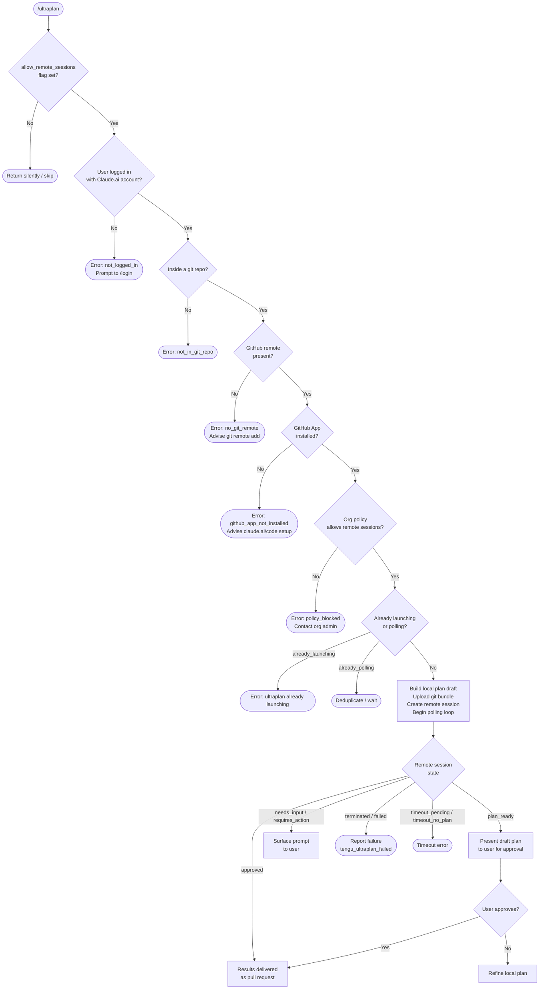

# `/ultraplan`

> Analysis basis: CC v2.1.132 bundle.js (AST extraction + Claude interpretation)
> Minimum version: v2.1.132

---

## Overview

`/ultraplan` is a local-JSX slash command that launches a **remote planning session** on Claude.ai's cloud infrastructure. The user provides a prompt; Claude Code validates eligibility (login, git repository, GitHub remote, GitHub App installation, org policy), packages the local repository as a git bundle and uploads it to a remote sandbox, then polls the remote session until a draft plan is returned for the user to review and approve. Results are eventually delivered as a pull request.

---

## Registration

| Field | Value |
|---|---|
| type | `local-jsx` |
| name | `ultraplan` |
| description | `" ... · Claude Code on the web drafts a plan you can edit and approve. See ..."` |
| argumentHint | `<prompt>` |
| load\_inline | `true` |
| load\_ident | `RM7` (handler resolved via `load_ident` path) |
| handler kind | `AsyncFunction` |
| handler FQN | `claude-2.1.132::RM7` |
| `loc_byte_end` | `10948304` |
| `load_ident` | `RM7` |
| `arbor_handler.name` | `RM7` |
| `arbor_handler.kind` | `AsyncFunction` |
| `arbor_handler.resolution_path` | `load_ident` |
| `arbor_handler.fqn` | `claude-2.1.132::RM7` |
| `arbor_handler.n_hits` | `1` |

Analysis basis: CC v2.1.132 bundle.js:+10948061 – +10948304

---

## Input Branching

The entry point `RM7` performs several gate checks before launching the remote session. The high-level flow is:



Analysis basis: CC v2.1.132 bundle.js:+10946216, +10946269, +10943730, +10943748, +10943794

---

## Behavioral Spec

### 1. Handler Entry — `mainHandler` (RM7)

```
async function mainHandler(context):
    if NOT featureFlag("allow_remote_sessions"):
        return                              // silently skip

    preconditionResult = checkPreconditions(context)
    if preconditionResult is error:
        return preconditionResult

    prompt = extractPrompt(context)
    remoteSessionOptions = buildSessionOptions(context, prompt)

    A.setAppState(...)                      // mark session as launching
    try:
        launchAndPollRemoteSession(remoteSessionOptions)
    catch unexpected:
        emit telemetry("tengu_ultraplan_failed")
        report error to user
```

Analysis basis: CC v2.1.132 bundle.js:+10946216, +10946540, +10946758

---

### 2. Prompt Extraction and Normalization — `extractAndNormalizePrompt` (EO8 → GO8 → tKq)

The raw CLI argument undergoes multi-step normalization before being forwarded to the remote session.

```
function extractAndNormalizePrompt(rawInput):
    // tKq: scan for known prefix patterns using startsWith (loc +10931431)
    // apply regex matchAll with "gi" flag (loc +10931829) to locate markers
    // if marker found at index > 0:
    //     close/flush any open streams (via streamCloser)
    //     push segment to queue
    // collect all matched segments into resultArray (M.push, loc +10932109)

    // EO8: slice the raw string (loc +10932328)
    // apply replacement pattern "$1$2" (loc +10932425) via _.replace
    // trim to maximum 5 segments (literal 5 at loc +10932448)
    return normalizedPrompt
```

The string `"ultraplan"` appears as a literal at loc +10932181, used as a keyword the user can embed anywhere in their prompt as an alternative to the slash command prefix.

Usage hint surfaced to the user: `"Usage: /ultraplan \<prompt\>, or include \"ultraplan\" anywhere"` (bundle.js:+10943794), followed by `"in your prompt"` (bundle.js:+10943860).

Analysis basis: CC v2.1.132 bundle.js:+10932300, +10931431, +10931837, +10932328, +10932425

---

### 3. Precondition Checks — `checkPreconditions` (AL → Mr9 → FIA → zm / Kr9)

```
function checkPreconditions(context):
    // Check telemetry/feature tier (zm):
    //   validates subscription tiers: "firstParty", "enterprise", "team"
    //   emits tengu_slate_kestrel on first-party tier check
    //
    // Check auth (AL):
    //   if Ft4 cache does NOT have auth entry:
    //       call zm (tier check) + kq (token resolver)
    //   if no valid Claude.ai session token:
    //       return { code: "not_logged_in",
    //                message: "Please run /login and sign in..." }

    // Check git repo presence (SnH pre-flight):
    //   if NOT inside git repo:
    //       return { code: "not_in_git_repo" }

    // Check GitHub remote (Hk):
    //   runs: git config --get remote.origin.url
    //   if missing:
    //       return { code: "no_git_remote",
    //                message: "Background tasks require a GitHub remote..." }

    // Check GitHub App (PGH → checkGithubAppInstalled):
    //   GET request to GitHub App endpoint with org UUID + access token
    //   on missing token:  assume not installed → return "github_app_not_installed"
    //   on missing orgUUID: assume not installed
    //   on HTTP 400: return "github_app_not_installed"
    //   on isAxiosError: return "ghes_optimistic" (allow GHES hosts)
    //   emits: "github_preflight_ok" or "github_preflight_failed"

    // Check org policy (SnH):
    //   if policy blocks remote sessions:
    //       return { code: "policy_blocked",
    //                message: "Remote sessions are disabled by your organization's policy..." }

    return OK
```

Analysis basis: CC v2.1.132 bundle.js:+9769478, +9769507, +10927039, +10927057, +10927261, +6440362, +7822476, +7822577, +7822715, +7822832, +7822986

---

### 4. Git Bundle Preparation — `teleportGitBundleUpload` (fjA)

```
async function teleportGitBundleUpload(repoPath, sessionParams):
    emit telemetry("tengu_ccr_bundle_upload")

    if NOT in git repo:
        throw { code: "empty_repo", message: "Not in a git repository" }

    // Clean up any leftover seed refs:
    //   git update-ref -d refs/seed/stash
    //   git update-ref -d refs/seed/root

    // Check for commits:
    //   git for-each-ref --count=1 refs/
    //   if no refs:  throw "Repository has no commits yet"

    // Stash local changes temporarily (strategy: "stash" → "create")
    //   POST to stash API, expect HTTP 200

    // Verify HEAD: git rev-parse --verify HEAD
    //   if fails: throw { code: "stash_failed" }

    // Generate bundle file: "ccr-seed" + ".bundle" → temp path
    // Upload bundle; on failure set status "failed" / "upload_failed"
    // On success: record strategy ("head", "fallback_head", "squashed", "fallback_squashed")
    // Cleanup: qQH.unlink(tempBundleFile)

    return uploadResult
```

Analysis basis: CC v2.1.132 bundle.js:+7798297, +7798358, +7798449, +7798985, +7799436, +7799447, +7799079, +7800033

---

### 5. Remote Session Creation — `teleportToRemote` (u1H)

```
async function teleportToRemote(params):
    // Policy guard:
    if orgPolicy.remoteSessions === "disabled":
        throw "Remote sessions are disabled by your organization's policy."

    // Auth guard:
    if NOT accessToken:
        throw "No access token found for remote session creation"

    // Org UUID guard:
    orgUUID = getOrgUUID()
    if NOT orgUUID:
        throw "Unable to get organization UUID for remote session creation"

    // Decide bundle source (emits tengu_teleport_bundle_mode, tengu_teleport_source_decision):
    //   - "explicit_env_bundle"  (env var override)
    //   - "git_repository"       (normal path via fjA upload)
    //   - "explicit_source_url"  (direct URL)
    //   - "no_git_at_all"        (empty sandbox — warns user)
    //   - "forced_bundle"        (forced path)

    // Select or auto-create cloud environment (ic / kBH):
    //   GET environments list → emits "teleport_environments_list"
    //   timeout: 15000 ms (bundle.js:+6438145)
    //   if none: auto-create default environment → emits "teleport_default_environment_create"
    //     default env spec: name="Default", provider="anthropic_cloud",
    //     home="/home/user", python="3.11", node="20"
    //   if auto-create fails: warn user, direct to https://claude.ai/code/onboarding?magic=env-setup

    // Generate title for task (gV4):
    //   POST to claude/task endpoint, JSON schema with "title" + "branch" fields
    //   emits "teleport_generate_title"
    //   truncates description to 75 chars (bundle.js:+7801437)

    // POST session creation request:
    //   headers include:
    //     anthropic-version: "2023-06-01"
    //     anthropic-beta: "ccr-byoc-2025-07-29"
    //     x-organization-uuid: <orgUUID>
    //   on HTTP 500: throw
    //   on HTTP 201: session created (bundle.js:+7814601)
    //   if response missing session id: throw "Server returned a malformed session response (no session id)"
    //   emits "tengu_ccr_session_link"

    // Upload git bundle (fjA) if source = "git_repository"
    // emits "tengu_teleport_bundle_mode"

    // Send control_request / set_permission_mode event to session

    return { sessionId, ... }
```

Analysis basis: CC v2.1.132 bundle.js:+7812531, +7812639, +7812949, +7814509, +7814563, +7814601, +7814891, +7815243, +7816236, +6438145

---

### 6. Session Launch Orchestration — `launchAndPollSession` (lj6 → SM7)

```
async function launchAndPollSession(context, prompt, sessionOptions):
    // Deduplication guard:
    if appState.ultraplanStatus === "already_polling":
        return
    if appState.ultraplanStatus === "already_launching":
        emit user message: "ultraplan: already launching. Please wait..."
        return

    // Build local draft plan (IO8 → ZO8):
    //   identifier for prompt stored (tengu_ultraplan_prompt_identifier emitted, loc +10939288)
    //   draft prefixed with "Here is a draft plan to refine:"  (loc +10939462)

    // Notify UI via task-notification (SM7, loc +10944495)

    // Call teleportToRemote (u1H) to create remote session:
    if creation fails:
        emit telemetry("tengu_ultraplan_create_failed")
        set status "create_api_fail" or "teleport_null"
        append ". See --debug for details." to error message
        return

    // Set app state:
    //   source: "cli" (loc +10945099)
    //   workflowName: "Ultraplan" (loc +10945342)

    // Emit tengu_ultraplan_launched (loc +10945186)
    // Delay 1500 ms before starting poll (loc +10945527)

    // Start polling loop (NM7):
    pollRemoteSession(sessionId, context)

    // Error handling:
    //   on unexpected error: emit "tengu_ultraplan_failed"
    //   surface: "Ultraplan hit an unexpected error during launch. Wait for the user's next instructions."
    //   attempt to archive orphaned session; on failure log: "ultraplan: failed to archive orphaned session"
```

Analysis basis: CC v2.1.132 bundle.js:+10943730, +10943748, +10943794, +10944104, +10944319, +10944639, +10944893, +10945186, +10945527, +10945595, +10945901

---

### 7. Remote Session Polling Loop — `pollRemoteSession` (NM7 → rKq)

```
async function pollRemoteSession(sessionId, context):
    emit telemetry("tengu_ultraplan_launched") // already emitted at launch
    startTime = Date.now()
    timeout = 5400 seconds (bundle.js:+10939155)
    pollInterval = 1000 ms; maxWait = 1800000 ms (bundle.js:+7827644, +7827651)

    loop:
        // rKq: fetch current session state
        // on network error: classify as "network_or_unknown"
        //   after repeated retries:
        //     emit "Lost connection to the remote session after repeated retries..."
        //   retry with back-off

        // Dispatch on session status:
        switch state:
            case "approved":
                emit tengu_ultraplan_approved (loc +10940241)
                message user: "Results will land as a pull request when the remote session finishes."
                break loop

            case "plan_ready":
                emit tengu_ultraplan_plan_ready (loc +10939833)
                present draft plan to user for approval
                // if user approves → session continues to "approved"

            case "needs_input" / "requires_action":
                emit tengu_ultraplan_awaiting_input (loc +10939765)
                surface question to user

            case "terminated":
                emit tengu_ultraplan_failed
                message: "Remote Ultraplan session failed. Wait for the user's next instructions."
                break loop

            case "timeout_pending":
                handle graceful timeout

            case "timeout_no_plan":
                break loop

            case "extract_marker_missing":
                error — no review output from orchestrator

        // Progress reporting: elapsed = Math.round((now - start) / 60000) minutes
        // Strings: "minute" / "minutes" (loc +10930152, +10930161)

        // fz6: cleanup temp files (yK.unlink) on terminal states
        // h5: enqueue notification (type "later" / "enqueue", loc +4156585, +4156605)

    // Emit tengu_ultraplan_timeout_seconds on loop exit with elapsed count
```

Analysis basis: CC v2.1.132 bundle.js:+10939121, +10939155, +10939765, +10939833, +10940241, +10941113, +10928821, +10928966, +10929317, +10929630, +10930007, +10930137

---

### 8. Plan Refinement Step — `refinePlan` (vM7 → VM7)

```
function buildRefinementPlan(draftText):
    segments = []
    segments.push("Here is a draft plan to refine:")   // literal loc +10939462
    segments.push(draftText)
    // VM7 (TM7): format/transform segments
    return segments.join(...)

// Label shown in UI: "Refine local plan"  (loc +10944639)
// Internal plan type key: "plan"           (loc +10944674)
```

Analysis basis: CC v2.1.132 bundle.js:+10939455, +10939545, +10944639, +10944674

---

### 9. Background Process Infrastructure — `backgroundDaemon` (w → LFA / OFA)

The ultraplan remote session is backed by the shared background-daemon infrastructure used by all background sessions in CC. Key behaviors observed in the depth-2 graph:

```
function spawnOrClaimBackgroundProcess(spec):
    // Try to claim a pre-warmed spare process (tengu_bg_spare_claim)
    // If no spare available: bm.spawn() a new process (tengu_bg_spare_spawn)
    // Connect via sX8.connect (IPC socket)
    // Register f.on / f.once listeners for stdout/stderr
    // On SIGKILL escalation: tengu_bg_dispatch_sigkill_escalate
    // On clean exit: tengu_bg_spare_enable (spare re-enabled)
    // On connection refused (ECONNREFUSED): tengu_bg_spare_claim_fail

    // OFA tracks running sessions:
    //   statuses: "done", "killed", "stopped", "blocked", "crashed",
    //             "working", "active", "bg", "daemon", "resuming"
    //   cleanup: WY.unlink (temp socket file), windows-specific path handling
```

Analysis basis: CC v2.1.132 bundle.js:+14130282, +14130309, +14130767, +14130886, +14129749, +14131149, +14112642, +14133776

---

### 10. Source-of-Code Decision — `decideBundleSourceMode` (k5H / DPK)

Before uploading the repository, the handler resolves how to represent the current working tree:

```
function decideBundleSourceMode(repoPath):
    emit tengu_teleport_source_decision

    // Modes (in priority order):
    // 1. "explicit_source_url"  — env var override present
    // 2. "forced_bundle"        — explicit bundle path set
    // 3. "no_git_at_all"        — no git binary or repo found
    //       logs: "[teleportToRemote] No repository detected — session will have an empty sandbox"
    // 4. "git_repository"       — normal flow → fjA upload

    // DPK: monitors the bundle file via lQ6.watchFile / lQ6.unwatchFile
    //       parses config (Z9, Fh) for per-project settings
    //       on config parse error: emits tengu_config_parse_error
    //       notifies subscribers (N1: J08.add / J08.delete) on file changes

    return sourceMode
```

Analysis basis: CC v2.1.132 bundle.js:+7816933, +7816955, +7818580, +7818669, +3103738, +3103905, +3107927

---

## State & Side Effects

| Item | Detail |
|---|---|
| **Telemetry — launch** | `tengu_ultraplan_launched` (loc +10945186) |
| **Telemetry — create fail** | `tengu_ultraplan_create_failed` (loc +10943515) |
| **Telemetry — polling** | `tengu_ultraplan_timeout_seconds` (loc +10939121), `tengu_ultraplan_awaiting_input` (loc +10939765), `tengu_ultraplan_plan_ready` (loc +10939833), `tengu_ultraplan_approved` (loc +10940241), `tengu_ultraplan_failed` (loc +10941113) |
| **Telemetry — prompt** | `tengu_ultraplan_prompt_identifier` (loc +10939288) |
| **Telemetry — git/bundle** | `tengu_ccr_bundle_upload` (loc +7798590), `tengu_teleport_bundle_mode` (loc +7813684), `tengu_teleport_source_decision` (loc +7818580), `tengu_ccr_bundle_seed_enabled` (loc +6442133), `tengu_ccr_session_link` (loc +7808102) |
| **Telemetry — environment** | `tengu_teleport_generate_title` (loc +7801741), `teleport_environments_list` (loc +6437630), `teleport_default_environment_create` (loc +6438356) |
| **Telemetry — background daemon** | `tengu_bg_spare_enable`, `tengu_bg_spare_claim`, `tengu_bg_spare_spawn`, `tengu_bg_spare_claim_fail`, `tengu_bg_dispatch_sigkill_escalate`, `tengu_bg_sendclaim_failed` |
| **Telemetry — auth/config** | `tengu_slate_kestrel` (loc +9766163), `tengu_config_parse_error` (loc +3107927), `tengu_feature_ok` (loc +906461), `tengu_feature_bad` (loc +906517), `tengu_mcp_retry_failed_remote` (loc +13846663) |
| **appState changes** | `A.getAppState()` read at loc +10946540; `A.setAppState()` written at loc +10946758. Fields mutated include session status (`already_launching`, `already_polling`) and `workflowName: "Ultraplan"` |
| **File system side effects** | Git bundle temp file written (`ccr-seed.bundle`) and cleaned up via `yK.unlink`; stash ref manipulation (`refs/seed/stash`, `refs/seed/root`); config backup directory (`backups/`) touched by `k5H`; `_source_seed.bundle` artifact at loc +7799739 |
| **Network calls** | `J8.post` (session create, bundle upload, stash), `J8.get` (environments list, GitHub App check); IPC socket connect (`sX8.connect`) for background daemon |
| **Process management** | `bm.spawn` for background worker; `process.exit` in error-path (`K`, loc +14110307); SIGKILL escalation after repeated retries |
| **File watch** | `lQ6.watchFile` / `lQ6.unwatchFile` on bundle file path (DPK, loc +3103738) |
| **Timers** | `setTimeout` for 1500 ms pre-poll delay (loc +10945527); poll interval 1000 ms (loc +7827644); max session wait 1800000 ms / 30 min (loc +7827651); session hard timeout 5400 s (loc +10939155) |
| **Sound** | None found in depth-2 traversal |

---

## Version History

| Version | Change |
|---|---|
| v2.1.132 | Initial analysis. Feature includes git-bundle teleport, remote cloud environment auto-creation, plan draft/review/approve flow, and background daemon integration. |

---

## Common Mistakes

1. **Invoking `/ultraplan` without a Claude.ai login.** The command requires a Claude.ai account session token (not just an API key). Running without `/login` first returns the `not_logged_in` error with a prompt to authenticate.

2. **Running outside a git repository.** The command requires a git repository at the working directory. Without one it errors with `not_in_git_repo`. Initialise with `git init` and create at least one commit.

3. **Missing GitHub remote.** Even with a git repo, a `remote.origin` pointing to GitHub is required. Add one with `git remote add origin <REPO_URL>` before invoking.

4. **GitHub App not installed.** The command checks whether the Claude Code GitHub App is installed in the organisation. If not, it directs the user to `https://claude.ai/code`.

5. **Organisation policy blocking remote sessions.** Enterprise organisations may have remote sessions disabled at the policy level. The error `policy_blocked` indicates this; only an org admin can re-enable.

6. **Repository with no commits.** An empty repository (no commits) causes the bundle upload to fail. The fix is `git add . && git commit -m "initial"`.

7. **Calling `/ultraplan` while a session is already launching.** The command deduplicates via the `already_launching` / `already_polling` guard and surfaces a message to wait for the in-flight session to start.

8. **Expecting instant results.** The remote session has a hard 5400-second timeout and a maximum wait of 1800 seconds (30 minutes). Results arrive asynchronously as a pull request; there is nothing to do in the local terminal once the session is approved.

---

## Appendix — Identifier Mapping

> For bundle debugging only. Identifiers change across versions.

| Identifier | Role |
|---|---|
| `RM7` | Main handler (`AsyncFunction`); command entry point resolved via `load_ident` |
| `EO8` | Prompt extraction and string normalization coordinator |
| `GO8` | Inner normalization helper called by EO8 |
| `tKq` | Prompt scanning / segment splitting (uses `startsWith`, `matchAll`, regex "gi") |
| `AL` | Auth / feature-access checker; caches result in `Ft4` |
| `Mr9` | Auth check sub-routine called by AL |
| `FIA` | Feature-tier resolver (firstParty / enterprise / team) |
| `zm` | Tier-check implementation; emits `tengu_slate_kestrel` |
| `Kr9` | Config file reader (`readFileSync`, utf-8) |
| `kq` | Token resolver (calls `h1_`) |
| `h1_` | Token extraction helper |
| `yH` | String coercion / normalisation utility |
| `lj6` | Session launch orchestrator (dedup guard, calls `SM7`) |
| `SM7` | Full launch pipeline: plan build → teleport → poll |
| `IO8` | Local draft plan builder (calls `ZO8`) |
| `ZO8` | Draft plan formatter; emits `tengu_ultraplan_prompt_identifier` |
| `ZM7` | Draft title/header builder |
| `vM7` | Refinement plan assembler (calls `VM7`) |
| `VM7` | Segment transformer for refinement plan (calls `TM7`) |
| `u1H` | `teleportToRemote` — remote session creation function |
| `fjA` | `teleportGitBundleUpload` — git bundle packaging and upload |
| `ic` | `teleportEnvironmentsList` — fetches available cloud environments |
| `kBH` | `teleportDefaultEnvironmentCreate` — auto-creates default cloud environment |
| `gV4` | `teleportGenerateTitle` — LLM-based task title generation |
| `Hk` | Git remote URL resolver (`git config --get remote.origin.url`) |
| `PGH` | `checkGithubAppInstalled` — GitHub App installation check |
| `zZ` | Default branch resolver (`git symbolic-ref`, fallback to main/master) |
| `NM7` | Polling loop driver; dispatches on session state |
| `rKq` | Individual poll fetch with error classification and retry |
| `EM7` | Session state event emitter (calls `j6`) |
| `hM7` | Polling helper / intermediate state handler |
| `fz6` | Cleanup helper — unlinks temp files on terminal poll states |
| `KQH` | Background session wrapper (calls `Zy`, `hq8`, `cP`, `d09`) |
| `Zy` | Random bytes generator for session tokens |
| `hq8` | Session open helper (`kn.open`) |
| `cP` | Session timestamp / elapsed time tracker |
| `d09` | Session result processor; handles `hook_progress`, `hook_response`, `SessionStart` events |
| `NF` | Plan-result poster (`J8.post`); emits final plan content |
| `SnH` | Pre-flight eligibility aggregator (`Promise.all` over Hk, NS, PGH, etc.) |
| `NS` | Permission/feature flag checker (uses `V5H`, `kq6`, `R6`) |
| `qL9` | `checkBgRemoteEligibility` — full eligibility check pipeline |
| `LQH` | Eligibility check entry point calling `qL9` |
| `N1` | Subscriber notifier (`J08.add` / `J08.delete`, `Object.assign`) |
| `DPK` | Bundle file watcher (`lQ6.watchFile` / `lQ6.unwatchFile`) |
| `R6` | Repository config reader (calls `k5H`) |
| `k5H` | Config file parser; reads/writes local config, emits `tengu_config_parse_error` |
| `bJ1` | Directory/backup resolver (`Xz.basename`, `readdirStringSync`) |
| `kt8` | Config path builder (`Xz.join`) |
| `DjA` | Access-token extractor |
| `xV` | Organisation UUID resolver |
| `__` | Environment/URL resolver (local / staging / prod) |
| `x5` | HTTP client configurator (sets `Content-Type`, `anthropic-version` headers) |
| `F09` | Outbound event builder (`randomUUID`, `control_request`) |
| `k` | Log-level / debug formatter |
| `RH` | JSON serialiser wrapper |
| `B09` | Session-link data builder |
| `fH` | Error logger (`EQ.logError`, `kyH.push`) |
| `HA` | Error string coercer |
| `v6` | Queue operation handler ("queue-operation") |
| `zD` | Base-URL resolver (localhost / staging / prod) |
| `nA` | Module initialiser (`fwH`, `lP8`, `J06.call`, `QFA.set`) |
| `u9A` | URL builder (calls `p46`, `tmK`) |
| `Ey` | Task notification dispatcher (`vtK`, `ItK`, `NtK`, `ktK`) |
| `vtK` | Task-started notification builder (emits `task_started`) |
| `ItK` | Task-updated notification builder (emits `task_updated`) |
| `NtK` | Notification scheduler with `Date.now` timestamping |
| `ktK` | Notification key enumerator (`Object.keys`) |
| `h5` | Notification enqueue helper ("later" / "enqueue") |
| `qMH` | Notification freeze-and-emit (`Object.freeze`, `dR1.emit`) |
| `PWH` | Notification persistence helper |
| `L` | Column-padding formatter (`padEnd`, `"  "`) |
| `w` | Background process lifecycle manager (spawn/kill/reconnect) |
| `LFA` | IPC connection handler (`sX8.connect`, `f.on`, `f.write`, `f.end`) |
| `OFA` | Background session state tracker; handles all terminal states |
| `Y` | Session cleanup / disposal (`$.dispose`, `s6`, `qFA`) |
| `R` | Supervisor file watcher (`kQq`, `tQ7`, `z.write`) |
| `K` | Uncaught-exception writer (`spare_uncaught`; calls `process.exit`) |
| `AZ` | Crash dump writer (`FNH.writeFileSync`) |
| `M` | MCP retry handler (`UZH`, `ZBq`, `K.get`); emits `tengu_mcp_retry_failed_remote` |
| `j6` | Session-presence registry (`V5H.has`, `kq6.add`, `mU.has/get`) |
| `N6` | Text formatter / node builder (`Qv6`, `_A`) |
| `zOH` | App-state accessor passed into launch functions |
| `f4q` | Feature-flag reader |
| `d` | Async delay / deferred helper |
| `vH` | String utility (calls `String`) |
| `mH` | Message helper (calls `d`) — emits `tengu_feature_bad` area |
| `SH` | Shell helper (calls `d`) — emits `tengu_feature_ok` area |
| `Wd` | Config-change subscriber |
| `vrq` | Undefined-check utility |
| `kM7` | Post-launch cleanup helper |
| `yM7` | Session state validator called inside `SM7` |
| `NF` | (also above) Plan submission function |