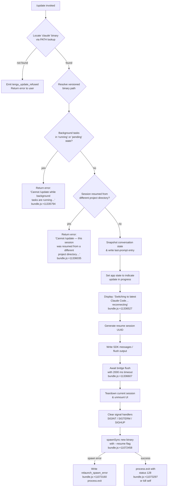

# `/update`

> Analysis basis: CC v2.1.132 bundle.js (AST extraction + Claude interpretation)
> Minimum version: v2.1.132

---

## Overview

The `/update` command upgrades Claude Code to the latest installed version in-place, without ending the current conversation. When invoked, it validates that background tasks are idle and session state is compatible, then tears down the running process, relaunches the new binary with `--resume`, and restores the conversation context in the upgraded session.

---

## Registration

| Field | Value |
|---|---|
| type | `local` |
| name | `update` |
| description | `Switch to the latest version (conversation continues)` |
| isHidden | `true` |
| supportsNonInteractive | `false` |
| module_id | `DOq` |
| load_inline | `true` |
| handler | `KY7` (AsyncFunction, resolved via `module_id` path) |
| `loc_byte_end` | `11337731` |
| `arbor_handler.name` | `KY7` |
| `arbor_handler.kind` | `AsyncFunction` |
| `arbor_handler.resolution_path` | `module_id` |
| `arbor_handler.fqn` | `claude-2.1.132::KY7` |
| `arbor_handler.n_hits` | `0` |

Analysis basis: CC v2.1.132 bundle.js:+11337529 – +11337731

---

## Input Branching

The handler (`KY7`) follows a strict pre-flight → snapshot → relaunch pipeline. Three early-exit gates can abort the update before any process replacement occurs.



---

## Behavioral Spec

### Phase 1 — Pre-flight Checks

```
async function handleUpdate(context):

    # 1. Resolve the binary on PATH
    binaryPath = locateBinaryOnPath("claude")   // calls QM → KK_ → Bun.which
    if binaryPath is null:
        emitTelemetry("tengu_update_refused")
        return earlyError(context)

    # 2. Resolve the versioned installation path
    versionedPath = resolveVersionedPath(binaryPath)
    # resolveVersionedPath uses the home directory (.local/share/versions/bin)
    # Analysis basis: CC v2.1.132 bundle.js:+7389766 (+7389775, +7745975, +7389845)

    # 3. Guard: background tasks
    taskStates = collectTaskStates(Object.values(appState.tasks))
    if any task in taskStates has state "running" or "pending":
        return userError(
            "Cannot /update while background tasks are running — " +
            "wait for them to finish, then try again.")
    # Analysis basis: CC v2.1.132 bundle.js:+11335691, +11335713, +11335794

    # 4. Guard: cross-directory resumed session
    if sessionWasResumedFromDifferentProjectDir(appState):
        return userError(
            "Cannot /update — this session was resumed from a different " +
            "project directory. Restart manually with --resume to continue " +
            "on the latest version.")
    # Analysis basis: CC v2.1.132 bundle.js:+11336035
```

Analysis basis: CC v2.1.132 bundle.js:+11335416, +11335428, +11335578, +11335653

---

### Phase 2 — Conversation Snapshot

```
async function snapshotConversation(context, appState):

    # Persist a "last-prompt" marker so the resumed session can reconstruct context
    appendEntry(conversationLog, type="last-prompt")
    # Analysis basis: CC v2.1.132 bundle.js:+11799154 (dSA → A.appendEntry)

    # Filter out assistant-prefixed ephemeral messages before snapshot
    filteredMessages = messages.filter(
        msg => not msg.id.startsWith("assistant-"))
    # Analysis basis: CC v2.1.132 bundle.js:+11336335

    # Mutate app state: mark update in progress
    currentState = A.getAppState()
    A.setAppState({ ...currentState, updateInProgress: true })
    # Analysis basis: CC v2.1.132 bundle.js:+11336281, +11336417
```

Analysis basis: CC v2.1.132 bundle.js:+11336253, +11336269

---

### Phase 3 — User Notification & Bridge Flush

```
async function notifyAndFlush(outputBridge):

    # Emit the "reconnecting" status message to the user
    displayText("Switching to latest Claude Code… reconnecting")
    # Analysis basis: CC v2.1.132 bundle.js:+11336527

    # Generate a UUID for the resume handshake
    resumeId = generateUUID()   // OOq → yz8.randomUUID
    # Analysis basis: CC v2.1.132 bundle.js:+11336523

    # Write any pending SDK messages
    outputBridge.writeSdkMessages(...)
    # Analysis basis: CC v2.1.132 bundle.js:+11336503

    # Flush the output bridge with a 2000 ms deadline
    await raceWithTimeout(outputBridge.flush(), timeoutMs=2000)
    # "bridge flush" label used in telemetry/logging
    # Analysis basis: CC v2.1.132 bundle.js:+11336597, +11336607, +11336612
```

Analysis basis: CC v2.1.132 bundle.js:+11336523, +11336594

---

### Phase 4 — Process Teardown

```
async function teardownAndRelaunch(versionedPath, resumeArgs):

    # Teardown session object (stops agents, drains queues)
    outputBridge.teardown()
    # Analysis basis: CC v2.1.132 bundle.js:+11336648

    # Full UI + terminal cleanup:
    #   - stop spinner/progress intervals (clearInterval)
    #   - unmount Ink/React UI (H.unmount)
    #   - restore terminal state (writeSync ESC sequences)
    #   - handle terminal-specific quirks for iTerm2, Ghostty (≥1.2.0 / ≥3.6.6)
    performTerminalCleanup()
    # Analysis basis: CC v2.1.132 bundle.js:+11072405, +11072481, +5042447
    # Terminal version thresholds: bundle.js:+3267732, +3267803

    # Flush output with 30 000 ms "relaunch" timeout
    await raceWithTimeout(flushPending(), timeoutMs=30000)
    # label: "flush timeout (relaunch)"   bundle.js:+11072520, +11072526

    # Wait for hook cleanup with "cleanup timeout" label
    await raceWithTimeout(runCleanupHooks(), timeoutMs=...)
    # Analysis basis: CC v2.1.132 bundle.js:+11072571, +11072582

    # Remove all existing signal handlers, then no-op SIGINT/SIGTERM/SIGHUP
    process.removeAllListeners("SIGINT")
    process.removeAllListeners("SIGTERM")
    process.removeAllListeners("SIGHUP")
    process.on("SIGINT",  noop)
    process.on("SIGTERM", noop)
    process.on("SIGHUP",  noop)
    # Analysis basis: CC v2.1.132 bundle.js:+11072845, +11072854, +11072864
    #                 +11072874, +11072904

    # Register beforeExit / exit hooks for final state persistence
    # (writes file via AZ → FNH.writeFileSync)
    # Analysis basis: CC v2.1.132 bundle.js:+11073024, +11073065, +11073157

    # Spawn the new binary synchronously with inherited stdio
    result = spawnSync(versionedPath, ["--resume", resumeId, ...], {
        stdio: "inherit"
    })
    # Analysis basis: CC v2.1.132 bundle.js:+11072931, +11072966, +11072458

    if spawnFailed(result):
        writeFile("relaunch_spawn_error", diagnosticInfo)
        # Analysis basis: CC v2.1.132 bundle.js:+11073160
        process.exit(nonZero)

    # On success, exit current process (status 128) or send kill signal to self
    process.exit(128)   // or process.kill(process.pid, ...)
    # Analysis basis: CC v2.1.132 bundle.js:+11073184, +11073249, +11073297
```

Analysis basis: CC v2.1.132 bundle.js:+11336648, +11072329 – +11073297

---

### Phase 5 — Error Display (Blocked Path)

```
function renderBlockedUpdateError(errorMessage, appState):
    # Formats an error result for the conversational UI.
    # Uses a rolling log buffer (shift oldest, push newest entry)
    # and calls the error logger.
    # Analysis basis: CC v2.1.132 bundle.js:+11336269, +911883, +911901, +911941

    errorResult = buildErrorResult(errorMessage)
    logBuffer.shift()           // drop oldest if at capacity
    logBuffer.push(errorResult)
    logger.logError(errorResult, level="error")
    return errorResult
```

Analysis basis: CC v2.1.132 bundle.js:+911800, +911883, +911941

---

## State & Side Effects

| Item | Detail |
|---|---|
| Telemetry — `tengu_update_refused` | Fired when no valid `claude` binary is found on PATH or pre-flight fails (bundle.js:+11335430) |
| Telemetry — `tengu_scroll_summary` | Fired inside the terminal scroll/progress helper during UI teardown (bundle.js:+5043828) |
| Telemetry — `tengu_amber_creek` | Fired inside the fullscreen-mode detection helper (bundle.js:+3189122) |
| Telemetry — `tengu_pewter_brook` | Fired inside the fullscreen-mode detection helper (bundle.js:+3189030) |
| `appState` changes | `updateInProgress` flag set to `true` before relaunch; read back by resumed session |
| Conversation log | A `last-prompt` entry is appended before teardown to allow context restoration |
| Output bridge | `writeSdkMessages` → `flush` (2 000 ms) → `teardown` called in sequence |
| Terminal state | ESC cursor-save (`\x1b7`) / cursor-restore (`\x1b8`) sequences issued; UI unmounted |
| Process signals | All existing listeners removed; SIGINT / SIGTERM / SIGHUP replaced with no-ops |
| Child process | `spawnSync` with `stdio:"inherit"` — blocks until new binary exits or errors |
| Exit code | Parent exits with code `128` on successful handoff (bundle.js:+11073297) |
| Spawn error file | `relaunch_spawn_error` written to disk when `spawnSync` fails (bundle.js:+11073160) |
| Hook registration | `beforeExit` and `exit` process events registered before spawn for final state persistence |
| Sound | <!-- TODO: not found in depth-2 traversal; needs --depth 4 --> |

---

## Version History

| Version | Change |
|---|---|
| v2.1.132 | Initial analysis. Handler `KY7` (AsyncFunction). Binary resolved via `Bun.which("claude")`. Pre-flight guards for background tasks and cross-directory resumed sessions. Bridge flush timeout 2 000 ms; relaunch flush timeout 30 000 ms. Exit code 128 on successful handoff. |

---

## Common Mistakes

1. **Running `/update` while background tasks are active.** The command will refuse with an explicit error message and emit `tengu_update_refused`. Wait until all background tasks reach a terminal state before invoking `/update`.

2. **Using `/update` in a session that was resumed from a different project directory.** The command detects this condition and blocks the update, instructing the user to restart manually with `--resume`. There is no way to override this guard in-session.

3. **Expecting the current process to continue after `/update`.** The command performs a full `process.exit(128)` (or `process.kill`) after `spawnSync`; the calling process is replaced, not restarted in-place.

4. **Assuming the command is visible in the command palette.** The registration sets `isHidden: true`, so `/update` does not appear in autocomplete or help listings. It must be typed explicitly.

5. **Expecting `/update` to work in non-interactive mode.** `supportsNonInteractive: false` means the command is only available in interactive CLI sessions.

6. **Ignoring the 2 000 ms bridge-flush window.** Any pending output that cannot be flushed within 2 000 ms may be lost. Avoid invoking `/update` immediately after a large output-generating operation.

---

## Appendix — Identifier Mapping

> For bundle debugging only. Identifiers change across versions.

| Identifier | Role |
|---|---|
| `KY7` | Main async handler for `/update` command (entry point) |
| `Sz8` | Binary/PATH resolver — locates the `claude` executable |
| `QM` | PATH lookup helper (calls `KK_`) |
| `KK_` | Thin wrapper around `Bun.which` |
| `Cy` | Versioned installation path resolver |
| `Oq8` | Path composition helper (joins version segments) |
| `dM` | Array normalization utility (`Array.isArray` guard) |
| `B$H` | Home-directory base-path builder |
| `N18` | Home directory accessor (`Bw9.homedir`) |
| `rs` | Alternate versioned-bin path builder |
| `G9` | Background-task state collector |
| `Tr` | Task state constants provider (`bg`, `daemon`, `daemon-worker`) |
| `d` | General utility / type helper |
| `AG` | Path basename + version utility (`NX.basename`, `v6`) |
| `v6` | Version string utility |
| `Bl` | File-system stat / existence check helper |
| `xhA` | Binary self-path resolver (dirname, stat) |
| `_A` | Internal path constant |
| `mK` | File metadata helper |
| `Ne` | Session-context validator |
| `Tn` | Hook-type / attachment filter |
| `DY8` | Hook registry accessor |
| `dSA` | Conversation snapshot writer (`appendEntry`, `last-prompt`) |
| `hK` | Conversation log accessor |
| `N1` | Log entry mutator (`J08.add/delete`, `Object.assign`) |
| `vrq` | Undefined-value sentinel helper |
| `A` | App-state manager (`getAppState`, `setAppState`) |
| `fH` | Error result builder and rolling log-buffer manager |
| `HA` | Error object factory |
| `yH` | String coercion utility |
| `kq` | Log-entry formatter |
| `h1_` | Sub-formatter for log entries |
| `$wL` | Rolling buffer shift/push helper |
| `gy` | App-state field updater |
| `O` | Output bridge (`writeSdkMessages`, `flush`, `teardown`) |
| `Q8` | SDK message serializer |
| `OOq` | Resume UUID generator (`yz8.randomUUID`) |
| `nM` | Timeout-race utility (`setTimeout`, `Promise.race`, `clearTimeout`) |
| `NDH` | Full process teardown + relaunch orchestrator |
| `Ef6` | Interval-clear helper |
| `Z5A` | `clearInterval` wrapper |
| `WUH` | Terminal UI unmount + TTY write helper |
| `H` | Ink/React renderer (`unmount`, `replaceAll`) |
| `mk` | Terminal state helper |
| `nc6` | Low-level TTY write helper (ESC sequences) |
| `Ac6` | Terminal version coercion (Ghostty / iTerm2 checks) |
| `W2H` | Terminal capability helper |
| `CE` | Escape-sequence text replacer |
| `ft6` | Scroll/progress teardown helper |
| `tT` | Timer reference holder |
| `Rr1` | Progress interval reference |
| `Sr1` | Progress state updater (`Date.now`, `Math.max`, `Math.round`) |
| `yr1` | Progress render helper |
| `r_` | Fullscreen-mode detection orchestrator |
| `jyH` | Terminal-type set membership check (`aDL.has`) |
| `Ne8` | Introspection / reflection helper |
| `Id` | Platform-specific mode resolver |
| `k` | Terminal string classifier (trim, toUpperCase, includes) |
| `oq6` | Windows platform detection |
| `uA` | SSH / ConPTY detection helper |
| `WWK` | Fullscreen suppression condition builder |
| `j6` | Fullscreen-mode state machine (`V5H`, `kq6`, `mU`) |
| `RT` | Hook-runner helper (calls `hK`) |
| `ENH` | Hook parallel executor (`Promise.all`, `Array.from`) |
| `AZ` | Spawn-error file writer (`FNH.writeFileSync`) |