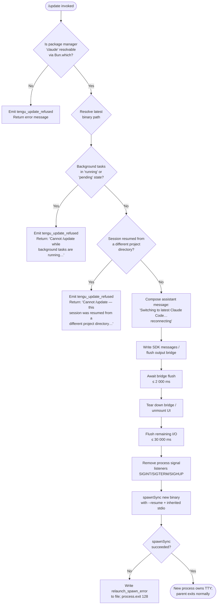

# `/update`

> Analysis basis: CC v2.1.132 bundle.js (AST extraction + Claude interpretation)
> Minimum version: v2.1.132

---

## Overview

The `/update` command switches the running Claude Code process to the latest installed version while preserving the current conversation. It performs a series of preflight checks, serialises session state, flushes and tears down the current I/O bridge, then relaunches the process via `spawnSync` with `--resume`, effectively replacing itself in-place without losing context.

---

## Registration

| Field | Value |
|---|---|
| type | `local` |
| name | `update` |
| description | `Switch to the latest version (conversation continues)` |
| supportsNonInteractive | `false` |
| isHidden | `true` |
| module\_id | `DOq` |

Analysis basis: CC v2.1.132 bundle.js:+11337529

---

## Input Branching

The command handler (`commandEntryPoint`) runs a sequence of ordered preflight guards before initiating the relaunch sequence. Any failed guard aborts the update and emits `tengu_update_refused`.



Analysis basis: CC v2.1.132 bundle.js:+11335330, +11335383, +11335691, +11335713, +11335794, +11336035, +11336523, +11336594, +11336597, +11336648, +11072931, +11073184

---

## Behavioral Spec

### Preflight: Resolve `claude` executable

```
function resolveClaudeExecutable():
    path = Bun.which("claude")
    if path is null or empty:
        return FAILURE
    return path
```

The runtime calls `Bun.which` with the literal string `"claude"` to locate the installed binary.
Analysis basis: CC v2.1.132 bundle.js:+11335330, +998954, +11335333

---

### Preflight: Resolve latest binary path

```
function resolveLatestBinaryPath(resolvedClaudePath):
    // Navigate from the resolved symlink target to the versioned install
    // directory using path join operations.
    // Constructs a path segment including "versions" and index offset 1.
    versionedPath = pathJoin(resolvedClaudePath, "versions", ...)
    localBinPath  = pathJoin(homedir, ".local", "bin", ...)
    return versionedPath, localBinPath
```

The path construction uses the string `"versions"` (Analysis basis: CC v2.1.132 bundle.js:+7745975), the number `1` as a path-segment index offset (Analysis basis: CC v2.1.132 bundle.js:+7745943), and the fragments `".local"` / `"bin"` for the user-local bin prefix (Analysis basis: CC v2.1.132 bundle.js:+7389836, +7389845).

---

### Preflight: Background-task guard

```
function backgroundTaskGuard(appState):
    tasks = Object.values(appState.tasks)
    for each task in tasks:
        if task.status == "running" or task.status == "pending":
            emit telemetry("tengu_update_refused")
            return ERROR(
                "Cannot /update while background tasks are running — " +
                "wait for them to finish, then try again."
            )
    return OK
```

Blocked statuses: `"running"` (Analysis basis: CC v2.1.132 bundle.js:+11335691) and `"pending"` (Analysis basis: CC v2.1.132 bundle.js:+11335713).
Error message literal: Analysis basis: CC v2.1.132 bundle.js:+11335794.

---

### Preflight: Cross-directory resume guard

```
function crossDirectoryResumeGuard(appState, currentWorkingDir):
    if appState was resumed AND appState.projectDir != currentWorkingDir:
        emit telemetry("tengu_update_refused")
        return ERROR(
            "Cannot /update — this session was resumed from a different " +
            "project directory. Restart manually with --resume to continue " +
            "on the latest version."
        )
    return OK
```

Error message literal: Analysis basis: CC v2.1.132 bundle.js:+11336035.
The `--resume` flag string is also used later during actual relaunch: Analysis basis: CC v2.1.132 bundle.js:+11072458.

---

### Session serialisation: write last-prompt entry

```
function serialiseLastPrompt(conversationLog):
    entry = buildLastPromptEntry(conversationLog)   // uses key "last-prompt"
    appendEntry(conversationLog, entry)
```

The entry key `"last-prompt"` is appended to the persistent conversation store so the resumed process can reload context.
Analysis basis: CC v2.1.132 bundle.js:+11799154, +11799174

---

### Transition message injection

```
function injectTransitionMessage():
    message = {
        role: "assistant",
        content: [{ type: "text",
                    text: "Switching to latest Claude Code… reconnecting" }]
    }
    writeSDKMessages([message])
    generateMessageUUID()   // via crypto.randomUUID
```

The user-visible transition string is `"Switching to latest Claude Code… reconnecting"`.
Analysis basis: CC v2.1.132 bundle.js:+11336527, +11336523.
UUID generation uses `crypto.randomUUID` (identifier `OOq` → `generateMessageUUID`).
Analysis basis: CC v2.1.132 bundle.js:+11334421.

---

### Bridge flush and teardown

```
function flushAndTeardown(bridge, timeout_ms):
    // Phase 1: flush with short deadline
    await withTimeout(bridge.flush(), 2000, label="bridge flush")

    // Phase 2: full bridge teardown
    bridge.teardown()

    // Phase 3: unmount UI render tree
    unmountUI()

    // Phase 4: write remaining sync output
    writeSync(pendingOutput)
```

Bridge flush timeout: **2 000 ms** (Analysis basis: CC v2.1.132 bundle.js:+11336607).
Flush label: `"bridge flush"` (Analysis basis: CC v2.1.132 bundle.js:+11336612).
Call order — `O.flush` → `O.teardown` → UI unmount → sync write:
Analysis basis: CC v2.1.132 bundle.js:+11336597, +11336648, +11072481.

---

### Relaunch: signal cleanup and spawnSync

```
function relaunchProcess(newBinaryPath, sessionArgs):
    // Remove all existing signal listeners to avoid double-handling
    process.removeAllListeners("SIGINT")
    process.removeAllListeners("SIGTERM")
    process.removeAllListeners("SIGHUP")

    // Register minimal pass-through listeners before exec
    process.on("beforeExit", ...)
    process.on("exit", ...)

    // Flush I/O with extended deadline
    await withTimeout(Promise.all([flushAll()]), 30000,
                      label="flush timeout (relaunch)")

    // Await cleanup hooks with deadline
    await withTimeout(cleanupHooks(), label="cleanup timeout")

    // Exec replacement process
    result = spawnSync(newBinaryPath,
                       [...sessionArgs, "--resume"],
                       { stdio: "inherit" })

    if result indicates error:
        writeFileSync(errorLogPath, "relaunch_spawn_error")
        process.exit(128)
    else:
        propagate result signal/status to parent via process.kill / process.exit
```

Relaunch flush timeout: **30 000 ms** (Analysis basis: CC v2.1.132 bundle.js:+11072520).
Flush label: `"flush timeout (relaunch)"` (Analysis basis: CC v2.1.132 bundle.js:+11072526).
Cleanup label: `"cleanup timeout"` (Analysis basis: CC v2.1.132 bundle.js:+11072582).
Signals removed: `"SIGINT"`, `"SIGTERM"`, `"SIGHUP"` (Analysis basis: CC v2.1.132 bundle.js:+11072845, +11072854, +11072864).
stdio mode: `"inherit"` (Analysis basis: CC v2.1.132 bundle.js:+11072966).
Error tag written on failure: `"relaunch_spawn_error"` (Analysis basis: CC v2.1.132 bundle.js:+11073160).
Exit code on spawn failure: **128** (Analysis basis: CC v2.1.132 bundle.js:+11073297).

---

### Error file write on spawn failure

```
function writeSpawnError(errorDir, tag):
    errorFilePath = pathJoin(errorDir, tag)   // IG8.join
    writeFileSync(errorFilePath, "relaunch_spawn_error")
```

Analysis basis: CC v2.1.132 bundle.js:+11073157, +149948, +149966, +11073160.

---

### Scroll summary telemetry (during teardown)

During UI unmount the scroll-summary telemetry event is emitted.

```
function emitScrollSummary(scrollState):
    emit telemetry("tengu_scroll_summary", scrollState)
```

Analysis basis: CC v2.1.132 bundle.js:+5043828.

---

## State & Side Effects

| Item | Detail |
|---|---|
| Telemetry — refused | `tengu_update_refused` emitted on any preflight failure (Analysis basis: CC v2.1.132 bundle.js:+11335430) |
| Telemetry — scroll | `tengu_scroll_summary` emitted during UI unmount phase (Analysis basis: CC v2.1.132 bundle.js:+5043828) |
| appState reads | `A.getAppState()` called to inspect task statuses and resume-directory metadata (Analysis basis: CC v2.1.132 bundle.js:+11336281) |
| appState writes | `A.setAppState()` called to mark session as transitioning before relaunch (Analysis basis: CC v2.1.132 bundle.js:+11336417) |
| SDK message write | `O.writeSdkMessages()` injects the transition assistant message into the output stream (Analysis basis: CC v2.1.132 bundle.js:+11336503) |
| Bridge flush | `O.flush()` with 2 000 ms timeout, then `O.teardown()` (Analysis basis: CC v2.1.132 bundle.js:+11336597, +11336648) |
| UI unmount | React/Ink tree unmounted via `H.unmount` (Analysis basis: CC v2.1.132 bundle.js:+11072481) |
| Signal handler cleanup | All listeners for `SIGINT`, `SIGTERM`, `SIGHUP` removed before exec (Analysis basis: CC v2.1.132 bundle.js:+11072874) |
| Conversation persistence | `"last-prompt"` entry appended to conversation log via `A.appendEntry` (Analysis basis: CC v2.1.132 bundle.js:+11799154) |
| Error file write | `relaunch_spawn_error` written to file system on `spawnSync` failure (Analysis basis: CC v2.1.132 bundle.js:+11073160) |
| Process replacement | `L5q.spawnSync` replaces current process; on success parent exits via `process.exit` or `process.kill` (Analysis basis: CC v2.1.132 bundle.js:+11072931, +11073184, +11073249) |
| Sound | <!-- TODO: not found in depth-2 traversal; needs --depth 4 --> |

---

## Version History

| Version | Change |
|---|---|
| v2.1.132 | Initial analysis. Build timestamp `2026-05-06T17:56:43Z`, commit `f9c2aef1b03555fabbb4ec60302d6750f2ff689e` (Analysis basis: CC v2.1.132 bundle.js:+11337263, +11337294) |

---

## Common Mistakes

1. **Running `/update` while background tasks are active.** The command refuses immediately if any task has status `"running"` or `"pending"`. Wait for all background tasks to complete before issuing `/update`.

2. **Expecting `/update` to work in a cross-directory resumed session.** If the session was resumed from a directory other than the current working directory, the command will refuse. In that case, exit and relaunch manually with `--resume` pointing at the correct project directory.

3. **Using `/update` in non-interactive (scripted) mode.** The `supportsNonInteractive` field is `false`; invoking `/update` from a script or pipe will not be accepted. (Analysis basis: CC v2.1.132 bundle.js:+11337529)

4. **Assuming the command is discoverable via `/help`.** The command is registered as `isHidden: true` and will not appear in the command listing presented to users. (Analysis basis: CC v2.1.132 bundle.js:+11337529)

5. **Interrupting the process during the flush window.** There is a 2 000 ms bridge-flush window and a subsequent 30 000 ms full-flush window before the new process is spawned. Sending `SIGINT` or closing the terminal during this window may result in a `relaunch_spawn_error` file being written and an exit code of 128.

---

## Appendix — Identifier Mapping

> For bundle debugging only. Identifiers change across versions.

| Identifier | Role |
|---|---|
| `Sz8` | Command entry point / top-level handler for `/update` |
| `QM` | Wrapper that calls `Bun.which` to resolve the `claude` executable |
| `KK_` | Inner resolver that invokes `Bun.which("claude")` |
| `Cy` | Latest-binary path resolution function |
| `Oq8` | Path construction helper — builds versioned install path |
| `rs` | Path construction helper — builds user `.local/bin` path |
| `dM` | Array normalisation utility (wraps `Array.isArray`) |
| `KY7` | Core update orchestrator — runs guards then initiates relaunch |
| `G9` | Process-type / runtime mode classifier |
| `Tr` | Mode constant resolver (`"bg"`, `"daemon"`, `"daemon-worker"`) |
| `d` | General-purpose logging / debug utility |
| `AG` | Binary basename extractor (`NX.basename` wrapper) |
| `v6` | Async task / promise utility |
| `Bl` | File-system path utility |
| `xhA` | Pre-relaunch hook runner (calls `M5q.dirname`, `mK`) |
| `_A` | Hook registry accessor |
| `mK` | Individual hook executor |
| `Ne` | Conversation log accessor |
| `Tn` | Hook-type set membership checker (`aW7.has`) |
| `DY8` | Hook-type constant provider |
| `dSA` | Last-prompt serialiser — appends `"last-prompt"` entry |
| `hK` | Conversation entry builder |
| `A` | App-state store interface (`getAppState`, `setAppState`, `appendEntry`) |
| `fH` | Output / network traffic manager (`"essential-traffic"`) |
| `HA` | Error normalisation helper |
| `yH` | String coercion helper |
| `kq` | Traffic-queue consumer (`h1_`) |
| `$wL` | Circular queue manager (shift / push on `uv6`) |
| `gy` | Session-ID / assistant-message-ID prefixer (`"assistant-"`) |
| `O` | I/O bridge object (`writeSdkMessages`, `flush`, `teardown`) |
| `Q8` | Background-session stop-state writer (`"stopped"`, `"background session"`) |
| `OOq` | UUID generator (wraps `crypto.randomUUID`) |
| `nM` | Promise-race timeout utility (`setTimeout` / `clearTimeout`) |
| `NDH` | Relaunch executor — unmounts UI, cleans signals, calls `spawnSync`, exits |
| `Ef6` | Sync-write output flusher (calls `Z5A`) |
| `WUH` | UI teardown helper — `writeSync`, `H.unmount`, `mk`, `nc6`, `yH` |
| `ft6` | Scroll-summary emitter — fires `tengu_scroll_summary` |
| `RT` | Post-relaunch conversation-log flusher |
| `ENH` | Parallel cleanup runner (`Promise.all` + `Array.from` over `H`) |
| `AZ` | Spawn-error file writer (`FNH.writeFileSync` via `IG8.join`) |