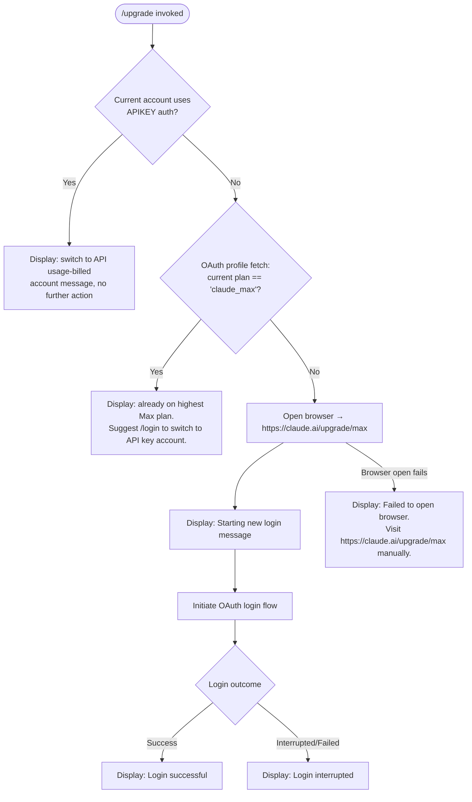

# `/upgrade`

> Analysis basis: CC v2.1.132 bundle.js (AST extraction + Claude interpretation)
> Minimum version: v2.1.132

---

## Overview

The `/upgrade` command guides a Claude Code user from a standard Claude account to the **Claude Max** subscription plan, which offers higher rate limits and increased access to the Opus model family. When invoked, the command inspects the current account's subscription state, opens the upgrade URL in the system browser, and then initiates a fresh OAuth login flow so that the newly upgraded entitlements are picked up immediately.

---

## Registration

| Field | Value |
|---|---|
| type | `local-jsx` |
| name | `upgrade` |
| description | `Upgrade to Max for higher rate limits and more Opus` |
| module\_id | `gOq` |

Analysis basis: CC v2.1.132 bundle.js:+11357547

---

## Input Branching

The command performs two independent guard checks before taking action, then proceeds with the browser-open and re-login sequence.



Analysis basis: CC v2.1.132 bundle.js:+11356593, +11356679, +11356822, +11356923, +11357076, +11357148, +11357267, +11357286, +11357340

---

## Behavioral Spec

### Guard 1 — API Key Auth Check

Before any network activity, the command checks whether the current session is authenticated via a raw Anthropic API key rather than OAuth.

```
function checkNotApiKeyAuth(sessionState):
    if sessionState has ANTHROPIC_API_KEY set
    and sessionState.authHelper == "apiKeyHelper":
        return AUTH_MODE_API_KEY
    else:
        return AUTH_MODE_OAUTH
```

If `AUTH_MODE_API_KEY` is returned the command exits early with a message directing the user to run `/login` to switch to an API-usage-billed account. No browser is opened and no network request is made.

Analysis basis: CC v2.1.132 bundle.js:+2866652, +2866677, +2866642

---

### Guard 2 — Subscription Plan Lookup (OAuth Profile Fetch)

If the session is OAuth-backed, the command fetches the user's current subscription tier from the Anthropic profile endpoint.

```
function fetchOAuthProfile(oauthToken):
    request = HTTP GET <profile endpoint>
        headers: { "Content-Type": "application/json" }
        timeout: 10 000 ms

    on success:
        emit telemetry event "oauth_profile_fetch"
        return profile.plan          // e.g. "max", "default_claude_max_20x"

    on failure:
        emit telemetry event "oauth_profile_token_failed"
        log error
        return null
```

Timeout value: **10 000 ms** (bundle.js:+1979071)

If the returned plan value equals `"claude_max"` (bundle.js:+11356822), the command displays the "already on the highest Max subscription plan" message (bundle.js:+11356923) and exits without opening the browser.

Analysis basis: CC v2.1.132 bundle.js:+1979028, +1979043, +1979071, +1979087, +1979151, +11356822, +11356923

---

### OAuth Environment Validation

Before making any OAuth request, the environment URL is validated to prevent requests to unapproved endpoints.

```
function validateOAuthEnvironment(envUrl):
    allowed = ["local", "staging", "prod"]

    normalized = envUrl with protocol prefix stripped

    if normalized not in allowed:
        if CLAUDE_CODE_CUSTOM_OAUTH_URL is set:
            raise Error("CLAUDE_CODE_CUSTOM_OAUTH_URL is not an approved endpoint.")
        else:
            raise Error(...)

    suffix applied: "-custom-oauth" appended to non-standard identifiers
```

Analysis basis: CC v2.1.132 bundle.js:+891587, +891612, +891642, +891772, +892288

---

### Browser Open — Platform Dispatch

Once both guards pass, the command opens `https://claude.ai/upgrade/max` (bundle.js:+11357076) in the default system browser. The launcher is chosen by platform:

```
function openUrl(url):
    validate url.protocol in ["http:", "https:"]
        // raises Error otherwise

    platform = process.platform

    if platform == "darwin":
        spawn("open", [url])

    else if platform == "win32":
        spawn("rundll32", ["url,OpenURL", url])

    else:                          // Linux / other
        spawn("xdg-open", [url])

    on spawn failure:
        display "Failed to open browser. Please visit https://claude.ai/upgrade/max to upgrade."
```

URL scheme check values: `"http:"` (bundle.js:+7355286), `"https:"` (bundle.js:+7355308)
Platform literals: `"darwin"` (bundle.js:+7355558), `"win32"` (bundle.js:+7355574)
Windows launcher: `"rundll32"` / `"url,OpenURL"` (bundle.js:+7355658, +7355670)
macOS launcher: `"open"` (bundle.js:+7355732)
Linux launcher: `"xdg-open"` (bundle.js:+7355739)
Failure message: bundle.js:+11357340

<!-- TODO: spawn retry count / backoff not found in depth-2 traversal; needs --depth 4 -->

---

### Re-Login Flow After Browser Open

Immediately after opening the browser, the command starts a new OAuth login sequence so that upgraded entitlements are reflected in the active session without requiring the user to restart Claude Code.

```
function initiatePostUpgradeLogin(appState):
    display "Starting new login following /upgrade. Exit with Ctrl-C to use existing account."

    result = await oauthLoginFlow(appState)

    if result.success:
        display "Login successful"
        appState.onChangeAPIKey(result.newKey)   // persists new credentials
    else:
        display "Login interrupted"
```

Informational message: bundle.js:+11357148
Success message: bundle.js:+11357267
Interrupted message: bundle.js:+11357286

Analysis basis: CC v2.1.132 bundle.js:+11357073, +11357244, +11357263, +11357319

---

### Animated / Deferred UI Helper

A helper function provides a randomized delay used for UI animation or polling during the login wait state.

```
function deferredUiStep():
    delay = Math.random() * 2    // seconds, float in [0, 2)
    setTimeout(callback, delay)
```

Random multiplier: `2` (bundle.js:+12264283)

Analysis basis: CC v2.1.132 bundle.js:+12264285, +12264322

---

### Telemetry Feature Events

Two generic feature-outcome events are emitted by lower-level OAuth helpers (not by the `/upgrade` command itself):

```
function featureSuccess(context):
    emit telemetry("tengu_feature_ok", context)

function featureFailure(context):
    emit telemetry("tengu_feature_sad", context)
```

Analysis basis: CC v2.1.132 bundle.js:+906461, +906587

---

## State & Side Effects

| Item | Detail |
|---|---|
| Telemetry — OAuth profile fetch success | `tengu_feature_ok` (bundle.js:+906461) |
| Telemetry — OAuth profile fetch failure | `tengu_feature_sad` (bundle.js:+906587) |
| Telemetry — profile fetch attempt | `oauth_profile_fetch` (bundle.js:+1979087) |
| Telemetry — profile token failure | `oauth_profile_token_failed` (bundle.js:+1979151) |
| Browser side effect | Opens `https://claude.ai/upgrade/max` in system default browser |
| appState changes | `onChangeAPIKey` called with refreshed OAuth credentials on successful re-login (bundle.js:+11357244) |
| Credential persistence | New API key / OAuth token written to app state after successful login |
| Sound | <!-- TODO: not found in depth-2 traversal; needs --depth 4 --> |
| Hook registration | <!-- TODO: not found in depth-2 traversal; needs --depth 4 --> |
| setTimeout usage | Used in both the browser-open path and the deferred UI helper; no fixed retry schedule observed at depth 2 |

---

## Version History

| Version | Change |
|---|---|
| v2.1.132 | Initial analysis. Command registered in module `gOq`; targets `https://claude.ai/upgrade/max`; checks for `claude_max` and `default_claude_max_20x` plan identifiers. |

---

## Common Mistakes

1. **Running `/upgrade` while authenticated with an API key** — The command detects `ANTHROPIC_API_KEY` / `apiKeyHelper` and exits immediately with no browser action. Users on API-key auth must switch account types via `/login` first; `/upgrade` cannot upgrade an API-key-billed account.

2. **Interrupting the post-upgrade login prompt with Ctrl-C** — The browser upgrade may have succeeded, but if the re-login step is interrupted, Claude Code will continue using the old credentials. The user must run `/login` manually to pick up the new Max entitlements.

3. **Already on the top-tier Max plan** — If the OAuth profile returns `claude_max`, the command exits with an informational message and does not re-open the browser. Expecting to be redirected to a higher tier will not work; the user is advised to switch to an API-usage-billed account via `/login` for additional capacity.

4. **Browser fails to open on headless / server environments** — The command falls back to printing the upgrade URL, but does not offer an alternative OAuth device-flow. Users must visit `https://claude.ai/upgrade/max` manually and then run `/login` to refresh credentials.

5. **Custom OAuth URL misconfiguration** — If `CLAUDE_CODE_CUSTOM_OAUTH_URL` is set to a non-approved endpoint, the OAuth environment validator throws an error before any request is made, and the entire `/upgrade` flow is aborted.

---

## Appendix — Identifier Mapping

> For bundle debugging only. Identifiers change across versions.

| Identifier | Role |
|---|---|
| `DX6` | Top-level `/upgrade` command handler (render / execute function) |
| `R_` | Auth-mode resolver — determines whether session uses OAuth or API key |
| `nY` | OAuth session/credential builder; assembles token, key, and helper fields |
| `fU` | Boolean coercion utility used during auth resolution |
| `zr` | OAuth profile fetch orchestrator — calls HTTP, parses plan, emits telemetry |
| `__` | OAuth environment URL validator — checks against approved endpoint list |
| `SH` | Feature-success telemetry emitter (`tengu_feature_ok`) |
| `Z8` | Feature-failure telemetry emitter (`tengu_feature_sad`) |
| `fH` | OAuth token exchange / profile fetch inner handler; pushes results, logs errors |
| `LL` | Browser URL open orchestrator — validates scheme, dispatches by platform |
| `T04` | URL scheme validator (enforces `http:` / `https:`) |
| `Y8` | Platform-specific process spawner for browser launch |
| `A` | App-state / props object passed into the command component; exposes `onChangeAPIKey` |
| `H` | Deferred UI animation helper using `Math.random` + `setTimeout` |