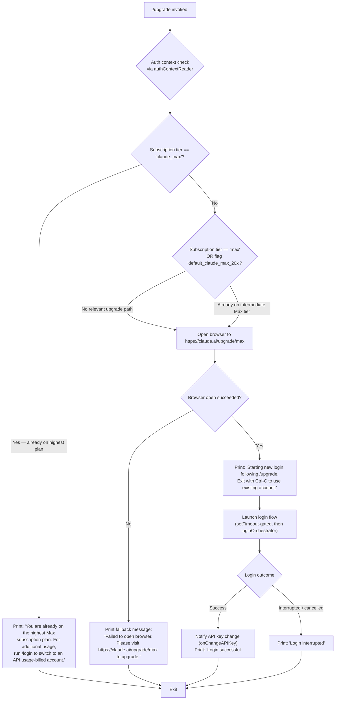

# `/upgrade`

> Analysis basis: CC v2.1.132 bundle.js (AST extraction + Claude interpretation)
> Minimum version: v2.1.132

---

## Overview

The `/upgrade` command guides the current user through upgrading their Claude subscription to the Claude Max plan, which provides higher rate limits and access to Opus-class models. It detects the existing subscription tier, guards against redundant upgrades, opens the upgrade URL in the system browser, and then initiates a fresh login flow to apply the new entitlements. On success it displays confirmation; on failure it falls back to a printed URL so the user can upgrade manually.

---

## Registration

| Field | Value |
|---|---|
| type | `local-jsx` |
| name | `upgrade` |
| description | `Upgrade to Max for higher rate limits and more Opus` |
| module\_id | `gOq` |
| load\_inline | `true` |
| handler (Arbor) | `DX6` (AsyncFunction, resolved via `module_id`) |
| loc\_byte span | `11357547`–`11357807` |
| `loc_byte_end` | `11357807` |
| `arbor_handler.name` | `DX6` |
| `arbor_handler.kind` | `AsyncFunction` |
| `arbor_handler.resolution_path` | `module_id` |
| `arbor_handler.fqn` | `claude-2.1.132::DX6` |
| `arbor_handler.n_hits` | `0` |

Analysis basis: CC v2.1.132 bundle.js:+11357547

---

## Input Branching

The handler (`DX6`) reads the active authentication context and subscription state before deciding what action to take.



Analysis basis: CC v2.1.132 bundle.js:+11356593 (handler entry `DX6`), +11356822 (`claude_max` sentinel), +11356923 (already-on-max message), +11357076 (upgrade URL), +11357148 (login preamble), +11357267 (success message), +11357286 (interrupted message), +11357340 (browser-failure fallback)

---

## Behavioral Spec

### 1. Auth Context & Subscription Tier Resolution

At invocation, the handler calls the auth-context reader (mapped to `R_` → `nY`) to retrieve the current authentication state, which includes the subscription tier string.

```
async function upgradeHandler(commandArgs):
    authContext = await readAuthContext()          // R_ -> nY pipeline
    currentTier = authContext.subscriptionTier     // e.g. "claude_max", "max", "pro", etc.
    featureFlags = authContext.featureFlags        // includes "default_claude_max_20x"
```

The auth context reader (`nY`) checks for:
- `ANTHROPIC_API_KEY` environment variable (Analysis basis: CC v2.1.132 bundle.js:+2868107)
- `apiKeyHelper` configuration (Analysis basis: CC v2.1.132 bundle.js:+2868201)
- `CLAUDE_CODE_OAUTH_TOKEN_FILE_DESCRIPTOR` for OAuth token (Analysis basis: CC v2.1.132 bundle.js:+1992170)
- `CLAUDE_CODE_API_KEY_FILE_DESCRIPTOR` for file-descriptor-based API key (Analysis basis: CC v2.1.132 bundle.js:+1992314)
- If neither `ANTHROPIC_API_KEY` nor an OAuth token is available, raises: `"ANTHROPIC_API_KEY or CLAUDE_CODE_OAUTH_TOKEN env var is required"` (Analysis basis: CC v2.1.132 bundle.js:+2868528)

Platform exclusions checked during context resolution include `claude-desktop` (Analysis basis: CC v2.1.132 bundle.js:+2865726) and `claude-vscode` (Analysis basis: CC v2.1.132 bundle.js:+46102).

### 2. Already-on-Max Guard

```
function checkAlreadyMaxSubscriber(currentTier):
    if currentTier == "claude_max":
        return ALREADY_MAX
    return PROCEED
```

Constant `"claude_max"` (Analysis basis: CC v2.1.132 bundle.js:+11356822).

When `ALREADY_MAX`, the command prints verbatim (paraphrased here per writing rules): a message indicating the user is already on the highest Max plan and suggesting `/login` to switch to an API usage-billed account instead. (Analysis basis: CC v2.1.132 bundle.js:+11356923). The command then returns without further action.

The intermediate tier check uses the string `"max"` and the feature flag `"default_claude_max_20x"` to distinguish partial Max subscriptions from the ceiling tier. (Analysis basis: CC v2.1.132 bundle.js:+11356679, +11356704)

### 3. Browser Launch

```
function openUpgradeURL():
    url = "https://claude.ai/upgrade/max"
    success = launchBrowserForURL(url)    // platform-specific dispatcher (LL -> Y8)
    return success
```

The browser-opening utility (`LL` → `Y8` → `PA`) dispatches per OS:
- **macOS** (`darwin`): uses `open` (Analysis basis: CC v2.1.132 bundle.js:+7355732)
- **Windows** (`win32`): uses `rundll32 url,OpenURL` (Analysis basis: CC v2.1.132 bundle.js:+7355658, +7355670)
- **Linux / other**: uses `xdg-open` (Analysis basis: CC v2.1.132 bundle.js:+7355739)

Only `http:` and `https:` scheme URLs are accepted; non-matching URLs cause an error before any shell invocation. (Analysis basis: CC v2.1.132 bundle.js:+7355286, +7355308)

If the launch fails, the command prints a fallback message instructing the user to navigate to `https://claude.ai/upgrade/max` manually. (Analysis basis: CC v2.1.132 bundle.js:+11357340)

### 4. Login Flow Orchestration

After a successful browser launch, the handler initiates a new login flow so that upgraded entitlements are applied to the running session.

```
async function initiatePostUpgradeLogin():
    printMessage("Starting new login following /upgrade. Exit with Ctrl-C to use existing account.")
    await delay(via setTimeout)           // gated via setTimeout (loc +11356908)
    result = await oauthLoginOrchestrator()    // zr -> OAuth flow
    if result.success:
        notifyAPIKeyChange()               // A.onChangeAPIKey (loc +11357244)
        printMessage("Login successful")   // loc +11357267
    else:
        printMessage("Login interrupted")  // loc +11357286
```

Analysis basis: CC v2.1.132 bundle.js:+11357073, +11357148, +11357244

The OAuth orchestrator (`zr`) performs:
1. Calls the URL builder utility to construct the OAuth endpoint URL, validating that `CLAUDE_CODE_CUSTOM_OAUTH_URL` (if set) is an approved endpoint — otherwise throws: `"CLAUDE_CODE_CUSTOM_OAUTH_URL is not an approved endpoint."` (Analysis basis: CC v2.1.132 bundle.js:+891772)
2. Approved environment values: `"prod"`, `"local"`, `"staging"` (Analysis basis: CC v2.1.132 bundle.js:+890433, +891587, +891612)
3. Issues HTTP requests with `Content-Type: application/json` and a 10,000 ms timeout (Analysis basis: CC v2.1.132 bundle.js:+1979028, +1979043, +1979071)
4. Profile-fetch telemetry events: `oauth_profile_fetch` and `oauth_profile_token_failed` (Analysis basis: CC v2.1.132 bundle.js:+1979087, +1979151)
5. Maintains a sliding window of the last 20 history entries via a rotate-and-push buffer (`$wL`: shift + push) (Analysis basis: CC v2.1.132 bundle.js:+1993656)

Local OAuth development endpoints include `http://localhost:8000`, `http://localhost:4000`, `http://localhost:3000`, and `http://localhost:8205`. (Analysis basis: CC v2.1.132 bundle.js:+890707, +890794, +890884, +891467)

The MCP toolbox route template `/v1/toolbox/shttp/mcp/{server_id}` is referenced within the OAuth URL construction path. (Analysis basis: CC v2.1.132 bundle.js:+891506)

A UUID constant `22422756-60c9-4084-8eb7-27705fd5cf9a` appears in the OAuth registration context. (Analysis basis: CC v2.1.132 bundle.js:+891381)

### 5. Background Spare Process Management

The `onChangeAPIKey` callback (invoked on login success) triggers background spare-process lifecycle management. The spare-process manager (`H`) uses:
- `Math.random` seeding with a constant of `2` for jitter (Analysis basis: CC v2.1.132 bundle.js:+12264283, +12264285)
- `setTimeout` with a 2,000 ms delay (Analysis basis: CC v2.1.132 bundle.js:+14129682)
- A recursive self-scheduling loop (`Y` calling `Y`) for keep-alive (Analysis basis: CC v2.1.132 bundle.js:+14129687)
- Disposable resource cleanup via `$.dispose` (Analysis basis: CC v2.1.132 bundle.js:+14129491)
- Windows platform path detection using `"windows"` string (Analysis basis: CC v2.1.132 bundle.js:+14129552)

---

## State & Side Effects

| Item | Detail |
|---|---|
| Telemetry — `tengu_feature_ok` | Fired on successful feature-flag read path (Analysis basis: CC v2.1.132 bundle.js:+906461) |
| Telemetry — `tengu_feature_sad` | Fired on feature-flag read failure path (Analysis basis: CC v2.1.132 bundle.js:+906587) |
| Telemetry — `tengu_bg_spare_enable` | Fired when background spare process is enabled after login (Analysis basis: CC v2.1.132 bundle.js:+14129457) |
| Telemetry — `tengu_bg_spare_spawn` | Fired when a background spare process is spawned (Analysis basis: CC v2.1.132 bundle.js:+14129749) |
| OAuth telemetry — `oauth_profile_fetch` | Fired on OAuth profile retrieval attempt (Analysis basis: CC v2.1.132 bundle.js:+1979087) |
| OAuth telemetry — `oauth_profile_token_failed` | Fired when OAuth profile token retrieval fails (Analysis basis: CC v2.1.132 bundle.js:+1979151) |
| Error logging | Errors during OAuth/history processing are forwarded to `EQ.logError` with level `"error"` (Analysis basis: CC v2.1.132 bundle.js:+911941, +911916) |
| `onChangeAPIKey` callback | Invoked on successful login to propagate the new API key/token to the active session (Analysis basis: CC v2.1.132 bundle.js:+11357244) |
| Browser subprocess | Spawns a platform-appropriate subprocess (`open` / `rundll32` / `xdg-open`) to navigate to the upgrade page |
| `setTimeout` (login gate) | A `setTimeout`-based delay gates the start of the login orchestration flow (Analysis basis: CC v2.1.132 bundle.js:+11356908) |
| Background spare process | Spawned or recycled after successful API-key change via `H` manager with 2,000 ms scheduling interval |
| History buffer | OAuth session history is maintained as a circular buffer capped at 20 entries (Analysis basis: CC v2.1.132 bundle.js:+1993656) |
| appState changes | <!-- TODO: not found in depth-2 traversal; needs --depth 4 --> |
| Sound | <!-- TODO: not found in depth-2 traversal; needs --depth 4 --> |

---

## Version History

| Version | Change |
|---|---|
| v2.1.132 | Initial analysis |

---

## Common Mistakes

1. **Running `/upgrade` when already subscribed to Claude Max** — The command detects the `"claude_max"` tier and exits immediately with an advisory message. Use `/login` instead to switch to an API usage-billed account.
2. **Cancelling the browser prompt mid-flow** — If the browser cannot be opened (e.g., headless environment, no display), the command falls back to printing the upgrade URL. The login step is never reached in this case; the user must visit the URL manually.
3. **Interrupting the login step with Ctrl-C** — If the user exits during the OAuth login flow, the command prints `"Login interrupted"` and the session retains the old credentials. No partial upgrade state is saved; `/upgrade` can be run again safely.
4. **Using an unapproved custom OAuth URL** — If `CLAUDE_CODE_CUSTOM_OAUTH_URL` is set to a non-allowlisted value, the OAuth orchestrator throws immediately and the upgrade login cannot complete.
5. **Missing auth environment variables** — If neither `ANTHROPIC_API_KEY` nor an OAuth token source is available, the auth-context resolution step raises an error before the upgrade flow even begins.

---

## Appendix — Identifier Mapping

> For bundle debugging only. Identifiers change across versions.

| Identifier | Role |
|---|---|
| `DX6` | Main upgrade command handler (AsyncFunction, module `gOq`) |
| `R_` | Auth context reader — top-level entry called by `DX6` |
| `nY` | Auth context resolver — resolves API key / OAuth token sources |
| `tL` | Generic platform/environment utility used across auth and flag resolution |
| `yH` | Low-level string conversion / environment variable accessor |
| `GS` | Auth method selector — dispatches based on auth type (OAuth, API key, etc.) |
| `db6` | OAuth token file-descriptor reader |
| `B96` | Boolean/conditional utility used in auth context branching |
| `Dr` | OAuth token environment reader |
| `zx` | Feature-flag settings accessor (`flagSettings` key) |
| `o$` | API-key resolution pipeline — checks env vars and helper config |
| `co8` | `apiKeyHelper` config reader |
| `HZ` | `none`-sentinel auth-mode detector |
| `$aH` | VSCode platform guard (`claude-vscode`) |
| `_B8` | File-descriptor-based API key reader (`CLAUDE_CODE_API_KEY_FILE_DESCRIPTOR`) |
| `R6` | Timestamp / session-record constructor (uses `Date.now`) |
| `qS` | History buffer slicer (last 20 entries) |
| `fU` | Boolean coercion utility |
| `zr` | OAuth login orchestrator — builds URL, fetches profile, manages token |
| `__` | OAuth URL builder — validates allowed endpoints, applies environment suffix |
| `W__` | OAuth base-URL selector for `prod` / `local` / `staging` |
| `eDL` | OAuth environment-suffix appender |
| `SH` | `tengu_feature_ok` telemetry emitter |
| `d` | Core telemetry dispatcher |
| `Z8` | `tengu_feature_sad` telemetry emitter |
| `fH` | HTTP request executor for OAuth profile fetch |
| `HA` | HTTP response/error normaliser |
| `kq` | OAuth profile response parser |
| `h1_` | Profile field extractor |
| `$wL` | OAuth history circular-buffer manager (shift + push, cap 20) |
| `LL` | Browser-launch dispatcher — selects platform handler |
| `T04` | URL scheme validator (`http:` / `https:`) |
| `Y8` | Platform-specific browser launcher entry |
| `PA` | Browser process spawner (wraps OS command invocation) |
| `rJH` | Low-level process-spawn utility with promise wrapping |
| `Y` | Background spare-process scheduler (self-recursive, 2,000 ms interval) |
| `ujL` | Process argument string builder |
| `N6` | Async-context store accessor |
| `Qv6` | `gv6.getStore` wrapper for async-local-storage retrieval |
| `_A` | Async context fallback resolver |
| `H` | Background spare-process manager (Math.random jitter, setTimeout) |