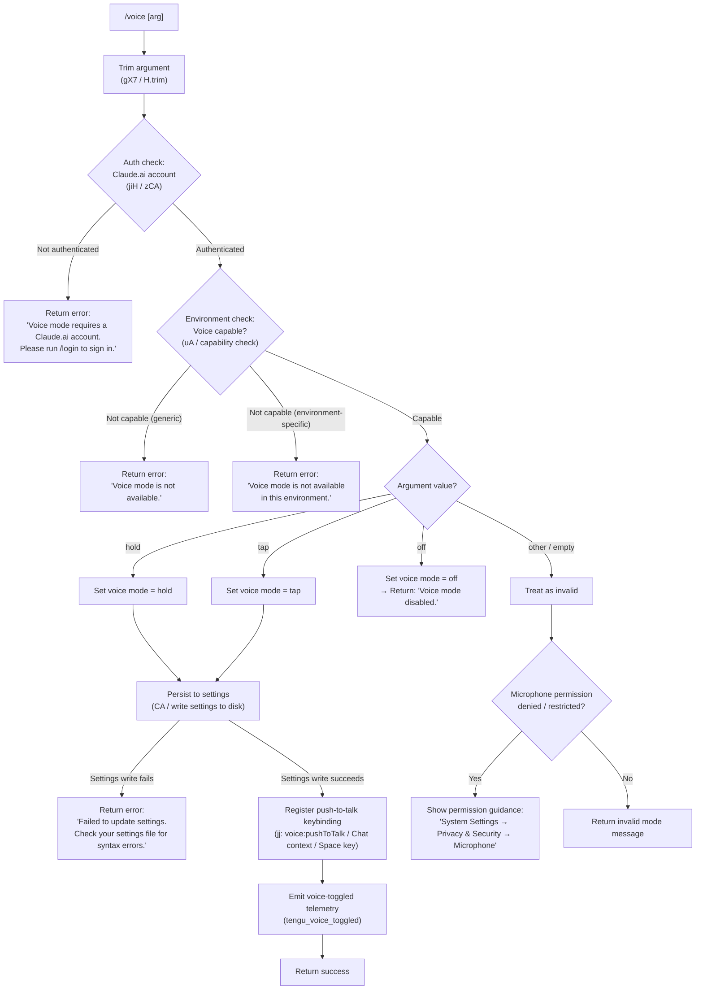

# `/voice`

> Analysis basis: CC v2.1.132 bundle.js (AST extraction + Claude interpretation)
> Minimum version: v2.1.132

---

## Overview

The `/voice` command toggles voice input mode in Claude Code, allowing users to control whether the CLI listens for spoken input in `hold` (push-to-talk), `tap` (toggle-to-talk), or `off` (disabled) modes. It is a `local`-type command that requires an authenticated Claude.ai account and a compatible (non-headless, non-restricted) environment. On invocation, the handler validates authentication, environment capability, and the argument, then persists the new voice mode state to settings on disk.

---

## Registration

| Field | Value |
|---|---|
| type | `local` |
| name | `voice` |
| description | `Toggle voice mode` |
| argumentHint | `[hold\|tap\|off]` |
| supportsNonInteractive | `false` |
| isHidden | `null` (not hidden) |
| module_id | `Cwq` |
| load_inline | `true` |
| handler | `QX7` (AsyncFunction; resolved via `module_id` path) |
| `loc_byte_end` | `11612451` |
| `arbor_handler.name` | `QX7` |
| `arbor_handler.kind` | `AsyncFunction` |
| `arbor_handler.resolution_path` | `module_id` |
| `arbor_handler.fqn` | `claude-2.1.132::QX7` |
| `arbor_handler.n_hits` | `1` |

Analysis basis: CC v2.1.132 bundle.js:+11612209 – +11612451

---

## Input Branching

The handler `QX7` begins by trimming the user-supplied argument, then routes through several gate checks before applying the mode change. The three recognized argument values are `hold`, `tap`, and `off` (bundle.js:+11609580, +11609592, +11609603). Any other value (including empty) is treated as invalid.



Analysis basis: CC v2.1.132 bundle.js:+11609533, +11609663, +11609674, +11609841, +11609888, +11609955, +11610024, +11610203, +11610350, +11610429, +11610560, +11610779, +11610991, +11611470, +11611604

---

## Behavioral Spec

### Authentication Gate

Before any mode change is attempted, the handler calls an auth-check function (`jiH`) that reads the current OAuth/API credential state (`zCA`). If no valid Claude.ai session is found (the `Boolean` coercion of the credential is falsy), the command short-circuits and returns a plain `text` block containing a login prompt.

```
async function checkAuthAndReturnMessage(context):
    credential = resolveCredential()          // zCA
    isAuthenticated = Boolean(credential)
    if not isAuthenticated:
        return textBlock("Voice mode requires a Claude.ai account. "
                         "Please run /login to sign in.")
    return null  // proceed
```

Analysis basis: CC v2.1.132 bundle.js:+11609663, +11600649, +11600575, +11600587, +11609704

### Environment Capability Gate

After authentication passes, the handler invokes a capability check (`uA` → `ub`) that evaluates whether the current runtime environment supports audio input. Two distinct failure messages are emitted:

- A generic unavailability message (bundle.js:+11609803) for environments where voice is completely absent.
- An environment-specific unavailability message (bundle.js:+11610504) for environments that are recognized but restricted (e.g., SSH-only remote sessions, CI environments, or headless terminals).

```
async function checkVoiceCapability(environment):
    if not environment.supportsAudio():
        return textBlock("Voice mode is not available.")
    if not environment.isInteractiveTerminal():
        return textBlock("Voice mode is not available in this environment.")
    return null  // proceed
```

Analysis basis: CC v2.1.132 bundle.js:+11609841, +11609803, +11610504

### Argument Parsing

The raw argument string is trimmed (via `gX7` / `H.trim`, bundle.js:+11609533, +11609955). The trimmed value is matched against three recognized literals:

| Literal | Meaning |
|---|---|
| `hold` | Push-to-talk mode — voice active only while a key is held |
| `tap` | Toggle mode — one keypress starts, another stops |
| `off` | Disable voice input entirely |

Any other value falls into the invalid path. The `invalid` string literal (bundle.js:+11609624) is used internally to label unrecognized arguments.

```
function parseVoiceMode(rawArg):
    arg = rawArg.trim()
    if arg in ("hold", "tap", "off"):
        return arg
    return "invalid"
```

Analysis basis: CC v2.1.132 bundle.js:+11609580, +11609592, +11609603, +11609624

### Settings Persistence

When the mode is valid and not `off`, the handler calls `CA` to load current settings from disk (via `nY` / `_2L`), apply the voice-mode field, and write the updated settings back. The settings subsystem reads from and writes to `settings.json` (bundle.js:+11158298) and optionally `settings.local.json` (bundle.js:+11158360) under the `.claude` directory (bundle.js:+1158288). If the write fails (e.g., malformed JSON already present), the error string "Failed to update settings. Check your settings file for syntax errors." is returned (bundle.js:+11610122).

```
async function applyVoiceModeSetting(mode, settingsContext):
    settings = await loadSettingsFromDisk(settingsContext)   // nY / _2L
    settings.voice = mode
    try:
        await writeSettingsToDisk(settings)                 // CA / QyH / NN6
    except SettingsWriteError:
        return textBlock("Failed to update settings. "
                         "Check your settings file for syntax errors.")
    return null  // proceed
```

Analysis basis: CC v2.1.132 bundle.js:+11610024, +11610122, +11609674

### Off-Mode Short-Circuit

When the argument resolves to `off`, the handler skips the keybinding registration step and returns the disable-confirmation message immediately after writing the setting.

```
if mode == "off":
    await applyVoiceModeSetting("off", ctx)
    emitTelemetry("tengu_voice_toggled", {mode: "off"})
    return textBlock("Voice mode disabled.")
```

Analysis basis: CC v2.1.132 bundle.js:+11610260, +11610203

### Keybinding Registration

When voice is enabled (`hold` or `tap`), the handler calls `jj` to register a default keybinding entry. The keybinding action name is `voice:pushToTalk` (bundle.js:+11611473), the context scope is `Chat` (bundle.js:+11611492), and the default key is `Space` (bundle.js:+11611499). Internally `jj` delegates to `FZ1` → `AK6` to read `keybindings.json` (bundle.js:+3602818) from the user config directory, merge the new binding (avoiding duplicates via `lZ1.has` / `lZ1.add`), and flush the updated file.

```
async function registerPushToTalkKeybinding():
    config = loadKeybindingsFile()           // AK6 / UZ1.readFileSync
    binding = {
        action: "voice:pushToTalk",
        context: "Chat",
        key: "Space"
    }
    if not config.hasBinding(binding.action):
        config.addBinding(binding)           // lZ1.add
        writeKeybindingsFile(config)
    emitTelemetry("tengu_custom_keybindings_loaded")
```

Analysis basis: CC v2.1.132 bundle.js:+11611470, +11611473, +11611492, +11611499, +3610117, +3610128, +3610059

### Microphone Permission Guidance

When the command detects that the operating system has denied microphone access (distinct from environment incapability), it surfaces a platform-specific navigation path. On macOS this is: **System Settings → Privacy & Security → Microphone** (bundle.js:+11611011). This guidance is emitted as a text block before returning.

Analysis basis: CC v2.1.132 bundle.js:+11610991, +11611011

### Telemetry Emission

After a successful mode change (any of `hold`, `tap`, or `off`), the handler calls `d` with the event `tengu_voice_toggled` (bundle.js:+11610203, +11610205). The payload includes at minimum the new mode value.

```
function emitVoiceToggled(mode):
    telemetry.track("tengu_voice_toggled", {mode: mode})
```

Analysis basis: CC v2.1.132 bundle.js:+11610203

---

## State & Side Effects

| Item | Detail |
|---|---|
| Telemetry | `tengu_voice_toggled` (bundle.js:+11610205) — fired on every successful mode change |
| Settings write | Writes updated `voice` field to `~/.claude/settings.json` or `settings.local.json` (bundle.js:+1158288, +1158298, +1158360) |
| Keybinding registration | On `hold`/`tap` modes, merges `voice:pushToTalk` → `Space` into `keybindings.json` in the user config directory (bundle.js:+3602818, +11611473) |
| Auth state read | Reads OAuth/API token to verify Claude.ai session (bundle.js:+11600649) |
| Environment probe | Queries runtime audio capability and terminal interactivity flags (bundle.js:+11609841) |
| Microphone permission | On macOS permission denial, displays navigation path to System Settings (bundle.js:+11611011) |
| Non-interactive mode | `supportsNonInteractive: false` — command is unavailable in `--bare` / piped / non-TTY contexts |

---

## Version History

| Version | Change |
|---|---|
| v2.1.132 | Initial analysis — `hold`, `tap`, `off` modes; Claude.ai auth gate; keybinding auto-registration for `voice:pushToTalk`; `tengu_voice_toggled` telemetry |

---

## Common Mistakes

1. **Running `/voice` without a Claude.ai account.** API-key-only sessions do not satisfy the auth gate; the command returns the login prompt and makes no changes.
2. **Running `/voice hold` or `/voice tap` in a non-interactive environment** (CI, SSH-forwarded sessions, headless terminals). The environment capability check will reject the command before any settings are written.
3. **Providing an unrecognized argument** (e.g., `/voice on`, `/voice enable`). Only the exact literals `hold`, `tap`, and `off` are accepted; anything else is treated as invalid.
4. **Expecting `/voice off` to remove the keybinding.** Disabling voice stops the listener, but the `voice:pushToTalk` entry already written to `keybindings.json` is not automatically removed.
5. **Malformed `settings.json` blocking the command.** If the settings file already contains invalid JSON when `/voice` is invoked, the write step will fail with the settings-error message; fix the JSON manually first.
6. **Microphone OS permission not granted.** Even if the runtime environment is capable, a denied OS-level microphone permission will surface a guidance message rather than activating voice input.

---

## Appendix — Identifier Mapping

> For bundle debugging only. Identifiers change across versions.

| Identifier | Role |
|---|---|
| `QX7` | Main async handler for `/voice` command (entry point) |
| `jiH` | Authentication check dispatcher |
| `zCA` | Credential resolver (returns auth token + Boolean coercion) |
| `nY` | Settings-load orchestrator (top-level) |
| `tL` | Terminal / TTY capability probe |
| `GS` | Claude-desktop environment detector |
| `yH` | String formatting / output builder |
| `o$` | API key / OAuth token validation helper |
| `B96` | Auth state accessor |
| `FX6` | Secondary auth path (called from `jiH`) |
| `uA` | Voice capability check (dispatches to `ub`) |
| `ub` | Audio environment probe |
| `Kp` | Platform audio query |
| `_2L` | Settings loader from disk (core implementation) |
| `$q` | Telemetry memory-usage sampler |
| `E8` | File-append logger |
| `t06` | Settings parse step |
| `hb` | Flag/policy settings filter |
| `w6H` | Remote-managed settings fetcher |
| `BN` | Structured-clone wrapper |
| `O` | Output message queue |
| `bb` | Settings merge helper |
| `tKH` | Settings validation / schema check |
| `fjH` | Settings field formatter |
| `z66` | WSL platform settings path resolver |
| `jk6` | Parent-managed settings loader |
| `MjH` | Settings diff utility |
| `L` | Settings collection map |
| `q` | File unlink / cleanup queue |
| `EO` | User settings file path resolver |
| `K` | Process-exit / spare-worker registry |
| `ni` | SDK inline settings loader |
| `W7_` | SDK inline settings merger |
| `ZdA` | Settings write finalizer |
| `gX7` | Argument trim helper (pre-parse) |
| `H` | Random / timer utility (Math.random + setTimeout wrapper) |
| `CA` | Settings update orchestrator (load → merge → write) |
| `F6` | File-existence / stat helper |
| `G7_` | Settings diff and patch applicator |
| `D66` | Settings section builder |
| `vdA` | Settings section validator |
| `H2L` | Settings key enumerator |
| `NdA` | Settings normalization utility |
| `wE` | File reader wrapper |
| `bp` | File content parser (encoding detection) |
| `v3` | Path / symlink safety checker |
| `k` | File-type classifier |
| `jH6` | File-read error handler |
| `A` | Generic accumulator / state store |
| `Fk8` | BOM stripper |
| `D8` | JSON parse wrapper |
| `j8` | Error code classifier |
| `Wh8` | Timestamp-keyed cache setter |
| `E6H` | Settings file path builder |
| `_A` | Async file read helper |
| `ULH` | Settings directory resolver |
| `QyH` | Atomic file write (temp + rename) |
| `f` | File-descriptor lifecycle manager |
| `_` | Lowercase / file-type probe |
| `RH` | JSON stringify wrapper |
| `C2` | Cache clear utility |
| `NN6` | Config file read/write orchestrator |
| `N6` | Config store accessor |
| `Qv6` | AsyncLocalStorage store getter |
| `_h8` | Config metadata accessor |
| `fh8` | Git-ignore checker |
| `PA` | Git subprocess runner |
| `fXL` | Config home-dir path resolver |
| `fH` | Structured logger (essential-traffic) |
| `HA` | Error string coercer |
| `kq` | Log queue flusher |
| `$wL` | Log ring-buffer manager |
| `xb` | `.claude` directory path joiner |
| `d` | Telemetry event emitter |
| `M` | MCP server manager (top-level) |
| `UZH` | MCP server collection updater |
| `qt` | MCP server entry processor |
| `VEH` | MCP server config validator and instantiator |
| `_t` | SDK-type MCP server builder |
| `LO6` | SSE/HTTP MCP server builder |
| `wI` | MCP transport wrapper |
| `oM` | MCP transport error mapper |
| `nwA` | MCP transport normalizer |
| `qA` | MCP capability advertiser |
| `Qw6` | MCP server filter utility |
| `Nr4` | MCP needs-auth cache reader |
| `XZA` | MCP needs-auth file reader |
| `a18` | MCP server hash builder |
| `jl` | MCP server label formatter |
| `o18` | MCP server entry key extractor |
| `WJ` | SHA-256 hasher |
| `K8` | MCP debug logger |
| `tTA` | MCP connection runner |
| `Ci4` | MCP client initializer |
| `Bp` | MCP transport factory |
| `ot` | MCP OAuth flow runner |
| `pcH` | MCP pending-auth tracker |
| `Y` | Background spare session manager |
| `hf8` | MCP needs-auth cache deleter |
| `QF` | MCP server reconnect handler |
| `Rb` | MCP transport key resolver |
| `D` | Daemon config reload handler |
| `Z7` | MCP error logger |
| `vH` | String coercer (error/value) |
| `bi4` | MCP connection state checker |
| `Ri4` | SSH environment detector for MCP |
| `eTA` | MCP re-connection handler |
| `mcH` | MCP in-progress auth fetcher |
| `UcH` | MCP pending-auth getter |
| `mc9` | MCP needs-auth cache writer |
| `Qf8` | MCP cache file path resolver |
| `aTA` | MCP token clear helper |
| `EK` | MCP message framer |
| `Nw6` | MCP token cache clearer |
| `gwA` | MCP server include-filter |
| `A8` | Global config save helper |
| `J` | Background worker kill list |
| `v` | Background process lifecycle manager |
| `S` | Background session write queue |
| `z` | Daemon stop/start controller |
| `Cc9` | MCP concurrency limiter |
| `zMH` | Async iterator / event-stream mapper |
| `dw6` | MCP server count parser |
| `PZA` | MCP server index parser |
| `ZBq` | MCP server update applicator |
| `df8` | MCP server diff serializer |
| `bI` | MCP server cleanup runner |
| `dcH` | MCP server cleanup serializer |
| `$` | Config persistence dispatcher |
| `mzq` | Config file writer (atomic) |
| `Er` | Config serializer |
| `lY` | Atomic file rename writer |
| `PX6` | Daemon status file path resolver |
| `j6` | Project config watcher |
| `hq6` | Project config read helper |
| `Rq6` | Project config write helper |
| `Oo` | Project config formatter |
| `Mo` | Project config YAML/JSON emitter |
| `uQ6` | Project config cache manager |
| `Lt8` | Project config event emitter |
| `Dt8` | Project config reload trigger |
| `R6` | Project config watcher starter |
| `Et8` | Project config watch-filter |
| `k5H` | Project config file reader (with backup) |
| `DPK` | Project config file watcher |
| `$F7` | MCP server retry manager |
| `t18` | MCP server suppression checker |
| `o8` | Retry timer manager |
| `jj` | Keybinding registration dispatcher |
| `FZ1` | Keybinding file loader + merger |
| `AK6` | Keybinding config parser and validator |
| `u8A` | Keybinding entry normalizer |
| `hx` | Keybinding context resolver |
| `RAH` | Keybinding file path resolver |
| `B6` | JSON.parse wrapper |
| `mH` | Structured data accessor |
| `Dl6` | Keybinding block structure validator |
| `Ol6` | Keybinding entry builder |
| `BZ1` | Keybinding default writer |
| `b8A` | Keybinding duplicate detector |
| `x8A` | Keybinding filter and deduplicator |
| `SH` | Feature-flag gate checker |
| `Jl6` | Keybinding last-entry finder |
| `u2H` | Keybinding entry mapper |
| `qNH` | Locale/language resolver |