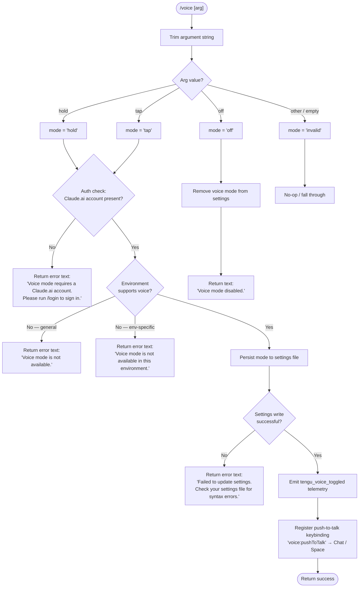

# `/voice`

> Analysis basis: CC v2.1.132 bundle.js (AST extraction + Claude interpretation)
> Minimum version: v2.1.132

---

## Overview

The `/voice` command toggles voice mode in Claude Code, allowing the user to switch between `hold`, `tap`, and `off` activation strategies. It validates authentication (Claude.ai account required), checks environment availability, persists the chosen mode to settings, and registers a push-to-talk keybinding when voice is enabled.

---

## Registration

| Field | Value |
|---|---|
| type | `local` |
| name | `voice` |
| description | `Toggle voice mode` |
| argumentHint | `[hold\|tap\|off]` |
| supportsNonInteractive | `false` |
| module_id | `Cwq` |

Analysis basis: CC v2.1.132 bundle.js:+11612209

---

## Input Branching

The command handler (`QX7`) first parses and trims the raw argument string, then routes execution through a cascade of guards before persisting state or reporting an error.



Analysis basis: CC v2.1.132 bundle.js:+11609580, +11609592, +11609603, +11609624, +11609663, +11609704, +11609803, +11610024, +11610122, +11610260, +11610350, +11610429, +11610449, +11610504, +11610560

---

## Behavioral Spec

### Argument Parsing

```
function parseVoiceArgument(rawInput):
    trimmed = rawInput.trim()
    if trimmed == "hold":
        return "hold"
    else if trimmed == "tap":
        return "tap"
    else if trimmed == "off":
        return "off"
    else:
        return "invalid"
```

Analysis basis: CC v2.1.132 bundle.js:+11609533, +11609580, +11609592, +11609603, +11609624, +11609955

---

### Authentication Guard

```
function checkVoiceAuthRequirement(authState):
    // Reads OAuth / account state via authStateReader
    accountPresent = authStateReader()
    isValidAuth   = Boolean(accountPresent)   // explicit Boolean coercion
    return isValidAuth
```

If `isValidAuth` is `false`, the command returns a `text`-type message:
> "Voice mode requires a Claude.ai account. Please run /login to sign in."

Analysis basis: CC v2.1.132 bundle.js:+11600555, +11600567, +11600587, +11600649, +11609674, +11609691, +11609704

---

### Environment Availability Check

```
function checkVoiceEnvironmentAvailability():
    // environmentAvailabilityCheck inspects process / platform flags
    available = environmentAvailabilityCheck()
    if not available:
        // Two distinct error messages indicate two distinct conditions:
        // 1. Generic "not available" (platform-level)
        // 2. "not available in this environment" (runtime/container-level)
        return { ok: false, reason: determineUnavailabilityReason() }
    return { ok: true }
```

- Generic unavailability message: `"Voice mode is not available."` — Analysis basis: CC v2.1.132 bundle.js:+11609803
- Environment-specific unavailability message: `"Voice mode is not available in this environment."` — Analysis basis: CC v2.1.132 bundle.js:+11610504

---

### Settings Persistence

```
function persistVoiceMode(mode):
    // settingsWriter resolves the correct settings layer:
    //   userSettings  → ~/.claude/settings.json
    //   localSettings → .claude/settings.local.json
    // It locks the config file before writing to prevent concurrent corruption.
    try:
        settingsWriter(voiceMode = mode)
        cacheInvalidator()   // clears in-memory settings caches
        return { ok: true }
    catch ParseError:
        return {
            ok: false,
            message: "Failed to update settings. Check your settings file for syntax errors."
        }
```

Settings layers resolved (in priority order):
1. `policySettings` — Analysis basis: CC v2.1.132 bundle.js:+1159426
2. `flagSettings` — Analysis basis: CC v2.1.132 bundle.js:+1159448
3. `userSettings` (written to `~/.claude/settings.json`) — Analysis basis: CC v2.1.132 bundle.js:+1158044, +1158288, +1158298
4. `projectSettings` — Analysis basis: CC v2.1.132 bundle.js:+1158092
5. `localSettings` (written to `.claude/settings.local.json`) — Analysis basis: CC v2.1.132 bundle.js:+1158114, +1158360

Settings write uses an atomic rename strategy (write to temp file → `fsyncSync` → `renameSync`) to prevent partial writes. Analysis basis: CC v2.1.132 bundle.js:+953233, +953357, +953485

---

### Voice Disable Path

```
function disableVoiceMode():
    settingsWriter(voiceMode = null)   // removes the key
    cacheInvalidator()
    return textMessage("Voice mode disabled.")
```

Analysis basis: CC v2.1.132 bundle.js:+11610260

---

### Keybinding Registration (hold / tap modes)

```
function registerPushToTalkKeybinding():
    // Registers action "voice:pushToTalk"
    // Default binding context : "Chat"
    // Default key             : "Space"
    keybindingRegistry.register(
        action  = "voice:pushToTalk",
        context = "Chat",
        key     = "Space"
    )
    // If the exact binding slot is occupied, fallback logic fires
    // and emits tengu_keybinding_fallback_used
```

Analysis basis: CC v2.1.132 bundle.js:+11611470, +11611473, +11611492, +11611499, +11611604

On macOS, the microphone permission path surfaced in error messaging is:
`System Settings → Privacy & Security → Microphone`
Analysis basis: CC v2.1.132 bundle.js:+11611011

---

### Telemetry Emission

```
function emitVoiceToggled(previousMode, newMode):
    telemetry.track("tengu_voice_toggled", {
        previous_mode : previousMode,
        new_mode      : newMode
    })
```

Analysis basis: CC v2.1.132 bundle.js:+11610205

The event is fired immediately after a successful settings write and before keybinding registration.

---

## State & Side Effects

| Item | Detail |
|---|---|
| Telemetry — primary | `tengu_voice_toggled` (fired on every successful mode change) — bundle.js:+11610205 |
| Telemetry — keybinding | `tengu_keybinding_fallback_used` (fired if Space/Chat slot is already occupied) — bundle.js:+3610141 |
| Telemetry — config lock | `tengu_config_lock_contention` (fired if settings lock takes longer than expected) — bundle.js:+3105398 |
| Telemetry — stale write | `tengu_config_stale_write` (fired if re-read config diverges from cache during save) — bundle.js:+3105534 |
| Telemetry — auth loss | `tengu_config_auth_loss_prevented` (fired when write is aborted to protect auth fields) — bundle.js:+3105877 |
| Telemetry — config parse | `tengu_config_parse_error` (fired if settings file JSON is malformed) — bundle.js:+3107927 |
| Telemetry — MCP retry | `tengu_mcp_retry_failed_remote` (may fire during settings reload if MCP servers are involved) — bundle.js:+13846663 |
| Hook registration | Registers `voice:pushToTalk` keybinding (action + Chat context + Space key) on enable — bundle.js:+11611473 |
| appState changes | `voiceMode` field in the resolved settings layer is updated (`"hold"`, `"tap"`, or removed for `"off"`) |
| In-memory cache | Settings caches (`s06`, `j28`) are cleared after each write — bundle.js:+24901, +24913 |
| Sound | <!-- TODO: not found in depth-2 traversal; needs --depth 4 --> |
| File writes | `~/.claude/settings.json` or `.claude/settings.local.json` via atomic temp-rename — bundle.js:+953233, +953485 |
| supportsNonInteractive | `false` — command is unavailable in non-interactive (piped / CI) sessions — bundle.js:+11612209 |

---

## Version History

| Version | Change |
|---|---|
| v2.1.132 | Initial analysis — three-mode toggle (`hold`, `tap`, `off`), Claude.ai auth guard, environment guard, atomic settings write, push-to-talk keybinding registration |

---

## Common Mistakes

1. **Running `/voice hold` or `/voice tap` without a Claude.ai account** — The command performs an authentication check before any mode change. Without a valid Claude.ai login (OAuth token), it immediately returns an error and makes no settings change. Run `/login` first.

2. **Running `/voice` in a non-interactive session** — `supportsNonInteractive` is `false`; the command is silently unavailable when CC is invoked with piped input or in CI-style environments.

3. **Passing an unrecognised argument** — Any argument other than `hold`, `tap`, or `off` is treated as `"invalid"` and the command takes no action. The argument hint `[hold|tap|off]` is exact.

4. **Expecting immediate microphone access after enabling** — On macOS, the OS-level microphone permission must be granted separately via `System Settings → Privacy & Security → Microphone`. The command does not trigger the OS permission dialog itself.

5. **Editing settings files while voice mode is toggling** — The settings writer uses a file lock with a contention timeout. A concurrently running Claude Code instance or a manual editor holding the file may cause `tengu_config_lock_contention` to fire and the write to fail with a parse-error message.

---

## Appendix — Identifier Mapping

> For bundle debugging only. Identifiers change across versions.

| Identifier | Role |
|---|---|
| `QX7` | Top-level voice command handler (entry point) |
| `jiH` | Authentication state reader / voice-auth guard |
| `zCA` | Auth state evaluator (reads account presence, applies Boolean coercion) |
| `FX6` | Auth failure response builder |
| `nY` | Settings reader / loader (reads all settings layers from disk) |
| `tL` | File existence / stat helper used by settings loader |
| `GS` | Settings layer merger / resolver |
| `yH` | String normalisation utility (used across multiple call sites) |
| `o$` | API key / OAuth token validator |
| `B96` | Settings object builder / serialiser |
| `uA` | Settings load-from-disk orchestrator |
| `ub` | Settings-from-disk loader (emits `loadSettingsFromDisk_end`) |
| `gX7` | Argument parser (trims input, maps to `hold`/`tap`/`off`/`invalid`) |
| `H` | General utility object (hosts `trim`, `includes`, `Math.random`, `setTimeout`) |
| `CA` | Settings writer / persister (atomic write orchestrator) |
| `EO` | Settings file path resolver |
| `F6` | Filesystem error classifier |
| `G7_` | Settings directory walker |
| `wE` | Settings write pre-processor |
| `D8` | File-not-found (`ENOENT`) handler |
| `k` | Debug / log-level classifier |
| `Wh8` | Settings cache timestamp updater |
| `E6H` | Settings file path builder (resolves `.claude/settings.json`) |
| `QyH` | Atomic file writer (temp-file + fsync + rename strategy) |
| `RH` | JSON serialiser wrapper |
| `C2` | In-memory settings cache invalidator (clears `s06` and `j28`) |
| `NN6` | Append/write-file helper with directory creation |
| `xb` | Path joiner for `.claude` directory |
| `_A` | Settings diff / merge helper |
| `fH` | Error logger for settings write failures |
| `d` | General async deferred / promise utility |
| `K` | Process-level crash / exit handler |
| `q` | Filesystem sync operations wrapper (unlink, stat, etc.) |
| `vH` | String coercion helper |
| `AZ` | Crash dump writer (`FNH.writeFileSync` + path join) |
| `L` | Command list / output formatter |
| `f` | Stream / file-descriptor manager |
| `M` | MCP server manager / lifecycle controller |
| `UZH` | MCP server connection handler |
| `ZBq` | MCP server update applier |
| `$` | Module registry / singleton store |
| `j6` | Permission / capability checker |
| `$F7` | MCP server retry and reconnect manager |
| `jj` | Keybinding registration orchestrator |
| `FZ1` | Keybinding action registry |
| `Jl6` | Keybinding last-match finder |
| `qNH` | Locale / language detector (checks `"en"`, splits on language codes) |
| `A` | General array / collection utility |
| `R6` | Settings file watcher / change monitor |
| `Et8` | Settings watch event classifier |
| `k5H` | Settings config loader with lock acquisition |
| `DPK` | File watcher (`watchFile` / `unwatchFile`) manager |
| `A8` | Settings save orchestrator (coordinates lock, read-back, write) |
| `Nt8` | Settings save-with-lock implementation (handles backup rotation, 60 s timeout) |
| `FbH` | Settings backup file path generator |
| `CJ1` | Settings object entry iterator |
| `gbH` | Settings write timestamp recorder |
| `uq6` | Settings lock file path resolver |
| `vt8` | Global config save fallback (guards against auth-field loss) |