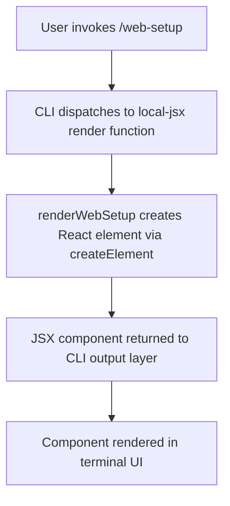

```
---
type: feature-spec
feature: "web-setup"
cc_version: "2.1.132"
updated: "2026-05-18"
tags: ["web-setup", "commands", "slash-commands"]
source: "bundle-analysis"
bundle_verified: true
analysis_basis: "CC v2.1.132 bundle.js (AST extraction + Claude interpretation)"
author: "ryujaeuk <ryujaeuk@gmail.com>"
repository: "https://github.com/MyLittleLuckyDog/cc-gnothi"
license: "AGPL-3.0-only"
---

# `/web-setup`

> Analysis basis: CC v2.1.132 bundle.js (AST extraction + Claude interpretation)
> Minimum version: v2.1.132

---

## Overview

The `/web-setup` command initiates the setup flow for Claude Code in a web environment, requiring the user to connect a GitHub account as a prerequisite. It is implemented as a `local-jsx` command, meaning its output is rendered as a JSX component rather than plain text. The command's core mechanism is the creation of a React element via the registered render function.

## Registration

| Field | Value |
|---|---|
| type | `local-jsx` |
| name | `web-setup` |
| description | `Setup Claude Code on the web (requires connecting your GitHub account)` |
| module_id | `iwq` |
| loc_line | 7643 |

Analysis basis: CC v2.1.132 bundle.js:+11619873

## Input Branching

The depth-2 call graph extracted for this command contains a single outbound edge: the render function calls `nI.createElement` to produce a JSX element. No branching on user-supplied arguments was detected within the traversal depth. The command appears to accept no parameters and follows a single execution path.



Analysis basis: CC v2.1.132 bundle.js:+11619649

## Behavioral Spec

### Web Setup Component Rendering

The command handler is a `local-jsx` type, meaning the CLI framework expects the registered function to return a React element that the terminal UI renders inline.

```
function renderWebSetup(commandContext):
    element = createElement(WebSetupComponent, props_derived_from_context)
    return element
```

When the user types `/web-setup` and confirms, the CLI:

1. Looks up the command registration by name `"web-setup"` in the local command registry.
2. Confirms the command type is `local-jsx`.
3. Invokes the render function (see Appendix: `KP7`).
4. The render function calls `nI.createElement` to instantiate the web-setup JSX component.
5. The resulting React element is handed to the CLI's JSX output pipeline for display.

Analysis basis: CC v2.1.132 bundle.js:+11619649

### GitHub Account Requirement

The command description explicitly states that connecting a GitHub account is required. Based on the registration descriptor, the setup flow is gated on GitHub OAuth or equivalent account-linking. The exact branching logic for the GitHub connection check was not reachable within depth-2 traversal.

```
function webSetupEntryPoint():
    // GitHub connection prerequisite is declared in the command description.
    // Enforcement logic is inside the rendered JSX component (depth > 2).
    component = buildWebSetupJSX()
    return component
```

<!-- TODO: not found in depth-2 traversal; needs --depth 4 -->

The specific steps for GitHub account linking, OAuth redirect handling, token storage, and error states are implemented inside the JSX component tree and were not reachable at the current traversal depth.

Analysis basis: CC v2.1.132 bundle.js:+11619873

## State & Side Effects

| Item | Detail |
|---|---|
| Telemetry | None detected within depth-2 traversal (`telemetry` array is empty) |
| Hook registration | `local-jsx` type; registered under module `iwq` at bundle line 7643 |
| appState changes | <!-- TODO: not found in depth-2 traversal; needs --depth 4 --> |
| Sound | <!-- TODO: not found in depth-2 traversal; needs --depth 4 --> |
| GitHub account linking | Declared as a prerequisite in the command description; side-effect details not reachable at depth ≤ 2 |

## Version History

| Version | Change |
|---|---|
| v2.1.132 | Initial analysis — `local-jsx` command registered at bundle.js:+11619873; single `createElement` call edge confirmed at bundle.js:+11619649 |

## Common Mistakes

1. **Running `/web-setup` without a web-compatible environment** — This command is specifically described as a web setup flow. Running it in a purely local terminal context with no web layer may result in an incomplete or non-functional setup UI, since the JSX component likely expects a browser-backed rendering surface or a web-connected CLI host.
2. **Skipping GitHub account connection** — The command description explicitly names GitHub account connection as a hard requirement. Attempting to proceed through the setup flow without a linked GitHub account will likely block progress at a step inside the JSX component tree.
3. **Expecting plain-text output** — Because this is a `local-jsx` command, its output is a rendered component, not a text string. Tooling or scripts that parse `/web-setup` output as plain text will not receive structured data.
4. **Assuming telemetry is emitted** — No telemetry events were found in the depth-2 traversal. Do not rely on `tengu_*` events from this command for observability or usage tracking at this version.

## Appendix — Identifier Mapping

> For bundle debugging only. Identifiers change across versions.

| Identifier | Role |
|---|---|
| `KP7` | Web-setup command render function; entry point that calls `nI.createElement` to produce the setup JSX element (bundle.js:+11619649) |
```