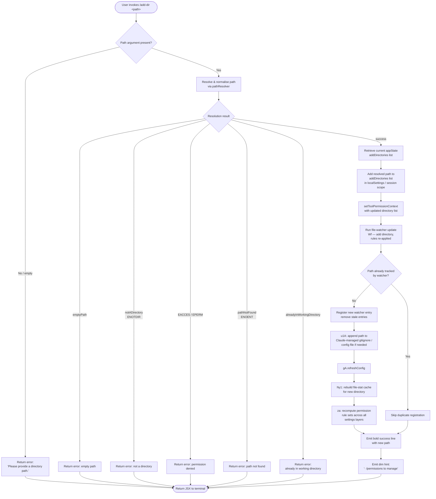

# `/add-dir`

> Analysis basis: CC v2.1.133 bundle.js (AST extraction + Claude interpretation)
> Minimum version: v2.1.133

---

## Overview

The `/add-dir` command registers an additional working directory for the current Claude Code session. Given a path argument, it resolves and validates the path, updates the application state with the new directory entry, reconfigures the tool-permission context, refreshes the session config, and triggers file-watcher and MCP-supervisor restart so that the newly added directory is covered by all existing tooling and permission rules.

---

## Registration

| Field | Value |
|---|---|
| type | `local-jsx` |
| name | `add-dir` |
| description | `Add a new working directory` |
| argumentHint | `<path>` |
| module_id | `mS1` |

Analysis basis: CC v2.1.133 bundle.js:+3994672

---

## Input Branching

The command handler reads the user-supplied path string and branches through several validation and state-mutation steps before producing its JSX output.



Analysis basis: CC v2.1.133 bundle.js:+3993388 (appState read), +3993508 (setToolPermissionContext), +3993540 (file-watcher call), +3993555 (already-present check), +3993592 (refreshConfig), +3993618 (Ny1 cache rebuild), +3993652 (za permission recompute), +3993669 (bold output), +3993955 (dim hint output), +3994119 (did-not-add message), +3586156 (empty-arg message)

---

## Behavioral Spec

### Path Resolution and Validation

```
function resolvePath(rawInput):
    if rawInput is null or rawInput.trim() == "":
        return { status: "emptyPath" }

    if rawInput contains null bytes:
        raise TypeError("Path contains null bytes")

    path = rawInput.trim()

    // Expand home-directory shorthand
    if path starts with "~/":
        path = os.homedir() + path.slice(1)

    // Windows-style drive-letter normalisation (if platform == "windows")
    if platform == "windows":
        path = applyWindowsDriveNormalisation(path)

    path = os.path.normalize(path)

    if not os.path.isAbsolute(path):
        path = os.path.resolve(currentWorkingDir, path)

    return { status: "resolved", absolutePath: path }
```

Analysis basis: CC v2.1.133 bundle.js:+3585660 (EuH entry), +949712 (null/empty guard), +949965 (null-byte error text), +950072 (homedir expansion), +950106 (tilde prefix check), +950119 ("~/" literal), +950201 (windows branch), +950021 (normalize), +950261 (isAbsolute), +950325 (resolve)

---

### Filesystem Stat Check

```
function validateDirectory(absolutePath):
    try:
        stats = fs.stat(absolutePath)  // async
    catch error:
        code = error.code
        if code == "ENOTDIR":
            return { status: "notADirectory" }
        if code == "EACCES" or code == "EPERM":
            return { status: "permissionDenied" }
        if code == "ENOENT":
            return { status: "pathNotFound" }
        return { status: "unknownError", message: error.message ?? "Unknown error" }

    if not stats.isDirectory():
        return { status: "notADirectory" }

    return { status: "ok" }
```

Analysis basis: CC v2.1.133 bundle.js:+3585694 (stat call), +3585739 ("notADirectory" literal), +3585802 (w8 error-code extraction), +3585829 ("ENOTDIR"), +3585844 ("EACCES"), +3585858 ("EPERM"), +3585884 ("pathNotFound"), +3993854 ("Unknown error" fallback)

---

### Duplicate-Directory Guard

```
function checkAlreadyPresent(resolvedPath, currentDirectoryList):
    for each entry in currentDirectoryList:
        if entry == resolvedPath:
            return true
    return false
```

If this returns `true`, the handler short-circuits with status `"alreadyInWorkingDirectory"` and does **not** mutate state.

Analysis basis: CC v2.1.133 bundle.js:+3585995 ("alreadyInWorkingDirectory" literal), +3993564 (D.includes call — existing-directory membership test)

---

### Application-State Mutation

```
function addDirectoryToState(appState, resolvedPath):
    // Read current list; index 1 selects the session-scope addDirectories array
    currentList = appState.getAppState()["addDirectories"]  // number literal 1 used as scope index

    updatedList = currentList + [resolvedPath]

    appState.set("addDirectories", updatedList, scope="localSettings/session")

    setToolPermissionContext({
        addDirectories: updatedList,
        ...existingPermissionContext
    })
```

Key literals consumed during this phase:

| Literal | Role |
|---|---|
| `"addDirectories"` | State key for the list of additional working directories |
| `"localSettings"` | Settings scope identifier |
| `"session"` | Settings sub-scope |
| `1` | Numeric scope selector passed to getAppState |

Analysis basis: CC v2.1.133 bundle.js:+3993388 (getAppState), +3993417 (numeric literal 1), +3993434 ("addDirectories"), +3993481 ("localSettings"), +3993497 ("session"), +3993508 (setToolPermissionContext)

---

### File-Watcher Update

```
function updateFileWatcher(resolvedPath, appState):
    // Determine if bypassPermissions mode is active; if not, reject setMode attempt
    permMode = appState.permissionMode
    if permMode == "bypassPermissions" and bypassPermissionsDisabled:
        log.debug("Ignoring permission update: setMode 'bypassPermissions' rejected — " +
                  "mode is not available (disableBypassPermissionsMode set, or session " +
                  "not launched in bypassPermissions mode)")
        return

    // Apply rule sets to watcher
    for ruleType in ["allow", "deny", "ask"]:
        key = ruleTypeToKey(ruleType)   // "alwaysAllowRules" | "alwaysDenyRules" | "alwaysAskRules"
        applyRulesToWatcher(key, currentRules[key])

    // Add new directory entry to watcher
    if resolvedPath not in watcherActiveSet:
        watcherActiveSet.add(resolvedPath)
        registerWatcherForPath(resolvedPath)

    // Remove stale entries no longer in the tracked list
    for staleEntry in watcherActiveSet:
        if staleEntry not in updatedDirectoryList:
            watcherActiveSet.delete(staleEntry)
            deregisterWatcher(staleEntry)
```

Analysis basis: CC v2.1.133 bundle.js:+3993540 (Wf call), +3891810 ("bypassPermissions" literal), +3891874 (debug-log guard), +3891876 (debug message text), +3892309 (SH — rule serialisation), +3892337 ("allow"), +3892345 ("alwaysAllowRules"), +3892377 ("deny"), +3892384 ("alwaysDenyRules"), +3892402 ("alwaysAskRules"), +3892152 ("addRules"), +3892500 ("replaceRules"), +3893157 ("removeRules"), +3893467 (L.filter — watcher filter), +3893482 (K.has — active-set membership), +3893541 ("removeDirectories"), +3893769 (_.delete — stale-entry removal)

---

### Gitignore / Config-File Append

```
function appendToManagedConfigFile(resolvedPath):
    // Normalise to NFC unicode form
    normPath = resolvedPath.normalize("NFC")

    // Derive realpath (resolves symlinks)
    realPath = fs.realpath(normPath)

    // Check whether we are in a "test" environment and skip write if so
    if environment == "test":
        return

    configFilePath = path.join(realPath, ".claude", "config")

    // Read existing config; tolerate ENOENT
    try:
        existing = fs.readFile(configFilePath, "utf8")
    catch { code: "ENOENT" }:
        existing = ""

    // Create parent directories as needed (mode 0o700 = 448 decimal)
    fs.mkdir(path.dirname(configFilePath), { recursive: true, mode: 448 })

    // Append new directory line (mode 0o600 = 384 decimal)
    fs.appendFile(configFilePath, newLine, { mode: 384 })
```

Directory creation mode: `448` (octal `0o700`)
File append mode: `384` (octal `0o600`)

Analysis basis: CC v2.1.133 bundle.js:+3993611 (u1A call), +11805041 (realpath), +11805067 ("NFC" normalisation), +11804803 ("test" env guard), +11805150 (path.join for config), +11805179 (readFile), +11805275 (mkdir), +11805317 (mode 448), +11805284 (dirname), +11805356 (appendFile), +11805384 (mode 384)

---

### File-Stat Cache Rebuild (Ny1)

```
function rebuildFileStatCache(directoryList):
    // Clear entries belonging to removed paths
    for staleEntry in fileStatCache:
        fileStatCache.delete(staleEntry)

    // For each directory, walk entries up to a maximum cache size
    for dirPath in directoryList:
        entries = fs.readdir(dirPath)   // via Rj.readFile

        for entry in entries:
            fullPath = path.join(dirPath, entry)
            stats = fs.stat(fullPath)   // Promise.all batched

            cacheEntry = {
                order: entryOrder,
                stateOrder: entryStateOrder,
                basename: path.basename(fullPath),
                mtime: Number(stats.mtime)
            }

            if Number.isFinite(cacheEntry.mtime):
                fileStatCache.set(fullPath, cacheEntry)

    // Evict oldest entries when cache exceeds 1000 items
    if fileStatCache.size > 1000:
        evictOldestEntries(fileStatCache)
```

Cache eviction limit: **1000 entries** (bundle.js:+3882301)

Analysis basis: CC v2.1.133 bundle.js:+3993618 (Ny1 call), +3884550 (lP — cache-delete helper), +3884568 (r9 — cache-populate helper), +3881339 (path.join), +3881424 (Promise.all), +3881437 (Rj.stat), +3881606 (basename), +3881366 ("order"), +3881387 ("stateOrder"), +3882144 (Number cast), +3882201 (Number.isFinite guard), +3882301 (1000 limit), +3882306 (cache clear on overflow), +3881823 (readFile), +3881719 (QfH.delete — stale clear)

---

### Permission-Rule Recomputation (za)

```
function recomputePermissionRules(appState):
    // Collect settings layers in priority order:
    //   policySettings > userSettings > projectSettings > flagSettings
    layers = [
        appState.policySettings,
        appState.userSettings,
        appState.projectSettings,
        appState.flagSettings
    ]

    // Build merged rule set
    mergedAllow = []
    mergedDeny  = []

    for layer in layers:
        allowed = layer.alwaysAllowRules ?? []
        denied  = layer.alwaysDenyRules  ?? []
        mergedAllow = mergedAllow + allowed
        mergedDeny  = mergedDeny  + denied

    // Deduplicate using a Set membership check
    seenRules = new Set()
    finalAllow = []
    for rule in mergedAllow:
        if not seenRules.has(rule):
            seenRules.add(rule)
            finalAllow.append(rule)

    // Filter rules relevant to the updated working-directory list
    relevantAllow = finalAllow.filter(r => directoryList.has(r.scope))
    relevantDeny  = mergedDeny.filter(r => directoryList.has(r.scope))

    // Emit updated rule event
    uk6.emit("rulesUpdated", { allow: relevantAllow, deny: relevantDeny })
```

Settings layer literals consumed:

| Literal | Role |
|---|---|
| `"userSettings"` | User-level settings layer |
| `"projectSettings"` | Project-level settings layer |
| `"policySettings"` | Policy/enterprise settings layer |
| `"flagSettings"` | Feature-flag settings layer |

Analysis basis: CC v2.1.133 bundle.js:+3993652 (za call), +3893950 ("userSettings"), +3893970 ("projectSettings"), +1165169 ("policySettings"), +1165191 ("flagSettings"), +3894667 (_.includes — rule membership), +3894962 (q.filter — rule filter), +3895000 (L.has — directory-scope check), +3895288 (_.filter — deny filter), +3895303 (q.has — deny membership), +1166055 (uk6.emit)

---

### Output Rendering

```
function renderOutput(result, resolvedPath):
    if result.status != "success":
        errorMessage = mapStatusToMessage(result.status)
        return jsx_text(errorMessage)               // "Did not add a working directory."

    // Success path
    boldLine = M6.bold(resolvedPath)
    dimHint  = M6.dim("· /permissions to manage")

    return jsx_box([
        jsx_text(boldLine),
        jsx_text(dimHint)
    ])
```

Fixed output strings:

| Condition | Text |
|---|---|
| No argument supplied | `"Please provide a directory path."` |
| Generic failure | `"Did not add a working directory."` |
| Success hint (dim) | `"· /permissions to manage"` |

Analysis basis: CC v2.1.133 bundle.js:+3586156 ("Please provide a directory path."), +3994119 ("Did not add a working directory."), +3993669 (M6.bold call), +3993955 (M6.dim call), +3993962 ("· /permissions to manage"), +3586071 ("success" status literal)

---

### MCP Supervisor Restart on Config Reload

```
function handleDaemonConfigReload(supervisorHandle):
    supervisorHandle.stop()
    supervisorHandle.updateConfig(newConfig)
    supervisorHandle.start()

    // Re-register heartbeat
    heartbeatHandle = startHeartbeat()

    // Emit telemetry
    emit("tengu_daemon_config_reload")
```

This sub-routine is triggered indirectly after `gA.refreshConfig` propagates the updated directory to the MCP daemon layer.

Analysis basis: CC v2.1.133 bundle.js:+14170187 (I.stop), +14170196 (I.updateConfig), +14170214 (I.start), +14169021 ("heartbeat" literal), +14170592 (tengu_daemon_config_reload emit)

---

## State & Side Effects

| Item | Detail |
|---|---|
| Telemetry | `tengu_daemon_config_reload` (bundle.js:+14170592) — fired when the MCP supervisor is restarted after the directory addition |
| appState changes | `addDirectories` array (scope `localSettings/session`) gains one entry for the resolved absolute path |
| Tool-permission context | `setToolPermissionContext` is called with the updated `addDirectories` list immediately after state mutation |
| File-watcher registration | New directory is added to the active watcher set; stale entries are pruned; rule sets (allow / deny / ask) are re-applied |
| Config-file write | An entry is appended to the `.claude/config` file inside the new directory (parent created with mode `0o700`; file written with mode `0o600`) |
| Config refresh | `gA.refreshConfig` is invoked to propagate the change to the running daemon |
| File-stat cache | The internal file-stat cache (cap: 1000 entries) is rebuilt to include files under the new directory |
| Permission-rule recompute | All four settings layers (policy, user, project, flag) are re-merged and the resulting rule sets are filtered against the updated directory list |
| MCP supervisor | Stopped, reconfigured, and restarted; heartbeat re-registered |
| Sound | <!-- TODO: not found in depth-2 traversal; needs --depth 4 --> |

---

## Version History

| Version | Change |
|---|---|
| v2.1.133 | Initial analysis |

---

## Common Mistakes

1. **Omitting the path argument.** Invoking `/add-dir` without any argument causes an immediate error — `"Please provide a directory path."` — with no state change.

2. **Supplying a file path instead of a directory.** If the resolved path points to a regular file, the command returns status `"notADirectory"` and does not mutate state. Always pass the directory itself, not a file inside it.

3. **Supplying a non-existent path.** The command performs a live `fs.stat` check. Paths that do not exist on disk yield `"pathNotFound"` / `ENOENT` and are rejected.

4. **Re-adding a directory already in the working set.** The command checks `D.includes` against the current `addDirectories` list. Duplicates are silently rejected with status `"alreadyInWorkingDirectory"`.

5. **Using relative paths expecting the shell's CWD.** The path resolver calls `path.resolve` relative to Claude Code's own working directory, which may differ from the shell's current directory. Prefer absolute paths or the `~/` shorthand.

6. **Expecting instant tool coverage.** The MCP supervisor undergoes a stop/reconfigure/start cycle after the directory is added. Tool calls that target the new directory may fail during the brief supervisor restart window.

7. **Paths with null bytes.** The resolver explicitly rejects any path containing null bytes with a `TypeError` ("Path contains null bytes"), producing no user-visible output beyond the generic error line.

---

## Appendix — Identifier Mapping

> For bundle debugging only. Identifiers change across versions.

| Identifier | Role |
|---|---|
| `MuK` | Top-level command handler / render function for `/add-dir` |
| `A` | Application-state accessor object (getAppState / setToolPermissionContext) |
| `Wf` | File-watcher update orchestrator |
| `k` | Permission-mode guard / setMode validator |
| `n4` | Rule-set serialisation helper |
| `SH` | JSON serialisation utility (wraps JSON.stringify) |
| `_` | Lodash-style utility (set / delete / filter / includes / toLowerCase) |
| `L` | Watcher-list filter and map utility |
| `K` | Active-watcher Set wrapper (add / delete / has) |
| `qV` | Existing-directory membership check helper |
| `D` | MCP supervisor manager (stop / updateConfig / start / get / set / delete) |
| `eDH` | Config-file read-and-parse helper |
| `q` | Filesystem write wrapper (write / close; also unlinkSync via Ydq) |
| `bwq` | Config-key statistics / max-length calculator |
| `f` | Connection/channel manager (get / set / close / finally) |
| `E` | Remote-control stop helper (preventDefault / QP / D / H) |
| `I` | MCP supervisor instance handle (stop / updateConfig / start) |
| `Bdq` | Heartbeat registration helper |
| `Z` | Secondary service start handle |
| `d` | Telemetry emit entry point for tengu_daemon_config_reload |
| `yaH` | Pre-add validation gate |
| `u1A` | Gitignore / managed-config-file append orchestrator |
| `qYH` | Environment detection helper ("test" guard) |
| `D8` | Error-code extractor (reads `.code` property from Error objects) |
| `fH` | File-content collection helper (push / logError) |
| `tg` | Path canonicalisation step within u1A |
| `LA` | Settings-layer accessor |
| `Ny1` | File-stat cache rebuild orchestrator |
| `lP` | Cache-entry delete helper |
| `r9` | Cache-populate walker (stat + readFile per directory) |
| `Pf` | Cache-entry write helper (join + SH + lP) |
| `za` | Permission-rule recompute orchestrator |
| `a_A` | Rule-set initialisation helper |
| `by1` | Per-directory rule builder |
| `h8` | Rule-object factory (OcA / j5_ / zcA) |
| `xA` | Individual rule-entry processor / uk6 emitter |
| `o$` | Rule-string substring / format helper |
| `H` | Async delay utility (Math.random + setTimeout) — used for supervisor restart back-off |
| `EuH` | Path-resolution and stat-validation entry point |
| `c_` | Low-level path resolver (normalize / homedir / isAbsolute / resolve) |
| `w8` | Error-code extractor alias (reads `.code`; shared with D8 at different call sites) |
| `sd` | Settings-layer read helper within EuH |
| `dk` | Path-display formatter (replaces /var/ and /tmp prefixes for UI) |
| `TuH` | Success-output JSX builder (M6.bold + kl6.dirname) |