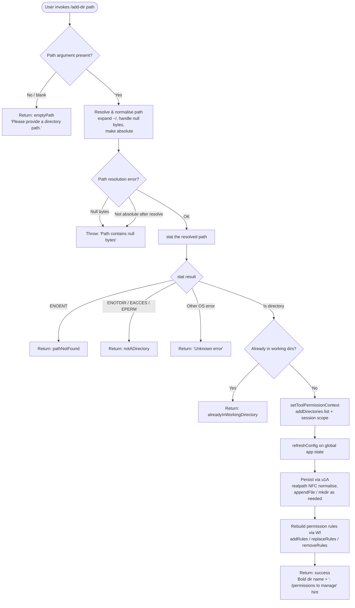

# `/add-dir`

> Analysis basis: CC v2.1.133 bundle.js (AST extraction + Claude interpretation)
> Minimum version: v2.1.133

---

## Overview

The `/add-dir` slash command adds a new working directory to the active Claude Code session. It validates and resolves the supplied path, updates the tool-permission context to include the new directory, and then refreshes the session's configuration — surfacing a styled success or failure message to the user. The command is the runtime counterpart to the `--add-dir` CLI flag used at startup.

---

## Registration

| Field | Value |
|---|---|
| type | `local-jsx` |
| name | `add-dir` |
| description | `Add a new working directory` |
| argumentHint | `<path>` |
| module_id | `mS1` |
| load_inline | `true` |
| loc_byte | `3994672` |
| loc_byte_end | `3994820` |
| loc_line | `698` |
| arbor_handler.name | `MuK` |
| arbor_handler.fqn | `claude-2.1.133::MuK` |
| arbor_handler.kind | `AsyncFunction` |
| arbor_handler.resolution_path | `module_id` |
| arbor_handler.n_hits | `0` |

Analysis basis: CC v2.1.133 bundle.js:+3994672

---

## Input Branching

The handler evaluates the supplied path through at least five distinct outcome states (`emptyPath`, `notADirectory`, `pathNotFound`, `alreadyInWorkingDirectory`, `success`) plus a generic error branch, totalling six branches.



Analysis basis: CC v2.1.133 bundle.js:+3993388 – +3994236

---

## Behavioral Spec

### 1. Entry point — `addDirHandler` (`MuK`)

```
async function addDirHandler(appState, userInput):
    currentState   = appState.getAppState()               // read current dirs
    updatedContext = setToolPermissionContext(currentState,
                        key="addDirectories",
                        scope="localSettings"/"session",
                        value=1)                          // mark intent
    result = validateAndAddDirectory(updatedContext, userInput.trim())
    if result.kind == "emptyPath":
        return render("Please provide a directory path.")
    dirList = queryCurrentWorkingDirs(currentState)       // D.includes check
    yaH(...)                                              // internal bookkeeping
    appState.refreshConfig()                              // gA.refreshConfig
    persistenceResult = persistDirectoryRecord(userInput) // u1A
    ruleResult        = rebuildPermissionRules(updatedContext) // Ny1
    uiResult          = buildCommandSuggestions(updatedContext) // za
    if result.kind == "success":
        return render(bold(resolvedPath) + dim("· /permissions to manage"))
    else:
        return render(errorMessage(result))
```

Analysis basis: CC v2.1.133 bundle.js:+3993388, +3993434, +3993481, +3993497, +3993555, +3993592, +3993611, +3993618, +3993652

---

### 2. Path validation and resolution — `pathResolver` (`EuH` → `c_`)

```
async function resolveAndValidatePath(rawInput):
    if rawInput is empty or null:
        return {kind: "emptyPath"}

    trimmed = rawInput.trim()

    if trimmed contains null bytes:
        throw Error("Path contains null bytes")

    if trimmed starts with "~/":
        trimmed = homedir() + trimmed.slice(2)   // expand tilde

    if platform == "windows":
        trimmed = normaliseWindowsDriveLetter(trimmed)

    normalized = path.normalize(trimmed)

    if not path.isAbsolute(normalized):
        normalized = path.resolve(normalized)    // resolve relative to cwd

    try:
        statResult = await fs.stat(normalized)
    catch err:
        if err.code == "ENOENT":
            return {kind: "pathNotFound"}
        if err.code in ["ENOTDIR", "EACCES", "EPERM"]:
            return {kind: "notADirectory"}
        return {kind: "error", message: err.message ?? "Unknown error"}

    if not statResult.isDirectory():
        return {kind: "notADirectory"}

    if normalized already in currentWorkingDirs:
        return {kind: "alreadyInWorkingDirectory"}

    return {kind: "success", resolvedPath: normalized}
```

Analysis basis: CC v2.1.133 bundle.js:+3585641, +3585694, +3585739, +3585802, +3585829, +3585844, +3585858, +3585884, +3585995, +3586071, +949758, +949965, +950021, +950072, +950119, +950201, +950261, +950325

---

### 3. Tool-permission context update — `permissionContextUpdater` (`Wf`)

```
function rebuildPermissionRules(context):
    serialized = JSON.stringify(context)           // SH
    rules      = context.alwaysAllowRules          // "allow" / "alwaysAllowRules"
               + context.alwaysDenyRules           // "deny"  / "alwaysDenyRules"
               + context.alwaysAskRules

    // Apply addRules, replaceRules, removeRules in order
    for each ruleSet in [addRules, replaceRules]:
        merged = _.set(currentRules, ruleSet.path, ruleSet.value)
        if K.has(merged, key):
            retain
    for each entry in removeRules:
        _.delete(merged, entry)                    // "removeDirectories" key

    // If bypassPermissions mode is requested but is unavailable:
    //   log warning: "Ignoring permission update: setMode 'bypassPermissions'
    //                  rejected — mode is not available ..."
    //   skip that rule silently

    return merged
```

Analysis basis: CC v2.1.133 bundle.js:+3892152, +3892309, +3892337, +3892345, +3892377, +3892384, +3892402, +3892500, +3893070, +3893157, +3893467, +3893541, +3893769, +3891810, +3891876

---

### 4. Directory persistence — `directoryPersistence` (`u1A`)

```
async function persistDirectoryRecord(resolvedPath):
    // Normalise to NFC Unicode form
    canonical = (await fs.realpath(resolvedPath)).normalize("NFC")

    // Determine config file path
    configDir  = path.join(configRoot, ...)
    configFile = path.join(configDir, ...)

    try:
        await fs.readFile(configFile, "utf-8")
    catch:
        // File may not exist yet; proceed

    await fs.mkdir(configDir, {recursive: true, mode: 0o700})   // mode 448
    await fs.appendFile(configFile, entry, {mode: 0o600})        // mode 384

    logError on failure via errorLogger (fH)
```

Analysis basis: CC v2.1.133 bundle.js:+11805007, +11805041, +11805067, +11805105, +11805150, +11805179, +11805275, +11805284, +11805317, +11805356, +11805384

Directory config file permissions:
- Config directory mode: **0o700 (448 decimal)** — `bundle.js:+11805317`
- Config file mode: **0o600 (384 decimal)** — `bundle.js:+11805384`

---

### 5. Permission-rule persistence (`Ny1`, `r9`, `Pf`)

```
async function persistPermissionRules(rules):
    // Delete stale cache entry (lP / QfH.delete)
    cache.delete(cacheKey)

    // Stat config file; obtain order/stateOrder metadata
    stat = await fs.stat(configPath)
    if stat fails:
        handle D8 error

    // Read existing JSON (Rj.readFile), parse via p6 (JSON.parse)
    existing = JSON.parse(await fs.readFile(configPath))

    // Validate numeric fields with Number.isFinite
    if not Number.isFinite(existing.order):
        log "warn"

    // Atomically write: generate random hex suffix (Xa8.randomBytes, "hex")
    tmpPath = configPath + "." + randomHex
    await fs.writeFile(tmpPath, JSON.stringify(merged))
    await fs.rename(tmpPath, configPath)   // atomic swap via iY

    // On conflict: copyFile fallback, then unlink tmp
    cache.set(cacheKey, merged)
    cache.clear() on terminal error
```

Analysis basis: CC v2.1.133 bundle.js:+3884550, +3884568, +3884733, +3884838, +3881298, +3881339, +3881366, +3881387, +3881424, +3881437, +3881579, +3881719, +3881744, +3881823, +3881928, +3882089, +3882144, +3882201, +3882306, +2867005, +2867033, +2867052, +2867105, +2867135

---

### 6. Command-suggestion / autocomplete builder — `commandSuggestionBuilder` (`za`, `by1`)

```
function buildCommandSuggestions(context):
    baseSuggestions = collectBaseCommands(context)   // a_A
    mapped = baseSuggestions.map(cmd =>
        resolveCommandEntry(cmd)                     // h8 → OcA, j5_, zcA
    )

    // For each candidate:
    //   normaliseShellEscaping(name)                // TbK → Z3 lstatSync check
    //   check isFIFO / isSocket / isCharacterDevice / isBlockDevice → skip
    //   realpathSync to dereference symlinks
    //   filter via M.has (tool-permission set membership check)
    //   format with o$ (replaceAll escaping for backslash/parens)
    //   padEnd to fixed width (40 chars)

    return filtered suggestions
```

Analysis basis: CC v2.1.133 bundle.js:+3894007, +3894086, +3894376, +3894580, +3894667, +3894715, +3894962, +3894983, +3894986, +3895000, +3895288, +3895303

---

### 7. Output rendering

```
function renderResult(result):
    match result.kind:
        "emptyPath"              => plain("Please provide a directory path.")
        "pathNotFound"           => error UI (pathNotFound label)
        "notADirectory"          => error UI (notADirectory label)
        "alreadyInWorkingDirectory" => info UI
        "error"                  => plain("Unknown error")
        "success"                =>
            bold(resolvedPath)
            + dim("· /permissions to manage")
        "didNotAdd"              => plain("Did not add a working directory.")
```

Literal strings confirmed in bundle:
- `"Please provide a directory path."` — `bundle.js:+3586156`
- `"Did not add a working directory."` — `bundle.js:+3994119`
- `"Unknown error"` — `bundle.js:+3993854`
- `"· /permissions to manage"` — `bundle.js:+3993962`

---

## State & Side Effects

| Item | Detail |
|---|---|
| Telemetry — `tengu_daemon_config_reload` | Emitted when the daemon reloads its config after the directory is added (`bundle.js:+14170592`) |
| Telemetry — `tengu_mcp_retry_failed_remote` | Emitted during MCP retry when all remote servers recover (`bundle.js:+13870729`) |
| `appState.setToolPermissionContext` | Adds the new path under key `"addDirectories"` in `"localSettings"` / `"session"` scope (`bundle.js:+3993434`, `+3993481`, `+3993497`) |
| `appState.refreshConfig` | Triggers a full config reload on the global app-state object after the directory is registered (`bundle.js:+3993592`) |
| Filesystem — config directory | Created with `mkdir recursive`, mode `0o700`, if absent (`bundle.js:+11805275`, `+11805317`) |
| Filesystem — config file append | New directory entry appended with mode `0o600` (`bundle.js:+11805356`, `+11805384`) |
| Filesystem — atomic rule write | Permission-rule file is written via a `writeFile` + `rename` pair using a random hex-suffixed temp path (`bundle.js:+2867005`, `+2867052`, `+2867105`) |
| Permission-rule cache | Cache entry is deleted before write and re-set on success; `cache.clear()` on terminal error (`bundle.js:+3881298`, `+3881719`, `+3882089`, `+3882306`) |
| `--add-dir` CLI flag alias | The literal `"--add-dir"` appears at `bundle.js:+3993622`, confirming this command mirrors the startup flag |
| Sound | <!-- TODO: not found in depth-2 traversal; needs --depth 4 --> |
| Hook registration | <!-- TODO: not found in depth-2 traversal; needs --depth 4 --> |

---

## Version History

| Version | Change |
|---|---|
| v2.1.133 | Initial analysis |

---

## Common Mistakes

1. **Omitting the argument entirely.** Invoking `/add-dir` with no path returns `"Please provide a directory path."` immediately — the handler short-circuits before any filesystem access. Always supply a path argument.
2. **Supplying a file path instead of a directory.** The handler calls `fs.stat` and checks `isDirectory()`; a regular file returns the `notADirectory` error (also triggered by `ENOTDIR`, `EACCES`, `EPERM`).
3. **Using a relative path without a clear CWD.** Relative paths are resolved with `path.resolve()`, which anchors to the process working directory at invocation time — not necessarily the project root. Use absolute paths or `~/…` for deterministic results.
4. **Adding a directory that is already present.** The command detects membership in the current working-directory set and returns `alreadyInWorkingDirectory` silently; no duplicate is added and no error is surfaced as a hard failure.
5. **Paths containing null bytes.** The validator throws a hard `Error("Path contains null bytes")` before any I/O; this is not a soft user-visible message — callers that construct paths programmatically must sanitize them first.
6. **Assuming the change is immediate in the permission UI.** The tool-permission context update and the config refresh are sequential async steps; the `/permissions` panel may lag one render cycle behind.

---

## Appendix — Identifier Mapping

> For bundle debugging only. Identifiers change across versions.

| Identifier | Role |
|---|---|
| `MuK` | Main async handler for `/add-dir` (entry point, `AsyncFunction`) |
| `A` | App-state object (holds `getAppState`, `setToolPermissionContext`, `refreshConfig`) |
| `Wf` | Permission-rule rebuild function |
| `k` | Internal terminal / output writer utility |
| `Ztq` | Output stream helper (depth-2 callee of `k`) |
| `xcA` | Sub-helper within output stream path |
| `H` | General-purpose string / buffer operand (context-dependent) |
| `SH` | JSON serialisation wrapper (`JSON.stringify`) |
| `Uf` | Path formatting / truncation helper |
| `rnA` | Segment-mapping helper used by `Uf` |
| `_` | Lodash-style utility object / path operand |
| `LkH` | Write-to-output helper |
| `UnA` | Low-level write dispatcher |
| `vtq` | File-write orchestrator (mkdir + appendFile + atomic swap) |
| `uNH` | Debounced batch-write scheduler (`clearTimeout` / `setTimeout` / `setImmediate`) |
| `aHH` | Write-completion callback handler |
| `F6` | Path / flag constant resolver |
| `dG8` | Error-code classifier (`w8` wrapper) |
| `_iA` | Path-join helper (uses `iwH.join`) |
| `AiA` | Atomic file-write helper (`stat` → `rename` → `unlink`) |
| `Vtq` | Directory-creation + append + rotate handler |
| `y1` | Pending-write set manager (`d08.add` / `d08.delete` / `Object.assign`) |
| `n4` | Shell-escape / display-name normaliser |
| `HWL` | `replaceAll`-based escape helper |
| `L` | Array/map used in rule filtering |
| `K` | Map / set used in rule key management |
| `q` | Secondary set / file-handle operand |
| `f` | File-handle / promise operand |
| `qV` | Working-directory membership query helper |
| `D` | Daemon / supervisor config manager |
| `eDH` | Config-file reader (`readFile` + parse) |
| `w8` | Low-level error wrapper |
| `lCA` | Config-parse sub-helper |
| `vH` | String coercion wrapper |
| `bwq` | Column-width / key-length calculator |
| `E` | Event / input-stop controller |
| `u` | Event object (carries `preventDefault`) |
| `QP` | Remote-control startup handler |
| `xA` | Project-settings loader (reads `policySettings`, `flagSettings`, `userSettings`, `projectSettings`) |
| `I` | Watcher / supervisor lifecycle controller (`stop`, `updateConfig`, `start`) |
| `Bdq` | Supervisor restart helper |
| `Go` | Heartbeat scheduler |
| `Z` | Secondary lifecycle controller |
| `d` | Daemon reload trigger |
| `yaH` | Internal bookkeeping call within `MuK` |
| `u1A` | Directory-persistence function (realpath, mkdir, appendFile) |
| `qYH` | Environment / build-variant resolver |
| `kH` | String-coercion / key normaliser |
| `Sjq` | Test-environment flag reader |
| `Sh` | Variant selector |
| `D8` | Error-object constructor |
| `fH` | Error-logging dispatcher |
| `HA` | Base error formatter |
| `yq` | Log-entry formatter |
| `J9_` | Sub-log key normaliser |
| `NJL` | Circular log-buffer manager (`shift` / `push`) |
| `tg` | Telemetry / traffic-level gate |
| `LA` | Context / locale accessor |
| `Ny1` | Permission-rule persistence orchestrator |
| `lP` | Cache-invalidation helper (`QfH.delete`) |
| `r9` | Config-file read + parse + cache update |
| `p6` | Safe `JSON.parse` wrapper |
| `Pf` | Atomic config-write dispatcher |
| `iY` | Atomic file-write implementation (randomBytes + writeFile + rename + copyFile fallback) |
| `za` | Command-suggestion / autocomplete builder (top-level) |
| `a_A` | Base-command list collector |
| `by1` | Command-entry mapper and filter |
| `mK6` | Command-metadata resolver |
| `h8` | Command-entry resolver (`OcA`, `j5_`, `zcA`) |
| `TbK` | Shell-path normaliser + stat checker |
| `ZO` | Path-join + display formatter |
| `Z3` | Filesystem stat checker (lstatSync, special-file filters, realpathSync) |
| `OE` | Path-type classifier |
| `VbK` | Secondary command-entry processor |
| `o$` | Shell-escape formatter (backslash / paren `replaceAll`) |
| `_WL` | Escape-sequence constant set |
| `YE` | `Object.hasOwn` guard helper |
| `qWL` | Escape-sequence pattern resolver |
| `AWL` | `replaceAll` escape applicator |
| `M` | Tool-permission membership set (MCP-aware) |
| `iZH` | MCP server initialiser / connection manager |
| `mFq` | MCP update applier (`applyMcpUpdate`, `cleanup`) |
| `$` | MCP cross-reference resolver |
| `J6` | Permission-entry set manager |
| `Og7` | MCP remote-server orchestrator |
| `EuH` | Path-validate-and-stat orchestrator (top-level for `MuK`) |
| `c_` | Path-resolution and null-byte validator |
| `N6` | AsyncLocalStorage context accessor |
| `zN6` | Store-get wrapper (`ON6.getStore`) |
| `sd` | Locale / context resolver |
| `dk` | macOS `/var/` → `/private/var/` and `/tmp` path fixer |
| `V2` | Case-normaliser (`toLowerCase`) |
| `JxA` | Platform-specific path rewriter |
| `gi` | Final path post-processor |
| `TuH` | Success-message renderer (`bold` + `dirname`) |

---

Note: index built via Arbor fallback; some signals (telemetry, literals) may be missing — see arbor-fallback.js.