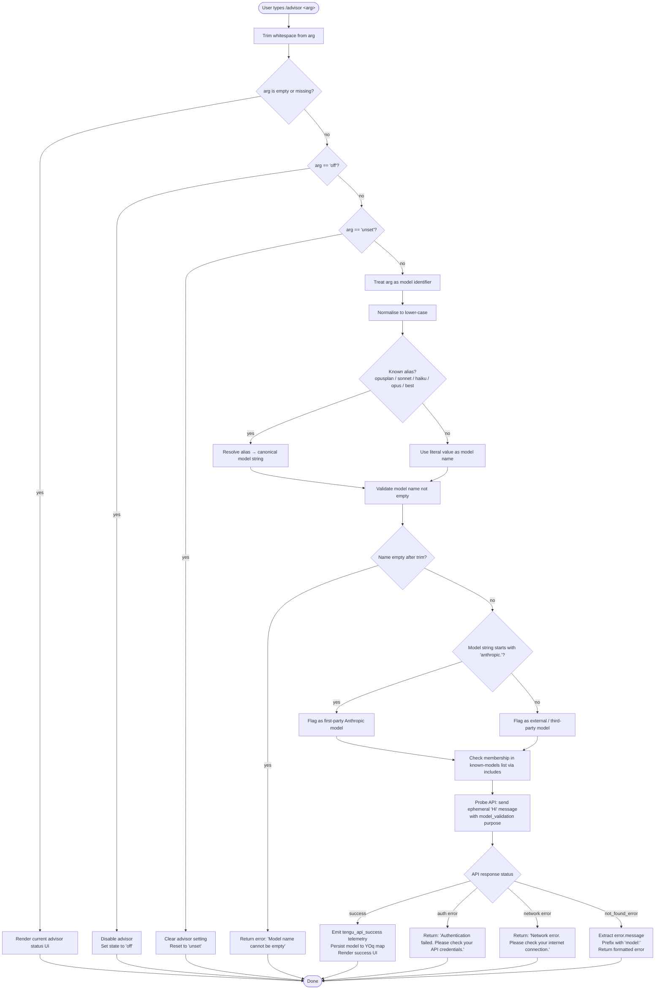

# `/advisor`

> Analysis basis: CC v2.1.133 bundle.js (AST extraction + Claude interpretation)
> Minimum version: v2.1.133

---

## Overview

The `/advisor` slash command configures the Advisor Tool, a subsystem that consults a stronger or alternate model at key decision points during a running task. Users invoke it to enable, disable, or set the specific model the advisor will use. Under the hood the command validates the supplied model identifier (including a live API probe), persists the selection, and renders a JSX-based configuration UI.

---

## Registration

| Field | Value |
|---|---|
| type | `local-jsx` |
| name | `advisor` |
| description | Configure the Advisor Tool to consult a stronger model for guidance at key moments during a task |
| argumentHint | *(null — no argument hint displayed in completion UI)* |
| module\_id | `POq` |

Analysis basis: CC v2.1.133 bundle.js:+11331904

---

## Input Branching

The command entry point trims the raw argument string, normalises it to lower-case, and routes through several distinct branches depending on what the user typed.



Analysis basis: CC v2.1.133 bundle.js:+11331363, +11331439, +11331450, +11323862, +11324783

---

## Behavioral Spec

### 1. Argument Parsing and Normalisation

```
function parseAdvisorArgument(rawArg):
    trimmed = rawArg.trim()                         // +11331363
    if trimmed is empty:
        return { action: "show_status" }
    lowered = trimmed.toLowerCase()                  // +14181260
    if lowered == "off":                             // +11331439
        return { action: "disable" }
    if lowered == "unset":                           // +11331450
        return { action: "unset" }
    return { action: "set_model", raw: trimmed, normalised: lowered }
```

Analysis basis: CC v2.1.133 bundle.js:+11331363, +11331439, +11331450

---

### 2. Model Alias Resolution

The command recognises a fixed set of short aliases that map to canonical model identifiers. Alias matching is performed on the lower-cased argument.

```
function resolveModelAlias(normalisedArg):
    // Known aliases checked in order  (+2120403 … +2120559)
    if normalisedArg == "opusplan":
        return resolveOpusPlanAlias()
    if normalisedArg contains "[1m]":               // +2120429
        return resolveOneMillionTokenVariant()
    if normalisedArg == "sonnet":                   // +2120444
        return resolveLatestSonnet()
    if normalisedArg == "haiku":                    // +2120483
        return resolveLatestHaiku()
    if normalisedArg == "opus":                     // +2120522
        return resolveLatestOpus()
    if normalisedArg == "best":                     // +2120559
        return resolveBestAvailableModel()
    // No alias match — use literal value
    return normalisedArg
```

The alias `"best"` resolves via the provider-selection helper that checks whether the active provider is `"firstParty"` or `"anthropicAws"` before picking a model.

Analysis basis: CC v2.1.133 bundle.js:+2120403, +2120429, +2120444, +2120483, +2120522, +2120559, +1981360, +1981378

---

### 3. Model Name Validation (Local)

Before making any network call, the command performs a synchronous local check.

```
function validateModelNameLocally(modelString):
    if modelString.trim() is empty:
        raise ValidationError("Model name cannot be empty")  // +11323862

    // Check first-party prefix
    isFirstParty = modelString.startsWith("anthropic.")      // +2114903 / +2114916

    // Check membership in the static known-model list
    isKnown = knownModelList.includes(modelString)           // +11324005

    // Check the in-session deduplication cache
    alreadyValidated = validationCache.has(modelString)      // +11324107

    return { isFirstParty, isKnown, alreadyValidated }
```

Analysis basis: CC v2.1.133 bundle.js:+11323862, +2114903, +2114916, +11324005, +11324107

---

### 4. Live API Validation Probe

When the model name passes local checks and is not already cached, the command issues a lightweight API call to confirm the model is accessible.

```
function probeModelViaApi(modelName, apiConfig):
    // Build a minimal ephemeral probe request
    request = {
        model:   modelName,
        purpose: "model_validation",               // +11324202
        messages: [
            { role: "user", content: "Hi" }        // +11324237, +11324271
        ],
        cache_control: "ephemeral",                // +11324296
        max_tokens: 1024                           // +12081673
    }

    // The query is labelled internally as a "side_query"  (+12081857)
    response = globalThis.fetch(apiEndpoint, request)  // +12081910

    if response indicates auth failure:
        return Error("Authentication failed. Please check your API credentials.")  // +11324562
    if response indicates network failure:
        return Error("Network error. Please check your internet connection.")      // +11324664
    if response.error.type == "not_found_error":   // +11324783
        msg = response.error.message               // +11324802
        return Error("model: " + msg)              // +11324865

    // On success
    emitTelemetry("tengu_api_success")             // +12083281
    validationCache.set(modelName, true)           // +11324315
    return Success
```

The probe deliberately uses a minimum token budget (`max_tokens: 1024`) and a single-word message to keep cost negligible.

Analysis basis: CC v2.1.133 bundle.js:+11324202, +11324237, +11324271, +11324296, +12081673, +12081857, +12081910, +11324562, +11324664, +11324783, +11324802, +11324865, +12083281, +11324315

---

### 5. Advisor State Persistence

After a successful validation the resolved model string is written into the session-level map and the application state is updated accordingly.

```
function persistAdvisorSelection(modelName):
    validationCache.set(modelName, resolvedEntry)  // +11324315

    // sY7: serialises the entry to a storable representation
    serialised = serialiseAdvisorEntry(modelName)  // +11324356
    // tY7: inner helper that converts to string
    raw = String(serialised)                       // +11325052

    updateAppState({ advisorModel: raw })
```

When the action is `"disable"` (`"off"`), both model closures (`_.close` and `q.close`) are invoked and the advisor state variable `K` is set to its zero/disabled value.

Analysis basis: CC v2.1.133 bundle.js:+11324315, +11324356, +11325052, +14167103, +14167113, +14167253

---

### 6. JSX Rendering

The command is registered as `local-jsx`, meaning its output is a React element tree rather than plain text. The renderer calls `Zw.createElement` to construct the configuration panel and joins the list of available model display names with `", "` as the separator.

```
function renderAdvisorPanel(currentState, availableModels):
    modelList  = availableModels.join(", ")        // +11331674, +11331683
    isOpus47   = checkModelVariant("opus-4-7")     // +5046201
    isOpus46   = checkModelVariant("opus-4-6")     // +5046225
    isSonnet46 = checkModelVariant("sonnet-4-6")   // +5046249

    element = createElement(AdvisorPanel, {
        currentModel: currentState.advisorModel,
        modelList:    modelList,
        onDisable:    () => dispatchDisable(),
        onUnset:      () => dispatchUnset(),
    })
    return element
```

The helper `vf6` performs a lower-case inclusion check against the known variant list before deciding which badge or label to show for each model.

Analysis basis: CC v2.1.133 bundle.js:+11331399, +11331674, +11331683, +5046167, +5046190, +5046201, +5046225, +5046249

---

### 7. Retry / Back-off on Transient Errors

The call-graph shows `Math.random` and `setTimeout` reached through the probe path, indicating a jittered retry strategy for transient network failures.

```
function jitteredRetry(attemptFn, maxAttempts):
    for attempt in 1 .. maxAttempts:
        result = attemptFn()
        if result is not transient error:
            return result
        // Jitter: random value in [1, 2) * base_delay   (+12285767, +12285769, +12285806)
        jitter   = 1 + Math.random()
        delay_ms = baseDelay * jitter
        sleep(delay_ms)
    return lastResult
```

Analysis basis: CC v2.1.133 bundle.js:+12285767, +12285769, +12285783, +12285806

---

## State & Side Effects

| Item | Detail |
|---|---|
| Telemetry | `tengu_api_success` — fired once per successful API probe (bundle.js:+12083281) |
| Validation cache | In-memory `Map` (`YOq`): keyed by model name string; persists for the session duration (bundle.js:+11324107, +11324315) |
| Advisor model state | Written to application state as a serialised string when a model is confirmed (bundle.js:+11324356) |
| Advisor disable | Calls two close-handles and sets state variable to `0` / falsy when `"off"` is supplied (bundle.js:+14167103, +14167113, +14167253) |
| Network I/O | One `globalThis.fetch` call per unvalidated model name (bundle.js:+12081910) |
| JSX rendering | Creates React element tree; no DOM side-effects beyond standard React reconciliation (bundle.js:+11331399) |
| Sound | <!-- TODO: not found in depth-2 traversal; needs --depth 4 --> |
| Hook registration | <!-- TODO: not found in depth-2 traversal; needs --depth 4 --> |

---

## Version History

| Version | Change |
|---|---|
| v2.1.133 | Initial analysis — command registered as `local-jsx`, live model-probe validation, alias resolution for `opusplan / sonnet / haiku / opus / best`, jittered retry on transient errors |

---

## Common Mistakes

1. **Passing an empty string after `/advisor`** — the command will show the current status panel rather than clearing the setting; use `/advisor unset` to explicitly clear the advisor model.
2. **Using mixed-case model names** — the argument is normalised to lower-case before alias matching, so `Opus` and `OPUS` both resolve correctly, but the raw string forwarded to the API preserves the original casing; relying on case to disambiguate custom model IDs may produce unexpected `not_found_error` responses.
3. **Confusing `off` and `unset`** — `off` actively disables the advisor feature (closes internal handles), whereas `unset` merely clears the persisted model preference without closing the subsystem.
4. **Expecting instant availability of a newly set model** — the live API probe must succeed before the selection is cached and persisted; on slow connections the jittered retry loop may take several seconds.
5. **Using the `[1m]` context-window qualifier without a base alias** — the `[1m]` token is recognised only as part of a compound alias string; supplying it alone returns a validation error.
6. **Assuming the alias `best` is static** — `best` resolves dynamically based on the active provider (`firstParty` vs `anthropicAws`); the actual model it maps to may change across sessions if the provider configuration changes.

---

## Appendix — Identifier Mapping

> For bundle debugging only. Identifiers change across versions.

| Identifier | Role |
|---|---|
| `Ow7` | Command entry-point / top-level handler function |
| `_` | Inner argument-processing closure (also used as generic local variable in several call sites) |
| `f` | Disable/close handler — invokes model-handle close and resets advisor state variable |
| `Gq` | Model alias resolver — maps short names to canonical model strings |
| `H` | Jittered-retry helper — uses `Math.random` and `setTimeout` for back-off |
| `A` | Normalised (lower-cased) argument string variable |
| `B0` | Sub-resolver called by alias resolver for complex alias expansion |
| `W8H` | Known-model-list membership checker (`P8H.includes`) |
| `pV` | Provider-type dispatcher — routes between `zM` (firstParty) and `DM` (other) |
| `URH` | Alternate provider path handler — delegates to `DM` |
| `Ek` | Model-entry constructor — calls `zM` and `DM` to build a model descriptor |
| `Lc_` | Higher-order wrapper around `Ek` for deferred model construction |
| `zM` | First-party model factory — produces model objects tagged `firstParty` |
| `hu6` | Inclusion-check helper against `X6K` (supported-models set) |
| `BRH` | Fallback resolution helper — delegates to `kH` |
| `rz8` | Model validation orchestrator — coordinates local checks, cache lookup, and API probe |
| `v7H` | Input parsing and segmentation helper — splits, trims, and dispatches model string components |
| `NR` | API probe executor — builds and fires the `side_query` fetch request, handles all error branches |
| `sY7` | Advisor-entry serialiser — converts resolved model descriptor to storable form via `tY7` |
| `vf6` | Model-variant display helper — lower-cases and checks inclusion for UI badge selection |