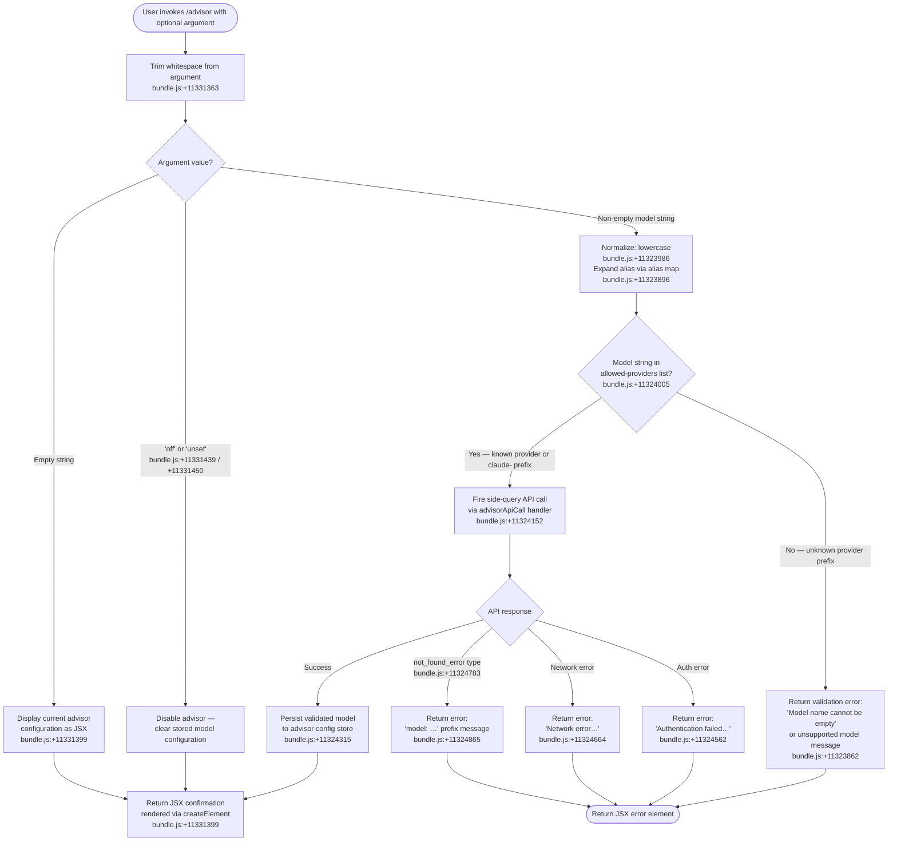

# `/advisor`

> Analysis basis: CC v2.1.133 bundle.js (AST extraction + Claude interpretation)
> Minimum version: v2.1.133

---

## Overview

The `/advisor` command configures the Advisor Tool, which allows Claude Code to consult a stronger (typically larger) model for guidance at key decision points during a task. Users invoke `/advisor` to set, inspect, or disable the advisor model by providing a model name or a recognized shorthand alias. The command validates the supplied model string against the Anthropic API before committing the configuration.

---

## Registration

| Field | Value |
|---|---|
| type | `local-jsx` |
| name | `advisor` |
| description | `Configure the Advisor Tool to consult a stronger model for guidance at key moments during a task` |
| module_id | `POq` |
| load_inline | `true` |
| loc_byte | `11331904` |
| loc_byte_end | `11332191` |
| loc_line | `7109` |
| argumentHint | `null` |
| isHidden | `null` |
| arbor_handler.name | `Ow7` |
| arbor_handler.fqn | `claude-2.1.133::Ow7` |
| arbor_handler.kind | `AsyncFunction` |
| arbor_handler.resolution_path | `module_id` |
| arbor_handler.n_hits | `1` |

Analysis basis: CC v2.1.133 bundle.js:+11331904

---

## Input Branching

The handler has four distinct meaningful branches based on the trimmed argument value and subsequent validation outcomes, making a Mermaid flowchart the required representation.



---

## Behavioral Spec

### 1. Top-Level Handler — `advisorCommandHandler` (Ow7)

The primary async handler for `/advisor`. It is resolved via `module_id` `POq` and confirmed by Arbor as `Ow7`.

```
async function advisorCommandHandler(commandInput, appContext):
    rawArg = commandInput.trim()                         // +11331363

    if rawArg === "off" or rawArg === "unset":           // +11331439, +11331450
        disableAdvisorConfig(appContext)
        return renderJSX(createElement, ConfirmationComponent)

    if rawArg is empty:
        return renderJSX(createElement, CurrentConfigDisplay, appContext)  // +11331399

    normalized = rawArg.toLowerCase()                    // +11323986
    expanded   = resolveModelAlias(normalized)           // +11323896
    validated  = validateModelString(expanded, appContext)

    if validated is error:
        return renderJSX(createElement, ErrorComponent, validated.message)

    apiResult  = await fireAdvisorValidationCall(expanded, appContext)  // +11324152

    if apiResult is auth error:
        return renderJSX(ErrorComponent,
            "Authentication failed. Please check your API credentials.")  // +11324562

    if apiResult is network error:
        return renderJSX(ErrorComponent,
            "Network error. Please check your internet connection.")     // +11324664

    if apiResult.type === "not_found_error":             // +11324783
        return renderJSX(ErrorComponent, "model: " + apiResult.message) // +11324865

    persistAdvisorModel(expanded, appContext)            // +11324315
    return renderJSX(createElement, ConfirmationComponent, expanded)   // +11331399
```

Analysis basis: CC v2.1.133 bundle.js:+11331363

---

### 2. Model Alias Resolution — `resolveModelAlias` (rz8 → sY7 → tY7)

Normalizes a user-supplied string into a canonical model identifier before validation. Called from within `advisorCommandHandler`.

```
function resolveModelAlias(input):
    trimmed = input.trim()                               // +11323825
    lower   = trimmed.toLowerCase()                      // +11323986

    // Check against the provider-prefix allow-list          +11324005
    if not allowedProviderPrefixes.includes(lower):
        if lower is empty:
            throw Error("Model name cannot be empty")    // +11323862

    // Expand well-known shorthand aliases via aliasTable +11324356
    aliasTable = {
        "opus-4-7"   : "opus_4_7",                      // +11325132 / +11325156
        "opus-4-6"   : "opus_4_6",                      // +11325201 / +11325225
        "opus-4-5"   : "opus_4_5",                      // +11325270 / +11325294
        "sonnet-4-6" : "sonnet_4_6",                    // +11325339 / +11325365
        "sonnet-4-5" : "sonnet_4_5",                    // +11325414 / +11325440
        ...
    }

    expanded = aliasTable[lower] ?? lower
    return String(expanded)                              // +11325052
```

Analysis basis: CC v2.1.133 bundle.js:+11323825

---

### 3. Model String Validation — `validateModelString` (v7H)

Checks that the normalized model string is structurally coherent before an API round-trip is attempted.

```
function validateModelString(modelStr, context):
    trimmed = modelStr.trim()                            // +2114851

    // Reject strings lacking the "anthropic." prefix or "claude-" prefix
    if trimmed.startsWith("anthropic."):                 // +2114916
        pass
    else if trimmed.startsWith("claude-"):               // +2114536
        pass
    else:
        return buildValidationError("Model name cannot be empty")  // +11323862

    // Additional checks via providerFilter and alias maps
    if isKnownAlias(trimmed):                            // +2114960
        return buildModelRef(trimmed)

    if isDisallowedSuffix(trimmed):                      // +2115010
        return buildValidationError(...)

    return buildModelRef(trimmed)
```

Analysis basis: CC v2.1.133 bundle.js:+2114851

---

### 4. Advisor Validation API Call — `fireAdvisorValidationCall` (NR)

Sends a minimal ("Hi", ephemeral) side-query to the Anthropic API to confirm the model exists and is accessible under the current credentials.

```
async function fireAdvisorValidationCall(modelId, context):
    // Build a minimal validation payload                +11324152
    payload = {
        model   : modelId,
        messages: [{ role: "user", content: "Hi" }],    // +11324271
        max_tokens: 1,
        cache_control: { type: "ephemeral" }             // +11324296
    }

    // Tag the call as a side_query                      +12081857
    headers["x-request-type"] = "side_query"

    try:
        response = await anthropicApiRequest(payload)    // +12081910

        if response.error.type === "not_found_error":   // +11324783
            return { kind: "not_found", message: response.error.message }

        if response.status === 401 or 403:
            return { kind: "auth_error" }

        return { kind: "success", model: modelId }

    catch NetworkError:
        return { kind: "network_error" }
```

Analysis basis: CC v2.1.133 bundle.js:+11324152

---

### 5. Recognized Shorthand Aliases — `resolveShorthandAlias` (Gq)

A separate normalization path for human-friendly tier names that map to concrete model identifiers.

```
function resolveShorthandAlias(input):
    lower = input.toLowerCase()                          // +2120318

    switch lower:
        case "opusplan":  return planningModelId         // +2120403
        case "[1m]":      return planningModelId         // +2120429
        case "sonnet":    return sonnetModelId           // +2120444
        case "haiku":     return haikuModelId            // +2120483
        case "opus":      return opusModelId             // +2120522
        case "best":      return bestAvailableModelId    // +2120559

    // Fall through: strip and normalize raw string
    normalized = input.replace(...)                      // +2120346
    return normalized
```

Analysis basis: CC v2.1.133 bundle.js:+2120318

---

### 6. JSX Output Rendering

The handler creates its user-visible output exclusively via `Zw.createElement` (React-compatible JSX factory). No raw text is written directly to stdout by the command handler itself.

Analysis basis: CC v2.1.133 bundle.js:+11331399

---

## State & Side Effects

| Item | Detail |
|---|---|
| Telemetry — `tengu_api_success` | Fired on a successful side-query API call; loc `+12083281` |
| Telemetry — `tengu_prompt_cache_1h_config` | Fired when 1-hour prompt-cache configuration is applied during the validation call; loc `+12045606` |
| Telemetry — `tengu_mcp_retry_failed_remote` | Fired when a remote MCP server fails retry during context setup; loc `+13870729` |
| Telemetry — `tengu_bg_dispatch_sigkill_escalate` | Fired if background dispatch requires SIGKILL escalation; loc `+14157040` |
| Telemetry — `tengu_bg_dispatch_low_mem` | Fired when background dispatcher detects low memory; loc `+14157619` |
| Telemetry — `tengu_bg_spare_enable` | Fired when a spare background session is enabled; loc `+14158234` |
| Telemetry — `tengu_bg_spare_claim` | Fired on spare session claim; loc `+14158355` |
| Telemetry — `tengu_bg_spare_claim_fail` | Fired on spare session claim failure; loc `+14158618` |
| Telemetry — `tengu_bg_proto_mismatch` | Fired on background protocol version mismatch; loc `+14146608` |
| Telemetry — `tengu_bg_attach` | Fired on background session attach; loc `+14150138` |
| Telemetry — `tengu_bg_attach_stall_gave_up` | Fired when attach stall is abandoned; loc `+14150972` |
| Telemetry — `tengu_bg_attach_stall_respawn` | Fired when stalled attach triggers respawn; loc `+14151241` |
| Advisor config persistence | On success the resolved model identifier is written to the advisor configuration store via `YOq.set`; loc `+11324315` |
| Model validation cache | A `YOq` Map is read before firing the API call (`YOq.has`); cache key is the normalized model string; loc `+11324107` |
| API side-query | A single minimal request (`"Hi"`, `max_tokens: 1`, `ephemeral` cache) is sent to the Anthropic API to verify model availability; loc `+11324152` |
| JSX output | All user-visible feedback is returned as a `createElement`-built JSX tree; loc `+11331399` |
| Sound | <!-- TODO: not found in depth-2 traversal; needs --depth 4 --> |
| appState changes | Advisor model field updated on success; no other appState mutation observed at depth ≤ 2 |

---

## Version History

| Version | Change |
|---|---|
| v2.1.133 | Initial analysis — `local-jsx` command; async validation handler `Ow7`; alias expansion; API side-query model check |

---

## Common Mistakes

1. **Passing an unqualified short name without using a recognized alias** — strings that do not start with `anthropic.` or `claude-` and are not in the built-in alias table (e.g., `"opus"`, `"sonnet"`, `"haiku"`, `"best"`) will be processed through the shorthand resolver (`Gq`). Using a completely arbitrary string will fail provider-prefix validation before any API call is made.
2. **Using `"off"` expecting a status display** — `"off"` and `"unset"` are treated as disable tokens, not as queries; they immediately clear the advisor configuration without prompting.
3. **Assuming the command is instant** — the handler is an `AsyncFunction` that fires a live API side-query on every new model string. In environments with slow or restricted network access this call will block and may return a network error.
4. **Treating alias aliases as stable across versions** — the alias-to-model-id mapping (e.g., `"opus-4-7"` → `"opus_4_7"`) is embedded in the bundle. The concrete model IDs behind shorthand names may change between CC releases.
5. **Invoking `/advisor` with no argument to set the model** — an empty invocation displays the current configuration; it does not accept a blank string as a "reset".

---

## Appendix — Identifier Mapping

> For bundle debugging only. Identifiers change across versions.

| Identifier | Role |
|---|---|
| `Ow7` | Top-level `/advisor` async command handler (arbor_handler) |
| `rz8` | Model string normalization and validation orchestrator |
| `sY7` | Alias-expansion wrapper calling `tY7` |
| `tY7` | Per-alias lookup and model string builder |
| `v7H` | Structural model string validator (prefix checks, suffix checks) |
| `Gq` | Human-friendly shorthand alias resolver (`"opus"`, `"sonnet"`, `"haiku"`, `"best"`, etc.) |
| `NR` | Advisor validation API call dispatcher (side-query sender) |
| `Jx` | Anthropic SDK API request builder and executor |
| `vf6` | Provider inclusion checker (lowercase + includes test) |
| `W8H` | Provider prefix allow-list membership check |
| `pV` | Provider configuration resolver |
| `zM` | Provider type mapper |
| `DM` | Model descriptor builder |
| `BsL` | Bedrock/provider credential helper |
| `_u_` | Object.entries-based provider iteration helper |
| `_x6` | Model-list finder (TB8.find based) |
| `URH` | Provider-URL resolver calling `DM` |
| `Ek` | Provider+model combiner calling `zM` and `DM` |
| `Lc_` | Lazy-provider resolver calling `Ek` |
| `hu6` | Model-id inclusion checker against `X6K` |
| `BRH` | Model-string builder calling `kH` |
| `Q_` | Core model key normalizer |
| `kH` | String coercion utility |
| `B0` | Token/model-tier resolver calling `T8H` |
| `T8H` | Tier-to-model-id mapper |
| `qx6` | Object.entries-based model config iterator |
| `mA` | Model attribute accessor |
| `pRH` | Disallowed-suffix membership checker |
| `qc_` | Suffix-position finder |
| `w6K` | Combined provider+model checker |
| `J6K` | Model-string-prefix composite checker |
| `_c_` | String startsWith helper |
| `iZH` | MCP transport connection initializer |
| `mFq` | MCP update applicator |
| `Og7` | MCP client/server reconciler |
| `J6` | MCP server session manager |
| `k` | Model debug/log level formatter |
| `M` | MCP state manager orchestrator |
| `$` | MCP client registry lookup |
| `L` | Column-pad formatter |
| `Lg6` | AsyncLocalStorage store getter |
| `Gd6` | Request context builder |
| `Wd6` | Request query builder |
| `zTH` | Prompt-cache configuration applier |
| `C08` | Cache token counter |
| `b08` | Cache suffix checker |
| `VZ` | Validation error builder |
| `Da8` | Error descriptor constructor |
| `v` | Retry/backoff scheduler |
| `rU` | Retry delay calculator |
| `bRq` | Retry condition evaluator |
| `r2q` | Response normalizer |
| `mP` | Message content replacer |
| `lF6` | Low-level API response filter |
| `xP` | Message content mapper |
| `LMH` | API response post-processor |
| `SH` | JSON.stringify wrapper |
| `pU` | Request-ID generator |
| `F7` | Auth resolver |
| `TwH` | Token-header injector |
| `d` | Raw HTTP response handler |
| `F76` | Agent dispatch router |
| `cgK` | Agent built-in registry checker |
| `fH` | Error logger with yQ.logError |
| `ma` | Agent prefix dispatcher |
| `dgK` | Agent prefix parser |
| `YaH` | Response finalizer |
| `yPH` | Model-capability feature checker |
| `B9` | Model flag evaluator |
| `$S` | Model key set builder |
| `rT7` | Model search helper |
| `oxA` | SHA-256 hash generator |
| `Zq` | String coercion wrapper |
| `E9` | Background-mode flag resolver |
| `Xx` | Version/docs metadata carrier |
| `v6` | Client-version string builder |
| `A7` | API version header builder |
| `C_` | Remote container header builder |
| `LYK` | Header field encoder |
| `NA` | Null/absent value sentinel |
| `eS6` | OAuth proxy-auth helper |
| `OYK` | SSE connection manager |
| `iw` | Stream permission-state helper |
| `yO` | Proxy-auth header builder |
| `KYK` | Request-retry orchestrator |
| `BF6` | Rate-limit backoff handler |
| `UF6` | HTTP header normalizer |
| `NPH` | SDK error logger |
| `I` | Request interceptor chain |
| `E` | Keyboard/UI event handler |
| `G` | AJ6/jP8 combo dispatcher |
| `xwH` | Worker startsWith checker |
| `HX` | Internal object mapper `_O` |
| `NS` | Network status monitor |
| `sRH` | Provider-auth header builder |
| `Lm6` | WIF credential fetcher (fetch-based) |
| `P` | Token acquisition orchestrator |
| `j` | Background IPC message framer |
| `X` | IPC index-of locator |
| `w` | Background session lifecycle manager |
| `ff` | Stream end/SH helper |
| `md7` | Background daemon message dispatcher |
| `vH` | String coercion via `String()` |
| `VNH` | Provider name constant holder |
| `_` | Lodash / utility library reference (not obfuscated but single-char) |

---

Note: index built via Arbor fallback; some signals (telemetry, literals) may be missing — see arbor-fallback.js.