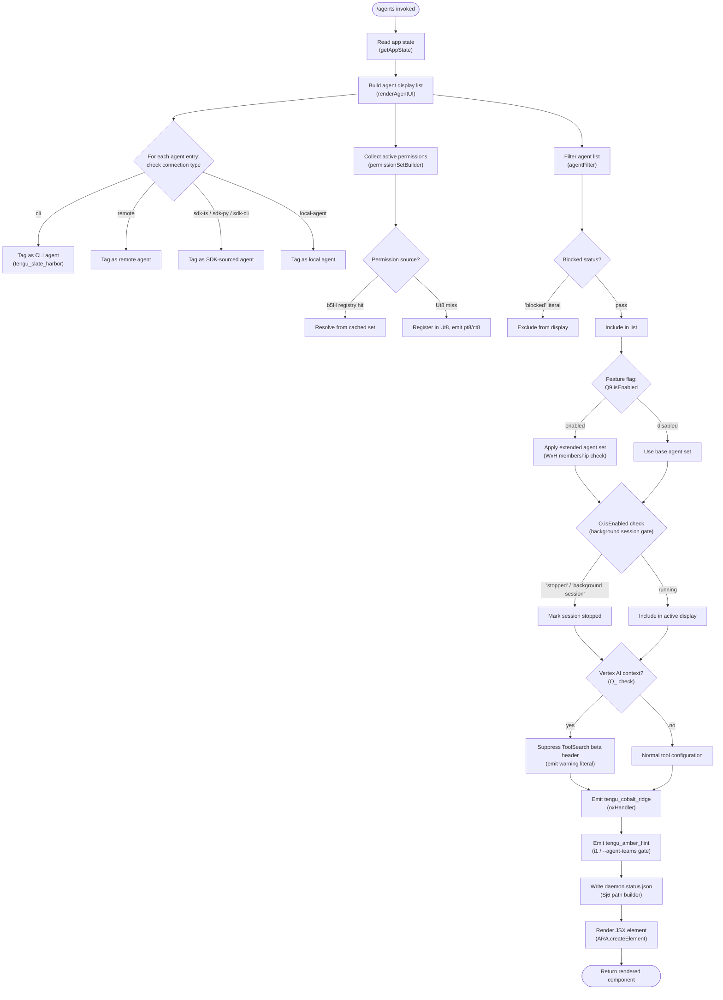

# `/agents`

> Analysis basis: CC v2.1.133 bundle.js (AST extraction + Claude interpretation)
> Minimum version: v2.1.133

---

## Overview

The `/agents` command is a local JSX-rendered slash command that provides an interactive management interface for agent configurations within Claude Code. It reads current application state, assembles a structured view of active and available agents (including their permission contexts, connection types, and run states), and renders the result as a React element in the CLI. The command is the primary surface for inspecting and manipulating the agent registry at runtime.

---

## Registration

| Field | Value |
|---|---|
| `type` | `local-jsx` |
| `name` | `agents` |
| `description` | `Manage agent configurations` |
| `loc_byte` | `11270655` |
| `loc_byte_end` | `11270780` |
| `loc_line` | `7076` |
| `module_id` | `l3q` |
| `load_inline` | `true` |
| `arbor_handler.name` | `nD7` |
| `arbor_handler.fqn` | `claude-2.1.133::nD7` |
| `arbor_handler.kind` | `AsyncFunction` |
| `arbor_handler.resolution_path` | `module_id` |
| `arbor_handler.n_hits` | `0` |

Analysis basis: CC v2.1.133 bundle.js:+11270655–+11270780

> **Handler note**: The handler was resolved via `module_id` → `l3q` → exported symbol `nD7`. The `load_inline: true` field confirms the module is loaded synchronously via an inline `Promise.resolve({call: nD7})` shape. The Arbor resolver (`resolution_path: "module_id"`) is authoritative; `nD7` is treated as the true entry point throughout this spec.

---

## Input Branching

The command's call graph contains more than three distinct branching paths (agent type filtering, permission-set evaluation, connection-type selection, feature-flag gating, and background-session state checking). A Mermaid flowchart is therefore used.



---

## Behavioral Spec

### 1. Handler Entry — `agentsCommandHandler` (`nD7`)

Analysis basis: CC v2.1.133 bundle.js:+11270462

```
async function agentsCommandHandler(context):
    appState = getAppState(context)              // A.getAppState @ +11270462
    uiElement = renderAgentUI(appState)          // GT @ +11270502
    return createElement(uiElement)             // ARA.createElement @ +11270515
```

The handler is an `AsyncFunction` (Arbor kind: `AsyncFunction`). It reads the global application state and delegates the heavy lifting to the agent UI renderer (`GT`) before wrapping the result in a React element for display.

### 2. Agent UI Renderer — `renderAgentUI` (`GT`)

Analysis basis: CC v2.1.133 bundle.js:+8887274–+8887708

```
function renderAgentUI(appState):
    // Step 1: stringify/normalize agent identifiers
    agentKeys = normalizeAgentKeys(appState)     // kH @ +8887274

    // Step 2: build connection-type tagged entries
    agentEntries = buildAgentEntries(appState)   // DX @ +8887313
    // connection type literals encountered: "cli", "remote",
    // "sdk-ts", "sdk-py", "sdk-cli", "local-agent"

    // Step 3: filter by blocked status
    filteredAgents = filterAgents(agentEntries)  // dt @ +8887345
    // removes any entry whose status equals "blocked" (+8886703)

    // Step 4: attach permission contexts
    agentsWithPerms = attachPermissions(filteredAgents) // eGA @ +8887369

    // Step 5: build key-value layout entries
    layoutEntries = buildLayoutEntries(appState) // KL @ +8887381

    // Step 6: compose full agent panel
    panel = composeAgentPanel(                   // nt @ +8887468
        layoutEntries,
        filteredAgents,
        agentsWithPerms
    )

    // Step 7: check membership in extended set
    if extendedSetRegistry.has(panel):           // _.has @ +8887486
        panel = applyExtendedLayout(panel)

    // Step 8: feature flag gate (primary)
    if featureFlagPrimary.isEnabled():           // Q9.isEnabled @ +8887536
        filteredAgents = filteredAgents.filter(  // L.filter @ +8887612
            entry => !blockedRegistry.has(entry) // WxH.has @ +8887627
        )
        agentMap = filteredAgents.map(...)       // L.map @ +8887655

    // Step 9: feature flag gate (secondary — background session)
    if featureFlagSecondary.isEnabled():         // O.isEnabled @ +8887666
        // marks sessions with status "stopped" as "background session"
        // literals: "stopped" @ +14191200, "background session" @ +14191243

    // Step 10: connection-type inclusion check
    if connectionTypes.includes(entry.type):     // $.includes @ +8887752
        applyConnectionPolicy(entry)

    // Step 11: apply Tz normalization
    normalizeAgentStrings(panel)                 // Tz @ +8887708

    return panel
```

### 3. Agent Entry Builder — `buildAgentEntries` (`DX`)

Analysis basis: CC v2.1.133 bundle.js:+3140362–+3140541

```
function buildAgentEntries(appState):
    // Normalize agent name via string coercion
    agentName = coerceToString(appState.agentId)   // ah @ +3140362
    agentKey  = buildKey(agentName)                // Zq @ +3140379
    normalized = normalizeKey(agentKey)            // kH @ +3140424

    // Determine connection type
    // Checks literal strings in order:
    //   "cli"    (+3140514)
    //   "remote" (+3140525)
    // Emits telemetry on cli match:
    //   tengu_slate_harbor (+3140544)

    // SDK type checks (further in callGraph):
    //   "sdk-ts"     (+3140771)
    //   "sdk-py"     (+3140785)
    //   "sdk-cli"    (+3140799)
    //   "local-agent" (+3140814)

    entry = buildPermissionEntry(normalized)       // J6 @ +3140541
    return entry
```

### 4. Permission-Set Builder — `permissionSetBuilder` (`J6`)

Analysis basis: CC v2.1.133 bundle.js:+3091299–+3091462

```
function permissionSetBuilder(agentEntry):
    // Resolve base permission descriptor
    basePerms  = resolveBasePermissions(agentEntry)   // Bq6 @ +3091299
    grantedSet = resolveGrantedSet(agentEntry)        // gq6 @ +3091336

    // Check deny list
    accessPolicy = checkAccessPolicy(agentEntry)      // Po @ +3091371
    // Po internally uses kH (string normalization) and jo (policy lookup)

    // Has the agent been seen before?
    if knownAgentRegistry.has(agentEntry.id):         // b5H.has @ +3091388
        return cachedPermissions(agentEntry.id)       // _d6 @ +3091399

    // Register new agent
    knownAgentRegistry.add(agentEntry.id)             // pq6.add @ +3091411

    // Check connection-level registry
    if connectionRegistry.has(agentEntry.conn):       // cU.has @ +3091425
        cachedConn = connectionRegistry.get(...)      // cU.get @ +3091442

    // Build runtime permission record
    permRecord = buildRuntimeRecord(agentEntry)       // R6 @ +3091462
    return permRecord
```

### 5. Cached-Permission Resolver — `cachedPermissionResolver` (`_d6`)

Analysis basis: CC v2.1.133 bundle.js:+3089099–+3089224

```
function cachedPermissionResolver(agentId):
    if seenSet.has(agentId):                    // Ut8.has @ +3089099
        cached = knownRegistry.get(agentId)     // b5H.get @ +3089123
        return cached

    // First-time registration
    seenSet.add(agentId)                        // Ut8.add @ +3089139
    emitRegistrationEvent(agentId)              // pt8 @ +3089150
    emitCompletionEvent(agentId)                // ct8 @ +3089224
```

### 6. Runtime Permission Record Builder — `runtimeRecordBuilder` (`R6`)

Analysis basis: CC v2.1.133 bundle.js:+3110101–+3110243

```
function runtimeRecordBuilder(agentEntry):
    formatted  = formatEntry(agentEntry)        // F6 @ +3110101
    tagged     = tagEntry(formatted)            // t2 @ +3110115
    annotated  = annotateEntry(tagged)          // He8 @ +3110134
    merged     = mergeMetadata(annotated)       // m5H @ +3110138
    timestamp  = Date.now()                     // Date.now @ +3110190
    record = {
        ...merged,
        createdAt: timestamp,
        extra: buildExtraPayload(merged)        // u2K @ +3110243
    }
    return record
```

### 7. Agent Filter — `agentFilter` (`dt`)

Analysis basis: CC v2.1.133 bundle.js:+8886642–+8886657

```
function agentFilter(agentList):
    // Remove entries whose connection type matches deny rules
    allowed = agentList.filter(                  // H.filter @ +8886642
        entry => !isDenied(entry)                // D58 @ +8886657
    )
    // isDenied checks literal "deny" (+9650429)
    // and "cliArg" source (+9650999)
    return allowed
```

`D58` (deny evaluator) calls `QzH` (flat-maps the global rule set via `rIA.flatMap` at +9650352) and `oIA` (which further checks `JS8`, `T66`, `$k` sub-classifiers at +9650675–+9650778). A third path `Di9` handles edge cases at +9651074.

### 8. Permission-Context Attacher — `permissionContextAttacher` (`eGA`)

Analysis basis: CC v2.1.133 bundle.js:+8887201–+8887231

```
function permissionContextAttacher(agentList):
    for entry in agentList:
        ctx = buildPermissionContext(entry)      // ox @ +8887201
        // ox checks "windows" platform literal (+4266747)
        // ox emits tengu_cobalt_ridge (+4266841)

        hook = attachHook(ctx)                   // jZH @ +8887225
        loopState = initLoopState()              // A_ @ +8887231
    return agentList
```

`ox` (platform-context builder) internally calls `a6` (platform lookup at +4266740), `kH` (string normalize at +4266764), `Zq` (key builder at +4266773), `v6H` (variant handler at +4266809), and `J6` (permission-set builder at +4266838).

`A_` (loop state initializer) calls module bootstrap helpers `OwH`, `P28`, `S06.call`, `R06.bind`, `Llq`, and stores state via `SgA.set`.

### 9. Agent Panel Composer — `agentPanelComposer` (`nt`)

Analysis basis: CC v2.1.133 bundle.js:+8886040–+8886599

```
function agentPanelComposer(layoutEntries, filteredAgents, agentsWithPerms):
    // Layout key-value rows
    kvRows = buildLayoutRows(layoutEntries)          // KL @ +8886040

    // Normalize display strings
    displayStr = normalizeDisplayString(kvRows)      // Tz @ +8886056

    // Resolve display variant
    variant = resolveDisplayVariant(kvRows)          // vX @ +8886160
    // vX calls kH (normalize) and NA (variant accessor)

    // String normalization pass
    normalized = normalizeStrings(filteredAgents)    // kH @ +8886237

    // Compute column width (constant: 40, +14181334)
    colWidth = computeColumnWidth(normalized)        // GcH @ +8886308

    // Render expanded panel state
    expandedPanel = renderExpandedState(colWidth)    // Og4 @ +8886327
    // Og4 calls TU9 (expansion helper) and A_ (loop state)

    // Agent-teams feature gate
    if agentTeamsFlag.enabled:                       // "--agent-teams" @ +3064954
        teamEntry = buildTeamEntry(filteredAgents)   // i1 @ +8886368
        // i1 emits tengu_amber_flint @ +3065066

    // Render "more" panel state
    morePanel = renderMoreState(colWidth)            // Mg4 @ +8886374
    // Mg4 calls AU9 and A_

    // Render collapsed/summary panel state
    summaryPanel = renderSummaryState(colWidth)      // $g4 @ +8886380
    // $g4 calls MU9 and A_

    // Attach permission context
    withPerms = attachPermissionContext(summaryPanel) // eGA @ +8886531

    // Apply display mode selector
    displayMode = selectDisplayMode(withPerms)        // gU9 @ +8886572

    // Apply formatting pipeline
    formatted = applyFormattingPipeline(displayMode)  // fm @ +8886599

    return formatted
```

### 10. Formatting Pipeline — `formattingPipeline` (`fm`)

Analysis basis: CC v2.1.133 bundle.js:+9372816–+9373030

```
function formattingPipeline(displayMode):
    // Apply primary display adapter
    // IZA checks "standard" (+9372338), "tst" (+9372417),
    // numeric limit 100 (+9372430), "tst-auto" (+9372467)
    adapted = applyDisplayAdapter(displayMode)    // IZA @ +9372816

    // Apply key formatter
    keyFormatted = formatKeys(adapted)            // k @ +9372856
    // k normalizes: trims, uppercases, checks debug mode (+162555),
    // applies dN and LkH transforms, evaluates vtq condition

    // Apply provider/platform filter
    // Checks: "bedrock" (+1980750), "foundry" (+1980800),
    //         "anthropicAws" (+1980856), "mantle" (+1980910),
    //         "vertex" (+1980958), "firstParty" (+1980967)
    // Also checks api.anthropic.com endpoint (+1981585)
    providerFiltered = applyProviderFilter(keyFormatted) // Q_ @ +9373008

    // Apply output renderer
    rendered = applyOutputRenderer(providerFiltered)     // o3 @ +9373030

    // Note: Vertex AI path suppresses ToolSearch beta header
    // Warning literal: "[ToolSearch:optimistic] disabled..." (+9373352)

    return rendered
```

### 11. Daemon Status Writer — `daemonStatusWriter` (`Sj6` / `XDq` chain)

Analysis basis: CC v2.1.133 bundle.js:+11407084–+11407140; +11406973–+11406987

```
function writeDaemonStatus(sessionData):
    // Build status file path
    statusPath = path.join(..., "daemon.status.json")  // Sj6/JDq.join @ +11406973
    // filename literal: "daemon.status.json" @ +11406987

    // Generate random write token (4 bytes, hex encoding)
    token = randomBytes(4).toString("hex")             // iY/Xa8.randomBytes @ +2867005

    // Atomic write: temp file → rename
    await fs.writeFile(tempPath, payload, "utf8")      // Lo.writeFile @ +2867052
    await fs.rename(tempPath, statusPath)              // Lo.rename @ +2867105

    // Track open handles
    openHandles.add(handle)                            // o41.has @ +2867156
    // Copy if needed:
    await fs.copyFile(src, dst)                        // Lo.copyFile @ +2867178
    // Cleanup:
    await fs.unlink(tempPath)                          // Lo.unlink @ +2867232

    // Serialize state
    serialized = JSON.stringify(sessionData)           // SH/JSON.stringify @ +143548
```

The status file path is constructed by joining a base directory constant with the literal filename `"daemon.status.json"` (bundle.js:+11406987). The write uses an atomic rename pattern to avoid partial reads.

### 12. Agent-Teams Gate — `agentTeamsGate` (`i1`)

Analysis basis: CC v2.1.133 bundle.js:+3064954–+3065066

```
function agentTeamsGate(agentList):
    // Check for --agent-teams CLI argument
    if cliArgs.includes("--agent-teams"):          // literal @ +3064954
        teamView = buildTeamView(agentList)        // lPK @ +3065044
        entries  = buildPermissionEntries(teamView) // J6 @ +3065063
        // emits tengu_amber_flint telemetry @ +3065066
        return entries
    return null
```

The `--agent-teams` flag (bundle.js:+3064954) gates an additional panel section that groups agents into team views.

### 13. Boolean/Flag Normalizer — `flagNormalizer` (`kH`, `Zq`)

Analysis basis: CC v2.1.133 bundle.js:+25147–+25393

```
function flagNormalizer(value):
    // Truthy literals: 1 (+25147), "yes" (+25237), "on" (+25243)
    // Falsy literals:  "no" (+25388), "off" (+25393)
    coerced = String(value)                       // kH → String @ +25188
    strKey  = buildStringKey(coerced)             // Zq → String @ +25338
    return evaluate(strKey)
```

This utility is called pervasively across the call graph wherever agent flags and permission booleans are normalized.

---

## State & Side Effects

| Item | Detail |
|---|---|
| **Telemetry** | `tengu_slate_harbor` (emitted on CLI-type agent registration, +3140544); `tengu_cobalt_ridge` (emitted during platform-context attachment in `ox`, +4266841); `tengu_amber_flint` (emitted when `--agent-teams` gate fires, +3065066) |
| **App state read** | `A.getAppState` called at handler entry (+11270462); reads the full application state object |
| **Permission registries** | `Ut8` (seen-agent set, `.has`/`.add`); `b5H` (cached permission map, `.has`/`.get`); `pq6` (new-agent registration set, `.add`); `cU` (connection-level registry, `.has`/`.get`) |
| **Agent filter registries** | `WxH` (blocked-agent set, `.has` at +8887627); `_` (extended-set registry, `.has` at +8887486) |
| **Daemon status file** | Written to `<basedir>/daemon.status.json` (+11406987) via atomic rename; 4-byte hex token generated per write (+2867005) |
| **Hook registration** | `A_` (loop state initializer) registers via `SgA.set` at +1692; `R06.bind` at +1630 sets a bound callback |
| **File system** | `Lo.writeFile`, `Lo.rename`, `Lo.copyFile`, `Lo.unlink` (all via `iY`); `Ydq.unlinkSync` (via `q` at +14137065) for synchronous cleanup |
| **Timers** | `setTimeout` used in `H` (background jitter, with `Math.random` multiplied by constant `2`, +12285767) |
| **JSX render** | `ARA.createElement` called at +11270515 to wrap the composed panel as a React element |
| **Sound** | None detected in depth-2 traversal |
| **Vertex AI suppression** | When Vertex AI provider is detected, the ToolSearch beta header is suppressed with a warning emitted as a string literal (+9373352) |

---

## Version History

| Version | Change |
|---|---|
| v2.1.133 | Initial analysis; `nD7` handler identified via Arbor `module_id` resolution; three telemetry events confirmed; `--agent-teams` flag gate documented |

---

## Common Mistakes

1. **Assuming `/agents` is read-only**: The command writes `daemon.status.json` to disk as a side effect on every invocation. Scripts that call `/agents` in a loop will produce repeated file-system writes.

2. **Ignoring the `--agent-teams` flag**: The additional team-grouping panel section is gated behind a CLI argument (`--agent-teams`). Without this flag, team-view entries are silently omitted and there is no error message.

3. **Expecting synchronous output for remote agents**: Entries tagged `"remote"` go through the full permission-set builder pipeline including async file I/O (atomic rename pattern). Treat the command as asynchronous end-to-end.

4. **Overlooking the blocked-agent filter**: Agents with status `"blocked"` are removed from the display list before rendering. A missing agent in the output does not necessarily mean it is unconfigured — it may be blocked by `WxH`.

5. **Confusing `"stopped"` with removal**: When the secondary feature flag (`O.isEnabled`) is active, sessions with status `"stopped"` are relabelled `"background session"` rather than removed. These entries remain visible in the panel.

6. **Vertex AI and ToolSearch**: On Vertex AI deployments, the ToolSearch beta header is suppressed automatically. Setting `ENABLE_TOOL_SEARCH=true` overrides this suppression (as noted in the warning literal at +9373352).

7. **Flag normalization edge cases**: Boolean flags are normalised through `flagNormalizer`. The strings `"yes"` and `"on"` are treated as truthy; `"no"` and `"off"` are treated as falsy. Passing raw `true`/`false` JavaScript booleans also works because `String()` coercion is applied first.

---

## Appendix — Identifier Mapping

> For bundle debugging only. Identifiers change across versions.

| Identifier | Role |
|---|---|
| `nD7` | `agentsCommandHandler` — async entry-point for the `/agents` command (Arbor-resolved handler) |
| `GT` | `renderAgentUI` — top-level agent UI renderer; orchestrates all sub-steps |
| `kH` | `normalizeAgentKey` / `flagNormalizer (string path)` — pervasive string normalization utility |
| `DX` | `buildAgentEntries` — constructs connection-type-tagged agent entry objects |
| `ah` | `coerceAgentName` — converts raw agent identifier to a normalized string |
| `Zq` | `buildStringKey` — secondary string-key builder used alongside `kH` |
| `J6` | `permissionSetBuilder` — assembles the permission descriptor for a given agent entry |
| `Bq6` | `resolveBasePermissions` — extracts base permission descriptor |
| `gq6` | `resolveGrantedSet` — extracts granted permission set |
| `Po` | `checkAccessPolicy` — evaluates deny/allow policy for an agent |
| `jo` | `policyLookup` — inner lookup used by `Po` |
| `_d6` | `cachedPermissionResolver` — returns cached permissions or registers on first sight |
| `R6` | `runtimeRecordBuilder` — constructs the full runtime permission record with timestamp |
| `F6` | `formatEntry` — first formatting pass inside `runtimeRecordBuilder` |
| `t2` | `tagEntry` — adds type tags to a formatted entry |
| `He8` | `annotateEntry` — attaches annotations to a tagged entry |
| `m5H` | `mergeMetadata` — merges metadata fields into a single record |
| `u2K` | `buildExtraPayload` — assembles supplementary payload fields |
| `dt` | `agentFilter` — filters agent list by deny rules |
| `H` | `backgroundJitterTimer` — applies random `setTimeout` jitter (constant `2` multiplier) |
| `D58` | `denyEvaluator` — top-level deny-rule evaluator |
| `QzH` | `ruleSetFlattener` — flat-maps the global rule set |
| `oIA` | `subClassifierDispatch` — dispatches to `JS8`, `T66`, `$k` sub-classifiers |
| `Di9` | `denyEdgeCaseHandler` — handles edge cases in deny evaluation |
| `JS8` | `subClassifierA` — one of three deny sub-classifiers |
| `T66` | `subClassifierB` — one of three deny sub-classifiers |
| `$k` | `subClassifierC` — one of three deny sub-classifiers |
| `eGA` | `permissionContextAttacher` — attaches platform permission context to each agent entry |
| `ox` | `platformContextBuilder` — builds platform-aware permission context; emits `tengu_cobalt_ridge` |
| `a6` | `platformLookup` — resolves platform identifier (e.g. `"windows"`) |
| `v6H` | `platformVariantHandler` — handles platform-specific variant logic |
| `jZH` | `hookAttacher` — attaches lifecycle hook to permission context |
| `A_` | `loopStateInitializer` — initializes loop/iteration state; stores via `SgA.set` |
| `R06` | `boundCallback` — callback bound during loop state initialization |
| `KL` | `buildLayoutEntries` — constructs key-value layout rows for the agent panel |
| `nt` | `agentPanelComposer` — assembles the full agent panel from sub-components |
| `Tz` | `normalizeDisplayString` — normalizes display strings inside the panel |
| `vX` | `resolveDisplayVariant` — resolves display variant from layout rows |
| `NA` | `variantAccessor` — accesses the specific display variant value |
| `GcH` | `columnWidthComputer` — computes column width (constant: 40) |
| `Og4` | `renderExpandedState` — renders the expanded panel state |
| `TU9` | `expansionHelper` — assists in rendering expanded state |
| `i1` | `agentTeamsGate` — gates `--agent-teams` panel; emits `tengu_amber_flint` |
| `lPK` | `buildTeamView` — builds the team-grouping view |
| `Mg4` | `renderMoreState` — renders the "more" (paginated) panel state |
| `AU9` | `moreStateHelper` — assists in rendering the "more" state |
| `$g4` | `renderSummaryState` — renders the collapsed/summary panel state |
| `MU9` | `summaryStateHelper` — assists in rendering summary state |
| `fm` | `formattingPipeline` — applies the full display formatting pipeline |
| `IZA` | `displayAdapter` — adapts display mode; checks `"standard"`, `"tst"`, `"tst-auto"` |
| `ld9` | `displayAdapterHelper` — inner helper used by `IZA` |
| `_r4` | `displayAdapterSecondary` — secondary helper used by `IZA` |
| `k` | `keyFormatter` — formats and normalizes display keys; handles `"debug"` mode |
| `NsH` | `debugModeChecker` — checks debug mode flag |
| `Ztq` | `keyTransformA` — first key transform step |
| `SH` | `jsonSerializerWrapper` — wraps `JSON.stringify` |
| `dN` | `keyTransformB` — second key transform step |
| `LkH` | `keyTransformC` — third key transform step |
| `vtq` | `conditionEvaluator` — evaluates a condition on the formatted key |
| `Uf` | `trimAndUpperHelper` — assists `toUpperCase`/`trim` operations |
| `Q_` | `providerPlatformFilter` — filters output based on provider/platform type |
| `o3` | `outputRenderer` — final rendering step in the formatting pipeline |
| `_` | `extendedSetRegistry` — registry of agents in the extended display set |
| `f` | `handleManager` — manages open file/process handles |
| `q` | `unlinkManager` — manages synchronous file unlink operations |
| `K` | `handleTracker` — tracks open handles; uses `q.add`, `f.finally`, `q.delete` |
| `L` | `agentDisplayList` — the working list of agent display entries (filtered, mapped) |
| `AK` | `auxiliaryProcessor` — auxiliary processing step after feature-flag filter |
| `O` | `backgroundSessionFlag` — feature flag for background session labelling |
| `d8` | `backgroundSessionChecker` — checks session stopped/background status |
| `$` | `connectionTypeList` — list of valid connection type strings for inclusion check |
| `XDq` | `daemonStatusOrchestrator` — orchestrates daemon status write sequence |
| `yr` | `sessionMetadataBuilder` — builds session metadata object |
| `y7H` | `sessionMetadataHelper` — inner helper for session metadata |
| `iY` | `atomicFileWriter` — performs atomic write via temp file + rename |
| `Sj6` | `daemonStatusPathBuilder` — builds path to `daemon.status.json` |
| `n8` | `baseDirectoryResolver` — resolves the base directory for daemon files |
| `Og4` | *(see above)* |
| `gU9` | `displayModeSelector` — selects the active display mode |
| `o$` | `ruleSetHelper` — helper used during rule-set flat-map |
| `pq6` | `newAgentRegistrationSet` — Set tracking newly registered agents |
| `cU` | `connectionLevelRegistry` — Map of connection-level cached data |
| `Ut8` | `seenAgentSet` — Set of already-seen agent IDs |
| `b5H` | `cachedPermissionMap` — Map of cached permission descriptors |
| `WxH` | `blockedAgentSet` — Set of blocked agent identifiers |
| `Q9` | `primaryFeatureFlag` — primary feature flag object (`.isEnabled()`) |
| `SgA` | `loopStateStore` — storage map for loop/iteration state |
| `Llq` | `loopInitHelper` — helper called during loop state initialization |
| `Xa8` | `cryptoModule` — Node.js `crypto` module wrapper (`randomBytes`) |
| `Lo` | `fsModule` — Node.js `fs` (promises) module wrapper |
| `Ydq` | `fsSyncModule` — Node.js `fs` sync module wrapper (`unlinkSync`) |
| `JDq` | `pathModule` — Node.js `path` module wrapper (`join`) |
| `o41` | `openHandleSet` — Set tracking open file handles |
| `a41` | `copyGuardSet` — Set guarding copy operations |
| `ARA` | `reactModule` — React (or compatible) module (`createElement`) |
| `rIA` | `globalRuleSet` — global flat array of deny/allow rules |
| `pt8` | `registrationEventEmitter` — emits first-registration event for new agents |
| `ct8` | `completionEventEmitter` — emits completion event after agent registration |
| `XDq` | *(see daemonStatusOrchestrator above)* |

---

Note: index built via Arbor fallback; some signals (telemetry, literals) may be missing — see arbor-fallback.js.