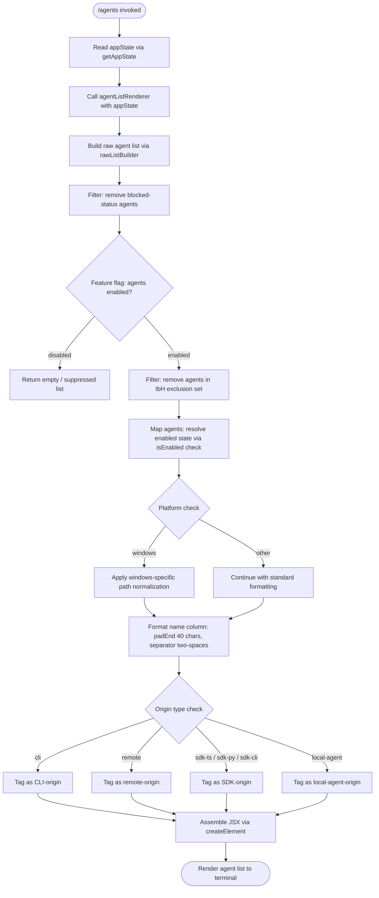

# `/agents`

> Analysis basis: CC v2.1.132 bundle.js (AST extraction + Claude interpretation)
> Minimum version: v2.1.132

---

## Overview

The `/agents` slash command provides a management interface for agent configurations within Claude Code. It reads current application state, enumerates registered agents filtered by status and origin type, and renders a JSX component listing those agents with their relevant metadata. The command integrates with the feature-flag system and platform-detection logic to conditionally display or suppress entries.

---

## Registration

| Field | Value |
|---|---|
| type | `local-jsx` |
| name | `agents` |
| description | `Manage agent configurations` |
| module_id | `Y3q` |

Analysis basis: CC v2.1.132 bundle.js:+11253411

---

## Input Branching

The top-level handler (`commandHandler`) first resolves application state, then delegates to the agent-list renderer. The renderer applies several sequential filters before building the display list.



Analysis basis: CC v2.1.132 bundle.js:+11253218, +11253258, +11253271, +8877018, +8877057, +8877089, +8877113, +8877125, +8877212, +8877230, +8877257, +8877269, +8877280, +8877356, +8877371, +8877399, +8877410, +8877452, +8877496

---

## Behavioral Spec

### Top-Level Command Handler

```
function commandHandler(context):
    appState = getAppState(context)           // reads global app state
    result   = agentListRenderer(appState)   // delegates all logic
    return createElement(result)             // wraps output as JSX element
```

Analysis basis: CC v2.1.132 bundle.js:+11253218, +11253258, +11253271

---

### Boolean Coercion Helper

The boolean coercion helper converts loose string/number truthy representations into strict booleans. Recognized truthy literals:

- Number `1` (Analysis basis: CC v2.1.132 bundle.js:+25147)
- String `"yes"` (Analysis basis: CC v2.1.132 bundle.js:+25237)
- String `"on"` (Analysis basis: CC v2.1.132 bundle.js:+25243)

```
function coerceToBool(value):
    normalized = String(value).toLowerCase()
    if normalized in ["1", "yes", "on"]:
        return true
    return false
```

Analysis basis: CC v2.1.132 bundle.js:+25188, +25237, +25243, +25147

---

### Agent Origin Classifier

Each agent entry carries an origin-type tag. The classifier maps the raw origin field to one of five canonical values:

| Raw origin value | Canonical tag |
|---|---|
| `"cli"` | CLI-origin |
| `"remote"` | Remote-origin |
| `"sdk-ts"` | SDK (TypeScript) origin |
| `"sdk-py"` | SDK (Python) origin |
| `"sdk-cli"` | SDK (CLI wrapper) origin |
| `"local-agent"` | Local-agent origin |

```
function classifyOrigin(agent):
    origin = agent.originType
    if origin == "cli":        return "CLI-origin"
    if origin == "remote":     return "remote-origin"
    if origin == "sdk-ts":     return "SDK-TS-origin"
    if origin == "sdk-py":     return "SDK-PY-origin"
    if origin == "sdk-cli":    return "SDK-CLI-origin"
    if origin == "local-agent":return "local-agent-origin"
    return "unknown-origin"
```

Telemetry event `tengu_slate_harbor` is emitted during origin classification or the surrounding agent-registration routine.

Analysis basis: CC v2.1.132 bundle.js:+3134295, +3134306, +3134552, +3134566, +3134580, +3134595, +3134325

---

### Raw Agent List Builder

The raw list builder reads all registered agent handles from application state and applies an initial status filter.

```
function rawListBuilder(agentRegistry):
    allAgents = agentRegistry.filter(entry => entry.status != "blocked")
    return allAgents
```

Blocked-status agents are unconditionally excluded from all downstream processing.

Analysis basis: CC v2.1.132 bundle.js:+8876386, +8876401, +8876447

---

### Feature-Flag Gate

After the raw list is built, the feature-flag gate checks whether the agents feature is enabled for the current session.

```
function featureFlagGate(rawList, featureFlags):
    if not featureFlags.isEnabled("agents"):
        return []
    return rawList
```

Analysis basis: CC v2.1.132 bundle.js:+8877280

---

### Exclusion-Set Filter

A secondary exclusion set (`tbH`) is applied after the feature-flag gate. Agents whose identifiers appear in this set are removed.

```
function exclusionSetFilter(list, exclusionSet):
    return list.filter(agent => not exclusionSet.has(agent.id))
```

Analysis basis: CC v2.1.132 bundle.js:+8877371

---

### Enabled-State Resolver

Each surviving agent is mapped through an `isEnabled` check. Agents whose `isEnabled` check returns `false` (which may reference the `"stopped"` status or `"background session"` classification) are marked as inactive but **are still included in the rendered list** — they are not filtered out, only visually distinguished.

```
function resolveEnabledState(agentList, sessionFlags):
    return agentList.map(agent => {
        active = sessionFlags.isEnabled(agent)
        // "stopped" state and "background session" type inform this check
        return { ...agent, active: active }
    })
```

Analysis basis: CC v2.1.132 bundle.js:+8877399, +8877410, +14163882, +14163925, +14163920

---

### Platform-Aware Name Formatter

Agent names are padded to a fixed column width before display. On Windows the path separator handling differs.

- Column width: **40 characters** (Analysis basis: CC v2.1.132 bundle.js:+14154022)
- Column separator: two-space string `"  "` (Analysis basis: CC v2.1.132 bundle.js:+14152051)
- Platform branch triggers on value `"windows"` (Analysis basis: CC v2.1.132 bundle.js:+4258861)

```
function formatAgentName(agent, platform):
    name = agent.displayName
    if platform == "windows":
        name = normalizeWindowsPaths(name)   // s6 + J6H helpers
    paddedName = name.padEnd(40)
    return paddedName + "  "
```

Analysis basis: CC v2.1.132 bundle.js:+14152017, +14152030, +14154022, +14152051, +4258854, +4258887, +4258861

---

### Agent Row Renderer

The row renderer assembles the per-agent display record and delegates to the shared JSX row component.

```
function renderAgentRow(agent, platform):
    formattedName  = formatAgentName(agent, platform)
    originTag      = classifyOrigin(agent)
    enabledLabel   = agent.active ? "enabled" : "stopped"
    rowProps = {
        name:    formattedName,
        origin:  originTag,
        status:  enabledLabel,
        context: agent.contextHandle     // cx field
    }
    return jsxRowComponent(rowProps)    // MZH + nA helpers
```

Analysis basis: CC v2.1.132 bundle.js:+8876945, +8876969, +8876975

---

### Agent Detail Panel (Bt)

The detail panel is the richer per-agent sub-component invoked when a specific agent has sufficient context. It composes multiple sub-helpers including the exclusion-set filter (`_L`), a metadata resolver (`MD`), input validators (`Ij`), additional boolean coercion (`yH`), time/duration display (`tdH`), a capability badge renderer (`FB4`), list utilities (`l1`, `UB4`, `BB4`), the row renderer (`JGA`), an overflow handler (`OU9`), and a teardown routine (`tu`).

```
function agentDetailPanel(agent, appState):
    filteredAgent = exclusionSetFilter([agent], exclusionSet)[0]
    if filteredAgent is undefined:
        return null
    meta       = resolveMetadata(filteredAgent)      // MD
    validated  = validateInputs(filteredAgent)        // Ij
    coerced    = coerceToBool(filteredAgent.flag)     // yH
    duration   = formatDuration(filteredAgent)        // tdH
    badges     = renderCapabilityBadges(filteredAgent)// FB4
    items      = buildListItems(filteredAgent)        // l1, UB4, BB4
    rows       = renderAgentRow(filteredAgent, platform) // JGA
    overflow   = handleOverflow(items)               // OU9
    onTeardown = registerTeardown(filteredAgent)      // tu
    return assembleDetailView(meta, validated, coerced,
                              duration, badges, items,
                              rows, overflow, onTeardown)
```

Analysis basis: CC v2.1.132 bundle.js:+8875784, +8875800, +8875904, +8875981, +8876052, +8876071, +8876112, +8876118, +8876124, +8876275, +8876316, +8876343

---

### String Inclusion Gate

A final string-inclusion check determines whether a given agent identifier appears in an allow-list (`$`), which itself is built via the `mzq` helper.

```
function stringInclusionGate(agentId, allowList):
    return allowList.includes(agentId)
```

Analysis basis: CC v2.1.132 bundle.js:+8877496, +14141983

---

## State & Side Effects

| Item | Detail |
|---|---|
| Telemetry | `tengu_slate_harbor` — emitted during origin classification / agent registration (bundle.js:+3134325) |
| appState reads | `getAppState` called once at command entry (bundle.js:+11253218) |
| Hook registration | Teardown hook registered per agent via `tu` helper (bundle.js:+8876343) |
| JSX rendering | Output assembled via `wSA.createElement` (bundle.js:+11253271) |
| Feature flags | `d9.isEnabled` (agents gate) and `O.isEnabled` (per-agent enabled state) queried at render time (bundle.js:+8877280, +8877410) |
| Exclusion set | `tbH` Set consulted to suppress specific agent IDs (bundle.js:+8877371) |
| Platform detection | `"windows"` branch alters name formatting (bundle.js:+4258861) |
| Sound | <!-- TODO: not found in depth-2 traversal; needs --depth 4 --> |

---

## Version History

| Version | Change |
|---|---|
| v2.1.132 | Initial analysis — command registered as `local-jsx`, origin classifier supports six origin types, telemetry event `tengu_slate_harbor` confirmed |

---

## Common Mistakes

1. **Assuming blocked agents are shown.** Agents with status `"blocked"` are removed before any other processing; they will never appear in the rendered list regardless of feature flags.
2. **Expecting the command to accept sub-arguments.** The registration has no `args` or `subCommands` field; `/agents` is invoked bare and produces a read-only list view.
3. **Treating `"stopped"` as filtered-out.** Agents in a stopped or background-session state are still listed; they are marked inactive visually but not excluded.
4. **Ignoring the exclusion set.** Even if an agent passes the feature-flag gate, it may still be suppressed by the `tbH` exclusion set, which operates independently of status and flags.
5. **Column-width assumptions on Windows.** The name column is padded to exactly 40 characters, but Windows paths are normalized before padding; tools that parse raw output should account for both code paths.
6. **Conflating origin types.** The six origin values (`cli`, `remote`, `sdk-ts`, `sdk-py`, `sdk-cli`, `local-agent`) are distinct and not interchangeable; filtering or matching on origin requires exact string comparison.

---

## Appendix — Identifier Mapping

> For bundle debugging only. Identifiers change across versions.

| Identifier | Role |
|---|---|
| `Wz7` | Top-level command handler (entry point for `/agents`) |
| `A` | Application state container (source of `getAppState`) |
| `NT` | Agent list renderer (orchestrates all filtering and mapping) |
| `yH` | Boolean coercion helper (normalizes `"yes"` / `"on"` / `1` to bool) |
| `zj` | Agent origin classifier (maps raw origin string to canonical tag) |
| `mt` | Raw agent list builder (initial status filter, removes `"blocked"`) |
| `JGA` | JSX agent row renderer (assembles per-row display component) |
| `_L` | Platform-aware name formatter / exclusion-set filter composite |
| `Bt` | Agent detail panel component (rich per-agent sub-view) |
| `_` | Identifier lookup helper (uses `toLowerCase` for case-insensitive key matching) |
| `L` | Agent display list builder (applies `map` and `padEnd` for column formatting) |
| `eL` | Supplementary list utility called after feature-flag gate |
| `O` | Per-agent enabled-state resolver (wraps `isEnabled` and `Q8` session check) |
| `MD` | Agent metadata resolver (used in both list and detail panel) |
| `$` | Allow-list inclusion checker (backed by `mzq` allow-list builder) |