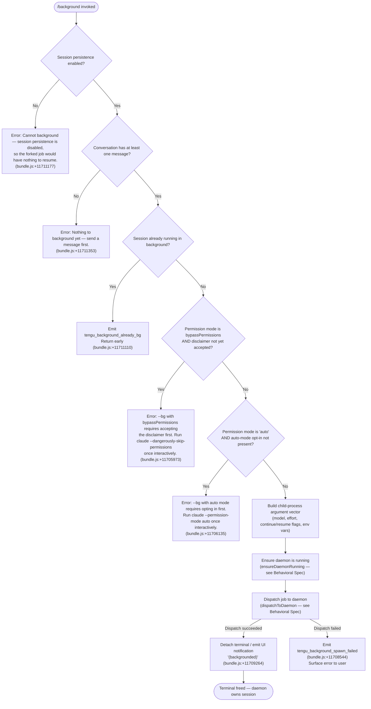

# `/background`

> Analysis basis: CC v2.1.133 bundle.js (AST extraction + Claude interpretation)
> Minimum version: v2.1.133

---

## Overview

The `/background` command (alias `/bg`) detaches the current interactive Claude Code session from the terminal and hands execution off to a background daemon process. The foreground terminal is freed immediately while the agentic task continues running under daemon supervision. The command performs permission-mode and session-persistence checks before dispatching, and surfaces errors when preconditions are not met.

---

## Registration

| Field | Value |
|---|---|
| type | `local-jsx` |
| name | `background` |
| aliases | `["bg"]` |
| description | `"Continue this session in the background and free the terminal"` |
| module\_id | `IXq` |
| load\_inline | `true` |
| loc\_byte | `11711730` |
| loc\_byte\_end | `11711950` |
| loc\_line | `7857` |
| immediate | `null` |
| arbor\_handler.name | `rW7` |
| arbor\_handler.kind | `AsyncFunction` |
| arbor\_handler.fqn | `claude-2.1.133::rW7` |
| arbor\_handler.resolution\_path | `module_id` |
| arbor\_handler.n\_hits | `0` |
| `loc_byte_end` | `11711950` |
| `arbor_handler.name` | `rW7` |
| `arbor_handler.kind` | `AsyncFunction` |
| `arbor_handler.resolution_path` | `module_id` |
| `arbor_handler.fqn` | `claude-2.1.133::rW7` |
| `arbor_handler.n_hits` | `0` |

Analysis basis: CC v2.1.133 bundle.js:+11711730

---

## Input Branching

The command has four or more distinct guarded branches before dispatching, so a flowchart is used.



---

## Behavioral Spec

### Handler entry — `rW7` (commandHandler)

The Arbor-resolved handler `rW7` is an `AsyncFunction` reached via `module_id → IXq`.

```
async function commandHandler(context):
    // Guard 1 — persistence check
    if not sessionPersistenceEnabled(context):
        return errorMessage("Cannot background — session persistence is disabled...")
        // bundle.js:+11711177

    // Guard 2 — conversation non-empty check
    if conversationMessages(context).length == 0:
        return errorMessage("Nothing to background yet — send a message first.")
        // bundle.js:+11711353

    // Guard 3 — already-backgrounded check
    if isAlreadyBackground(context):
        emit telemetry("tengu_background_already_bg")   // bundle.js:+11711110
        return

    // Delegate to UI renderer (kY8) which performs remaining guards and dispatch
    return renderBackgroundUI(context)
```

Analysis basis: CC v2.1.133 bundle.js:+11711096

---

### UI renderer — `kY8` (backgroundUIRenderer)

`kY8` is called by `rW7` at bundle.js:+11711314. It produces the JSX output and orchestrates the remaining permission guards and dispatch via `uW7`.

```
function backgroundUIRenderer(context):
    // Permission-mode guard — bypassPermissions
    if permissionMode == "bypassPermissions" and not disclaimerAccepted:
        display error (bundle.js:+11705973)
        return

    // Permission-mode guard — auto mode
    if permissionMode == "auto" and not autoModeOptIn:
        display error (bundle.js:+11706135)
        return

    // Build argument vector
    args = buildArgVector(context)     // → uW7

    // Ensure daemon is reachable (may spawn transient or ask to install service)
    daemonHandle = ensureDaemonRunning(context)   // → Bm

    // Dispatch
    result = dispatchJob(daemonHandle, args)       // → vbA

    if result.ok:
        display "(backgrounded)"  // bundle.js:+11709264
        detachTerminal()
    else:
        emit telemetry("tengu_background_spawn_failed")   // bundle.js:+11708544
        display errorSummary(result)
```

Analysis basis: CC v2.1.133 bundle.js:+11711314

---

### Argument vector builder — `uW7` (buildArgVector)

Constructs the `claude` CLI invocation that the daemon will execute for the forked session.

```
function buildArgVector(context):
    args = []

    // Carry forward model and effort if set
    if context.model:
        args += ["--model", context.model]         // bundle.js:+11708231
    if context.effort:
        args += ["--effort", context.effort]       // bundle.js:+11708253

    // Session continuation strategy
    // "continue" flag is passed to resume the conversation
    args += ["continue"]                           // bundle.js:+11708294

    // Gate: permission mode propagation
    if permissionMode set:
        args += ["--permission-mode", permissionMode]   // bundle.js:+11705773

    // Dangerous-skip-permissions propagation
    // "--dangerously-skip-permissions" (bundle.js:+11705836)
    // "--allow-dangerously-skip-permissions" (bundle.js:+11705882)
    propagateDangerousFlags(args)

    // Fork-session flag for session identity
    args += ["--fork-session"]                     // bundle.js:+11691807

    // Session ID propagation
    args += ["--session-id=<currentSessionId>"]    // bundle.js:+11705311

    // Agent name if present
    if agentName:
        args += ["--name", agentName]              // bundle.js:+11691606

    // Carry forward critical environment variables
    propagateEnvVars([
        "CLAUDE_CONFIG_DIR",                       // bundle.js:+11706722
        "CLAUDE_INTERNAL_FC_OVERRIDES",            // bundle.js:+11706742
        "AWS_REGION",                              // bundle.js:+11706773
        "AWS_DEFAULT_REGION",                      // bundle.js:+11706786
        "AWS_PROFILE",                             // bundle.js:+11706807
        "GOOGLE_APPLICATION_CREDENTIALS",          // bundle.js:+11706821
        "GOOGLE_CLOUD_PROJECT",                    // bundle.js:+11706854
        "GCLOUD_PROJECT",                          // bundle.js:+11706877
    ])

    return args
```

Analysis basis: CC v2.1.133 bundle.js:+11691211 (uW7 start)

---

### Daemon lifecycle manager — `Bm` (ensureDaemonRunning)

Guarantees a daemon is available before dispatch. Handles multiple lifecycle states.

```
async function ensureDaemonRunning(context):
    emit telemetry("daemon_ensure_running")         // bundle.js:+11659103

    status = checkDaemonStatus()

    if status == "up":
        // Verify binary path is not stale
        if binaryIsStale():
            emit telemetry("tengu_bg_daemon_service_stale_exec")  // bundle.js:+11659178
            fallbackToTransientSpawn()
            return

    if status == "not_running":
        // Determine platform (macos/linux/windows)  // bundle.js:+11659681,11659711,11659743
        answer = askInstallPrompt()
        // "Install as a service now? [y/N/never, or 'once' just for now]"  // bundle.js:+11663507
        emit telemetry("tengu_bg_daemon_cold_start_ask")          // bundle.js:+11660126
        emit telemetry("tengu_bg_daemon_cold_start_ask_answer")   // bundle.js:+11663582

        if answer in ["yes", "y"]:
            installService()
            emit telemetry("tengu_bg_daemon_install")             // bundle.js:+11659561
            // Poll up to 5000 ms for daemon to become reachable  // bundle.js:+11664038
            if not daemonReachableWithin(5000):
                error("service installed but daemon did not become reachable within 5s")
                // bundle.js:+11664066
        elif answer == "once":
            spawnTransient()
        elif answer in ["no", "never"]:
            error("No background daemon is running. Run 'claude daemon install'")
            // bundle.js:+11660191

    if spawnFailed:
        emit telemetry("tengu_bg_daemon_spawn_failed")            // bundle.js:+11660560
        // EACCES check at bundle.js:+11660643

    return daemonHandle
```

Analysis basis: CC v2.1.133 bundle.js:+11659060

---

### Job dispatcher — `vbA` (dispatchToDaemon)

Writes a dispatch file and connects to the daemon control socket to hand off the job.

```
async function dispatchToDaemon(daemonHandle, args):
    // Generate random bytes for unique job identity  // bundle.js:+11687417
    jobId = randomBytes()

    // Determine socket path and jobs directory  // bundle.js:+11687358
    socketPath  = resolveSocketPath()
    jobsDir     = resolveJobsDir()          // literal "jobs" at bundle.js:+3880662

    // Write dispatch file atomically (iY — atomicWriteFile)
    writeDispatchFile(jobsDir, jobId, args)   // bundle.js:+11688037

    // Attempt socket connection (M$ — controlSocketConnect)
    // Timeout: 6000 ms  // bundle.js:+11687562
    // Ack timeout yields error code "no ack"  // bundle.js:+11687406
    connection = connectToControlSocket(socketPath, timeout=6000)

    if connection.error == "EALIVE":        // bundle.js:+11687664
        // Daemon already alive, proceed
    elif connection.error == "ESTALE":      // bundle.js:+11687794
        handleStaleSocket()

    // Send dispatch request and await ack
    ackResult = awaitAck(connection)        // "await-ack" bundle.js:+11688217

    if ackResult == "ESTARTING":            // bundle.js:+11688313
        // Daemon starting up; retry after 200 ms  // bundle.js:+11688344
        retry(delay=200)

    if dispatchFailed:
        // Classify failure mode for telemetry
        classify = one of:
            "daemon-unreachable"            // bundle.js:+11689667
            "ack-timeout"                   // bundle.js:+11689711
            "dispatch-write"                // bundle.js:+11689742
            "enoconn"                       // bundle.js:+11689778
            "stale-short"                   // bundle.js:+11689811
            "short-alive"                   // bundle.js:+11689848
        emit telemetry("tengu_bg_dispatch_fallback")   // bundle.js:+11689598
        attemptRescue()

    if rescueSucceeded:
        emit telemetry("tengu_bg_dispatch_rescued")    // bundle.js:+11694117

    emit telemetry("tengu_bg_dispatch")               // bundle.js:+11689072
    return dispatchResult
```

Analysis basis: CC v2.1.133 bundle.js:+11687134

---

### Argument parser — `lW7` (parseResumeArgs)

Parses resume-related flags from the existing session to reconstruct the continuation argument vector.

```
function parseResumeArgs(args):
    // Locate "--" separator  // literal "--" at bundle.js:+11705740
    separatorIndex = args.indexOf("--")

    // Detect --resume= / -r= prefix forms
    // "--resume=" prefix length 9  // bundle.js:+11704985
    // "-r=" prefix  // bundle.js:+11705012
    // "--resume" long form  // bundle.js:+11705052
    // "-r" short form  // bundle.js:+11705068
    resumeArg = extractResumeFlag(args)

    // Check permission mode flags
    if args.includes("--permission-mode"):   // bundle.js:+11705773
        permMode = extractPermMode(args)

    // bypassPermissions guard
    if permMode == "bypassPermissions":       // bundle.js:+11705804
        if not disclaimerAccepted():
            error("--bg with bypassPermissions requires...")  // bundle.js:+11705973

    // auto mode guard
    if permMode == "auto":                   // bundle.js:+11706115
        if not autoModeOptIn():
            error("--bg with auto mode requires opting in first...")  // bundle.js:+11706135

    return parsedArgs
```

Analysis basis: CC v2.1.133 bundle.js:+11705730

---

### Daemon yield handler — implicit (daemonYield)

When a foreground or service daemon takes over, background workers are re-adopted.

```
function onDaemonYield():
    // Message: "yielding to a foreground/service daemon — bg workers will be re-adopted"
    // bundle.js:+14174544
    emit telemetry("tengu_daemon_yield")   // bundle.js:+14174626
    setState("transient")                  // bundle.js:+14174491
    // Workers transition to "supervisor" role  // bundle.js:+14174531
```

Analysis basis: CC v2.1.133 bundle.js:+14174626

---

### Session-state labels observed in dispatch path

The following string constants define session states read or written during backgrounding:

| State label | Meaning | loc\_byte |
|---|---|---|
| `"idle"` | Session is idle, safe to background | `11692736` |
| `"blocked"` | Session is blocked (e.g., awaiting permission) | `11692743` |
| `"user"` | Session in user-input mode | `11692623` |
| `"bg"` | Session is running in background | `11692473` |
| `"repl"` | Session is in REPL mode | `11693251` |
| `"slash"` | Session is processing a slash command | `11693258` |
| `"resume"` | Session resuming from prior state | `11693307` |
| `"prompt"` | Session in prompt mode | `11693398` |
| `"worktree"` | Worktree-based session | `11693562` |
| `"built-in"` | Built-in session type | `11693585` |
| `"none"` | No session type | `11693607` |
| `"fleet"` | Fleet-managed session | `11692376` |
| `"spare"` | Spare/pooled session | `11692389` |

Analysis basis: CC v2.1.133 bundle.js:+11692376

---

## State & Side Effects

| Item | Detail |
|---|---|
| Telemetry: `tengu_background` | Fired on each `/background` invocation (bundle.js:+11708613) |
| Telemetry: `tengu_background_already_bg` | Fired when session is already running in background (bundle.js:+11711110) |
| Telemetry: `tengu_background_spawn_failed` | Fired when daemon dispatch fails (bundle.js:+11708544) |
| Telemetry: `tengu_bg_dispatch` | Fired on successful job dispatch to daemon (bundle.js:+11689072) |
| Telemetry: `tengu_bg_dispatch_fallback` | Fired when primary dispatch path fails (bundle.js:+11689598) |
| Telemetry: `tengu_bg_dispatch_rescued` | Fired when fallback dispatch succeeds (bundle.js:+11694117) |
| Telemetry: `tengu_bg_daemon_cold_start_ask` | Fired when user is prompted to install daemon (bundle.js:+11660126) |
| Telemetry: `tengu_bg_daemon_cold_start_ask_answer` | Fired with user's install answer (bundle.js:+11663582) |
| Telemetry: `tengu_bg_daemon_install` | Fired when daemon service is installed (bundle.js:+11659561) |
| Telemetry: `tengu_bg_daemon_spawn_failed` | Fired when transient daemon spawn fails (bundle.js:+11660560) |
| Telemetry: `tengu_bg_daemon_service_stale_exec` | Fired when daemon binary path is stale (bundle.js:+11659178) |
| Telemetry: `tengu_bg_daemon_service_poll_fallthrough` | Fired when daemon poll falls through (bundle.js:+11659802) |
| Telemetry: `tengu_daemon_yield` | Fired when daemon yields to foreground/service daemon (bundle.js:+14174626) |
| Telemetry: `tengu_amber_anchor` | Fired in background-service context (bundle.js:+3105007) |
| Telemetry: `tengu_config_lock_contention` | Fired when config lock is slow to acquire (bundle.js:+3111273) |
| Telemetry: `tengu_config_stale_write` | Fired on stale config write attempt (bundle.js:+3111409) |
| Telemetry: `tengu_config_auth_loss_prevented` | Fired when auth loss in config is blocked (bundle.js:+3111752) |
| appState changes | Session state transitions to `"bg"` (bundle.js:+11692473); terminal detaches |
| Dispatch file written | A job dispatch file is written atomically to the `jobs/` directory (bundle.js:+3880662) |
| Control socket | A Unix-domain socket connection is made to the daemon control socket (bundle.js:+10294314) |
| Daemon may be installed | If no daemon is running, user may be prompted; service may be installed and registered |
| Environment variables propagated | `CLAUDE_CONFIG_DIR`, `CLAUDE_INTERNAL_FC_OVERRIDES`, `AWS_REGION`, `AWS_DEFAULT_REGION`, `AWS_PROFILE`, `GOOGLE_APPLICATION_CREDENTIALS`, `GOOGLE_CLOUD_PROJECT`, `GCLOUD_PROJECT` are forwarded to the background process (bundle.js:+11706722–11706877) |
| Sound | <!-- TODO: not found in depth-2 traversal; needs --depth 4 --> |
| Hook registration | <!-- TODO: not found in depth-2 traversal; needs --depth 4 --> |

---

## Version History

| Version | Change |
|---|---|
| v2.1.133 | Initial analysis; command documented with full permission guards, daemon lifecycle, dispatch protocol, and telemetry events |

---

## Common Mistakes

1. **Running `/background` before sending any message.** The guard at bundle.js:+11711353 will reject the command with "Nothing to background yet — send a message first." You must have at least one conversation turn before invoking `/background`.

2. **Using `bypassPermissions` mode without interactive acceptance.** If your session was started with `--permission-mode bypassPermissions` but you have never run `claude --dangerously-skip-permissions` interactively, the command will be blocked (bundle.js:+11705973). Run the interactive invocation once to accept the disclaimer.

3. **Using `auto` permission mode without opt-in.** Similarly, `--permission-mode auto` requires a prior interactive `claude --permission-mode auto` invocation (bundle.js:+11706135).

4. **No daemon running and answering "never" to the install prompt.** Answering "never" at the install prompt prevents backgrounding. Choose "once" to run a transient daemon for the current session without permanently installing the service.

5. **Session persistence disabled.** If the session was started without persistence (e.g., certain CI/ephemeral modes), the command fails immediately (bundle.js:+11711177). There is no workaround other than enabling persistence.

6. **Expecting the terminal to remain interactive.** Once `/background` succeeds, the terminal is freed and the session is owned by the daemon. There is no interactive terminal to type into; use `claude jobs list` or daemon status commands to monitor progress.

---

## Appendix — Identifier Mapping

> For bundle debugging only. Identifiers change across versions.

| Identifier | Role |
|---|---|
| `NY8` | Top-level background command orchestrator (calls guards, arg builder, daemon, dispatch) |
| `AV` | Session state accessor |
| `vf` | Conversation message list accessor |
| `xbA` | Permission-mode reader |
| `RK` | AppState updater |
| `y1` | State store mutation helper |
| `Qoq` | State store listener/subscriber |
| `_YH` | Background job setup utility (UUID generation, directory creation) |
| `lW7` | Resume-flag and permission-flag argument parser |
| `Ue` | Permission-mode flag set membership checker |
| `pQ` | Settings loader |
| `h8` | Settings object (user/local/flag/policy layers) |
| `R6` | Session record creator/persister |
| `m5H` | Config file reader with backup rotation |
| `u2K` | File-watch based state monitor |
| `ip` | Settings writer |
| `k` | Config key formatter / normalizer |
| `M` | MCP server registry / session manager |
| `iZH` | MCP server connection orchestrator |
| `zt` | MCP transport factory |
| `$I` | MCP client wrapper |
| `AA` | Anthropic API client builder |
| `so4` | MCP session timestamp recorder |
| `G98` | MCP server status aggregator |
| `K8` | MCP debug logger |
| `gZA` | MCP OAuth flow initiator |
| `QZA` | MCP OAuth callback handler |
| `Yl9` | MCP credentials writer |
| `BZA` | MCP connection teardown |
| `kJA` | MCP capability filter |
| `T7` | MCP error logger |
| `vH` | String coercion / error formatter |
| `$l9` | MCP state snapshot builder |
| `_J6` | Port integer parser |
| `fIA` | Timeout integer parser |
| `mFq` | MCP update applier |
| `XM8` | MCP state serializer |
| `hI` | MCP cleanup helper |
| `XDq` | Session record timestamper |
| `J6` | Session registry lookup/create |
| `Bq6` | Session ID generator |
| `gq6` | Session metadata builder |
| `Po` | Session storage reader |
| `_d6` | Session deduplication guard |
| `Og7` | MCP server reconciler |
| `T98` | MCP server capability checker |
| `r8` | Abort-controller / timeout wrapper |
| `DlH` | MCP state delta serializer |
| `xL` | Jobs directory path resolver |
| `VW` | Base jobs directory builder |
| `uW7` | Background argument vector builder |
| `GXq` | Resume-flag prefix extractor |
| `nW7` | Flag allowlist membership checker |
| `D` | File watcher / config reload manager |
| `eDH` | File reader with encoding |
| `bwq` | Column-width calculator |
| `E` | Keyboard / input event interceptor |
| `Bdq` | Heartbeat emitter |
| `F` | Plugin / tool list filter |
| `xH` | Tool list builder |
| `JH` | Orphaned-permission guard |
| `dW7` | Session-ID flag injector |
| `EXq` | Extra flag propagator |
| `N6` | AsyncLocalStorage context reader |
| `zN6` | Store getter wrapper |
| `LA` | Logging / analytics helper |
| `r9` | Jobs-directory stat reader |
| `p6` | JSON.parse wrapper |
| `Pf` | Dispatch-file atomic writer |
| `iY` | Atomic file write (randomBytes + rename) |
| `SH` | JSON.stringify wrapper |
| `lP` | Dispatch-file cleanup |
| `H_H` | Status label formatter |
| `Uf` | Path redactor / `[REDACTED]` replacer |
| `OXq` | Argument array mapper |
| `cW7` | Continuation-flag injector |
| `vbA` | Daemon job dispatcher (full dispatch protocol) |
| `MP6` | Service-install prompt handler |
| `Bm` | Daemon lifecycle manager (ensureDaemonRunning) |
| `IbA` | Dispatch error classifier |
| `VIH` | Dispatch socket path resolver |
| `M$` | Control-socket connector |
| `DXq` | Dispatch result recorder |
| `jp` | Job list fetcher |
| `_Y` | Background-service label emitter |
| `x5H` | Amber-anchor event emitter |
| `pW7` | Daemon poll status checker |
| `LxH` | Daemon-not-running message builder |
| `TAH` | Daemon status descriptor |
| `qqH` | Session-record save wrapper |
| `e6` | Global config reader/writer |
| `fe8` | Config-with-lock writer |
| `ql_` | Lock acquisition helper |
| `w8` | Error constructor helper |
| `lq6` | Config merge utility |
| `Me8` | Backup directory builder |
| `KhH` | Atomic symlink-safe file writer |
| `fxH` | Config field validator |
| `jX1` | Config entries iterator |
| `MxH` | Config timestamp recorder |
| `Ke8` | Config directory creator |
| `hf6` | Pre-background hook caller |
| `Vt6` | Post-background hook caller |
| `unH` | UI message constructor for background notification |
| `qO8` | Message metadata builder |
| `wv` | Background session message renderer |
| `dq` | Display queue / output writer |
| `Ff8` | Conversation snapshot builder |
| `Bf8` | Message attachment processor |
| `XG` | Full conversation normalizer |
| `wr4` | Tool-result content mapper |
| `rd9` | SHA-1 content hasher |
| `kH` | String-to-buffer helper |
| `$8` | UUID generator (SG.randomUUID) |
| `HVH` | Background session orchestrator (NZA + i2q) |
| `NZA` | Conversation snapshot forwarder |
| `i2q` | Main query / agent loop |
| `KX` | Remote-control handler |
| `URH` | Detach-request processor |
| `GW` | Terminal detach executor |
| `NL` | Message filter (type discriminator) |
| `e3` | Compact-boundary finder |
| `Ne4` | Compact-boundary selector |
| `RX` | Boundary slice resolver |
| `dfH` | Jobs-directory state collector |
| `vW` | Job directory basename resolver |
| `fH` | Error/exception logger |
| `HA` | Error normalizer |
| `yq` | Log-queue flusher |
| `J9_` | Log entry formatter |
| `NJL` | Log ring-buffer manager |
| `kY8` | Background UI renderer (JSX, guard checks, dispatch initiation) |
| `yy` | Array-check helper |
| `uM8` | Tool schema checker |
| `MC` | Message content discriminator |
| `dF` | Content-type filter |
| `ylH` | Prefix-check helper |
| `y$` | Backgrounded-state JSX renderer |
| `Tm` | Terminal-state transition renderer |
| `rW7` | Arbor-resolved main handler for `/background` (AsyncFunction) |
| `E9` | Daemon-worker role tagger |
| `hr` | Worker identity setter |
| `AqH` | Detach-request dispatcher |
| `xu6` | Detach acknowledgment sender |
| `Da9` | Detach payload builder |
| `VZH` | Detach message serializer |
| `ot` | Readline write helper |
| `HqH` | Tmux detach-client invoker |
| `qYH` | Environment discriminator (production/test) |
| `Sjq` | Test-mode flag reader |
| `Sh` | Environment label resolver |

---

Note: index built via Arbor fallback; some signals (telemetry, literals) may be missing — see arbor-fallback.js.