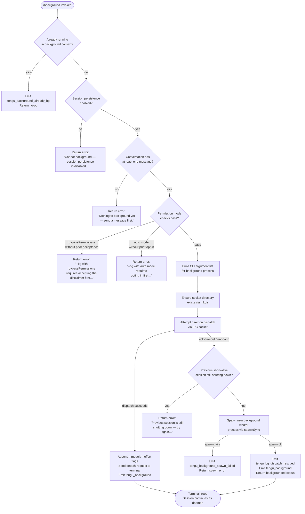

# `/background`

> Analysis basis: CC v2.1.133 bundle.js (AST extraction + Claude interpretation)
> Minimum version: v2.1.133

---

## Overview

The `/background` command (alias `/bg`) detaches the current interactive Claude Code session from the terminal and continues it as a daemon-managed background process. It validates permission mode and session state, spawns or dispatches to a background worker process via an IPC socket, and frees the terminal for other use. If the session is already running in a background context, the command is a no-op that emits a dedicated telemetry event.

---

## Registration

| Field | Value |
|---|---|
| type | `local-jsx` |
| name | `background` |
| description | `Continue this session in the background and free the terminal` |
| aliases | `["bg"]` |
| immediate | `null` |
| module\_id | `IXq` |

Analysis basis: CC v2.1.133 bundle.js:+11711730

---

## Input Branching

The command handler (`commandHandler`) evaluates several conditions before proceeding. The flowchart below captures the full branching logic derived from the call graph and string literals.



Analysis basis: CC v2.1.133 bundle.js:+11708081 through +11708832

---

## Behavioral Spec

### Permission Gate Check

Before any dispatch is attempted, the permission mode of the current process is inspected.

```
function checkPermissionGate(currentArgs):
    separatorIndex = currentArgs.indexOf("--")
    relevantArgs   = currentArgs.slice(0, separatorIndex)   // drop everything after "--"

    if relevantArgs includes "--permission-mode bypassPermissions":
        if user has NOT previously accepted the bypass disclaimer:
            return gateBlocked(
                "--bg with bypassPermissions requires accepting the disclaimer first. " +
                "Run `claude --dangerously-skip-permissions` once interactively."
            )

    if relevantArgs includes "--dangerously-skip-permissions"
       OR "--allow-dangerously-skip-permissions":
        // same disclaimer check applies
        if not accepted:
            return gateBlocked(...)

    if permissionMode == "auto":
        if user has NOT previously opted in interactively:
            return gateBlocked(
                "--bg with auto mode requires opting in first. " +
                "Run `claude --permission-mode auto` once interactively."
            )

    return pass
```

Analysis basis: CC v2.1.133 bundle.js:+11705730, +11705773, +11705804, +11705836, +11705882, +11706115, +11706135

---

### Session-State Precondition Checks

```
function checkSessionPreconditions(appState):
    if appState.isBackgroundSession == true:
        emitTelemetry("tengu_background_already_bg")
        return NO_OP

    if sessionPersistenceDisabled(appState):
        return userError(
            "Cannot background — session persistence is disabled, " +
            "so the forked job would have nothing to resume."
        )

    conversationMessages = getConversationMessages(appState)
    if conversationMessages.length == 0:
        return userError(
            "Nothing to background yet — send a message first."
        )

    return pass
```

Analysis basis: CC v2.1.133 bundle.js:+11711110, +11711177, +11711353

---

### CLI Argument Construction for the Background Worker

When the session is eligible to be backgrounded, an argument list is assembled for the child process. The construction mirrors the current session configuration.

```
function buildBackgroundArgs(sessionState, appState):
    args = []

    // Session identity
    args.push("--agent")
    if sessionState.name is set:
        args.push("--name", sessionState.name)    // also accepts -n

    // Session continuation strategy (mutually exclusive)
    if sessionState.resumeId is set:
        args.push("--resume", sessionState.resumeId)
    else if sessionState.continueMode:
        args.push("--continue")                   // or -c
    else if sessionState.forkSessionId:
        args.push("--fork-session", sessionState.forkSessionId)

    // Session ID forwarding
    args.push("--session-id", sessionState.sessionId)

    // Model / effort overrides (appended later, near dispatch)
    if appState.model is set:
        args.push("--model", appState.model)
    if appState.effort is set:
        args.push("--effort", appState.effort)

    // Process type tag
    args.push("--bg")                             // marks child as bg type

    return args
```

Analysis basis: CC v2.1.133 bundle.js:+11691579, +11691606, +11691622, +11691696, +11691706, +11691724, +11691734, +11691759, +11691786, +11691807, +11691908, +11708231, +11708253

---

### Socket Directory Preparation

```
function prepareSocketDirectory(socketPath):
    dirPath = path.join(socketPath, ...)
    await fs.mkdir(dirPath, { recursive: true })
    // Existing directory is not an error
```

Analysis basis: CC v2.1.133 bundle.js:+11691178

---

### Daemon Dispatch and Fallback Spawn

```
function dispatchOrSpawn(args, sessionState, signal):
    // Phase 1: Attempt dispatch over existing IPC socket
    result = await attemptIpcDispatch(socketPath, args, {
        ackTimeoutMs: 5000,    // wait up to 5 s for acknowledgement
        connectTimeoutMs: 6000 // wait up to 6 s for connection
    })

    if result.status == "dispatch":
        // Daemon acknowledged; proceed to detach
        return { strategy: "dispatch", result }

    if result.status in ["ack-timeout", "enoconn"]:
        // Phase 2: Check for a recently-terminated short-lived session
        if isStaleShortSession(sessionState):
            emitTelemetry("stale_short")
            return userError(
                "Previous session is still shutting down — try again in a moment"
            )

        // Phase 3: Spawn a fresh background worker
        spawnResult = spawnBackgroundProcess(args, {
            detached: true,
            stdio: "ignore"
        })

        if spawnResult.failed:
            emitTelemetry("tengu_background_spawn_failed")
            return spawnError(spawnResult)

        emitTelemetry("tengu_bg_dispatch_rescued")
        return { strategy: "spawn", result: spawnResult }

    // Unexpected status — propagate as error
    return unexpectedError(result)
```

Analysis basis: CC v2.1.133 bundle.js:+11692695, +11693871, +11693897, +11693936, +11694114, +11694384, +11694428, +11694445, +11694771, +11694903, +11694932, +11694965, +11695043

Timeout constants:
- IPC acknowledgement timeout: **5000 ms** (Analysis basis: CC v2.1.133 bundle.js:+11694428)
- IPC connection timeout: **6000 ms** (Analysis basis: CC v2.1.133 bundle.js:+11694445)

---

### Terminal Detach

When the daemon acknowledges the dispatch, the CLI sends a `detach-request` message to the active terminal multiplexer (if present, e.g. tmux) and marks the foreground session as stopped.

```
function detachTerminal(terminalContext):
    // Notify daemon of detach intent
    writeToSocket(terminalContext.socket, { type: "detach-request" })

    // If running inside tmux, issue detach-client
    if terminalContext.multiplexer == "tmux":
        spawnSync("tmux", ["detach-client"], { stdio: "ignore" })

    // Mark UI state
    appState.sessionStatus = "stopped"
    appState.sessionLabel  = "background session"
```

Analysis basis: CC v2.1.133 bundle.js:+9859945, +9860018, +9860026, +9860050, +14191200, +14191243

---

### UI Render (JSX Component)

The command is registered as `local-jsx`, meaning it renders a React component as its output rather than plain text.

```
function renderBackgroundResult(dispatchResult, sessionState):
    label = "(backgrounded)"       // displayed in the conversation pane
    statusCode = 200               // HTTP-style success code used internally

    if sessionState.environment == "production":
        // Suppress verbose debug output
        suppressDebugBanner = true

    return JSX <BackgroundResultView
        label={label}
        status={statusCode}
        sessionId={sessionState.sessionId}
        strategy={dispatchResult.strategy}
    />
```

Analysis basis: CC v2.1.133 bundle.js:+11709264, +11709290, +11711423, +11804706

Session name auto-generation timeout: **120 s** (Analysis basis: CC v2.1.133 bundle.js:+11709071)

---

### Background Process Self-Identification

Inside the spawned (or dispatched) child process, the process type is identified from the `--bg` flag so that the child can configure itself as a daemon worker.

```
function identifyProcessType(argv):
    if argv includes "--bg":
        processType = "bg"       // background daemon worker
    else if argv includes "--agent":
        processType = "fleet"    // fleet/spare agent
    // etc.
    return processType
```

Recognised internal role strings: `"fleet"`, `"spare"`, `"bg"`, `"user"`, `"repl"`, `"slash"`.

Analysis basis: CC v2.1.133 bundle.js:+11692376, +11692389, +11692473, +11692623, +11693251, +11693258

---

### Conversation History Forwarding

The first 8 messages of the current conversation are sliced and forwarded to the background process so it can resume with context intact.

```
function forwardConversationHistory(messages):
    slicedMessages = messages.slice(0, 8)
    // Serialise and pass to background worker via session file or socket payload
    return slicedMessages
```

Analysis basis: CC v2.1.133 bundle.js:+11691140, +11691150

---

### Resume-Mode Determination

```
function determineResumeMode(sessionState):
    if sessionState.hasExplicitResumeId:
        return "resume"
    if sessionState.promptMode:
        return "prompt"
    return "continue"
```

Analysis basis: CC v2.1.133 bundle.js:+11693307, +11693398

---

## State & Side Effects

| Item | Detail |
|---|---|
| Telemetry: `tengu_background` | Fired on every successful background dispatch (dispatch or spawn path). Analysis basis: CC v2.1.133 bundle.js:+11708613 |
| Telemetry: `tengu_background_already_bg` | Fired when `/background` is invoked from within an already-backgrounded session (no-op path). Analysis basis: CC v2.1.133 bundle.js:+11711110 |
| Telemetry: `tengu_background_spawn_failed` | Fired when the fallback `spawnSync` of the background worker process fails. Analysis basis: CC v2.1.133 bundle.js:+11708544 |
| Telemetry: `tengu_bg_dispatch_rescued` | Fired when IPC dispatch fails but the fallback spawn succeeds. Analysis basis: CC v2.1.133 bundle.js:+11694117 |
| Telemetry: `tengu_mcp_retry_failed_remote` | Fired in the MCP session-list helper called during context preparation; not specific to `/background` success path. Analysis basis: CC v2.1.133 bundle.js:+13870729 |
| Telemetry: `tengu_config_auth_loss_prevented` | Fired in the config-save guard (GH #3117 safeguard) that runs during session serialisation. Analysis basis: CC v2.1.133 bundle.js:+3108610 |
| Socket / IPC | Creates or reuses a UNIX socket under the session socket directory. Directory created with `fs.mkdir`. Analysis basis: CC v2.1.133 bundle.js:+11691178 |
| File system: socket directory | Session socket directory ensured via `Be.mkdir` before dispatch. Analysis basis: CC v2.1.133 bundle.js:+11691178 |
| File system: stale socket cleanup | Stale socket files are removed with `Be.rm` after detecting a short-alive session. Analysis basis: CC v2.1.133 bundle.js:+11691320, +11694710 |
| `appState` changes | `sessionStatus` set to `"stopped"`, `sessionLabel` set to `"background session"` on successful detach. Analysis basis: CC v2.1.133 bundle.js:+14191200, +14191243 |
| Terminal multiplexer | If tmux is detected, `tmux detach-client` is issued via `spawnSync`. Analysis basis: CC v2.1.133 bundle.js:+9860018, +9860026 |
| AbortSignal | An `AbortSignal.timeout` is set for the overall dispatch flow. Analysis basis: CC v2.1.133 bundle.js:+11708739 |
| Sound | <!-- TODO: not found in depth-2 traversal; needs --depth 4 --> |
| Session name auto-generation | A `rename_generate_name` sub-call is triggered with a 120 s timeout to auto-name the backgrounded session. Analysis basis: CC v2.1.133 bundle.js:+10775218, +11709071 |

---

## Version History

| Version | Change |
|---|---|
| v2.1.133 | Initial analysis. Feature present with full daemon-dispatch + spawn-fallback logic, tmux integration, and permission-gate checks. |

---

## Common Mistakes

1. **Invoking `/background` before sending any message.** The command requires at least one conversation turn; otherwise it returns `"Nothing to background yet — send a message first."` (Analysis basis: CC v2.1.133 bundle.js:+11711353)

2. **Using `/background` with `--dangerously-skip-permissions` without prior interactive acceptance.** The permission gate blocks the command and instructs the user to run `claude --dangerously-skip-permissions` once interactively first. (Analysis basis: CC v2.1.133 bundle.js:+11705836, +11705882)

3. **Using `/background` with `--permission-mode auto` without prior interactive opt-in.** Analogous to the bypass-permissions gate; an interactive run with `claude --permission-mode auto` is required first. (Analysis basis: CC v2.1.133 bundle.js:+11706115, +11706135)

4. **Retrying immediately after a backgrounded session that is still shutting down.** If a short-lived previous session is still in the process of terminating, the command returns `"Previous session is still shutting down — try again in a moment"` rather than spawning a new worker. (Analysis basis: CC v2.1.133 bundle.js:+11694965)

5. **Running `/background` inside a session where persistence is disabled.** Background sessions depend on session persistence to resume; if persistence is disabled the command returns an explicit error. (Analysis basis: CC v2.1.133 bundle.js:+11711177)

6. **Expecting `/background` to work when already in a background session.** Calling `/background` from within an already-backgrounded worker is a silent no-op (the `tengu_background_already_bg` event is emitted and nothing else happens). (Analysis basis: CC v2.1.133 bundle.js:+11711110)

---

## Appendix — Identifier Mapping

> For bundle debugging only. Identifiers change across versions.

| Identifier | Role |
|---|---|
| `NY8` | Top-level command handler function for `/background` |
| `AV` | Application state accessor / context reader |
| `vf` | Session state accessor |
| `xbA` | Permission-gate check dispatcher |
| `RK` | Gate-result renderer / response builder |
| `_YH` | Session spawn orchestrator (mkdir → dispatch → fallback) |
| `lW7` | Permission-mode argument validator |
| `M` | MCP session-map / context store |
| `xL` | Socket path builder (joins path components) |
| `uW7` | IPC dispatch and spawn-fallback engine |
| `vH` | String coercion / value formatter |
| `LA` | CLI argument list assembler |
| `d` | Logger / debug output sink |
| `qqH` | Config persistence helper |
| `R6` | Config write function |
| `e6` | Config read / merge function |
| `hf6` | Session rename / name-generation initiator |
| `Vt6` | Session name auto-generator caller |
| `unH` | Conversation message collector / preparer |
| `qO8` | Message serialiser for IPC payload |
| `wv` | Tool-result filter / message transformer |
| `dq` | Message type discriminator |
| `NL` | Message list filter |
| `k` | Locale / string normaliser |
| `e3` | Conversation history slicer for forwarding |
| `Ne4` | History entry extractor |
| `H` | Random / timer utility (Math.random + setTimeout) |
| `dfH` | File-watcher / stat-cache manager |
| `v6` | React context value reader |
| `vW` | Path basename resolver |
| `r9` | File stat + read cache (with LRU-style Map) |
| `lP` | Cache entry invalidator (Map.delete) |
| `Pf` | Watched-path registration helper |
| `D8` | ENOENT-safe file accessor |
| `fH` | Error accumulator / logger (push + logError) |
| `y1` | AbortController / signal set manager |
| `Qoq` | Signal sentinel / undefined-guard wrapper |
| `kY8` | JSX result renderer for background outcome |
| `yy` | Array-check utility (Array.isArray wrapper) |
| `O` | Stopped-state label store |
| `d8` | UI state atom / signal store |
| `uM8` | Tool-result presence checker |
| `A` | Generic accumulator array |
| `MC` | Conversation message classifier |
| `dF` | Message array flattener / normaliser |
| `ylH` | String prefix tester (startsWith wrapper) |
| `y$` | Background-label component (renders "(backgrounded)") |
| `Tm` | Status-code component (renders 200 badge) |
| `rW7` | Top-level JSX render function for the command UI |
| `E9` | Daemon process-type resolver |
| `hr` | Process-type string constants holder |
| `AqH` | Terminal detach orchestrator |
| `xu6` | Terminal write helper |
| `Da9` | Session task-type discriminator |
| `ot` | Raw readline / socket writer |
| `HqH` | Tmux availability checker |
| `qYH` | Environment / build-mode detector |
| `kH` | String coercion primitive |
| `Sjq` | Test-environment sentinel |
| `Sh` | Build-mode flag reader |