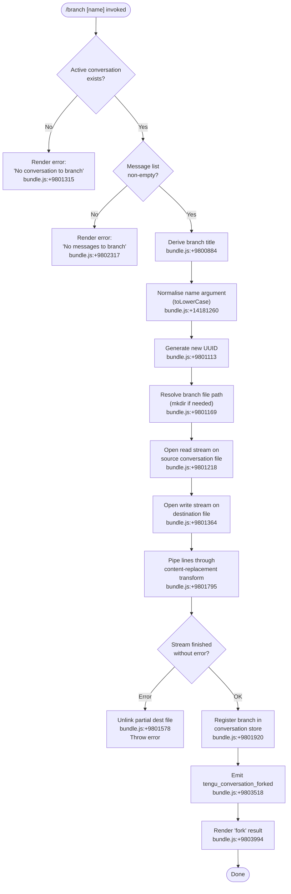

# `/branch`

> Analysis basis: CC v2.1.133 bundle.js (AST extraction + Claude interpretation)
> Minimum version: v2.1.133

---

## Overview

The `/branch` command (also accessible as `/fork`) creates a divergent copy of the current conversation up to the point it is invoked, assigning the new conversation a fresh UUID and copying the message history via a streaming file pipeline. The branch is registered in the application's conversation store and the `tengu_conversation_forked` telemetry event is emitted on success.

---

## Registration

| Field | Value |
|---|---|
| type | `local-jsx` |
| name | `branch` |
| description | Create a branch of the current conversation at this point |
| argumentHint | `[name]` |
| aliases | `fork` |
| module_id | `uVA` |

Analysis basis: CC v2.1.133 bundle.js:+11184178

---

## Input Branching



---

## Behavioral Spec

### 1. Title Resolution

When the user supplies an optional `[name]` argument, the command uses it as the branch title after normalising it to lower-case (Analysis basis: CC v2.1.133 bundle.js:+14181260). When no argument is given, the default title `"Branched conversation"` is applied (Analysis basis: CC v2.1.133 bundle.js:+9800884).

```
function resolveBranchTitle(rawArgument):
    if rawArgument is absent or blank:
        return "Branched conversation"
    else:
        return rawArgument.toLowerCase()
```

Analysis basis: CC v2.1.133 bundle.js:+9800884, +14181260

---

### 2. Source Message Lookup

The implementation searches the active conversation's message array for the current cut-point. Only messages of type `"text"` are considered for the copy (Analysis basis: CC v2.1.133 bundle.js:+9800957). If no messages are present after the lookup, an error is surfaced immediately.

```
function findSourceMessages(conversationMessages):
    textMessages = conversationMessages.filter(m => m.type == "text")
    if textMessages is empty:
        raise UserFacingError("No messages to branch")
    return textMessages
```

Analysis basis: CC v2.1.133 bundle.js:+9800957, +9802317

---

### 3. Guard: Active Conversation Check

Before any file I/O, the implementation verifies that a conversation is loaded. If the conversation lookup returns nothing, execution halts with a user-visible error message.

```
function assertConversationPresent(conversationStore):
    current = conversationStore.find(activeId)
    if current is null or undefined:
        raise UserFacingError("No conversation to branch")
    return current
```

Analysis basis: CC v2.1.133 bundle.js:+9800936, +9801315

---

### 4. UUID Generation and Path Setup

A new universally-unique identifier is generated via the platform's `randomUUID` facility to serve as the branch conversation ID. The branch directory is created with `mkdir` (recursive) before any file handles are opened.

```
function allocateBranchSlot(fileSystem):
    newId = crypto.randomUUID()
    branchDir = derivePath(newId)
    fileSystem.mkdir(branchDir, { recursive: true })
    return { newId, branchDir }
```

Analysis basis: CC v2.1.133 bundle.js:+9801113, +9801169

---

### 5. Streaming Copy with Content-Replacement Transform

The source conversation file is opened as a read stream with encoding `"utf8"` (Analysis basis: CC v2.1.133 bundle.js:+9801251) and piped through a line-by-line transform that applies a `"content-replacement"` pass (Analysis basis: CC v2.1.133 bundle.js:+9801795) before writing to the destination. The source buffer chunk size hint is 448 bytes (Analysis basis: CC v2.1.133 bundle.js:+9801200) and the destination write buffer hint is 384 bytes (Analysis basis: CC v2.1.133 bundle.js:+9801410).

The `readline.createInterface` is used to iterate lines (Analysis basis: CC v2.1.133 bundle.js:+9801458), and each parsed JSON line is processed through the content-replacement mapping before being serialised back to JSON and written.

```
async function streamCopyConversation(srcPath, destPath, replacements):
    readStream  = fs.createReadStream(srcPath, encoding="utf8", highWaterMark=448)
    writeStream = fs.createWriteStream(destPath, highWaterMark=384)
    lineReader  = readline.createInterface({ input: readStream })

    for await line in lineReader:
        parsed = JSON.parse(line)
        transformed = applyContentReplacement(parsed, replacements)
        writeStream.write(JSON.stringify(transformed) + "\n")

    await streamFinished(writeStream)
```

Analysis basis: CC v2.1.133 bundle.js:+9801218, +9801364, +9801458, +9801795, +9802713, +9802727

---

### 6. Error Recovery — Partial File Cleanup

If an error is raised at any point during the streaming copy (e.g., an `ENOENT` from the source file — Analysis basis: CC v2.1.133 bundle.js:+134316), the partially-written destination file is removed via `fs.unlink` to avoid a corrupt branch entry, and the error is re-thrown.

```
async function copyWithRollback(srcPath, destPath, replacements):
    try:
        await streamCopyConversation(srcPath, destPath, replacements)
    catch err:
        await fs.unlink(destPath)   // best-effort cleanup
        throw err
```

Analysis basis: CC v2.1.133 bundle.js:+9801309, +9801578

---

### 7. Branch Registration and Progress Reporting

After a successful copy, the new conversation entry is inserted into the in-memory conversation map (`w.set`) and the UI receives a `"progress"` update signal (Analysis basis: CC v2.1.133 bundle.js:+9802235) so the sidebar or conversation list can refresh without a full reload.

```
function registerBranch(store, newId, metadata):
    store.set(newId, metadata)
    emitProgress("branch-complete", { id: newId })
```

Analysis basis: CC v2.1.133 bundle.js:+9801920, +9802193, +9802235

---

### 8. Fork Result Rendering

On completion, the command renders a `"fork"` result token (Analysis basis: CC v2.1.133 bundle.js:+9803994) using the `local-jsx` render path registered in the module. The rendered component receives the new conversation's ISO timestamp (Analysis basis: CC v2.1.133 bundle.js:+9803608) and epoch milliseconds (Analysis basis: CC v2.1.133 bundle.js:+9803657) for display. If an unexpected failure slips past the inner guard, the fallback message `"Unknown error occurred"` is displayed (Analysis basis: CC v2.1.133 bundle.js:+9804142).

```
function renderForkResult(branchMeta):
    return JSXElement("fork", {
        id:        branchMeta.id,
        title:     branchMeta.title,
        createdAt: branchMeta.timestamp.toISOString(),
        epochMs:   branchMeta.timestamp.getTime(),
    })
```

Analysis basis: CC v2.1.133 bundle.js:+9803994, +9803608, +9803657

---

### 9. Session Title and Agent-Name Propagation

When the branch is opened as a new session, two additional update paths fire:

- A `"custom-title"` attribute is written to the new session metadata, triggering the `tengu_session_renamed` event (Analysis basis: CC v2.1.133 bundle.js:+11830546, +11830638).
- An `"agent-name"` attribute is propagated, triggering `tengu_agent_name_set` (Analysis basis: CC v2.1.133 bundle.js:+11832776, +11832874).

Both paths share the `HN` → `ef` utility chain that constructs the path, reads the current config, and writes back a merged value.

```
function propagateSessionAttributes(newSessionId, sourceSession):
    if sourceSession.customTitle exists:
        writeSessionAttribute(newSessionId, "custom-title", sourceSession.customTitle)
        emit("tengu_session_renamed")

    if sourceSession.agentName exists:
        writeSessionAttribute(newSessionId, "agent-name", sourceSession.agentName)
        emit("tengu_agent_name_set")
```

Analysis basis: CC v2.1.133 bundle.js:+11830546, +11830638, +11832776, +11832874

---

## State & Side Effects

| Item | Detail |
|---|---|
| Telemetry — primary | `tengu_conversation_forked` emitted on every successful branch (bundle.js:+9803518) |
| Telemetry — session rename | `tengu_session_renamed` emitted when branch inherits a custom title (bundle.js:+11830638) |
| Telemetry — agent name | `tengu_agent_name_set` emitted when branch inherits an agent name (bundle.js:+11832874) |
| Telemetry — daemon/bg | Multiple `tengu_bg_*` and `tengu_daemon_*` events may fire if the branch triggers a background session allocation (see Appendix) |
| File system | Creates a new directory under the conversations data root; writes one JSONL file per conversation message line |
| File system (rollback) | Partial destination file is unlinked on stream error (bundle.js:+9801578) |
| Conversation store | New entry inserted via `store.set(newId, metadata)` (bundle.js:+9801920) |
| Progress signal | `"progress"` UI event emitted after store insertion (bundle.js:+9802235) |
| Session metadata | `custom-title` and `agent-name` attributes written to new session if present on source (bundle.js:+11830546, +11832776) |
| Sound | <!-- TODO: not found in depth-2 traversal; needs --depth 4 --> |
| Hook registration | <!-- TODO: not found in depth-2 traversal; needs --depth 4 --> |

---

## Version History

| Version | Change |
|---|---|
| v2.1.133 | Initial analysis |

---

## Common Mistakes

1. **Invoking `/branch` with no active conversation** — the command requires a conversation to already be open. Running it from a fresh session produces the error `"No conversation to branch"` and performs no file I/O.
2. **Invoking `/branch` on a conversation with no messages** — even if a conversation object exists, an empty message list causes an immediate `"No messages to branch"` error before any copy begins.
3. **Assuming the branch is immediately visible in the UI** — the new branch entry becomes available only after the stream is fully finished and the progress event propagates; navigating away mid-copy may leave the sidebar stale until the next refresh cycle.
4. **Confusing `/branch` with `/fork`** — both aliases invoke identical logic; there is no behavioral difference between them (Analysis basis: CC v2.1.133 bundle.js:+11184178).
5. **Expecting the branch title argument to preserve case** — any user-supplied `[name]` argument is normalised to lower-case before storage (Analysis basis: CC v2.1.133 bundle.js:+14181260).
6. **Assuming a failed branch leaves a file on disk** — the rollback path (`fs.unlink`) removes the partial destination file on any stream error, so no cleanup is needed manually.

---

## Appendix — Identifier Mapping

> For bundle debugging only. Identifiers change across versions.

| Identifier | Role |
|---|---|
| `fo9` | Source message finder / title replacer (searches messages array, applies string replacement) |
| `Mo9` | Core branch-copy orchestrator (UUID → mkdir → stream copy → register) |
| `$o9` | Branch command handler / render coordinator (top-level command entry point) |
| `hH7` | Command JSX render wrapper (invokes `$o9`) |
| `yH7` | Branch title builder (constructs display title, manages title index set) |
| `v6` | Conversation path resolver utility |
| `LA` | Conversation metadata builder |
| `HN` | Session attribute writer (writes key/value to session config) |
| `ef` | Config read-merge-write utility (used by `HN`) |
| `D8` | Error code classifier |
| `w8` | Low-level error wrapper |
| `fH` | Background session spawner / job queue manager |
| `HA` | Error constructor helper |
| `kH` | String error code normaliser |
| `yq` | Essential-traffic queue handler |
| `NJL` | Job queue shift/push manager |
| `O` | Write-stream handle for destination file |
| `d8` | Stream event dispatcher |
| `H` | Random delay / timer utility (used in retry logic) |
| `X` | Background process launcher wrapper |
| `w` | Active process registry map |
| `p6` | JSON line parser |
| `J` | Process value map iterator |
| `v` | Background job lifecycle manager (blur/focus/kill) |
| `Fu` | Conversation store registration helper |
| `Y` | Spare-session pool manager |
| `J6` | Session-pool slot resolver |
| `$` | Daemon socket/connection handle |
| `sFA` | Platform-aware session allocator (macOS / Windows branch) |
| `lFA` | Bun-runtime spare-session spawner |
| `d` | General-purpose async deferred/promise utility |
| `D` | Supervisor / daemon manager |
| `eDH` | Config file reader (reads and parses config JSON) |
| `q` | Supervisor write handle |
| `bwq` | Config diff / max-key utility |
| `E` | Keyboard / input event stop handler |
| `I` | Daemon lifecycle controller (stop / updateConfig / start) |
| `Bdq` | Heartbeat emitter |
| `Z` | Daemon start controller |
| `W` | UI event / skill refresh emitter |
| `z` | Daemon stop signal handler |
| `rfH` | Policy-settings config-change handler |
| `_mH` | Skill-list membership tester |
| `k` | Key/shortcut parser and normaliser |
| `Zf8` | Skill registry reference |
| `et` | Skill-event emitter bundle |
| `K` | Async task tracker (add / finally / delete) |
| `BcH` | Cache-clear helper |
| `j` | IPC socket message framer / buffer accumulator |
| `ff` | Stream-end / socket-header helper |
| `md7` | IPC protocol message dispatcher (handles all IPC message types) |
| `vH` | String conversion utility |
| `SH` | JSON serialiser wrapper |
| `y$` | Conversation metadata initialiser |
| `zm` | Session rename handler (writes custom-title, emits `tengu_session_renamed`) |
| `R9H` | Agent-name setter (writes agent-name, emits `tengu_agent_name_set`) |
| `s9` | Array index/slice utility |