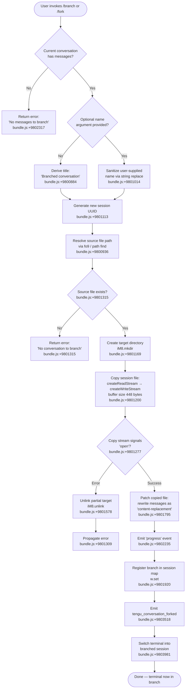

# `/branch`

> Analysis basis: CC v2.1.133 bundle.js (AST extraction + Claude interpretation)
> Minimum version: v2.1.133

---

## Overview

`/branch` (alias: `/fork`) creates an independent copy of the current conversation up to the point where the command is invoked. The new branch is written to a separate session file, assigned a fresh UUID, and the user's working terminal is redirected into the branched session. The original conversation remains intact, enabling parallel exploration of different response trajectories.

---

## Registration

| Field | Value |
|---|---|
| `type` | `local-jsx` |
| `name` | `branch` |
| `aliases` | `["fork"]` |
| `description` | `"Create a branch of the current conversation at this point"` |
| `argumentHint` | `[name]` |
| `module_id` | `uVA` |
| `load_inline` | `true` |
| `loc_byte` | `11184178` |
| `loc_byte_end` | `11184372` |
| `loc_line` | `6963` |
| `arbor_handler.name` | `hH7` |
| `arbor_handler.kind` | `AsyncFunction` |
| `arbor_handler.fqn` | `claude-2.1.133::hH7` |
| `arbor_handler.resolution_path` | `module_id` |
| `arbor_handler.n_hits` | `0` |

Analysis basis: CC v2.1.133 bundle.js:+11184178

---

## Input Branching

The command involves four distinct runtime paths depending on the presence of messages, the optional branch name argument, success or failure of the file-copy operation, and error recovery. A Mermaid flowchart is used accordingly.



---

## Behavioral Spec

### Top-level handler (`hH7`)

Arbor resolves the handler as `hH7` (AsyncFunction, resolution path: `module_id → uVA`).  
Analysis basis: CC v2.1.133 bundle.js:+9804258

```
async function branchCommandHandler(userInput, appState):
    result = await prepareBranchOperation(userInput, appState)
    if result.error:
        display(result.error)
        return
    switchTerminalToSession(result.newSessionId)
```

### Branch preparation (`$o9`)

`$o9` is the primary orchestration function called directly from `hH7`.  
Analysis basis: CC v2.1.133 bundle.js:+9803350

```
async function prepareBranchOperation(userInput, appState):
    // 1. Resolve the name for the branch
    branchName = resolveBranchName(userInput)        // fo9 — bundle.js:+9803409

    // 2. Locate existing session file
    sourceFile = findCurrentSessionFile(appState)    // $.find — bundle.js:+9803413
    if not sourceFile:
        return { error: "No conversation to branch" }  // bundle.js:+9801315

    // 3. Check messages are present
    if messageCount == 0:
        return { error: "No messages to branch" }      // bundle.js:+9802317

    // 4. Perform file copy
    newSessionId = await copySessionToNewBranch(sourceFile, branchName)  // Mo9

    // 5. Record fork relationship
    emit("fork", newSessionId)                       // bundle.js:+9803994

    // 6. Resume stream into new session
    resumeStreamForSession(newSessionId)             // H.resume — bundle.js:+9803981

    return { newSessionId }
```

### Branch name resolution (`fo9`)

Analysis basis: CC v2.1.133 bundle.js:+9800936

```
function resolveBranchName(userInput):
    // Look for an explicit [name] argument
    match = searchForNameToken(userInput)             // A.find — bundle.js:+9800936
    if match:
        // Sanitize the user-supplied name
        sanitized = match.replace(UNSAFE_CHARS, "")  // _.replace — bundle.js:+9801014
        return sanitized
    else:
        return "Branched conversation"               // default title — bundle.js:+9800884
```

### Session file copy (`Mo9`)

This is the most complex sub-routine; it performs a binary stream copy of the JSONL conversation file with content-replacement patching.  
Analysis basis: CC v2.1.133 bundle.js:+9803350

```
async function copySessionToNewBranch(sourceFilePath, branchName):
    newId   = crypto.randomUUID()                    // qo9.randomUUID — bundle.js:+9801113
    destDir = resolveDestinationDirectory(newId, branchName)  // v6, L$, LA, HN — bundle.js:+9801132
    destPath = joinPath(destDir)

    await fs.mkdir(destDir, { recursive: true })     // iM8.mkdir — bundle.js:+9801169

    // Open source with UTF-8, read in 448-byte chunks
    // bundle.js:+9801200, +9801251
    readStream  = fs.createReadStream(sourceFilePath, { encoding: "utf8", highWaterMark: 448 })
    writeStream = fs.createWriteStream(destPath)     // bundle.js:+9801364

    // Wait for 'open' event before writing
    // bundle.js:+9801277
    await once(readStream, "open")

    // Process each JSONL line:
    //   - Lines of type "text" are kept               bundle.js:+9800957
    //   - Messages are re-tagged as "content-replacement"  bundle.js:+9801795
    interface = readline.createInterface(readStream)  // Lo9.createInterface — bundle.js:+9801458
    for line of interface:
        patched = patchLine(line)                     // H.map — bundle.js:+9801513
        writeStream.write(patched)                    // O.write — bundle.js:+9801647

    // Emit incremental progress
    emit("progress")                                  // bundle.js:+9802235

    // Finalise
    writeStream.end()                                 // O.end — bundle.js:+9802713
    await streamFinished(writeStream)                 // Ko9.finished — bundle.js:+9802727

    // On error: unlink partial destination
    on error:
        fs.unlink(destPath)                           // iM8.unlink — bundle.js:+9801578
        throw error

    // Register new session
    sessionMap.set(newId, destPath)                   // w.set — bundle.js:+9801920

    return newId
```

### Conversation fork event emission (`yH7`)

After the file copy succeeds, fork metadata is recorded and the session registry is updated.  
Analysis basis: CC v2.1.133 bundle.js:+9802919

```
function recordForkMetadata(newSessionId, parentId, branchName):
    sanitizedName = normalizeLabel(branchName)       // LQ — bundle.js:+9803020
    indexSet.add(newSessionId)                       // L.add — bundle.js:+9803114
    lineNumber = parseInt(position)                  // parseInt — bundle.js:+9803120
    if registryHas(newSessionId):                    // L.has — bundle.js:+9803167
        return
    // Persist fork record
```

### Post-copy session state persistence (`zm`, `R9H`)

Writes updated conversation metadata and emits telemetry.  
Analysis basis: CC v2.1.133 bundle.js:+9803485, +9803503

```
function persistBranchState(sessionId, metadata):
    // Write session title
    writeSessionTitle(sessionId, metadata.title)     // HN, wVH — bundle.js:+9803485
    // Write agent-name tag
    writeAgentName(sessionId, metadata.name)         // HN, wVH — bundle.js:+9803503
    emit("tengu_conversation_forked", {              // bundle.js:+9803518
        sessionId,
        timestamp: new Date().toISOString()          // z.toISOString — bundle.js:+9803608
    })
    emit("tengu_session_renamed")                    // bundle.js:+11830638
    emit("tengu_agent_name_set")                     // bundle.js:+11832874
```

### Error string constants

| Constant | Source byte |
|---|---|
| `"No conversation to branch"` | `bundle.js:+9801315` |
| `"No messages to branch"` | `bundle.js:+9802317` |
| `"Branched conversation"` (default title) | `bundle.js:+9800884` |
| `"Unknown error occurred"` | `bundle.js:+9804142` |

---

## State & Side Effects

| Item | Detail |
|---|---|
| Telemetry — fork | `tengu_conversation_forked` emitted on successful branch (bundle.js:+9803518) |
| Telemetry — rename | `tengu_session_renamed` emitted when branch title is written (bundle.js:+11830638) |
| Telemetry — agent name | `tengu_agent_name_set` emitted when branch agent label is written (bundle.js:+11832874) |
| Telemetry — daemon/bg (indirect) | `tengu_bg_spare_enable`, `tengu_bg_spare_spawn`, `tengu_bg_spare_claim`, `tengu_bg_spare_claim_fail`, `tengu_bg_dispatch_sigkill_escalate`, `tengu_bg_sendclaim_failed`, `tengu_bg_dispatch_low_mem` — emitted by background session machinery reached via call graph |
| Telemetry — worktree detection | `tengu_worktree_detection` (bundle.js:+10928127) — indirectly called during session-context resolution |
| File system | New session file written under the sessions directory; partial file removed on error (`iM8.unlink` — bundle.js:+9801578) |
| Session map | `sessionMap.set(newId, destPath)` adds the branch to the in-memory session registry (bundle.js:+9801920) |
| Stream side effect | `H.resume` redirects the current terminal stream into the new session (bundle.js:+9803981) |
| Progress event | `"progress"` event emitted to UI during copy (bundle.js:+9802235) |
| Content patching | Each message line in the copied file is re-tagged as `"content-replacement"` (bundle.js:+9801795); raw text lines retain type `"text"` (bundle.js:+9800957) |
| Sound | <!-- TODO: not found in depth-2 traversal; needs --depth 4 --> |
| Hook registration | <!-- TODO: not found in depth-2 traversal; needs --depth 4 --> |

---

## Version History

| Version | Change |
|---|---|
| v2.1.133 | Initial analysis — command registered as `local-jsx`, alias `fork`, handler `hH7` via module `uVA` |

---

## Common Mistakes

1. **Invoking `/branch` before the first message.** The command guard checks for an empty message list and returns `"No messages to branch"` (bundle.js:+9802317) without creating any file. Start a conversation first.
2. **Assuming `/fork` and `/branch` are separate commands.** Both resolve to the identical handler (`hH7`). The alias `fork` is registered on the same registration object (bundle.js:+11184178).
3. **Supplying a name containing special characters without escaping.** The name argument is sanitised via a string replace (bundle.js:+9801014), so characters that match the unsafe-character pattern are silently stripped. Verify the resulting branch name in the UI.
4. **Expecting the original session to be modified.** The branch is a strict copy-on-write operation. The source file is only read; only the destination receives the `"content-replacement"` patch.
5. **Treating the `"content-replacement"` tag as conversation history.** Lines of type `"content-replacement"` (bundle.js:+9801795) in the branch file are produced during copying and indicate patched message content, not additional user/assistant turns.
6. **Relying on branch files surviving an interrupted copy.** On any stream error the partial destination file is unlinked immediately (bundle.js:+9801578). A missing branch file after an error is expected, not a bug.

---

## Appendix — Identifier Mapping

> For bundle debugging only. Identifiers change across versions.

| Identifier | Role |
|---|---|
| `hH7` | Top-level async branch command handler (Arbor-resolved entry point) |
| `$o9` | Branch preparation orchestrator — validates state, calls copy and registration routines |
| `Mo9` | Session file copy worker — streams source JSONL to new destination with content-replacement patching |
| `fo9` | Branch name resolver — finds optional `[name]` argument and sanitises it |
| `yH7` | Fork metadata recorder — adds new session ID to index and persists fork position |
| `zm` | Session title writer — calls title-persistence helper and emits rename telemetry |
| `R9H` | Agent-name writer — persists agent-name tag and emits `tengu_agent_name_set` |
| `$o9` (inner `A`) | Final state object returned to caller |
| `qo9` | Crypto module reference used for `randomUUID()` |
| `iM8` | `fs/promises` reference used for `mkdir` and `unlink` |
| `nM8` | `fs` (sync stream) reference used for `createReadStream` / `createWriteStream` |
| `xVA` | Stream-events helper providing `once()` |
| `Ko9` | `stream` module providing `finished()` |
| `Lo9` | `readline` module providing `createInterface()` |
| `v6` | Session path resolver |
| `L$` | Path join / directory helper |
| `LA` | Session label helper |
| `HN` | Session metadata writer |
| `ef` | Path composition helper |
| `tg` | Tag/type constants object |
| `D8` | Error-code helper |
| `w8` | Logging / telemetry emitter |
| `fH` | Feature-flag / telemetry gating function |
| `HA` | Error construction helper |
| `kH` | String conversion utility |
| `yq` | Telemetry queue writer |
| `J9_` | Telemetry serialiser |
| `NJL` | Ring-buffer / queue management helper |
| `LQ` | Label normaliser (regex replace on session name) |
| `s9` | String slice / index utility |
| `wVH` | File append / mkdir-sync writer for session metadata |
| `RK` | React state-setter / signal emitter |
| `y1` | State atom updater |
| `EU` | Settings persistence helper |
| `nA6` | Config read/write helper |
| `fg` | Completion-list / suggestion builder |
| `aIH` | Worktree-aware path sorter |
| `gjq` | File-system directory walker for completions |
| `JVH` | Binary buffer helper used during stream operations |
| `GM` | LRU map / cache for completion results |
| `Fu` | Session-close / cleanup function |
| `fo9` | (see above) |
| `d8` | Low-level stream data handler |
| `vH` | Value stringifier / coercion helper |
| `k` | Locale / platform-variant helper for tool/command formatting |
| `p6` | JSON.parse wrapper with error handling |
| `SH` | JSON.stringify wrapper |
| `r8` | Timeout-with-abort helper |
| `W` | Background-session manager / watcher |
| `z` | Background-session set tracker |
| `bS` | Session bootstrap helper |
| `mt8` | Session UUID generator and emitter |
| `cC` | Graceful-shutdown sequencer |
| `rfH` | Background-session request dispatcher |
| `aK` | Agent-request builder |
| `YP` | Hook execution engine |
| `Yw8` | Process-spawn hook executor |
| `kxA` | HTTP hook executor |
| `yxA` | MCP-tool hook executor |
| `RxA` | Hook event matcher / filter |
| `SxA` | Third-party hook filter |
| `Dw8` | Hook output parser (JSON vs plain-text) |
| `H2q` | UserPromptSubmit hook output parser |
| `md7` | Daemon message dispatcher / IPC router |
| `ud7` | Daemon job lifecycle manager |
| `xd7` | Column-width / layout calculator |
| `Pdq` | Dispatch timeout / backpressure controller |
| `oFA` | Backpressure flow-control helper |
| `_Y` | Background-service bridge helper |
| `x5H` | Service identity resolver |
| `nFA` | Unix-socket claim sender |
| `kd7` | Claim timeout watcher |
| `Nd7` | Claim frame builder |
| `Em` | Binary framing encoder for IPC messages |
| `tFA` | Background-session state-machine (working / idle / blocked / crashed) |
| `L` | Padding / display formatter |
| `xL` | Path join wrapper |
| `r9` | JSONL tool-state reader with caching |
| `Hw` | Active-session sentinel |
| `Pf` | Permission-cache writer |
| `tlH` | Agent-response awaiter with timing |
| `$qH` | Session roster-entry path builder |
| `_N` | Session log-path builder |
| `Vm` | Session metadata-path builder |
| `BcH` | Skills cache clearer |
| `et` | UI render-trigger helper |
| `Zf8` | Render-frame scheduler |
| `j` | IPC socket reader / framer |
| `ff` | IPC stream end handler |
| `M` | MCP-server state manager |
| `iZH` | MCP tool-call dispatcher |
| `mFq` | MCP client update applier |
| `Og7` | MCP retry-on-failure orchestrator |
| `Q` | PTY write-stream wrapper |
| `aJ6` | PTY config reader |
| `Ce9` | PTY config unlinker |
| `p` | Heartbeat / keepalive timer |
| `g` | Permission gate evaluator |
| `WL8` | Iron-gate / permission-block enforcer |
| `nt` | UI notification / toast emitter |
| `QW6` | PTY write helper |
| `G` | Tool-result formatter |
| `y$` | React state hook / selector |
| `fg` | (see above — completion-list builder) |
| `EU` | (see above — settings persistence) |

---

Note: index built via Arbor fallback; some signals (telemetry, literals) may be missing — see arbor-fallback.js.