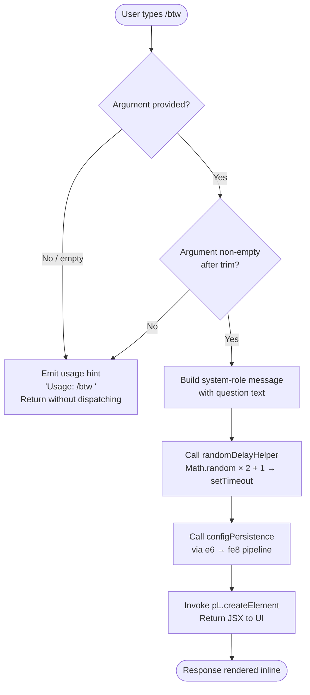

# `/btw`

> Analysis basis: CC v2.1.133 bundle.js (AST extraction + Claude interpretation)
> Minimum version: v2.1.133

---

## Overview

The `/btw` ("by the way") command lets the user pose a quick side question to the agent without interrupting or forking the main conversation thread. It is a `local-jsx` command that dispatches immediately via the `control-request` thin-client path, injecting the question as a `system`-role message before returning a JSX element to the UI. The handler is the async function `UH7` (resolved via module `Do9`), which validates the argument, builds a system-scoped prompt, and renders the response inline.

---

## Registration

| Field | Value |
|---|---|
| `type` | `local-jsx` |
| `name` | `btw` |
| `description` | Ask a quick side question without interrupting the main conversation |
| `argumentHint` | `<question>` |
| `immediate` | `true` |
| `thinClientDispatch` | `control-request` |
| `module_id` | `Do9` |
| `load_inline` | `true` |
| `loc_byte` | `9809726` |
| `loc_byte_end` | `9809965` (registration block: bytes `9809726`–`9809965`) |
| `arbor_handler.name` | `UH7` |
| `arbor_handler.fqn` | `claude-2.1.133::UH7` |
| `arbor_handler.kind` | `AsyncFunction` |
| `arbor_handler.resolution_path` | `module_id` (Arbor followed `module_id` → `Do9` → `UH7`) |
| `arbor_handler.n_hits` | `0` |

Analysis basis: CC v2.1.133 bundle.js:+9809726

---

## Input Branching

Three distinct paths exist based on argument presence and content, warranting a Mermaid flowchart.



Analysis basis: CC v2.1.133 bundle.js:+9809333 (usage string), +9809374 (system role literal), +9809443 (JSX creation)

---

## Behavioral Spec

### 1. Argument Validation

When the command is invoked, `UH7` first checks whether an argument was supplied. If the trimmed argument string is absent or empty, the handler emits the usage hint string `"Usage: /btw <your question>"` and returns early without dispatching any request.

```
async function btwHandler(context, args):
    question = args.trim()
    if question is empty:
        return renderUsageHint("Usage: /btw <your question>")
    # proceed to dispatch
```

Analysis basis: CC v2.1.133 bundle.js:+9809333, +9809335

### 2. System-Role Message Construction

When a non-empty question is present, `UH7` constructs a message object with role `"system"` containing the user's question text. This framing ensures the question is treated as an out-of-band inquiry rather than a new user turn in the main conversation.

```
async function btwHandler(context, args):
    ...
    message = {
        role: "system",
        content: question
    }
```

Analysis basis: CC v2.1.133 bundle.js:+9809374

### 3. Random Delay Helper (`H`)

`UH7` calls the helper identified as `H` (descriptive name: `randomDelayHelper`), which schedules execution via `setTimeout` after a delay derived from `Math.random`. The delay formula uses the constants `2` and `1` (both found at adjacent byte offsets), producing a jittered delay in the range `[1, 3)` arbitrary units before the next step proceeds.

```
function randomDelayHelper(callback):
    delay = Math.random() * 2 + 1   # constants: 2 @ +12285767, 1 @ +12285783
    setTimeout(callback, delay)
```

Analysis basis: CC v2.1.133 bundle.js:+9809333 (call site), +12285769 (constant `2`), +12285783 (constant `1`), +12285806 (setTimeout)

### 4. Configuration Persistence Pipeline (`e6` → `fe8`)

After the delay, `UH7` calls `e6` (descriptive name: `globalConfigDispatch`), which internally calls `fe8` (descriptive name: `configWriteWithLock`). This pipeline is responsible for persisting any state changes triggered by the side question. Key behaviors within this pipeline:

- **Lock acquisition**: `fe8` calls `K.mkdirSync` to acquire a filesystem lock. If lock acquisition takes longer than expected, the warning `"Lock acquisition took longer than expected - another Claude instance may be running"` is emitted at log level `"error"`.
- **Stale-write guard**: If a re-read of the config detects that cached auth would be overwritten, the write is refused and telemetry event `tengu_config_stale_write` is fired. The guard message references GH #3117.
- **Auth-loss prevention**: A separate check fires `tengu_config_auth_loss_prevented` if auth data would be lost.
- **Config parse error**: If the config file cannot be parsed, `tengu_config_parse_error` is fired and an `Error` is thrown with `"Config accessed before allowed."`.
- **Lock contention**: Prolonged lock waits fire `tengu_config_lock_contention`.
- **Backup rotation**: `fe8` manages up to `5` backup copies (constant `5` at +3112203), stored in a `"backups"` subdirectory, with filenames containing `".backup."`. Files are rotated using `K.copyFileSync` / `K.unlinkSync`. Backup directory creation tolerates `EEXIST`. Missing config files are treated via `ENOENT` handling.
- **60-second timeout**: A 60 000 ms timeout (constant `60000` at +3111954) guards the lock acquisition loop.
- **File permissions**: Temporary files are created with mode `384` (octal `0o600`) for security.

```
async function globalConfigDispatch(sessionContext, question):
    t2Context = loadContext()
    history = loadHistory()
    fxhData = loadFxhData()
    jX1Result = buildEntries(Object.entries(...))
    MxHTimestamp = Date.now()
    configResult = await configWriteWithLock(sessionContext)
    return configResult

async function configWriteWithLock(sessionContext):
    A.mkdirSync(dirname)          # ensure directory exists
    Ez.dirname(path)
    acquireLock(K.mkdirSync)      # filesystem lock via mkdir
    timestamp = Date.now()
    recordId = generateRecordId(ql_)
    messageBlock = buildMessageBlock(k)
    if lockTookTooLong:
        emit("error", "Lock acquisition took longer than expected...")
        fire(tengu_config_lock_contention)
    existingConfig = readConfigFile()   # K.statSync, q.readFileSync
    if staleWriteDetected:
        fire(tengu_config_stale_write)
        refuse write
    if authLossDetected:
        fire(tengu_config_auth_loss_prevented)
        refuse write
    manageBackups()               # up to 5 backups, 60s timeout
    atomicWrite(KhH)              # atomic rename with temp file @ mode 0o600
    releaseLock(K.unlinkSync)
```

Analysis basis: CC v2.1.133 bundle.js:+9809397, +3108275, +3110973, +3111000, +3111045, +3111100, +3111184, +3111273, +3111409, +3111539, +3111584, +3111600, +3111752, +3111800, +3111954, +3112177, +3112203, +3112321, +3112485, +3113211, +3113217, +3113273, +3113854, +3114033, +3114068

### 5. JSX Rendering (`pL.createElement`)

After the config pipeline completes, `UH7` calls `pL.createElement` to build and return a JSX element representing the inline response. Because the command is `immediate: true` and `local-jsx` typed, the element is rendered directly into the conversation view without creating a new top-level turn.

```
async function btwHandler(context, args):
    ...
    element = pL.createElement(InlineResponseComponent, { question, systemMessage })
    return element
```

Analysis basis: CC v2.1.133 bundle.js:+9809443

### 6. Background Session Management (via `w`)

The call graph reaches `w` (descriptive name: `backgroundSessionManager`) through the config pipeline. This function manages background Claude sessions and is not specific to `/btw`, but is invoked as part of the shared infrastructure. Relevant behaviors:

- Escalates to `SIGKILL` after `30`s / `15`s thresholds when terminating background sessions (`tengu_bg_dispatch_sigkill_escalate`).
- Monitors free memory (`hP8.freemem`) with a `1024`-byte threshold and fires `tengu_bg_dispatch_low_mem`.
- Manages spare session slots (`"spare"`) with events `tengu_bg_spare_enable`, `tengu_bg_spare_claim`, `tengu_bg_spare_claim_fail`.
- Spawns new sessions via `gm.spawn`.

Analysis basis: CC v2.1.133 bundle.js:+14156922, +14156995, +14157006, +14157040, +14157088, +14157449, +14157513, +14157619, +14157754, +14158234, +14158349, +14158355, +14158618, +14158677

---

## State & Side Effects

| Item | Detail |
|---|---|
| Telemetry | `tengu_config_lock_contention` (+3111273), `tengu_config_stale_write` (+3111409), `tengu_config_parse_error` (+3113854), `tengu_config_auth_loss_prevented` (+3111752), `tengu_bg_dispatch_sigkill_escalate` (+14157040), `tengu_bg_dispatch_low_mem` (+14157619), `tengu_bg_spare_enable` (+14158234), `tengu_bg_spare_claim` (+14158355), `tengu_bg_spare_claim_fail` (+14158618) |
| Config write | `fe8` / `configWriteWithLock` may write or refuse to write `~/.claude.json`; uses atomic rename via temp file with mode `0o600` |
| Backup files | Up to `5` rotated backups in `"backups"` subdirectory with `".backup."` in filename |
| Filesystem lock | Acquired via `K.mkdirSync`; released via `K.unlinkSync`; 60 000 ms timeout guard |
| Background sessions | `w` / `backgroundSessionManager` may spawn, retire, or SIGKILL background sessions as a side effect of shared infrastructure calls |
| JSX element | Returns a `pL.createElement` element for inline rendering in the active conversation view |
| Sound | <!-- TODO: not found in depth-2 traversal; needs --depth 4 --> |
| appState changes | <!-- TODO: not found in depth-2 traversal; needs --depth 4 --> |
| Hook registration | `immediate: true`; dispatches via `thinClientDispatch: "control-request"` — no deferred hook registration observed at depth ≤ 2 |

---

## Version History

| Version | Change |
|---|---|
| v2.1.133 | Initial analysis. Handler `UH7` in module `Do9`; `local-jsx` type; `control-request` dispatch; immediate execution. |

---

## Common Mistakes

1. **Omitting the argument**: Invoking `/btw` without a question results in the usage hint `"Usage: /btw <your question>"` being shown and no request being dispatched. Always supply a non-empty question string.
2. **Expecting a new conversation turn**: Because `/btw` is `immediate: true` and `local-jsx`, the response is rendered inline. It does not create a separate top-level turn or fork the conversation history.
3. **Assuming no side effects**: The command routes through the full config-persistence pipeline (`e6` → `fe8`). On systems where another Claude instance holds the config lock, the command may log a lock-contention warning and experience a delay of up to 60 000 ms before completing.
4. **Conflating the system role with a system prompt**: The question is wrapped in a `"system"` role message for out-of-band framing, but it is not a persistent system prompt. It scopes only to this single side inquiry.
5. **Ignoring the jitter delay**: The `randomDelayHelper` (`H`) introduces a small non-deterministic delay before dispatch. Automated tests that expect synchronous or zero-latency responses will be flaky.

---

## Appendix — Identifier Mapping

> For bundle debugging only. Identifiers change across versions.

| Identifier | Role |
|---|---|
| `UH7` | Main async handler for `/btw` (arbor_handler; resolved via module `Do9`) |
| `H` | Random-delay helper (uses `Math.random` + `setTimeout`) |
| `e6` | Global config dispatch orchestrator |
| `fe8` | Config write-with-lock implementation |
| `A` | Filesystem abstraction (mkdir, statSync, readdirStringSync) |
| `F6` | Path / file utility helper |
| `K` | Primary filesystem I/O module (statSync, mkdirSync, readdirStringSync, copyFileSync, unlinkSync) |
| `q` | Secondary filesystem I/O module (readFileSync, readlinkSync, lstatSync, statSync, unlinkSync, mkdirSync, readdirStringSync, copyFileSync) |
| `f` | File handle / stream object (close, toLowerCase, toString) |
| `ql_` | Record ID / metadata generator |
| `jQ8` | Record ID sub-component builder |
| `k` | Message block builder (includes debug/redacted handling) |
| `Ztq` | Sub-helper within message block builder |
| `SH` | JSON serialization helper (JSON.stringify) |
| `Uf` | String normalization / path extraction helper |
| `LkH` | Additional string utility (calls `UnA`) |
| `vtq` | Buffer / byte-length computation and file write helper |
| `d` | Context/state accessor |
| `w8` | Error construction / wrapping utility |
| `m5H` | Config file read and parse pipeline |
| `p6` | JSON parse wrapper |
| `nh` | String prefix stripper (startsWith / slice) |
| `PX1` | Backup directory scanner and file locator |
| `fH` | Error logging / push helper (logError) |
| `Me8` | Path join + normalization helper |
| `w` | Background session manager (spawn, SIGKILL, memory monitor) |
| `lq6` | Lock release / cleanup helper |
| `_` | Lowercase normalizer / general utility |
| `Z` | Filename/path string being checked for prefix |
| `P` | SDK/HTTP connection manager (Promise.all, connected/failed states) |
| `jP8` | SDK sub-component |
| `HA` | Error factory (Error + String coercion) |
| `I` | Array slice source (config history slice) |
| `KhH` | Atomic file write helper (temp file, fchmod, fsync, rename) |
| `O` | Stat result object (isSymbolicLink check) |
| `D8` | Error wrapping utility (calls `w8`) |
| `fxH` | Session context data loader |
| `jX1` | Object entries iterator / builder |
| `MxH` | Timestamp recorder (Date.now) |
| `Ke8` | Config entry construction helper (dirname, JV, SH, KhH) |

---

Note: index built via Arbor fallback; some signals (telemetry, literals) may be missing — see arbor-fallback.js.