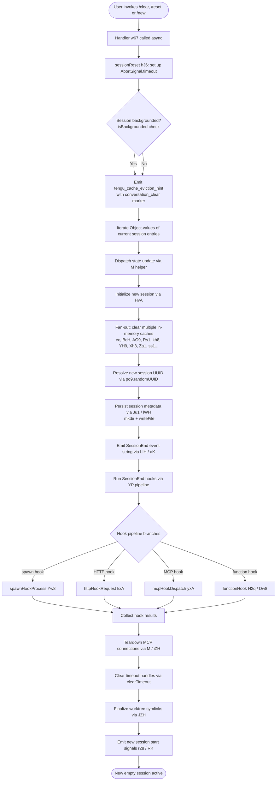

# `/clear`

> Analysis basis: CC v2.1.133 bundle.js (AST extraction + Claude interpretation)
> Minimum version: v2.1.133

---

## Overview

The `/clear` command starts a new interactive session with a completely empty context window while preserving the previous session on disk in a resumable state. It is also reachable via the aliases `/reset` and `/new`. The command is classified as type `local`, supports non-interactive invocation, and dispatches its UI update via the `post-text` thin-client channel.

---

## Registration

| Field | Value |
|---|---|
| type | `local` |
| name | `clear` |
| description | `Start a new session with empty context; previous session stays on disk (resumable with /resume)` |
| aliases | `["reset", "new"]` |
| supportsNonInteractive | `true` |
| thinClientDispatch | `"post-text"` |
| module_id | `Bo9` |
| load_inline | `true` |
| loc_byte | `9842780` |
| loc_byte_end | `9843049` |
| loc_line | `5513` |
| **arbor_handler.name** | `w67` |
| **arbor_handler.kind** | `AsyncFunction` |
| **arbor_handler.resolution_path** | `module_id` |
| **arbor_handler.fqn** | `claude-2.1.133::w67` |
| **arbor_handler.n_hits** | `0` |
| `arbor_handler.name` | `w67` |
| `arbor_handler.kind` | `AsyncFunction` |
| `arbor_handler.resolution_path` | `module_id` |
| `arbor_handler.fqn` | `claude-2.1.133::w67` |
| `arbor_handler.n_hits` | `0` |

Analysis basis: CC v2.1.133 bundle.js:+9842780

---

## Input Branching

The clear operation involves more than three distinct internal paths (backgrounded vs. foreground session handling, abort-signal timeout, MCP connection teardown, per-session-entry processing, and state-reset fan-out), so a flowchart is used.



---

## Behavioral Spec

### Top-level handler

The Arbor-resolved entry point is the async function `w67` (module `Bo9`). It receives the command invocation context and delegates immediately to the session-reset coordinator `hJ6`.

```
async function clearCommandHandler(invocationContext):
    return sessionResetCoordinator(invocationContext)
```

Analysis basis: CC v2.1.133 bundle.js:+9842695

---

### Session reset coordinator (`hJ6`)

This is the primary orchestration function. It:

1. Creates an `AbortSignal.timeout` to bound the entire operation.
2. Reads the `isBackgrounded` flag from the current app state.
3. Fires the `tengu_cache_eviction_hint` telemetry event, tagging the reason as `"conversation_clear"`.
4. Iterates current session entries via `Object.values` and dispatches a state update through the MCP connection manager `M`.
5. Calls the session-state initializer `HvA` to begin cache clearing and new-session construction.
6. Invokes `SD` to resolve and validate the working-directory path.
7. Calls `LA` to update internal path state.
8. Clears the in-progress abort-controller map entry (`"abortController"` key).
9. Calls `tWH` to wire timeout handles.
10. Iterates `Object.entries` of pending items and calls `Rv` on each.
11. Clears any lingering `setTimeout` handles.
12. Calls `fH` for final state bookkeeping and `mO` to flush pending writes.
13. Invokes `JFH` / `K49` to emit the final status.
14. Calls `Xr1` / `sLH` to update the session-log reference.
15. Triggers `y$`, `SJ6`, `Mg`, `zm`, `jC`, `ze`, `Wu` for downstream session-signal propagation.
16. Calls `JZH` to finalize worktree symlinks and `hG` for sub-agent path resolution.
17. Returns the new session descriptor.

```
async function sessionResetCoordinator(ctx):
    signal = AbortSignal.timeout(TIMEOUT_MS)

    backgrounded = readAppState("isBackgrounded")
    emitTelemetry("tengu_cache_eviction_hint", { reason: "conversation_clear" })

    entries = Object.values(currentSession.entries)
    for entry in entries:
        dispatchMcpStateUpdate(entry)              // M helper

    newSessionState = initializeSessionState(ctx)  // HvA
    resolvedCwd = resolveWorkingDirectory(ctx)      // SD
    updatePathState(resolvedCwd)                   // LA

    clearMap("abortController")
    wireTimeoutHandles(ctx)                        // tWH

    for [key, item] in Object.entries(pendingItems):
        processItem(key, item)                     // Rv

    clearTimeout(pendingTimerHandle)

    finalizeStateBookkeeping()                     // fH
    flushPendingWrites()                           // mO

    emitSessionStatus()                            // JFH / K49
    updateSessionLogRef()                          // Xr1 / sLH

    propagateSessionSignals(newSessionState)        // y$, SJ6, Mg, zm, jC, ze, Wu
    finalizeWorktreeSymlinks()                     // JZH
    resolveSubagentPaths()                         // hG

    return newSessionState
```

Analysis basis: CC v2.1.133 bundle.js:+9840880 – +9842695

---

### Session-state initializer (`HvA`)

`HvA` performs the bulk of the in-memory reset. It:

1. Calls `oVA` and `et` to reset React / Ink rendering state.
2. Calls `Ju1` → `lWH` to clear the conversation transcript store (`tx.clear`) and persist a new empty session file via `Vo6.mkdir` + `Vo6.writeFile`.
3. Calls `kaH` for key/auth-state reset.
4. Invokes `ec` which cascades through a large set of cache-clear helpers: `LH8`, `V76`, `Ws`, `pt1`, `sc`, `$H8`, `ss1`, `uA4.resetAutonomousLoopDelivered`, `xN`, `H3A`.
5. Calls `BcH` → `c58.clear` to clear the tool-result cache.
6. Calls `AG9` → `iEH.clear` and `uXA.clear` to clear suggestion and expansion caches.
7. Calls `Rs1` → `JBH.clear` + `YM6.clear` for message-history caches.
8. Calls `kh8` → `whH.clear` for the hook-state cache.
9. Calls `lR1` for supplementary cache reset.
10. Calls `YH9` → `yH8.clear` for the REPL-state cache.
11. Calls `N08` to check and update the feature-flag map.
12. Calls `Xh8` → `DhH.clear` for the display-hint cache.
13. Calls `fd9` for additional file-descriptor cleanup.
14. Calls `Za1` which calls `k`, then `Fc.clear` + `c3H.clear` for completion/context caches.
15. Resolves via `Promise.resolve` to yield the event loop before continuing.
16. Calls `Q0A`, `q`, `r78`, `VX`, `vUH` for downstream UI-state propagation.

```
async function initializeSessionState(ctx):
    resetRenderingState()               // oVA, et
    await clearConversationStore()      // Ju1 → lWH (tx.clear, writeFile)
    resetAuthState()                    // kaH
    clearAllCaches()                    // ec cascade
    clearToolResultCache()              // BcH → c58.clear
    clearSuggestionCaches()             // AG9
    clearMessageHistoryCaches()         // Rs1
    clearHookStateCache()               // kh8
    clearReplStateCache()               // YH9
    checkFeatureFlags()                 // N08
    clearDisplayHintCache()             // Xh8
    cleanupFileDescriptors()            // fd9
    clearCompletionContextCaches()      // Za1

    await Promise.resolve()             // yield event loop

    propagateUiState()                  // Q0A, q, r78, VX, vUH
```

Analysis basis: CC v2.1.133 bundle.js:+9839856 – +9840425

---

### SessionEnd hook pipeline (`LIH` → `YP`)

After the in-memory reset, the coordinator calls `LIH` which:

1. Emits the `"SessionEnd"` event string (literal at bundle.js:+11923547).
2. Calls `aK` to build the hook-execution context, resolving effort level, model parameters, and permission settings via `PX`, `bZ`, `HN`, `N6`.
3. Calls `YP`, the full hook-dispatch pipeline, which fans out to the individual hook executor strategies: spawn (`Yw8`), HTTP (`kxA`), MCP (`yxA`), and function / command hooks (`H2q`, `Dw8`).
4. Calls `v6` and `ZD6` for post-hook state synchronisation.

```
async function runSessionEndHooks(ctx):
    hookCtx = buildHookContext("SessionEnd", ctx)   // aK
    results = await dispatchAllHooks(hookCtx)       // YP
    syncPostHookState(results)                      // v6, ZD6
```

Analysis basis: CC v2.1.133 bundle.js:+9840892 – +9923775

---

### MCP teardown (`M` → `iZH` → `Og7`)

When iterating session entries the coordinator also reaches the MCP connection manager `M`, which:

1. Calls `iZH` to enumerate all active MCP connections via `Object.entries`.
2. For each connection, determines transport type (`stdio`, `sse`, `sse-ide`, `ws-ide`), calls `gZA` / `QZA` to gracefully close OAuth / stdio transports, writes session metadata via `Yl9`, and kills remaining subprocesses via `J.push` → `v.kill`.
3. Calls `mFq` to apply any pending MCP configuration updates and `hI` for cleanup.
4. Calls `Og7` to retry failed remote servers, applying DlH error formatting and re-initialising via `iZH`.

```
async function teardownMcpConnections(sessionEntries):
    connections = Object.entries(activeConnections)
    for [id, conn] in connections:
        transport = conn.transportType   // "stdio" | "sse" | "sse-ide" | "ws-ide"
        if transport in OAUTH_TRANSPORTS:
            await closeOAuthTransport(conn)    // gZA
        else:
            await closeStdioTransport(conn)    // QZA
        await writeSessionMetadata(conn)       // Yl9
        killSubprocesses(conn)                 // J → v.kill

    applyPendingMcpUpdates()                   // mFq
    cleanupHandles()                           // hI
    retryFailedRemoteServers()                 // Og7
```

Analysis basis: CC v2.1.133 bundle.js:+9841164 – +13871693

---

### Working-directory resolution (`SD`)

Called during reset to anchor the new session's CWD:

1. Checks whether the supplied path is absolute via `$48.isAbsolute`; if not, resolves it via `$48.resolve`.
2. Validates via `F6` and `D8`.
3. On failure throws an `Error`.
4. Calls `Gy8` to normalise and store the path, emitting `tengu_shell_set_cwd` telemetry.

```
function resolveWorkingDirectory(path):
    if not isAbsolute(path):
        path = resolve(path)
    validate(path)                         // F6, D8
    normalizedPath = normalizeAndStore(path)  // Gy8
    emitTelemetry("tengu_shell_set_cwd")
    return normalizedPath
```

Analysis basis: CC v2.1.133 bundle.js:+8374007 – +8374164

---

### Worktree symlink finalization (`JZH`)

After the new session UUID is generated the coordinator calls `JZH` to update the `tasks/` symlink tree:

1. Calls `Hw8` to mark the task as in-flight (adds to `$Pq`, removes on `finally`).
2. Calls `ExA` → `xn.mkdir` to ensure the tasks directory exists.
3. Calls `L3` to compute the new symlink target.
4. Calls `xn.symlink` to create the symlink; on `EEXIST` calls `xn.unlink` then retries.
5. Calls `tq8` for the open-file handle path.

```
async function finalizeWorktreeSymlinks(newSessionId):
    markInFlight()                            // Hw8
    try:
        ensureTasksDir()                      // ExA → xn.mkdir
        target = computeSymlinkTarget(newSessionId)  // L3
        try:
            xn.symlink(target, linkPath)
        catch EEXIST:
            xn.unlink(linkPath)
            xn.symlink(target, linkPath)
        openFileHandle()                      // tq8
    finally:
        clearInFlight()
```

Analysis basis: CC v2.1.133 bundle.js:+11894321 – +11894499

---

## State & Side Effects

| Item | Detail |
|---|---|
| Telemetry — `tengu_cache_eviction_hint` | Fired with `conversation_clear` tag immediately after invocation (bundle.js:+9840984) |
| Telemetry — `tengu_shell_set_cwd` | Fired when the new session's CWD is anchored (bundle.js:+8374166) |
| Telemetry — `tengu_repl_hook_finished` | Fired at end of each hook in the SessionEnd pipeline (bundle.js:+11952673) |
| Telemetry — `tengu_run_hook` | Fired per hook execution in the YP dispatcher (bundle.js:+11967438) |
| Telemetry — `tengu_hook_plugin_injected` | Fired when a plugin hook is injected during SessionEnd hooks (bundle.js:+11966022) |
| Hook registration | Fires the `"SessionEnd"` hook event; all registered `SessionEnd` hooks run before the new session is considered active |
| appState changes | `isBackgrounded` read; `abortController` map entry cleared; all in-memory caches cleared via `ec` cascade; new session UUID written |
| Conversation transcript store | Cleared via `tx.clear` and a new empty file written to disk via `Vo6.writeFile` |
| MCP connections | All active connections gracefully shut down; subprocesses killed; session metadata persisted |
| Worktree symlinks | `tasks/` symlink updated to point at new session |
| AbortSignal timeout | Bounds the entire operation; applies from construction of the signal through teardown |
| Previous session | Remains on disk in full and is resumable via `/resume` |
| Sound | <!-- TODO: not found in depth-2 traversal; needs --depth 4 --> |

---

## Version History

| Version | Change |
|---|---|
| v2.1.133 | Initial analysis |

---

## Common Mistakes

1. **Expecting immediate MCP reconnection.** `/clear` tears down all MCP connections as part of teardown. They are re-initialised for the new session, but this involves network round-trips; MCP-dependent tools may be briefly unavailable after clearing.
2. **Assuming previous context is gone permanently.** The old session remains on disk; use `/resume` to restore it. `/clear` does not delete any files.
3. **Using `/clear` to reset only partial context.** `/clear` is an all-or-nothing reset. It clears every in-memory cache, the full conversation transcript, and all session state. There is no partial-clear variant.
4. **Invoking `/clear` in a non-interactive pipeline and not checking the `supportsNonInteractive` flag.** The command does support non-interactive use (`supportsNonInteractive: true`) and dispatches via the `post-text` channel, so automated callers should expect a text response rather than an interactive prompt.
5. **Aliasing confusion.** `/reset` and `/new` are exact aliases for `/clear`; they invoke identical logic with no behavioral difference.

---

## Appendix — Identifier Mapping

> For bundle debugging only. Identifiers change across versions.

| Identifier | Role |
|---|---|
| `w67` | Top-level `/clear` command async handler (Arbor-resolved entry point) |
| `hJ6` | Session reset coordinator — primary orchestration function |
| `RJ6` | Effort/model parameter resolver called from hook-context builder |
| `hX` | Policy-settings accessor |
| `h8` | Policy-settings reader (reads `"policySettings"`) |
| `Jp` | Effort value normaliser |
| `MF` | Model-family classifier |
| `WMA` | Inner model-family helper |
| `LIH` | SessionEnd event emitter and hook dispatcher coordinator |
| `aK` | Hook execution context builder |
| `v6` | Post-hook / post-action state synchroniser |
| `UN` | Unknown utility called from hook context builder and session runner |
| `PX` | Permission-settings resolver |
| `bZ` | Effort-value helper (maps to `"high"` and related literals) |
| `HN` | Hook-name / model-string formatter |
| `N6` | Session name utility |
| `YP` | Full hook dispatch pipeline (SessionEnd fan-out) |
| `kH` | String coercion helper |
| `a_H` | App-state reader helper |
| `k` | ANSI / terminal string formatter |
| `nqH` | Numeric normalisers `NA` / `I5` |
| `H` | Random-delay scheduler (uses `Math.random` + `setTimeout`) |
| `RxA` | Hook-type classifier and filter (PreToolUse, PostToolUse, …) |
| `O` | Background-session state reader |
| `A2q` | Auxiliary hook result accumulator |
| `SxA` | Third-party hook filter |
| `_2q` | Hook result de-duplicator |
| `d` | General-purpose state-store accessor |
| `SH` | JSON.stringify wrapper / serialiser |
| `fH` | State-bookkeeping finaliser (uses `HA`, `kH`, `yq`, `NJL`) |
| `uH` | State-store reader |
| `UJH` | Session-log reference updater (`nv6`) |
| `YT` | In-flight task aborter (calls `L.abort`, `clearTimeout`, `setTimeout`) |
| `X` | Callback dispatcher |
| `ce` | Conversation-end marker |
| `RC` | Result collector |
| `yxA` | MCP hook dispatcher |
| `Dw8` | Command/function hook output parser |
| `kxA` | HTTP hook executor |
| `H2q` | Function hook dispatcher |
| `Yw8` | Spawn-based hook process executor |
| `hH` | Session-state helper |
| `ZD6` | Post-hook session synchroniser |
| `DaH` | Duration/abort-signal helper |
| `M` | MCP connection manager dispatcher |
| `iZH` | MCP connection enumerator and teardown loop |
| `zt` | MCP transport-state merger |
| `$I` | MCP client-state helper |
| `L` | Padding/column formatter |
| `AA` | Auxiliary array accumulator |
| `AJ6` | MCP connection-filter helper |
| `so4` | Session-metadata writer (uses `Date.now`) |
| `G98` | MCP server object builder |
| `K8` | MCP debug logger |
| `gZA` | OAuth transport closer |
| `QZA` | Stdio transport closer |
| `Yl9` | Session-metadata file writer (`l9H.writeFile`) |
| `BZA` | MCP connection-state reset helper |
| `kJA` | MCP transport-type inclusion checker |
| `J` | Subprocess kill list |
| `S` | Stream write buffer |
| `T7` | MCP error logger |
| `vH` | String coercion / error formatter |
| `$l9` | MCP session-state archive helper |
| `_J6` | MCP protocol-version parser |
| `fIA` | MCP frame-id parser |
| `mFq` | MCP configuration update applier |
| `XM8` | MCP update serialiser |
| `hI` | MCP handle cleanup (`DlH`, `L.cleanup`) |
| `K` | Promise/task wrapper (adds to queue, `finally` removes) |
| `q` | Unlink-sync queue |
| `f` | Stream close wrapper |
| `$` | Telemetry / stats snapshot dispatcher |
| `XDq` | Stats snapshot writer (uses `Date.now`, `iY`, `Sj6`) |
| `J6` | Job/session registry entry manager |
| `Bq6` | Job registry read helper |
| `gq6` | Job registry write helper |
| `Po` | Job process handle accessor |
| `_d6` | Dedup registry helper (uses `Ut8`, `b5H`) |
| `R6` | Job-record constructor |
| `Og7` | MCP remote-server retry manager |
| `A` | Generic accumulator / config object |
| `T98` | Transport-type membership checker |
| `r8` | Timeout-bounded promise wrapper |
| `DlH` | MCP debug-log serialiser |
| `j` | IPC socket message framer |
| `w` | Background-worker process manager |
| `y` | Worker process handle |
| `sFA` | Worker spawn-info builder |
| `x` | Write-stream with timeout |
| `nFA` | New-worker spawner |
| `tFA` | Worker lifecycle tracker |
| `Y` | Worker heartbeat / health monitor |
| `w8` | Promise/error utility |
| `u` | Idle-exit timer |
| `ff` | Socket-end writer |
| `md7` | IPC message dispatcher (handles all message types) |
| `p6` | JSON-parse wrapper |
| `pd7` | Protocol-decode helper |
| `_Y` | Background-service marker |
| `oFA` | Outbound-message queue |
| `Pdq` | Dispatch-retry scheduler |
| `h0` | Path join helper |
| `r$` | Realpath normaliser |
| `aKH` | Log-file line reader |
| `xd7` | Scroll/resize calculator |
| `Z` | Timer handle store |
| `HqH` | Heartbeat sender |
| `xL` | Socket path builder |
| `ud7` | Worker-state inspector |
| `v` | Backoff-timer manager |
| `l` | Worker-list accessor |
| `c` | Client-list accessor |
| `W` | Batch-output debouncer |
| `Q` | Output stream writer |
| `p` | PTY write throttler |
| `g` | Render-scheduler |
| `QW6` | Socket destroy-and-write helper |
| `G` | Permission-request forwarder |
| `mX` | Session-context merge helper |
| `OY` | Output-yielder |
| `HvA` | Session-state initialiser (primary cache-clear fan-out) |
| `oVA` | Rendering-state resetter |
| `et` | UI-framework state clearer (f1H, a58, Eg9, Zf8) |
| `f1H` | Ink/React store 1 clearer |
| `a58` | Ink/React store 2 clearer |
| `Eg9` | Ink/React store 3 clearer |
| `Zf8` | Ink/React store 4 clearer |
| `Ju1` | Conversation-transcript store clearer (`tx.clear`) |
| `lWH` | Session-file writer (`Vo6.mkdir` + `Vo6.writeFile`) |
| `kaH` | Auth/key-state resetter |
| `ec` | Primary cache-clear cascade coordinator |
| `ex` | Cache-clear sub-helper |
| `LH8` | Ready-state cache clearer (`tc.delete`) |
| `V76` | Session-start event emitter (`gZ`) |
| `Ws` | Two-level cache clearer (`S08`, `B08`) |
| `pt1` | Single-store resetter |
| `sc` | Dual-store resetter |
| `$H8` | Query-interface cache clearer (`qi9.clear`) |
| `ss1` | Two-map clearer (`GM6.clear`, `hMA.clear`) |
| `xN` | Object.values sweeper (`GNH`) |
| `H3A` | Additional state resetter |
| `BcH` | Tool-result cache clearer (`c58.clear`) |
| `AG9` | Suggestion/expansion cache clearer (`iEH.clear`, `uXA.clear`) |
| `Rs1` | Message-history cache clearer (`JBH.clear`, `YM6.clear`) |
| `kh8` | Hook-state cache clearer (`whH.clear`) |
| `lR1` | Supplementary cache resetter |
| `YH9` | REPL-state cache clearer (`yH8.clear`) |
| `N08` | Feature-flag map updater |
| `Xh8` | Display-hint cache clearer (`DhH.clear`) |
| `fd9` | File-descriptor cleanup helper |
| `Za1` | Completion/context cache clearer (`Fc.clear`, `c3H.clear`) |
| `SD` | Working-directory path resolver |
| `F6` | Path validator |
| `D8` | Path error wrapper |
| `Gy8` | CWD normaliser and store (`ON6.getStore`, `H.normalize`) |
| `bHH` | Path normalisation utility |
| `LA` | Internal path-state updater |
| `tWH` | Timeout-handle wirer |
| `Rv` | Pending-item processor |
| `mO` | Pending-write flusher (`Hw8`, `tY8.delete`) |
| `Hw8` | In-flight marker (`$Pq.add` / `$Pq.delete`) |
| `JFH` | Session-status emitter (`K49`) |
| `K49` | Status-record writer |
| `Xr1` | Session-log reference updater (`sLH`) |
| `sLH` | Session-log handle writer |
| `y$` | Session-signal propagator |
| `RK` | Session-record updater (`y1`) |
| `y1` | Record-set helper (`d08.add`, `d08.delete`, `Object.assign`) |
| `SJ6` | Supplementary session-signal emitter |
| `r28` | New-session UUID emitter (`SHH.randomUUID`, `GG6.emit`) |
| `Mg` | Model-state propagator |
| `zm` | Session log-append helper (`HN`, `wVH`) |
| `wVH` | Log file appender (`_.appendFileSync`, `_.mkdirSync`) |
| `JZH` | Worktree symlink finaliser |
| `ExA` | Tasks-directory creator (`xn.mkdir`) |
| `gdH` | Symlink-target path builder |
| `L3` | Symlink-path composer |
| `tq8` | File-handle opener for new session |
| `hG` | Sub-agent path resolver |
| `tg` | Sub-agent path helper |
| `rf` | Auxiliary session-signal helper |
| `vf` | Auxiliary session-signal helper 2 |
| `jC` | Worktree-state emitter (`b58.emit`) |
| `ze` | Isolation-latch writer (`Ujq`) |
| `Ujq` | Async append-file helper (`SK.appendFile`, `SK.mkdir`) |
| `Wu` | Plugin-hook loader and executor |
| `HK` | Plugin-hook context builder |
| `GpH` | Plugin policy-settings merger |
| `ryH` | Plugin hook timer / logger |
| `E8` | Plugin hook log-file appender |
| `D` | Tool-watcher / config-reload manager |
| `eDH` | Config-file reader (`Cwq.readFile`) |
| `bwq` | Config schema validator |
| `E` | Remote-control event handler |
| `Bdq` | Heartbeat sender |
| `jM6` | Agent / sub-session launcher |
| `_P` | Full agent execution pipeline |
| `M1` | Random-UUID sub-session ID generator |

---

Note: index built via Arbor fallback; some signals (telemetry, literals) may be missing — see arbor-fallback.js.